# 黑客盒子— Spectra Machine 演练

> 原文：<https://infosecwriteups.com/hackthebox-spectra-machine-walkthrough-9339f01b65a0?source=collection_archive---------3----------------------->

你好，所有伟大的黑客和渗透测试人员。我的名字是 [**山塔努库尔卡尼**](https://twitter.com/0xShantanuKul) 。我是**安全顾问**，兼职 **Bug 赏金猎人**。最近我开始在 HTB 上解决机器问题，我能够 pwned **Spectra Machine** 。因为这台机器现在退役了，所以我想告诉你我是如何获得这台机器的 root 访问权限的。让我们开始吧，不要浪费时间。

**侦察:**

像往常一样，我们从检查开放的端口和使用 NMAP 运行服务开始。所以我开始扫描目标如下:

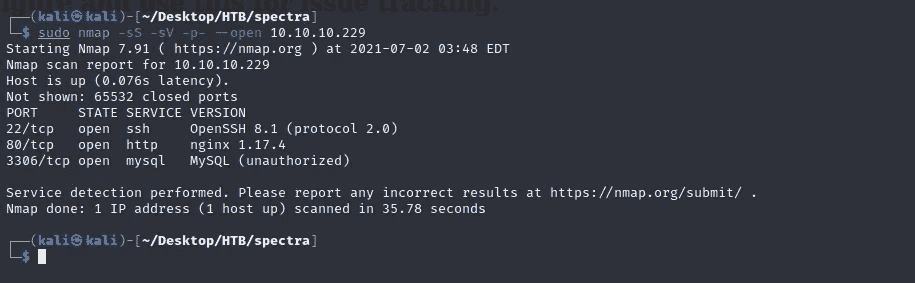

NMAP 结果

根据 NMAP 的结果，P **ort 80** 是打开的，因此目标上必须有 Web 应用程序在运行。端口 **22 用于 SSH** 。所以我立即在浏览器中输入一个 IP 地址，打开了一个网络应用。

## 枚举:

正如猜测的那样，target 上运行着一个 web 应用程序，看起来像是一个问题跟踪门户。

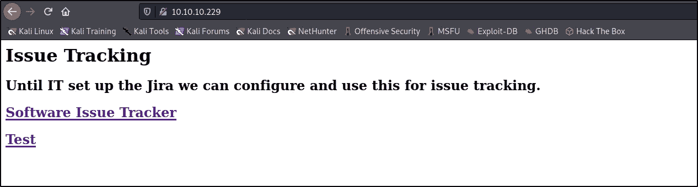

在端口 80 上运行的 Web 应用程序

我已经在我的系统上修改了 **/etc/hosts** 文件，以探索在这台 **Spectra** 机器上运行的 Web 应用程序。

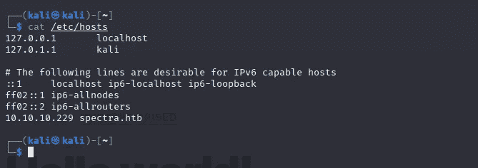

在/etc/hosts 文件中添加了 Spectra.htb

点击***软件问题跟踪***和**【测试】**页面后，我看到其中一个页面指向我们有博客的主页。如果我们观察用户的博客，那么我们可以看到它是管理员。

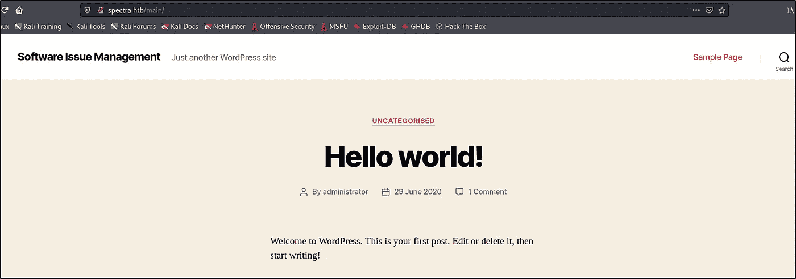

管理员的博客页面

在其他页面，我们看到在**测试**文件夹中有多个 WordPress PHP 文件。我们已经打开了多个文件，我们在 wp-config.php.save 的源代码中看到了凭证

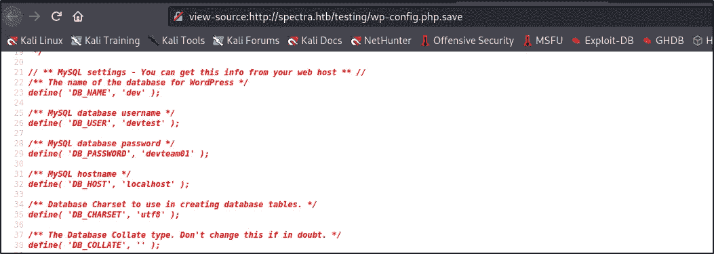

wp-config.php.save 的源代码

所以我试着在 **WP 管理员登录**页面使用这些凭证，但是没有成功。

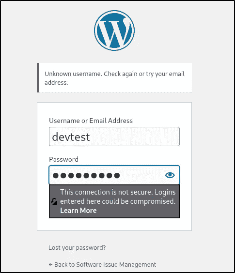

错误的凭据和未知的用户名错误

但是，我看到一个错误，叫做**未知用户名**。然后我想起来我们有一个用户是从博客页面得到的管理员。很快，我输入了管理员的**用户和**密码:devteam01** ，现在我可以作为管理员成功登录了。**

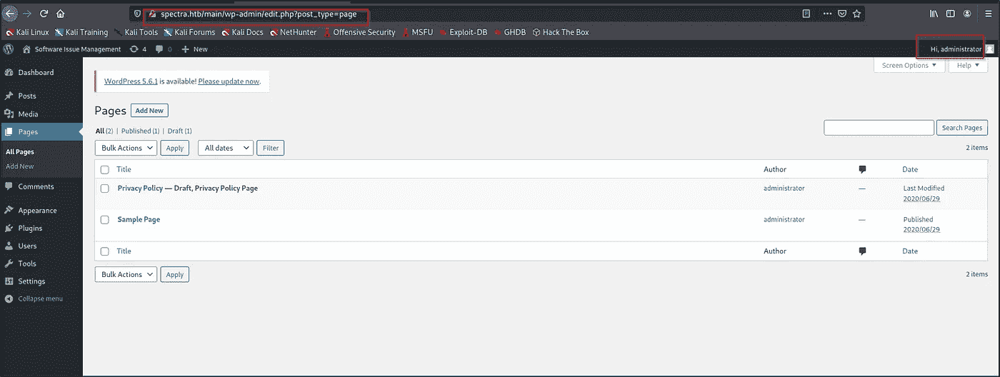

以管理员身份登录

对于这个版本的 WordPress，谷歌上有几个漏洞，我尝试了很多，但我不能成功利用。所以我决定使用 **searchsploit** 来搜索漏洞。

## 流量计外壳:

我在我的 Kali VM 中启动 Metasploit，并搜索任何已知的对 WP 管理外壳的利用。我又发现了一个，所以立即开始使用。开始使用 exploit，完成初始配置，我能够成功地获得 meterpreter 外壳。

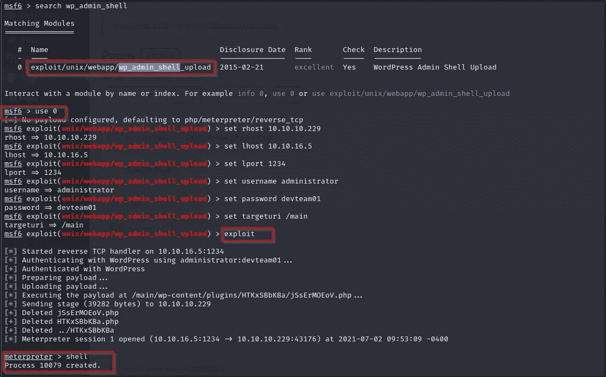

仪表外壳

我马上想知道我们有多少用户？所以我很快做了 **cat /etc/passwd** ，我注意到这里有两个用户 katie 和 nginx。

> nginx:x:20155:20156::/home/nginx:/bin/bash
> 凯蒂:x:20156:20157::/home/凯蒂:/bin/bash

**用户标志:**

因为我已经有了 meterpreter shell，所以我开始使用一些命令，并且知道我们有 **opt 文件夹。所以我检查了它的内容，发现有一个 autologin.conf 文件。**

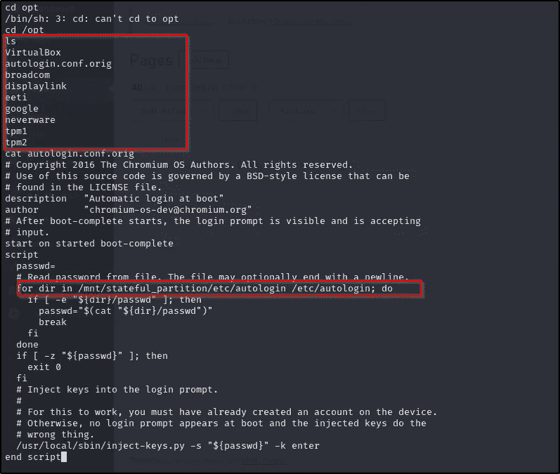

autologin.conf.orig 文件包含

我检查了上面提到的目录，并检查了那里是否存在任何文件。所以基本上它使用一个 passwd 文件进行自动登录。检查了文件，在里面发现了一个密码。

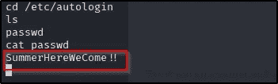

自动登录文件中的密码。

我立即为我们的用户 **Katie** 尝试了那个密码，并且我能够使用这些凭证成功地 SSH 目标。检查文件夹的内容，发现 **user.txt** 在那里。

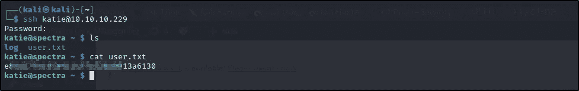

SSH 和 user.txt

**权限提升和根标志:**

在获得 **user.txt** 之后，现在是考虑权限提升的时候了。在我的测试过程中，我发现这一部分非常难，也非常有趣。它实际上考验的是你的知识、技术能力和逻辑。所以检查了 **sudo 特权**，发现该用户可以在没有密码的情况下执行“ **/sbin/initctl** ”，密码**与 root** 相同。

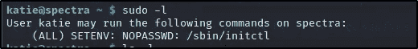

Katie 用户上的 sudo -l

然后，我迅速移动到那个目录，检查它包含什么文件。

> katie@spectra /etc/init $ ls -la
> 
> rw-rw--1 根开发者 478 2020 年 6 月 29 日 test . conf
> -rw-rw--1 根开发者 478 2020 年 6 月 29 日 test1 . conf
> -rw-rw--1 根开发者 478 2020 年 6 月 29 日 test10 . conf
> -rw-rw--1 根开发者 478 2020 年 6 月 29 日 test2 . conf
> -rw-rw--1 根开发者 478 2020 年 6 月 29 日 2020 年 test9.conf

因此，我们可以使用 **initctl** 来控制系统启动和停止进程。我已经检查了 test.conf 文件，并开始探索是否可以从这里得到任何路径成为根用户。

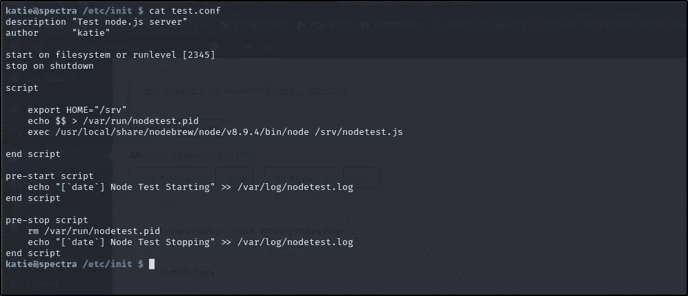

cat test.conf

在经历了大量的 GitHub、medium、google 链接以及尝试了一些脚本之后，我发现这个简单的脚本可以完成我们的工作，所以我很快编辑了 **test.conf 文件**并保存了它。

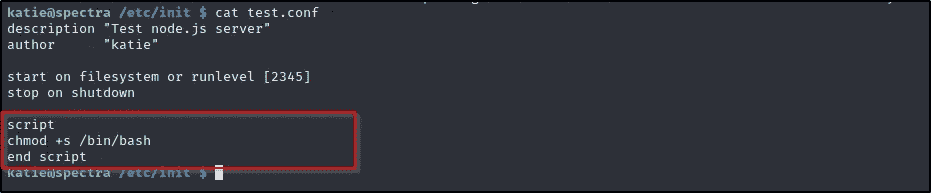

修改的 test.conf 文件

之后，我再次启动了**测试进程**，并使用简单的命令进行权限提升，该命令是“ **/bin/bash -p** ”。我在那里有根。登顶旗帜，成功**刷谱**。

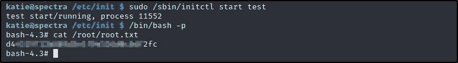

猫根. txt

**user.txt 和 root.txt** 标志都是正确的。

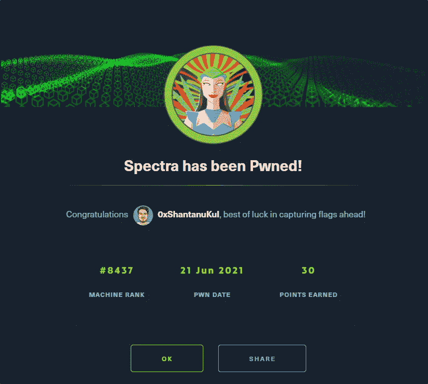

获得的积分。

虽然这是一台来自 HTB 的简单机器，但对于像我这样的初学者来说，在这上面工作总是具有挑战性。我学到了很多东西，比如 WordPress 漏洞、Metasploit、bash 和特权提升方法。

如果你喜欢我的文章，请在推特上联系我。

再次感谢..！！