# 黑客盒子报道:路由器空间

> 原文：<https://infosecwriteups.com/hackthebox-writeup-routerspace-d0a4d5c1ce78?source=collection_archive---------1----------------------->

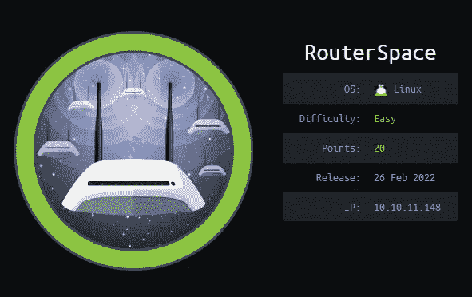

这是一个由易到难的 Linux 机器，需要对 Android APK 文件进行基本的扫描和分析，以便在机器上获得立足点，获得用户标志。到 root 的权限提升也是一个相对简单的过程，需要使用 Linux 权限提升[**CVE-2021–3156**](https://blog.qualys.com/vulnerabilities-threat-research/2021/01/26/cve-2021-3156-heap-based-buffer-overflow-in-sudo-baron-samedit)(即 Sudo 中基于堆的缓冲区溢出)。

# 列举

我开始通过用 **NMAP** 执行快速扫描来枚举目标机器，以识别任何打开的端口:

```
nmap -T5 --open -sS -vvv --min-rate=300 --max-retries=3 -p- -oN all-ports-nmap-report 10.10.11.148PORT   STATE SERVICE REASON
22/tcp open  ssh     syn-ack ttl 63
80/tcp open  http    syn-ack ttl 63
```

扫描发现两个端口打开(即端口 22 和 80)。接下来，我使用 NMAP 来识别每个端口上运行的服务，并使用通用 NSE 脚本来查找我可以利用的任何常见漏洞:

```
nmap -sV -sC -Pn -v -oN nmap-report -p 22,80 10.10.11.148PORT   STATE SERVICE VERSION
22/tcp open  ssh     (protocol 2.0)
| fingerprint-strings: 
|   NULL: 
|_    SSH-2.0-RouterSpace Packet Filtering V1
80/tcp open  http
| fingerprint-strings: 
|   FourOhFourRequest: 
|     HTTP/1.1 200 OK
|     X-Powered-By: RouterSpace
|     X-Cdn: RouterSpace-46080
|     Content-Type: text/html; charset=utf-8
|     Content-Length: 71
|     ETag: W/"47-vsUiEn1T/EW91KMPo5u7ZZMDNb0"
|     Date: Fri, 04 Mar 2022 17:09:34 GMT
|     Connection: close
|     Suspicious activity detected !!! {RequestID: WOA KW Qq lr Uc fK Qfu }.................
```

我可以看到端口 22 正在运行 SSH，而端口 80 正在托管一个网站。我还在端口 80 的 nmap 扫描结果中看到一些不常见的 http 头和一条关于可疑活动的警报消息。我认为我有足够的信息继续前进，并开始检查托管在端口 80 上的网站。

# HTTP —端口 80 分析

导航到[*http://10 . 10 . 11 . 143/*](http://10.10.11.143/)，我看到了一个推广名为 RouterSpace 的移动应用的基本网站。该网站还提供了一个 **RouterSpace.apk** 文件的下载链接。

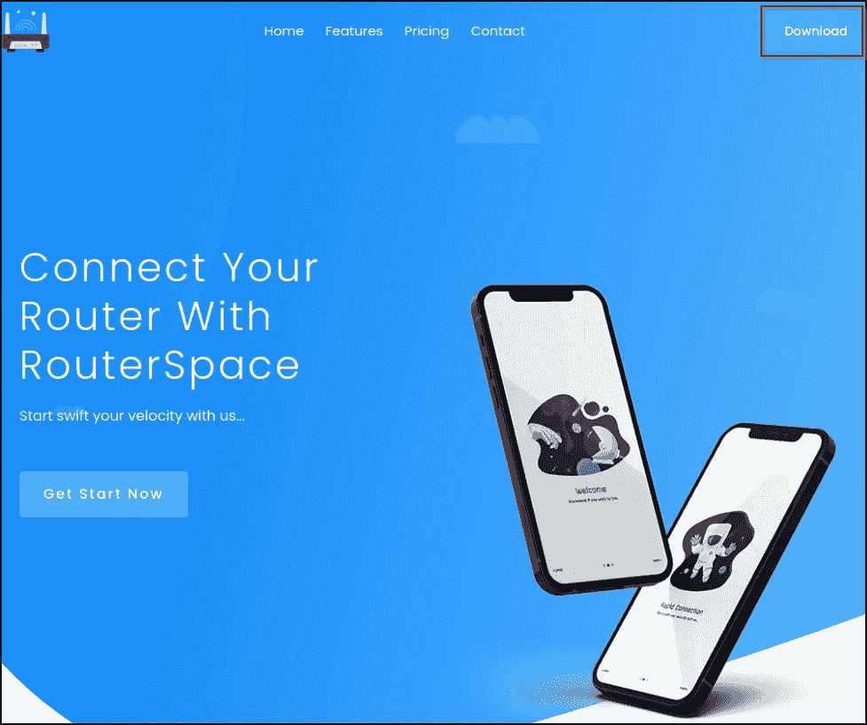

RouterSpace 网站和下载链接。

我还注意到，当试图模糊其他目录时，会显示一个警告。

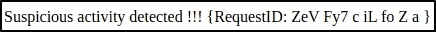

可疑警报。

# 安卓 APK 分析

我从网站上下载了 APK 文件，并将其加载到 MobSF 中进行静态分析。查看静态报告，我可以看到在 APK 签名者证书细节下，主机名 **routerspace.htb** 被设置为组织。

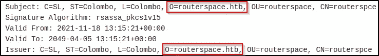

Hostname routerspace.htb

我将它添加到我的“ */etc/hosts* ”文件中，但是在枚举端口 80 上的网站时没有发现任何新信息。接下来，我决定使用 Genymotion 和 ADB 在模拟器上安装 APK 文件。

```
adb connect <ip>adb install routerspace.htb
```

在与应用程序交互时，我可以看到我能够检查路由器的状态，但是在尝试连接到服务器时出现错误。


连接到服务器时出错。

我决定使用 BurpSuite 来拦截这个请求，并按如下方式进行设置:

*   监听端口 8081 上的所有接口。
*   使用 ADB 来**将流量反向传输到**我的仿真器和攻击机器之间的端口 8081。

```
adb reverse tcp:8081 tcp:8081
```

*   将我的模拟器设置为使用具有以下详细信息的代理:

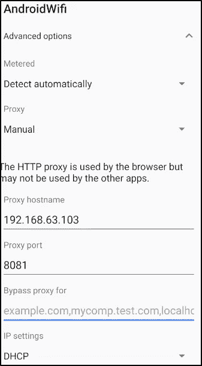

模拟器代理设置

尽管我进行了设置，但最初尝试拦截从应用程序到服务器的请求时，我仍然遇到了麻烦。然而，我发现如果我换成一个使用旧的 Android API 的模拟器，并按照上面相同的步骤操作，我能够连接到服务器。


仿真器 Android API。

# 用户标志:命令注入

随着我的设置现在开始工作，我能够使用 BurpSuite 拦截从应用程序到服务器的请求。

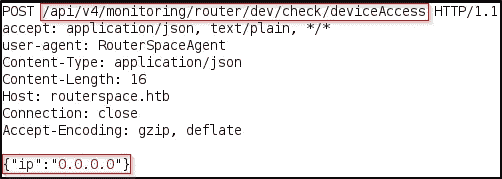

API 发布请求

我可以看到应用程序发出的帖子请求。我把这个截获的请求发给了 BurpSuite 的 repeater 做进一步分析。在响应中，我可以看到返回了一个字符串值。我决定测试命令注入，列出当前工作目录的内容，成功了。

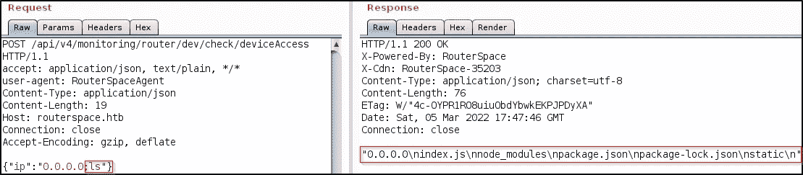

命令注入列表目录内容。

接下来，我使用命令 whoami，可以看到我当前登录的用户是 **paul** 。

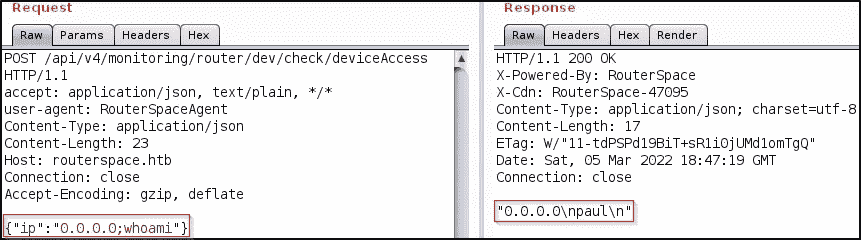

检查登录的用户。

接下来，我可以通过导航到用户**保罗**目录来检索用户标志，并打印 **user.txt** 文件的内容。

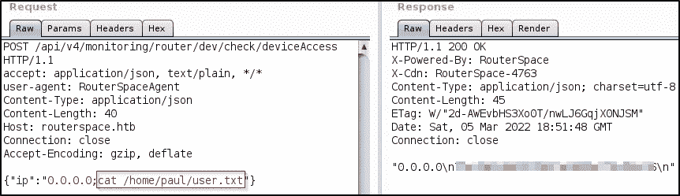

用户标志。

# 根标志

我试图使用命令注入漏洞利用由 [pentestmonkey](https://pentestmonkey.net/cheat-sheet/shells/reverse-shell-cheat-sheet) 提供的样本获得一个反向外壳，但每次尝试都失败了。查看用户 **paul** 目录的内容，我可以看到一个隐藏的**。ssh** 文件夹。我决定生成自己的 SSH 公钥和私钥，然后将公钥添加到。 **ssh** 文件夹，这样我就可以以用户 paul 的身份登录。

```
$ ssh-keygen -oGenerating public/private rsa key pair.
Enter file in which to save the key (/home/kali/.ssh/id_rsa): id_rsa
Enter passphrase (empty for no passphrase): 
Enter same passphrase again:
```

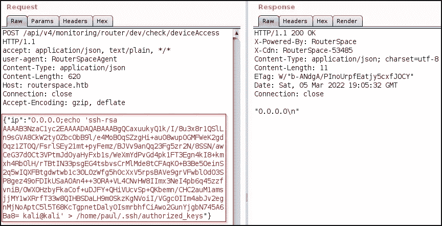

用我的 SSH 公钥覆盖 authorized_keys。

接下来，我给它 700 权限，然后使用 SSH 以用户 paul 的身份登录。

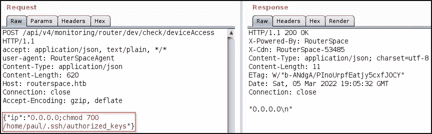

更改权限。

```
ssh paul@10.10.11.148 -i id_rsa
```

一旦登录，我可以看到各种文件，包括一个引用[**CVE-2021–3156**](https://blog.qualys.com/vulnerabilities-threat-research/2021/01/26/cve-2021-3156-heap-based-buffer-overflow-in-sudo-baron-samedit)的漏洞脚本。

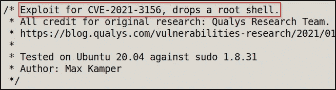

Exploit.c CVE 参考

检查 sudo 版本，我可以确认该版本易受此攻击。

```
paul@routerspace:~$ sudo -V
Sudo version 1.8.31
Sudoers policy plugin version 1.8.31
Sudoers file grammar version 46
Sudoers I/O plugin version 1.8.31
```

我可以看到机器上已经有一个编译版本的漏洞。执行这个漏洞利用给了我一个根 shell，然后我可以在其中获得根标志。

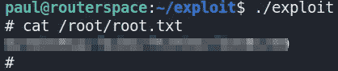

根标志。

# 最后的想法

总的来说，我发现这台机器有点棘手。设置我的测试环境来分析 APK 文件花了我一些时间。一旦我找到了最初的立足点(即命令注入)，它就变得容易多了，我能够快速获得用户标志。根旗也出奇的容易，有点失望。我想预期的解决方案并不涉及已经有一个编译好的漏洞准备执行，但总的来说，我喜欢这个盒子。谢谢你一直读到最后，祝你黑客快乐😄！