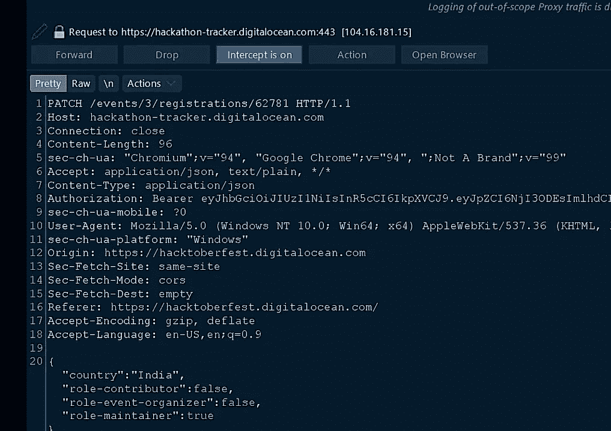
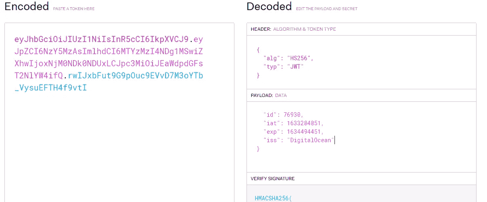

# HacktoberFest2k21 漏洞:如何通过从 waybackurls 泄漏的身份验证 JWT 令牌来更改用户元数据

> 原文：<https://infosecwriteups.com/hacktoberfest2k21-vulnerability-how-users-metadata-can-be-changed-via-auth-jwt-tokens-leaking-from-3028f8ad6991?source=collection_archive---------0----------------------->

你好，了不起的读者们👨‍💻✌✌,

以下是我的第六篇文章，我将解释我是如何通过 auth JWTtokens 从 waybackurls 日志和 ***视频 POC 中泄漏的内容来更改用户元数据的，这些内容在最后一篇文章*** 中提供。

我们开始吧，

别担心我不会用**redacted.com**🤣所以先访问[**hacktoberfest.digitalocean.com**](http://hacktoberfest.digitalocean.com)，把你的账号链接到 **GitLab** 或者 **GitHub** 。


现在只需捕获 burpsuit 中的概要文件，检查处理用户元数据的请求，并将其发送到**中继器**作为备份，如下所示。



现在在请求中，您可以观察到在**授权头**中只使用了 JWT，授权 jwt 已经在有效载荷部分包含了一个**用户 ID** ，如下所示:

您可以使用 [**jwt.io**](http://jwt.io) 来分析 jwt



这意味着我们只需要一种方法来找到/建立这些令牌，以改变用户/受害者帐户元信息。

在这一点上，我尝试了一些谷歌，Github 呆子，但没有工作后，当我使用 **waybackurls 工具。**

简单的命令:

```
**waybackurls hacktoberfest.digitalocean.com**
```

我在回程中发现了 URL，其中**用户认证 JWT 令牌**正在被使用，如下所示:


如上所示，在 jwt 分析部分中，我可以很容易地获得 **JWT 有效载荷**部分中的 **user_id** ，并且现在可以在请求中使用。

现在，当我分别在**授权头**和**请求 URL 端点**中使用此 JWT 和 user_id 时，我的请求得到了 **200OK** 响应，受害者**元数据**发生了变化。

我甚至用一个受害者账户样本演示了它，它的工作方式与 waybackurls JWT 的样本一样。

**查看视频，更清楚地了解漏洞:**

这个 *POC 展示了链接多个漏洞的力量*和*为什么侦察有时很重要。*

**感谢观看概念验证**😍。

在这里订阅我的频道👩‍💻:[订阅 _ _ 此处](https://www.youtube.com/channel/UCq7-Qf45etdk0qc35I_n7PQ?sub_confirmation=1)

**通过 LinkedIn 联系我**:【https://www.linkedin.com/in/anurag-verma-650b771a2 

**在 Instagram 上联系我** : varmaanu001