# HactivityCon 2021 CTF 报道

> 原文：<https://infosecwriteups.com/hactivitycon-2021-ctf-writeup-23ae1f6f06e1?source=collection_archive---------1----------------------->

OPA 秘密挑战(类别:网页，级别:硬)

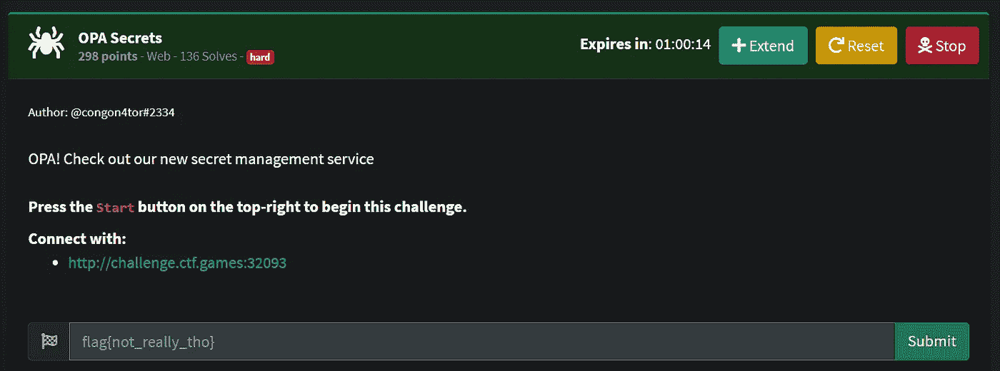

OPA 秘密挑战赛

**步骤 1:** 打开挑战，会出现一个登录屏幕。

登录屏幕

**第二步:**我们首先需要建立一个账户，以便访问 OPA Secrets 门户网站。所以，用任意的用户名和密码注册。

注册屏幕

**第三步:**现在使用创建新账户时使用的凭证登录。

**第四步:**登录后，会出现 OPA Secrets 仪表盘。

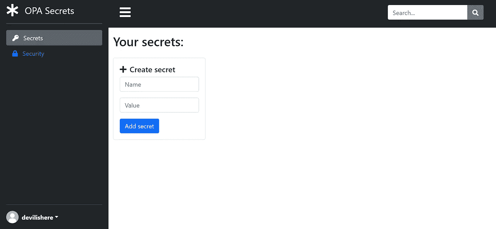

OPA 机密仪表板

**步骤 5:** 仪表板上有两个选项卡，在“机密”选项卡中，它提供了创建和保存机密的功能。在访问 Security 选项卡时，它为我们提供了用于保护这个秘密的算法的信息。还提到了一个 Github 链接，在那里我们可以看到这个开源 OPA Secrets 算法的源代码。

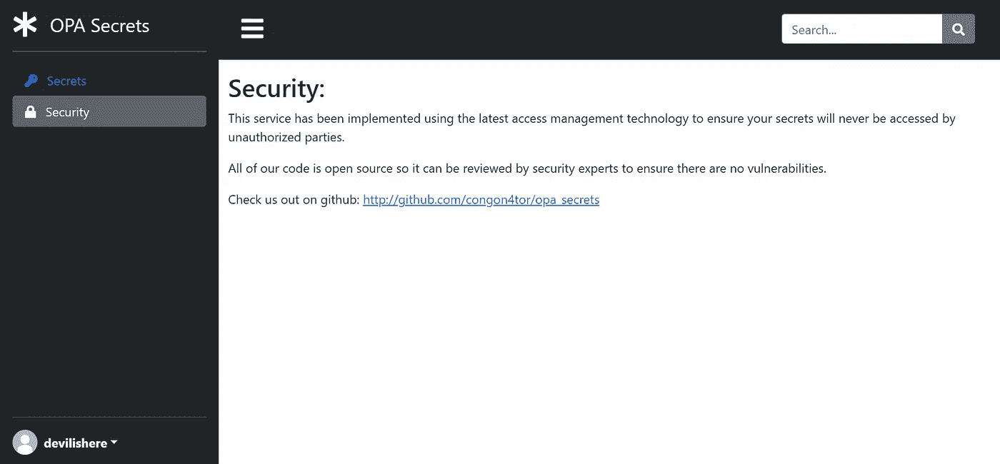

**第六步:**打开 github 链接([congon tor/opa _ secrets:Secret manager using Open Policy Agent(github.com](https://github.com/congon4tor/opa_secrets))打开 *app.py* 脚本(opa_secrets/app/app.py)。

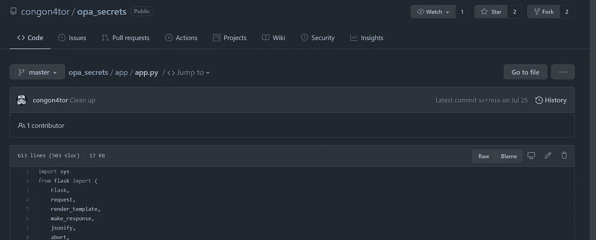

app.py 脚本

**第七步:**现在仔细观察剧本。我们可以看到已经创建了 3 个不同的用户(congon4tor、jellytalk、pinkykoala)。每个人都有自己唯一的 id 和指定的角色。

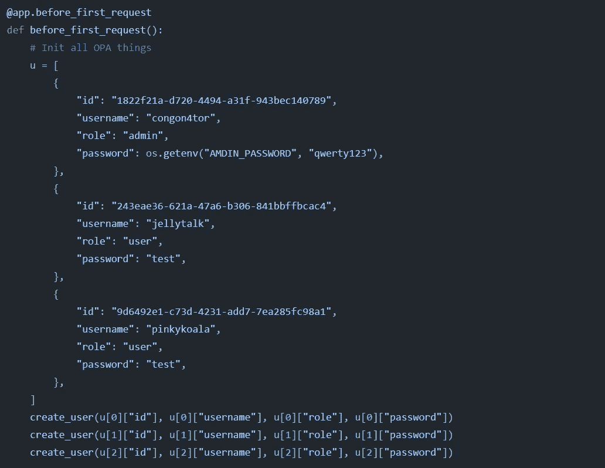

创建的用户

我们可以看到用户名为*congon tor*的用户是管理员，而其余 2 个用户是普通用户。我们还可以看到所有三个用户的密码(qwerty123，test，test)。但是解决这个挑战并不需要它。

**第八步:**进一步观察代码，我们可以看到 3 个不同的秘密也被添加到各自的用户帐户。每个秘密都有唯一的 id。

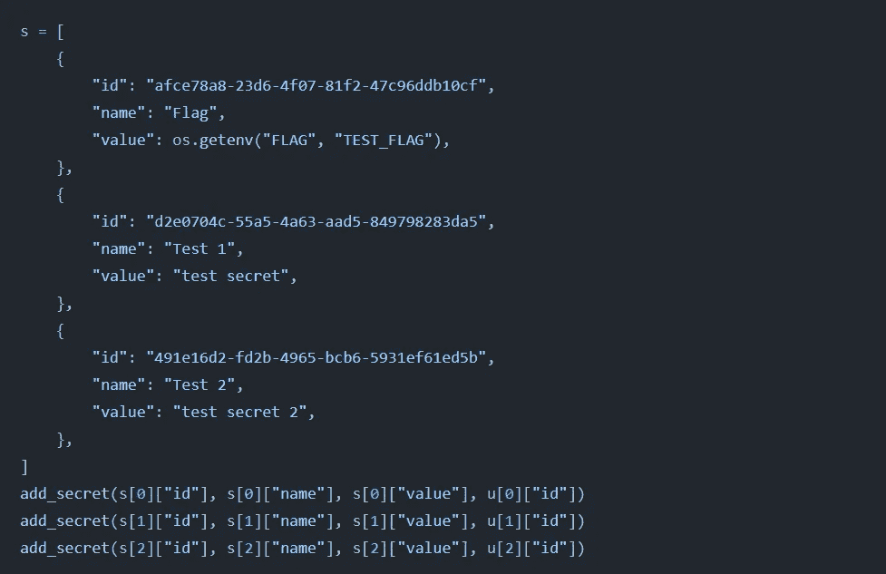

具有唯一秘密 id 的秘密

我们可以注意到第一个秘密的名字是 Flag，这表明它与我们的目标*即* flag{}有关。还要注意，与其他两个秘密不同，第一个秘密的值没有在明文中直接提及。

**第 9 步:**现在，让我们转到我们创建的帐户的仪表板，创建一个密码并保存它。

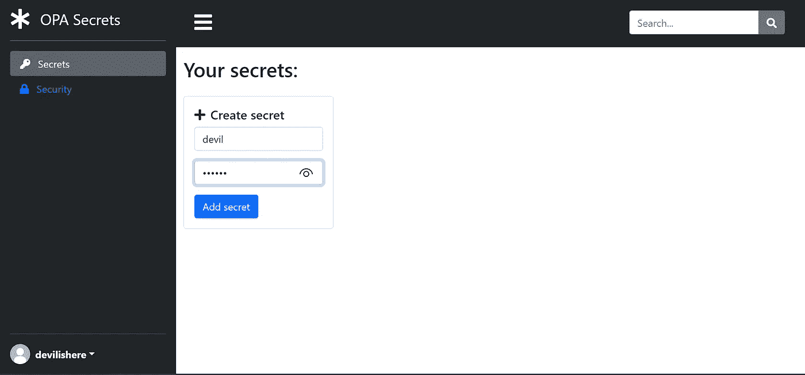

秘密创作

第 10 步:一旦创建了密码，它就会显示在我们的仪表盘中。还要记住，我们的秘密会像其他秘密一样被赋予一个唯一的 id(参考步骤 8)

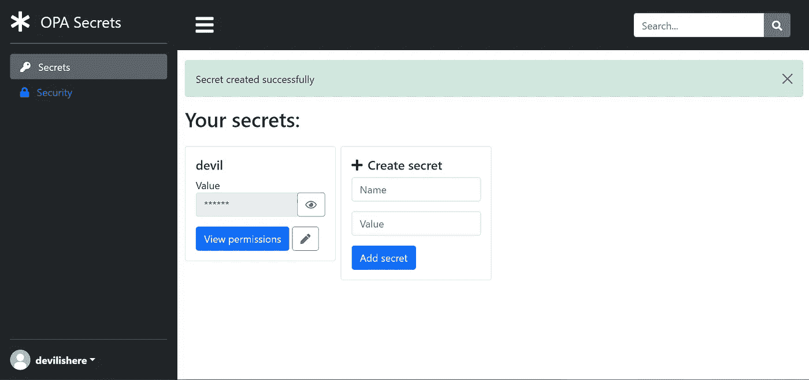

成功秘密创建后

**步骤 11:** 可以看到，我们的秘密值被屏蔽了，为了以明文形式看到秘密，我们需要点击那个*眼*按钮。点击它，它将发送包括我们的秘密的唯一 id 的请求，并且作为响应，它将接收我们的秘密的值。

第 12 步:我们需要启动 Burpsuite 来拦截这个请求。一旦设置好打嗝，点击*眼*按钮并拦截该请求。在拦截的请求中，我们可以看到我们的秘密的唯一 id 被发送。

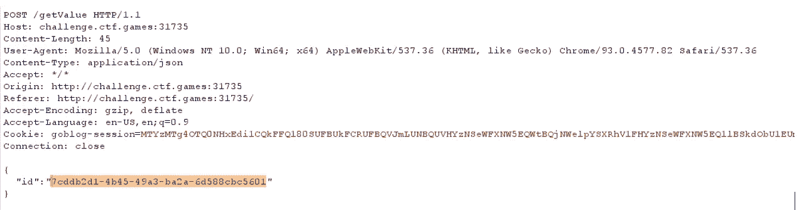

用我们的秘密的唯一 id 拦截请求

**步骤 13:** 现在只需用我们在 *app.py* 脚本(我们在步骤 8 中看到的那个)*中找到的名称标志替换 id 值，即 afce 78 a 8–23d 6–4f 07–81 F2–47 c 96 DDB 10 cf*并转发修改后的请求

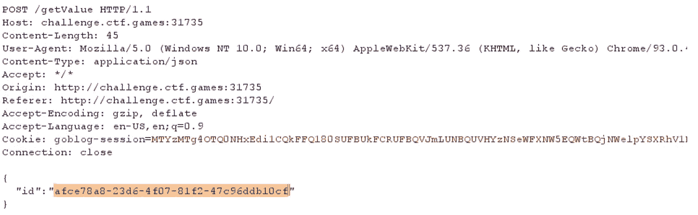

id 被替换的已编辑请求

**第 14 步:**在响应中，我们将在仪表板上获得标志。

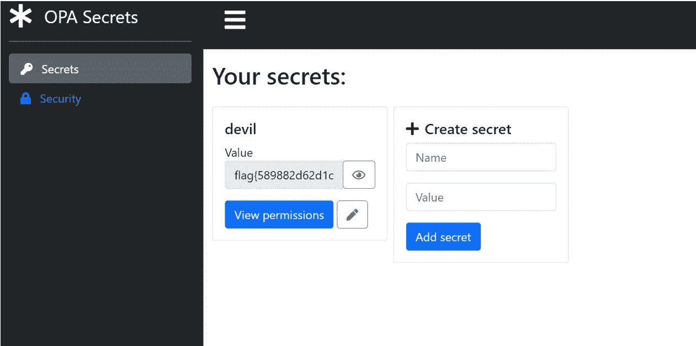

旗

flag { 589882d 62d 1c 899d 8 b 85 db 1 af 2076 b 39 }

这是我寻找旗帜的方法。希望你觉得有用。

感谢您的阅读。知识就是力量，所以不断获取！😈

在 [GitHub](https://github.com/gandhidevansh) 上关注我！