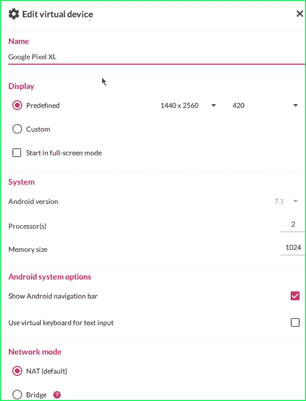
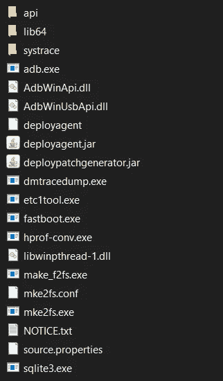
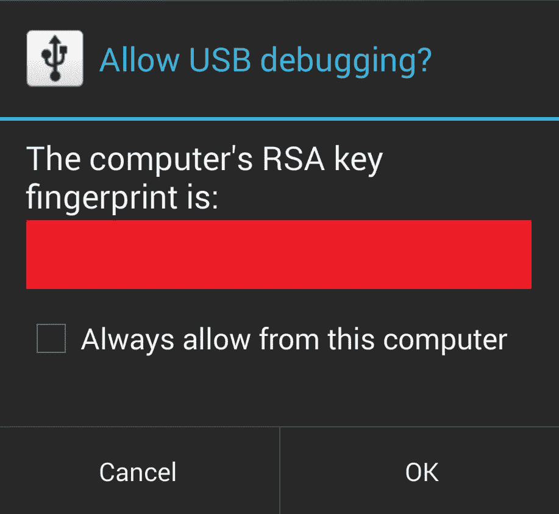
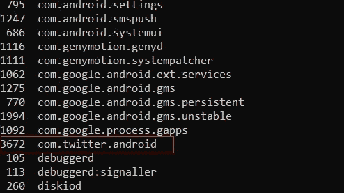
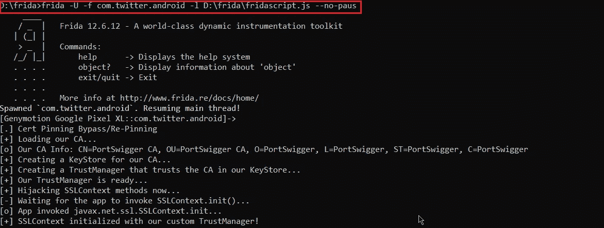
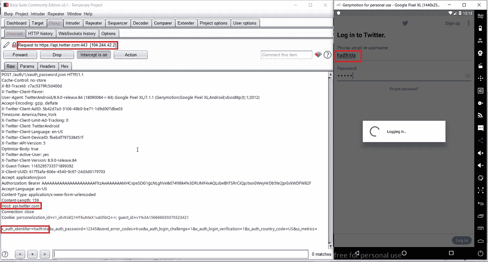

# 弗里达万岁！！Android 应用程序的通用 SSL 锁定旁路

> 原文：<https://infosecwriteups.com/hail-frida-the-universal-ssl-pinning-bypass-for-android-e9e1d733d29?source=collection_archive---------0----------------------->


大家好在这篇文章中，我将解释如何使用 frida 框架绕过 android 应用程序的 SSL 固定。我会试着更详细更清楚地解释所有的事情。

**本文将涵盖:**

1.  *Frida 和 SSL pin 简介*
2.  *要求*
3.  *设置和安装*
4.  Frida 服务器设置
5.  设置 BurpSuite
6.  推送代理的 CA 证书:
7.  绕过 SSL 锁定的脚本注入
8.  一言以蔽之
9.  解决纷争

# 1.Frida *和 SSL pin*简介

Frida 框架是 SSL pinning bypass 的最后一站。

根据 frida [**网站**](https://www.frida.re/docs/home/) :

> “这是本机应用程序的 [Greasemonkey](https://addons.mozilla.org/en-US/firefox/addon/greasemonkey/) ，或者用更专业的术语来说，这是一个动态代码工具套件。它允许你将 JavaScript 片段或你自己的库注入到 Windows、macOS、GNU/Linux、iOS、Android 和 QNX 上的本地应用程序中。Frida 还为您提供了一些构建在 Frida API 之上的简单工具。这些可以按原样使用，根据您的需要进行调整，或者作为如何使用 API 的示例。”


> 证书锁定是将远程服务器信任的证书硬编码在应用程序本身中，以便它将忽略设备证书存储，并将信任他自己的硬编码证书，进一步的应用程序将使用该证书“安全地”与远程服务器通信。

如今，当我们甚至开始对大多数移动应用程序的 HTTP 请求进行动态分析时，SSL 锁定旁路是需要完成的主要步骤，因为组织更加关注数据隐私和网络上数据的安全传输，以免受到中间人(MiTM)攻击等线程的攻击。

Frida 是一个框架，它将脚本注入到本地应用程序中，以在运行时操纵应用程序的逻辑，这是一种测试移动应用程序的更动态的方法。

# 2.要求

在表演魔术之前，让我们收集并满足所有要求。第一次设置需要一些时间，因为需求列表很长。一旦我们完成了所有的设置，从下一次它将是小菜一碟。如果你在任何一步卡住了，在博客的最后有****故障排除****一节。建议将所有下载的内容保存在一个文件夹中。**

****一、根设备/仿真器:****

**我们将需要一个根设备或模拟器，因为我们需要注入脚本到设备的根目录。这个我用的是 genymotion。Genymotion 易于安装和使用，可以从下面下载。**

> **[**【https://www.genymotion.com/fun-zone/】**](https://www.genymotion.com/fun-zone/)**

**一旦我们安装完 genymotion，我们需要安装一个 android 设备。安卓 7+版本就好走了。我将使用具有以下配置的' *Google pixel XL'* 设备。**

****

****二。Python frida 包安装:****

**从这里安装 Python for windows。**

> **[***https://www.python.org/downloads/windows/***](https://www.python.org/downloads/windows/)**

**我们需要为 frida 服务器安装一些 python 包。为此，请在终端中输入以下命令:**

```
**python -m pip install Frida
python -m pip install objection
python -m pip install frida-toolsorpip install Frida
pip install objection
pip install frida-tools**
```

****三。平台工具(亚行):****

**从以下链接下载 windows 平台工具:**

> **[***https://dl . Google . com/Android/repository/platform-tools-latest-windows . zip***](https://dl.google.com/android/repository/platform-tools-latest-windows.zip)**

****

****四。下载注射脚本:****

**我们需要从下面下载注入脚本，我们将把它推入设备，以便注入目标应用程序。**

> **[***https://codeshare . Frida . re/@ PCI polloni/universal-Android-SSL-pinning-bypass-with-Frida/***](https://codeshare.frida.re/@pcipolloni/universal-android-ssl-pinning-bypass-with-frida/)**

**或者您可以将此代码作为 **fridascript.js** 保存在与 adb 相同的文件夹中。**

```
**/* 
   Android SSL Re-pinning frida script v0.2 030417-pier$ adb push burpca-cert-der.crt /data/local/tmp/cert-der.crt
   $ frida -U -f it.app.mobile -l frida-android-repinning.js --no-pause[https://techblog.mediaservice.net/2017/07/universal-android-ssl-pinning-bypass-with-frida/](https://techblog.mediaservice.net/2017/07/universal-android-ssl-pinning-bypass-with-frida/)

   UPDATE 20191605: Fixed undeclared var. Thanks to [@oleavr](http://twitter.com/oleavr) and [@ehsanpc9999](http://twitter.com/ehsanpc9999) !
*/setTimeout(function(){
    Java.perform(function (){
     console.log("");
     console.log("[.] Cert Pinning Bypass/Re-Pinning");var CertificateFactory = Java.use("java.security.cert.CertificateFactory");
     var FileInputStream = Java.use("java.io.FileInputStream");
     var BufferedInputStream = Java.use("java.io.BufferedInputStream");
     var X509Certificate = Java.use("java.security.cert.X509Certificate");
     var KeyStore = Java.use("java.security.KeyStore");
     var TrustManagerFactory = Java.use("javax.net.ssl.TrustManagerFactory");
     var SSLContext = Java.use("javax.net.ssl.SSLContext");// Load CAs from an InputStream
     console.log("[+] Loading our CA...")
     var cf = CertificateFactory.getInstance("X.509");

     try {
      var fileInputStream = FileInputStream.$new("/data/local/tmp/cert-der.crt");
     }
     catch(err) {
      console.log("[o] " + err);
     }

     var bufferedInputStream = BufferedInputStream.$new(fileInputStream);
    var ca = cf.generateCertificate(bufferedInputStream);
     bufferedInputStream.close();var certInfo = Java.cast(ca, X509Certificate);
     console.log("[o] Our CA Info: " + certInfo.getSubjectDN());// Create a KeyStore containing our trusted CAs
     console.log("[+] Creating a KeyStore for our CA...");
     var keyStoreType = KeyStore.getDefaultType();
     var keyStore = KeyStore.getInstance(keyStoreType);
     keyStore.load(null, null);
     keyStore.setCertificateEntry("ca", ca);

     // Create a TrustManager that trusts the CAs in our KeyStore
     console.log("[+] Creating a TrustManager that trusts the CA in our KeyStore...");
     var tmfAlgorithm = TrustManagerFactory.getDefaultAlgorithm();
     var tmf = TrustManagerFactory.getInstance(tmfAlgorithm);
     tmf.init(keyStore);
     console.log("[+] Our TrustManager is ready...");console.log("[+] Hijacking SSLContext methods now...")
     console.log("[-] Waiting for the app to invoke SSLContext.init()...")SSLContext.init.overload("[Ljavax.net.ssl.KeyManager;", "[Ljavax.net.ssl.TrustManager;", "java.security.SecureRandom").implementation = function(a,b,c) {
      console.log("[o] App invoked javax.net.ssl.SSLContext.init...");
      SSLContext.init.overload("[Ljavax.net.ssl.KeyManager;", "[Ljavax.net.ssl.TrustManager;", "java.security.SecureRandom").call(this, a, tmf.getTrustManagers(), c);
      console.log("[+] SSLContext initialized with our custom TrustManager!");
     }
    });
},0);**
```

# **3.设置和安装:**

****一、将设备连接到 adb:****

**我们需要将我们的设备连接到 adb，以便在设备上运行命令。但首先转到*设置> >开发者选项*并启用设备中的调试模式，以便 adb 可以与设备通信。**

**转到提取平台工具的文件夹，运行以下命令将设备连接到 adb**

```
**//adb connect <ip of device:port>
adb connect 192.168.1.190:5555**
```

**如果弹出窗口出现在设备中，请单击“允许”。**

****

**要检查设备是否连接到 adb:**

```
**adb devices**
```

**您应该会看到您的设备的 ip 以及设备名称。**

****二。为支持的 android 设备的 arch 版本下载 frida 服务器:**
我们需要根据我们设备的 arch 版本为我们的 android 设备下载 frida 服务器包。**

> **[https://github.com/frida/frida/releases/](https://github.com/frida/frida/releases/)**

**要找出设备的 arch 版本，请运行以下命令。**

```
**adb shell getprop ro.product.cpu.abi**
```

**如果设备配置与上述相同，可缩短下载时间:**

> **弗里达-服务器-12.4.7-android-x86.xz
> 弗里达-服务器-12.4.7-android-x86_64.xz**

****四。在设备中安装目标应用程序。****

**安装您的应用程序谁的 SSL pin 必须在我们的设备绕过。打开应用程序，并让它在后台运行。**

# **4.Frida 服务器设置:**

**在注入我们的脚本之前，我们需要在设备中运行 frida 服务器。请遵循以下步骤:**

****I .将 frida 服务器推入设备:****

**现在我们需要把我们的 frida 服务器文件推进到设备中。提取并复制 adb 文件夹中的“*frida-server-12 . 4 . 7-Android-x86”*文件，将文件重命名为“Frida-server”。之后，运行以下命令。**

```
**//adb push <path_of_frida_server_folder><space></data/local/tmp>adb push C:\ADB\frida-server /data/local/tmp**
```

****二。给弗里达服务器权限:****

```
**adb shell chmod 777 /data/local/tmp/frida-server**
```

# ****5。设置 BurpSuite 的:****

**遵循这个令人敬畏的指南来为 android 设备设置代理:**

> **[**https://support . portswigger . net/customer/portal/articles/1841101-configuring-an-Android-device-to-work-with-burp**](https://support.portswigger.net/customer/portal/articles/1841101-configuring-an-android-device-to-work-with-burp)**

# **6.推送代理的 CA 证书:**

**为了能够[拦截流量](https://guidedhacking.com/register/)，frida 需要访问我们 Burpsuite 的 CA 证书。我们将推送在步骤 5 中下载的相同证书。在 BurpSuite 设置中。**

**将证书放入设备，放入 frida-server 所在的位置，将其命名为 *cert-der.crt* (为了避免任何问题，这个名称和路径已经在 fridascript.js 中提到过)**

```
**// adb push <path to cacert.der> /data/local/tmp/cert-der.crt
adb push cacert.der /data/local/tmp/cert-der.crt**
```

# ****7。绕过 SSL 固定的脚本注入:****

**现在是真正魔术的时候了。我们将把 **'fridascript.js'** 注入到目标应用中。**

****一、将 fridascript.js 推送到设备:****

**将 fridascript.js 复制到 adb 文件夹中，并运行以下命令将 fridascript.js 推送到设备中。**

```
**//adb push <path_to_fridascript.js_folder> /data/local/tmp
adb push C:\ADB\fridascript.js /data/local/tmp**
```

****二。检查并运行设备**中的 frida 服务器**

```
**adb shell /data/local/tmp/frida-server &**
```

**这将在设备中运行 frida-server。也许你不会在终端中得到这个命令的任何输出。**

****三。列出设备上所有正在运行的进程:****

**现在，我们需要找出我们的目标应用程序的 id。我们将列出设备上所有正在运行的服务，包括您的应用程序流程。**

**打开新终端，键入以下命令。**

```
**frida-ps -U**
```

****四。找到应用程序的包名。****

****

****V .将 fridascript.js 挂钩到目标应用:****

**最后，我们将使用以下命令将 fridascript.js 与本机应用程序挂钩:**

```
**//frida -U -f <your_application_package_name> -l <path_to_fridascript.js_on_your_computer> --no-pausfrida -U -f com.twitter.android -l D:\frida\fridascript.js --no-paus**
```

****

****六。绕过了！！****

**一旦一切顺利，目标应用程序的所有流量都会被拦截到 BurpSuite 中。只要我们拦截进入 BurpSuite 的流量，我们就需要保持 frida 服务器的运行。**

****

# **8.简而言之:**

****1。在 genymotion
2 上下载并安装设备。安装弗里达和异议工具****

```
****python -m pip install Frida
python -m pip install frida-tools
python -m pip install objection****or****pip install Frida
pip install frida-tools
pip install objection****
```

****3。下载亚行平台工具
4。下载弗里达注射脚本
5。将设备连接到 adb****

```
****//adb connect <ip of device:port>****
```

****6。下载 frida 服务器的支持 android 设备的 arch 版本
7。找出设备的 arch 版本****

```
****adb shell getprop ro.product.cpu.abi****
```

****8。在设备中安装目标应用程序。
9。将 frida 服务器推入设备:****

```
****//adb push <path of frida-server folder><space></data/local/tmp>****
```

****10。将权限授予弗里达服务器:****

```
****adb shell chmod 777 /data/local/tmp/frida-server****
```

****11。设置 burpsuite
12。推送代理的 CA 证书****

```
****// adb push <path to cacert.der> /data/local/tmp/cert-der.crt****
```

****13。将 fridascript.js 推入设备:****

```
****//adb push <path to fridascript.js folder> /data/local/tmp****
```

**14。检查并运行设备中的 frida 服务器**

```
****adb shell /data/local/tmp/frida-server &****
```

**15。列出设备上所有正在运行的进程:**

```
****frida-ps -U****
```

**16。找到应用程序的包名
17。将 fridascript.js 与目标应用程序挂钩**

```
****//frida -U -f <your_application_package_name> -l <path_to_fridascript.js_on_your_computer> --no-paus****
```

**18。在 BurpSuite 拦截交通。**

# **9.故障排除:**

****1。ADB 守护程序无法连接****

**如果您遇到这样的错误:**

```
**adb devices
adb server is out of date. killing...
cannot bind 'tcp:5037'
ADB server didn't ACK
*failed to start daemon*
error:**
```

**一、开放环境系统属性> >高级> >环境变量
ii。点击路径，删除 C:/Android 或 adb 工具指向的路径的条目
iii。将所有平台工具复制到 genymotion>tools 文件夹
iv 中。创建新路径，并将路径添加到 genymotion > >工具文件夹中。**

****2。frida/ pip 不被识别为内部或外部命令**
一.开放环境系统属性> >高级> >环境变量
二.创建新路径并添加 Python > >脚本文件夹的路径**

****3。将应用程序安装到设备时出现 Arm 转换错误。****

**一.从这里下载 arm 翻译文件
[【https://androidfilehost.com/?fid=23252070760974384】T42](https://androidfilehost.com/?fid=23252070760974384)
二.如果使用物理设备
iii，将文件拖放到设备仿真器或从恢复中刷新该文件。重新启动设备，您将能够拖放安装目标应用程序**

****4。无法生成:生成 Android 应用程序时不支持“argv”选项****

**检查计算机上的 fridascript.js 路径。路径可能不正确。您必须给出 fridascript.js 文件的绝对路径。[绝对路径？](https://www.computerhope.com/issues/ch001708.htm)**

****5。已启动 frida 服务器，但无法列出服务****

**断开并重新连接设备中的 wifi。**

****

**感谢阅读这篇文章。你真棒！！如果您遇到任何问题，请在评论中告诉我，我会努力解决并添加到故障排除部分。掌声感谢！！😄**