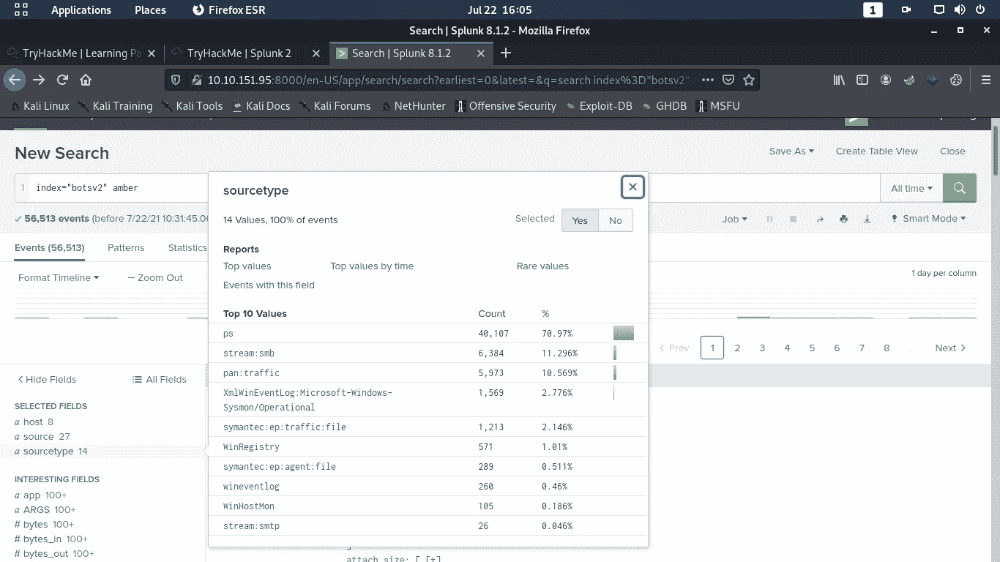
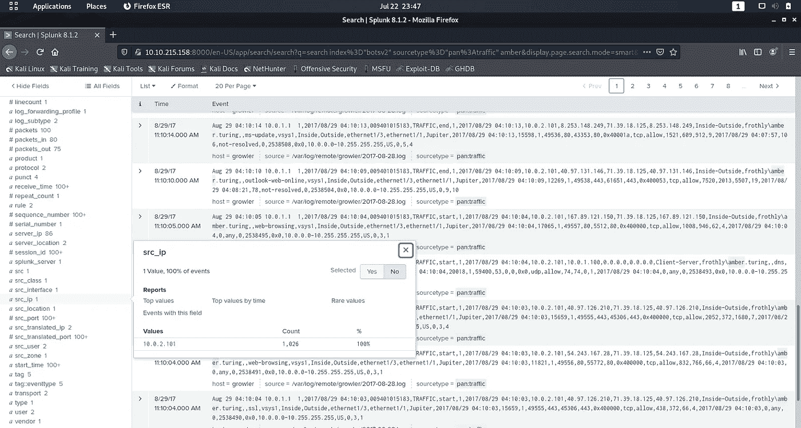
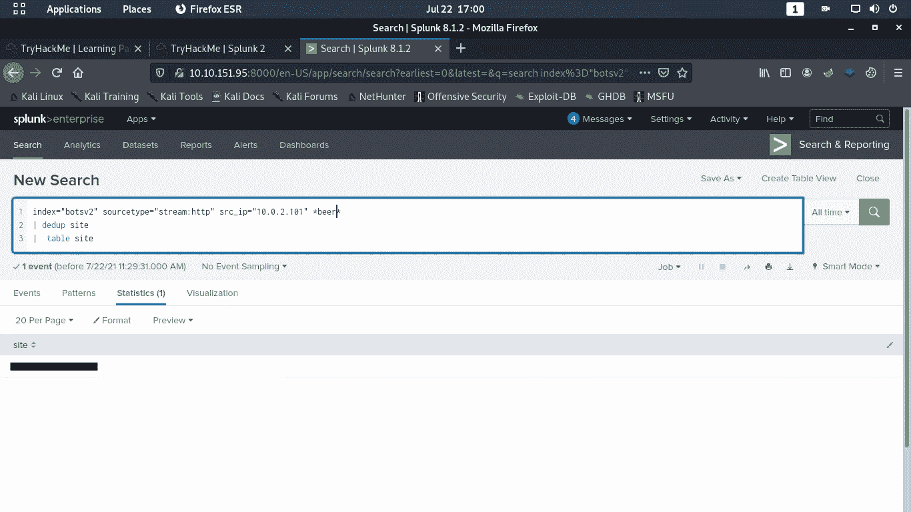
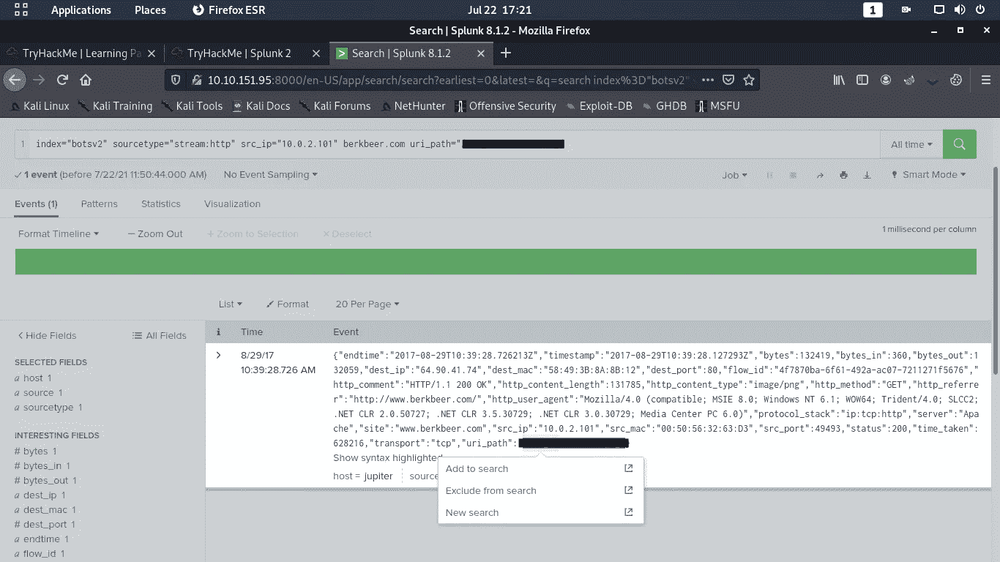
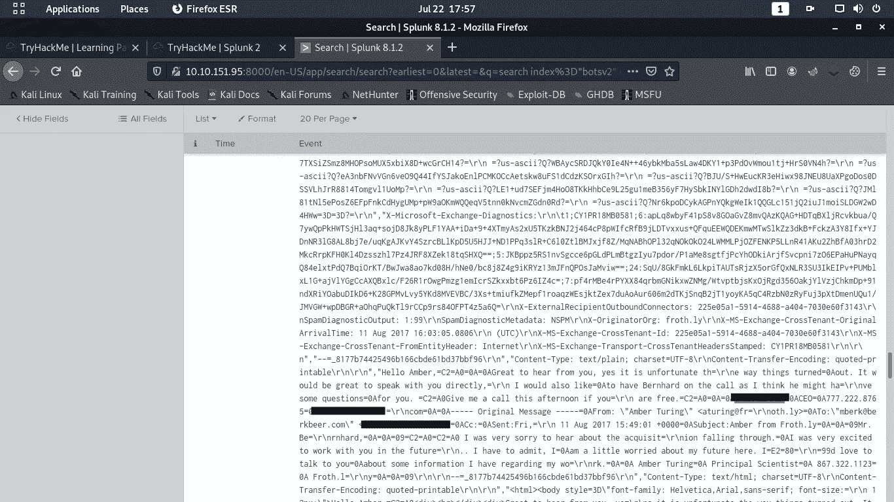
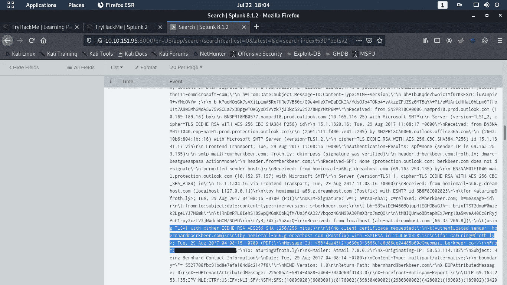
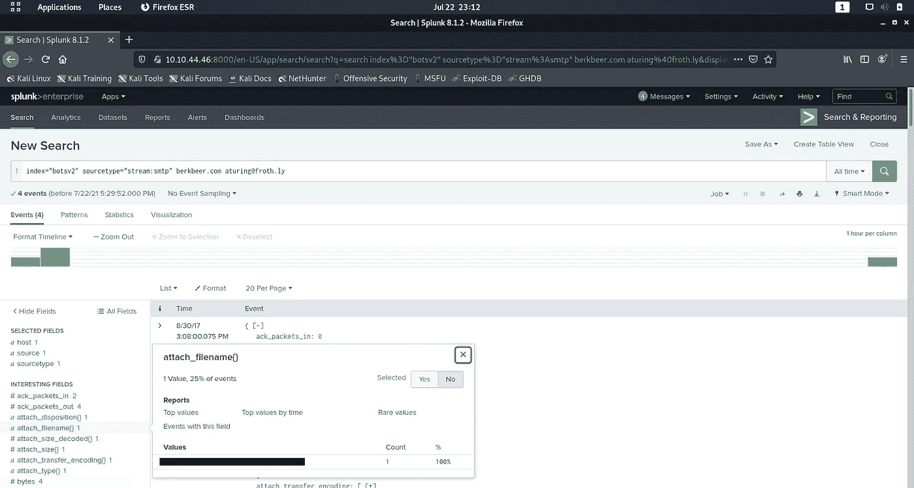
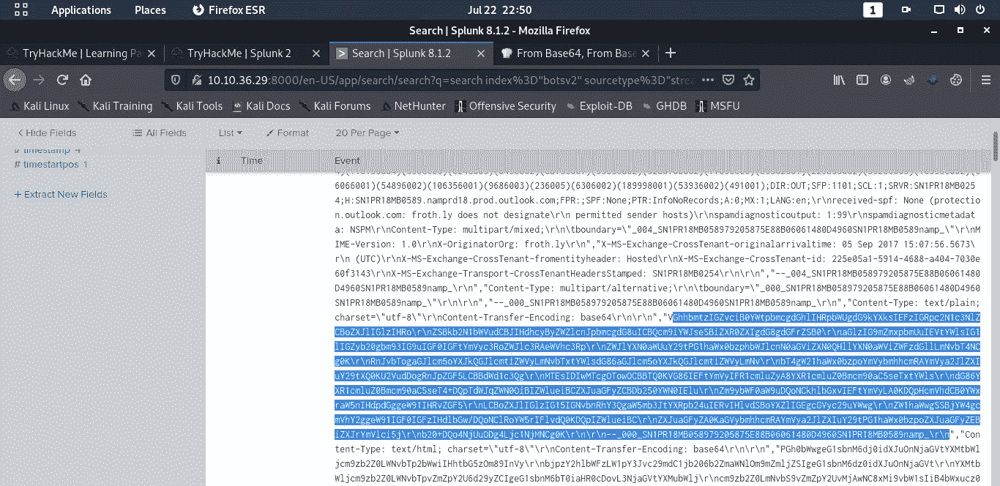

# 使用 SPLUNK 狩猎第 1 部分

> 原文：<https://infosecwriteups.com/handling-queries-on-splunk-d39f5ae30ad?source=collection_archive---------0----------------------->

## TryHackMe — Splunk 2

欢迎来到我的第一个博客！这个博客是为那些试图习惯使用 Splunk 的人准备的。

在这篇博客中，我将解决一个完全基于在 Splunk 上测试一个人的技能的 TryHackMe 房间。房间的名称是 Splunk 2，让初学者有一个中级的理解。

TryHackMe

**我将在 4 个不同的博客中报道这个房间**。

享受第一个。快乐学习！！

我将使用 BOTSv2 数据集来求解答案。通读任务 1 和 2 并部署机器。

**我将直接跳到任务 3 的场景**

> 问题 1 : Amber Turing 希望被一个失败的潜在竞争对手收购，但他访问了他们的网站，寻找他们管理团队的联系信息。她访问的网站域名是什么？

我在 splunk 搜索选项卡中输入了以下命令-->

**index = " botsv 2 "琥珀色 **

在该命令中，我将数据源作为 botsv2，并使用 amber(如问题中给出的)作为员工的姓名来过滤 splunk 中的事件。

由于我收到了许多事件，我单击了 sourcetype 字段，并选择 sourcetype 作为**“pan:traffic”**，这相应地过滤了所有事件。我选择 sourcetype 作为 pan:traffic 来获取 amber 的 IP 地址。

结果出来后，我运行以下命令->

***index = " botsv 2 " source type = " pan:traffic "琥珀色***

该命令过滤掉了包含琥珀色的事件。之后，我查看了“感兴趣的字段”选项卡，在其中我发现了一个名为“src_ip”的字段。我点击了同一个字段，得到了 amber 的 IP 地址 **10.0.2.101**

现在我有了 amber 的 IP 地址，我将命令改为->

***index = " bots v2 " 10 . 0 . 2 . 101 source type = " stream:http****"*

在这个命令中，我使用 sourcetype 作为 http，因为我需要所有使用 http 的事件。在此之后，我查看了“有趣的字段”选项卡，在其中我发现了一个名为“网站”的字段，但有很多重复的字段，并不需要找到答案。我使用**关键字**过滤了重复的内容

评估日志时，关键字非常有用。为了解决这个问题，我使用了两个关键字表&重复数据删除。

Table ->这将在 statistics 选项卡中以表格形式显示数据。

重复数据删除->这将删除所有重复的数据。

使用关键字后的命令->

***index = " botsv 2 " source type = " stream:http " 10 . 0 . 2 . 101 |重复数据删除站点|表站点***

在执行这个命令之后，仍然有很多事件需要我去寻找答案。在任务 2 中有一个特定的句子给出了解决这个问题的提示-> " **在这个练习中，你假设爱丽丝·蓝鸟的角色，她是一名分析师，曾成功地协助韦恩企业，并被推荐给发泡力(*一家啤酒公司*)的格雷斯·霍普，帮助他们解决最近的问题。**

最终命令->

***index = " botsv 2 " source type = " stream:http " 10 . 0 . 2 . 101 * beer * | dedup site | table site***

答案就在我面前。

> 问题 2 : Amber 找到了高管的联系方式，并给他发了一封邮件。哪个图像文件显示了高管的联系信息？答案示例:/path/image.ext

为了回答这个问题，我输入了以下命令->

***index = " botsv 2 " 10 . 0 . 2 . 101 source type = " stream:http " { "答案 1 中找到的公司的域" }***

因为我仍然有 12 个事件，所以我查看了“有趣的字段”选项卡，并选择“uri_path”作为过滤器。我通过点击特定路径选择了与公司域名最相似的路径。

我输入了以下命令->

***index = " botsv 2 " 10 . 0 . 2 . 101 source type = " stream:http " uri _ path = " * * * * * * * * * * * * * * * * * * * * ****

> 问题 CEO 叫什么名字？提供名字和姓氏。

为了回答这个问题，我首先找出了琥珀的电子邮件 id。我输入的命令是->

***index = " bots v2 " source type = " stream:SMTP " { "答案 1 中找到的公司的域名" }琥珀色***

我使用 smtp 而不是 http，因为我必须找到一个电子邮件地址，为此我需要电子邮件的协议，即 smtp。

执行命令后，返回了 4 个事件。我查看了日志，想试试运气。写了几篇日志后，我偶然发现了一篇日志，在这篇日志中，我不得不点击“显示为原始文本”,经过一些调查，我找到了这位首席执行官的名字和姓氏。

提示:查找时间戳为 8/20/17 11:03:08.879AM 的日志

> 问题 CEO 的邮箱是什么？

为了回答这个问题，我使用 amber 的电子邮件 id 来过滤日志(你可以很容易地在研究日志时发现这一点)

> 问题 5:在与首席执行官初次接触后，Amber 联系了该竞争对手的另一名员工。该员工的电子邮件地址是什么？

为了回答这个问题，我使用了以下命令->

***index = " botsv 2 " source type = " stream:SMTP " { "答案 1 中找到的公司的域名" } {"Amber 的电子邮件 ID"}***

结果出来后，我看了看时间戳。

对话分以下几部分进行:

1.  琥珀-> CEO
2.  CEO ->安珀
3.  H * * * *硬(员工)->琥珀色
4.  琥珀色-> H * * * *硬(员工)。

如果你按照时间标记并阅读日志中的原始数据，你将能够得到答案。

> 问题 Amber 发送给竞争对手联系人的文件附件名称是什么？

为了回答这个问题，我使用了与上面问题中相同的命令-->

***index = " botsv 2 " source type = " stream:SMTP " berkbeer.com {琥珀的邮箱 ID}***

通过查看“感兴趣的字段”选项卡，我发现了一个名为“附加文件名”的字段。这对你们所有人来说都是小菜一碟。

> 问题 Amber 的个人邮箱是什么？

为了回答这个问题，我使用了与上述问题相同的命令-->

【berkbeer.com】*index = " botsv 2 " source type = " stream:SMTP " Amber 的邮箱 ID}*

根据答案 5 中描述的对话，我知道我必须查看最近的日志。我试图通过点击打开原始数据，我注意到数据是以 64 进制编码的。

我在 cyber chef[https://gchq . github . io/cyber chef/# recipe = From _ Base64(' A-Za-z0-9% 2B/% 3D '，true)](https://gchq.github.io/CyberChef/#recipe=From_Base64('A-Za-z0-9%2B/%3D',true)) 的帮助下解码了这些数据

在解码数据时，我得到了 Amber 的个人电子邮件地址。

> 本博客的第 1 部分到此结束，我希望你现在已经熟悉了 splunk 的基础知识。我将在未来几天发布下一部分。

> 感谢阅读。如果你觉得有用，欢迎在评论中提问并分享这篇文章。