# 亚马逊简单通知服务(SNS)实践教程

> 原文：<https://infosecwriteups.com/hands-on-tutorial-of-amazon-simple-notification-service-86230f8b6d62?source=collection_archive---------4----------------------->

Amazon Simple Notification Service(Amazon SNS)是一项全面管理的消息服务，适用于应用程序对应用程序(A2A)和应用程序对个人(A2P)的通信。

[**亚马逊 SNS 是如何运作的？**](https://aws.amazon.com/sns/?whats-new-cards.sort-by=item.additionalFields.postDateTime&whats-new-cards.sort-order=desc)

亚马逊 SNS 非常容易上手。开发人员必须首先创建一个“主题”,它是一个“访问点”,标识特定的主题或事件类型，用于发布消息并允许客户端订阅通知。创建主题后，主题所有者可以为其设置策略，例如限制谁可以发布消息或订阅通知，或者指定将支持哪些通知协议(即 HTTP/HTTPS、电子邮件、SMS)。订阅者是对接收感兴趣主题的通知感兴趣的客户；他们可以订阅主题或由主题所有者订阅。订户指定协议和端点(URL、电子邮件地址等。)以发送通知。当发布者有信息或更新通知他们的订阅者时，他们可以发布一条消息到该主题——这立即触发 Amazon SNS 将消息发送给所有适用的订阅者。

# 摘要

AWS SNS 是一种受管理的 AWS 服务，它管理和促进消息的发送和接收。它使用发布和订阅模式，发布者和订阅者都是 SNS 主题。发布者(如 web 应用程序)可以将消息发布到 SNS 主题。另一方面，订阅者可以使用该主题的消息。

> 发布到 SNS 主题的单个消息可以由该主题的所有订阅者使用，即使他们具有不同类型的客户端和协议。

# 手放在台阶上

## a)云迹和 S3 桶

1.  从 AWS 服务中打开`Cloudtrail`

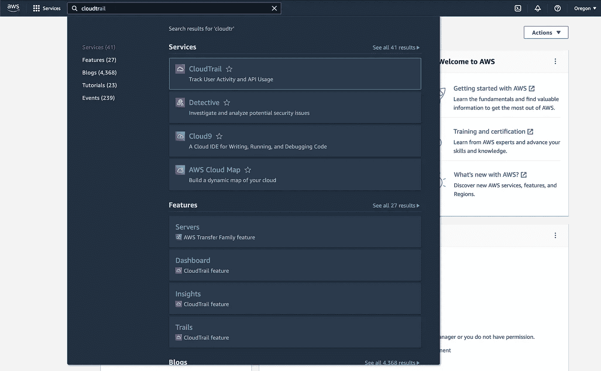

1.  点击`create trail`。

1.  在**一般详情**部分，输入下述信息:

*   **轨迹名称** : *mydemotrail。*
*   **存放位置**:选择**新建 S3 桶。**
*   **轨迹日志桶和文件夹**:*mysuperdemobacter/data。*

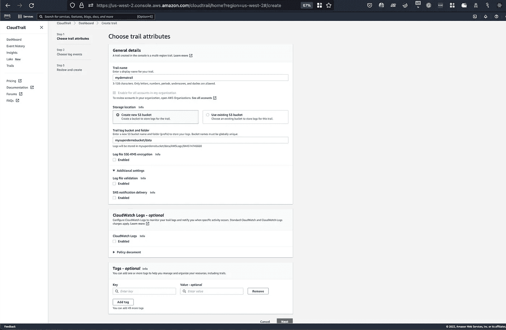

2.检查日志事件并选择`management events`，如下图所示。

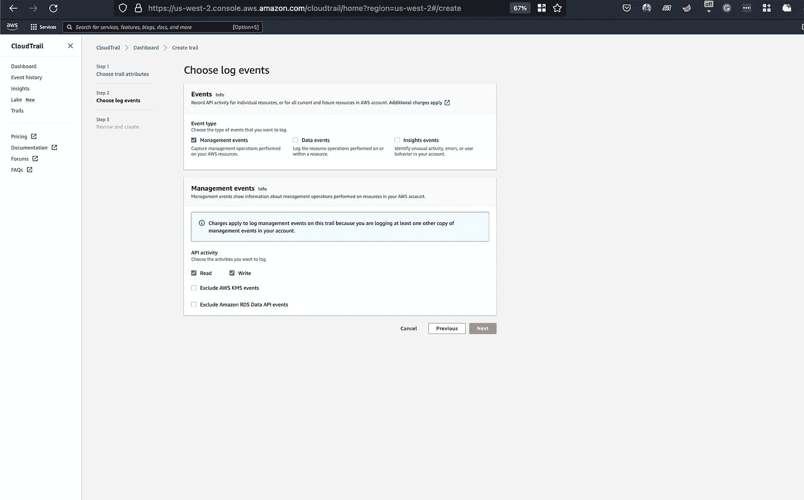

3.查看轨迹属性，点击`Create Trail`创建轨迹。

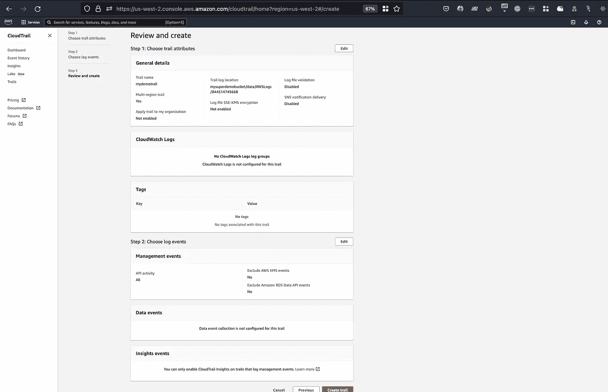

将其他选项保留为默认值

9.检查在**轨迹**表中列出的新创建的轨迹。

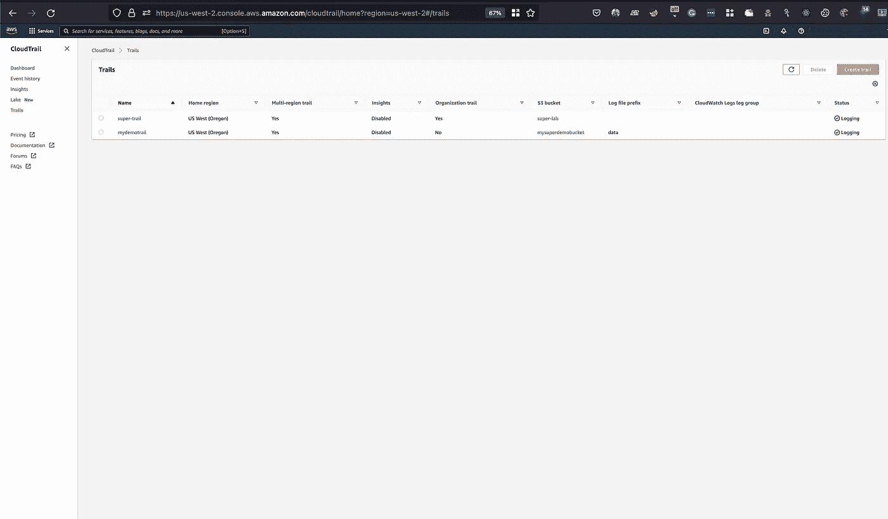

这条小径是和 S3 水桶一起被创造出来的。

10.S3 存储桶将使用上述结构来存储日志`bucket/prefix/AWSLogs/Account ID/CloudTrail/region/YYYY/MM/DD/file.json.gz`

11.单击您的踪迹的名称并查看配置。

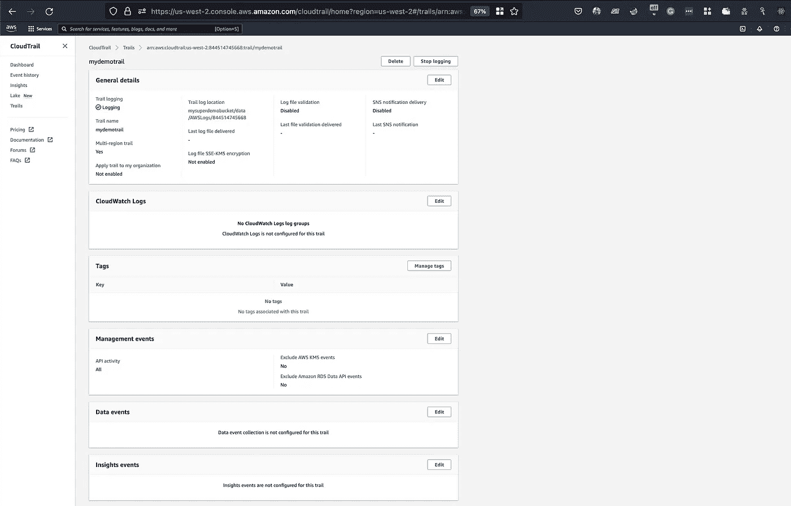

12.检查应该启用日志记录的`Trail Logging` ，并与检查`Last file validation delivered`一起标记为绿色，以检查交付的日志。

13.在新的 AWS 管理控制台中，选择 **S3 并**点击最近创建的桶。

在创建 CloudTrail 时创建的 S3 存储桶中有一个文件夹名**mysuperdemobacter/**。

14.点击**my superdemobacter/**，然后进一步向下导航至组织结构。

15.点击**云迹**前缀，然后点击**地区**前缀。

16.继续沿着文件夹/前缀结构导航，直到出现压缩的 JSON 文件(以 **.json.gz** 结尾)。

> cloudtrail 可能需要一些时间来填充结果。

17.检查 JSON 日志的名称，发现文件命名约定包括:

*   帐户 ID
*   正文 **CloudTrail。**
*   地区
*   日期/时间戳。
*   唯一字符串(由 AWS 生成)。
*   一个 **.json.gz** 文件扩展名(json 文件类型带 gzip 文件格式)。

18.勾选表格中间的方框选择一个 JSON 文件，然后按**打开**按钮查看`raw json`。

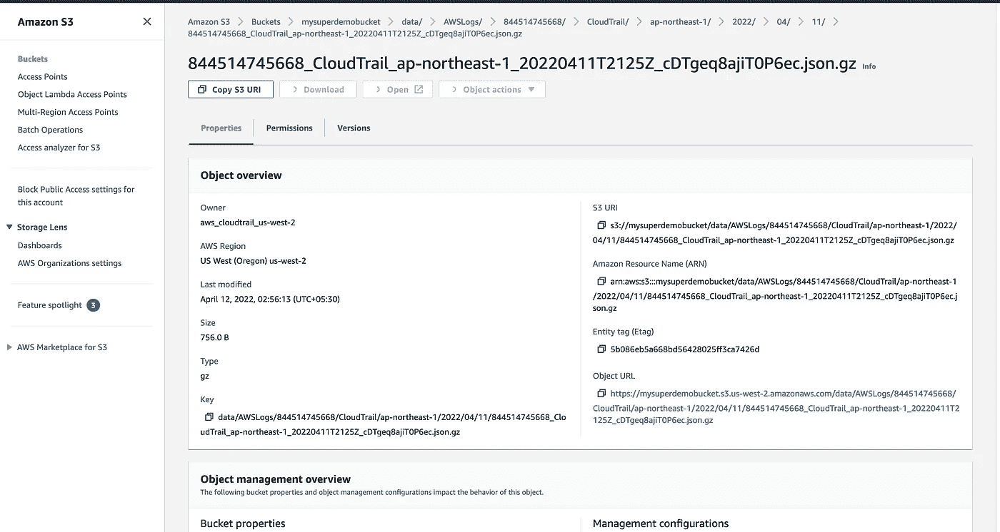

## b)社交网络设置

19.在顶部的搜索栏中输入 *SNS* ，在**服务**下，点击**简单通知服务。**

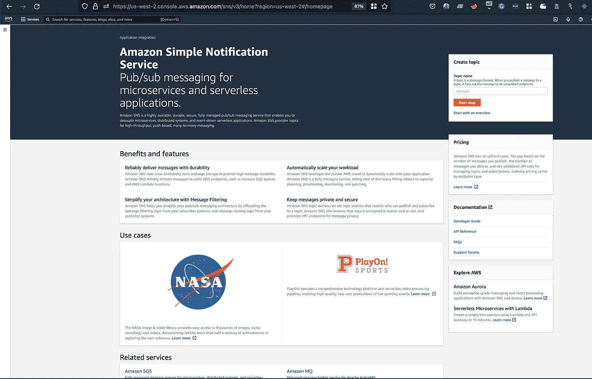

20.在右侧点击`Create topic`和`Next step`。

21.然后填充类似`Name`和`Display Name`的细节。

22.为**类型字段选择`Standard`。**

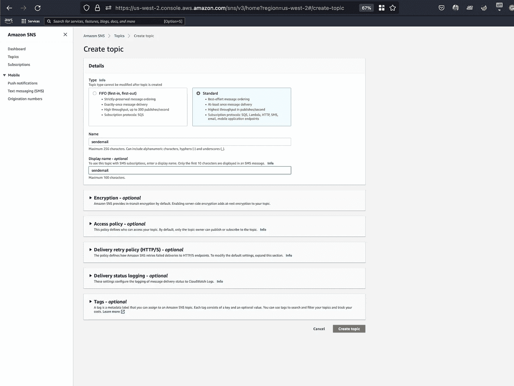

23.滚动到底部然后点击`**Create topic**`。

24.然后在左侧，点击`Subscriptions`。

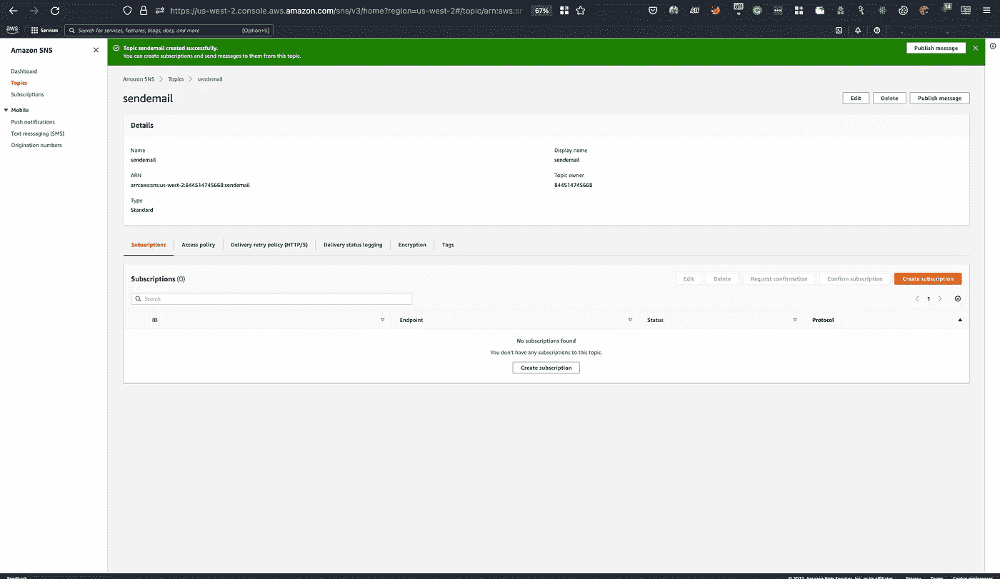

将加载**创建订阅**表单。

25.要配置新的订阅，请点击`**Create subscription**` 并输入详细信息:

*   **主题 ARN** :之前创建的主题的名称。
*   **协议**:选择**电子邮件**
*   **终点**:输入您接收邮件的电子邮件地址(此处使用一次性电子邮件进行演示)

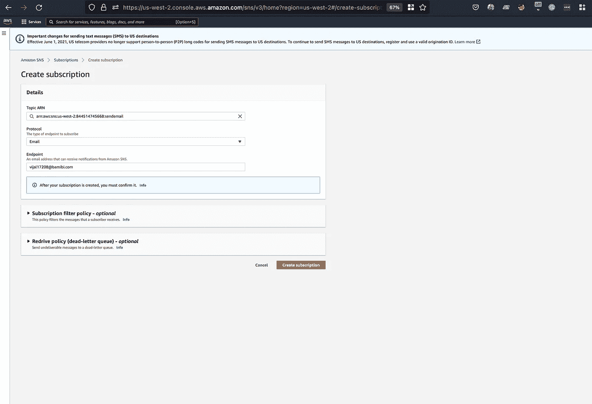

> **端点**的类型和格式取决于所选择的**协议**。

26.滚动到底部，点击`Create subscription`，然后检查显示`Pending confirmation.`的`Status`字段

27.检查您的收件箱，查看 AWS SNS 的确认电子邮件。

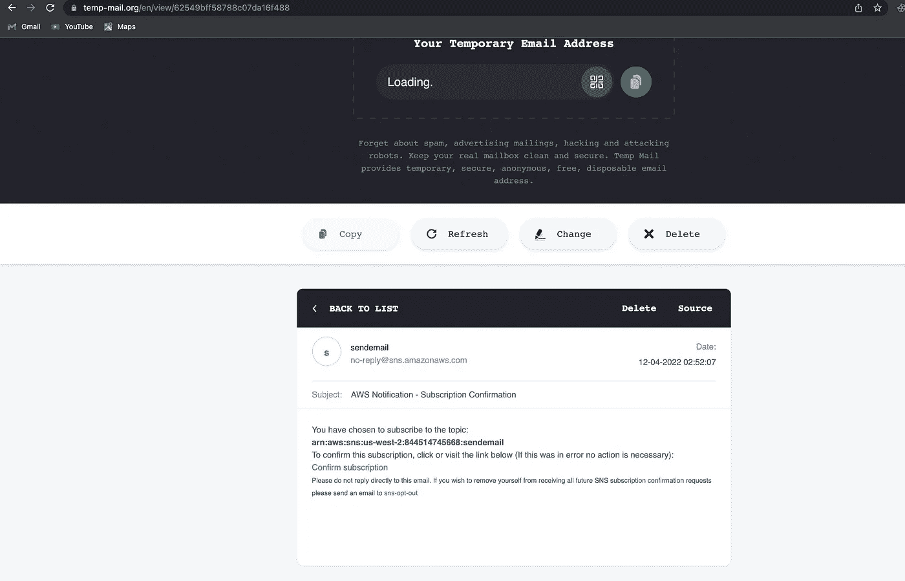

28.打开邮件，点击**确认订阅**链接，**订阅将被确认。**

29.返回到您的选项卡，打开订阅并刷新页面。检查**状态**是否已经更新为**确认**:

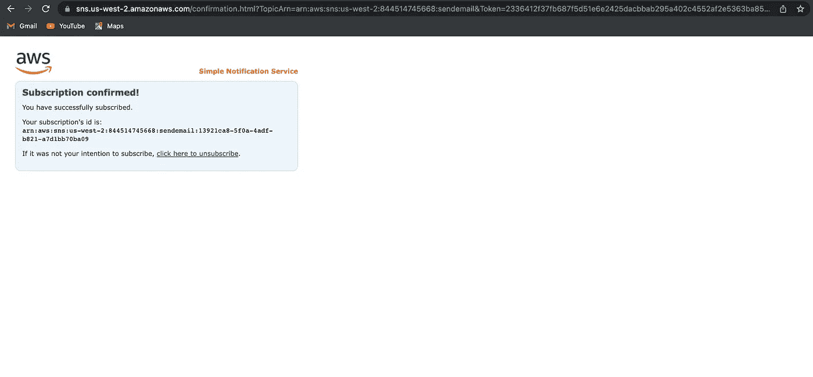

## 发布消息

30.在 Amazon SNS 中，我们可以用它来广播信息或测试新的 SNS 主题。在左边点击`Topics`，并点击你的题目名称。

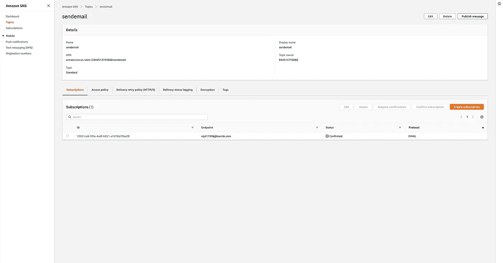

31.然后点击右上角的`Publish message`。

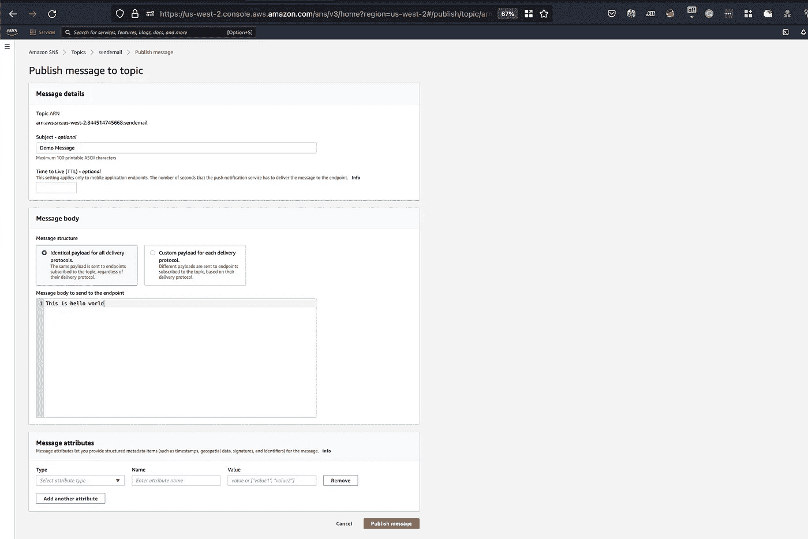

32.输入`Subject`和`Message Body`等细节。点击`Publish message`。

33.检查收到的有 *hello world* 的邮件。

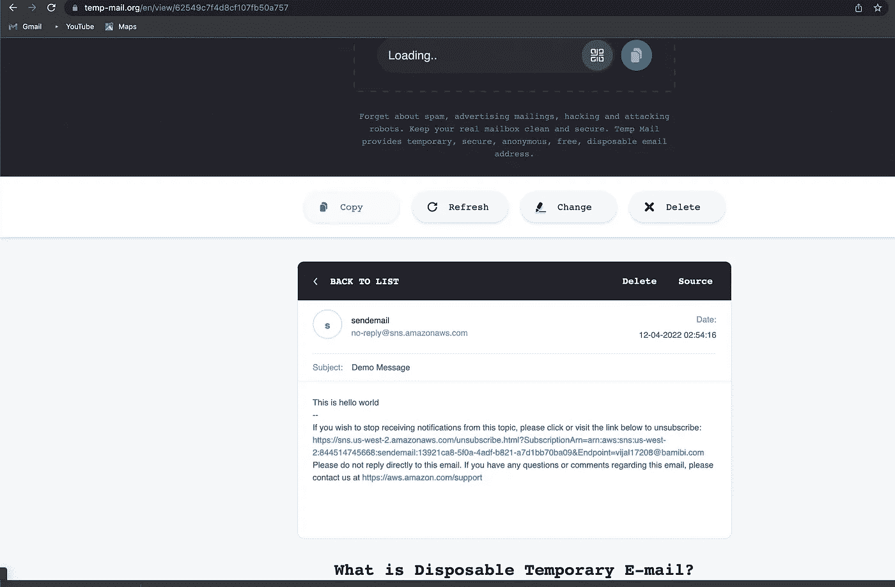

*注*:信息的外观会因您的电子邮件而异。

> 如果您设置了多个订阅(例如电子邮件和短信)，您可以通过编辑属性来自定义信息。

**参考:**

 [## 亚马逊简单通知服务(SNS) |消息服务| AWS

### 全面管理的发布/订阅消息、短信、电子邮件和移动推送通知亚马逊简单通知服务(亚马逊…

aws.amazon.com](https://aws.amazon.com/sns/?whats-new-cards.sort-by=item.additionalFields.postDateTime&whats-new-cards.sort-order=desc)  [## 亚马逊简单通知服务(SNS)常见问题|消息服务| AWS

### 问:什么是亚马逊简单通知服务(Amazon SNS)？亚马逊简单通知服务(亚马逊 SNS)是一个网络…

aws.amazon.com](https://aws.amazon.com/sns/faqs/)