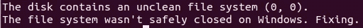

# 揭露数字证据:刑事调查用物理硬盘调查指南

> 原文：<https://infosecwriteups.com/hard-drive-forensics-7e5ffd6036fd?source=collection_archive---------0----------------------->

想象一下，你有一个硬盘，你需要检查刑事调查。就像处理所有证据一样，你需要非常小心地检查它，使用正确的工具，因为不恰当的方法会破坏它，使它变得无用。这篇文章是关于如何处理数字证据，特别是对物理硬盘的调查，而类似的方法也适用于其他存储设备。


总结以下部分，我将向您展示如何:

*   制作磁盘的副本
*   将磁盘映像绑定到块设备
*   在 [libguestfs](https://libguestfs.org/) 中挂载并检查它

我将在我的 Linux Ubuntu 机器上使用终端。如果你目前运行的是 Windows，给自己设置一个虚拟机，安装你喜欢的任何 Linux 操作系统发行版——Ubuntu、Xubuntu 和 Debian 应该可以，但是还有很多其他的软件也可以完成这项工作。

## 磁盘拷贝

假设我们有一个存有数字证据的硬盘。我们需要做的第一件也是最重要的事情是将硬盘驱动器的完整副本制作成磁盘映像。为什么？嗯，我们几乎总是希望**对拷贝进行调查，因此如果出现任何问题(文件系统损坏)，原始文件仍然完好无损**，我们可以从头开始。

首先，当您将硬盘插入 PC 时，您应该能够在/dev 目录下看到一个新的块设备:

```
**ls -l /dev**
```

一旦你确定了它是哪一个，你可以通过使用 **cat** 或 [**dd**](https://www.geeksforgeeks.org/dd-command-linux/) 命令来创建它的完整副本:

```
**cat /dev/<your-device> > disk_image.raw**# or**dd if=/dev/<your-device> of=disk_image.raw**
```

请注意，您的主机(或 VM)上应该有足够的内存空间，因为这些文件可能会变得很大，达到物理驱动器的大小。一旦命令完成，您现在就有了一个物理驱动器的完整副本，它存储在一个 **disk_image.raw** 文件中，稍后我将把它称为**磁盘映像(文件)**。

## 绑定到块设备

对于磁盘映像，通常的做法是将它连接到一个块设备，挂载它，并检查它上面的文件系统。这种方法有什么问题？问题是**你对数字证据执行的每一个可能会修改它的操作都需要被记录或者被很好地记录并可重复，这样检察官就可以执行相同的操作并以相同的结果结束**。

好吧，但是为什么他能做到我上面提到的步骤呢？嗯，因为我们的电脑或任何你用来检查磁盘的硬件有时试图表现得有点太聪明了(显然是为了让我们的生活更容易)。让我们看看我的意思是什么。

我有一些文件 **disk_image.raw** ，我将对其进行检查。下面的命令是:

```
**modprobe nbd** # Load the nbd module into kernel and create block devices**ls -l /dev/nbd*** # List NBD devices**apt install qemu-utils** # Install QEMU tool**qemu-nbd -f raw -c /dev/nbdX disk_image.raw** # Connect .raw image to device**lsblk** # Check available partitions on /dev/nbdX
```

如果我们所做的一切都正确的话，块设备(文件)和磁盘映像应该还是一样的(如果你现在不相信，以后你会明白的)。

我们可以通过计算两者的散列来检查相等性:

```
**md5sum /dev/<device-name>** **disk_image.raw**
```

怎么了?为什么哈希值不同？我必须承认，有可能在你的情况下散列是相等的，你完全没问题，但是让我们暂时想象一下不是这样，因为这是新手经常犯的错误。

你没有做错任何事，但是你的操作系统“在幕后”做错了。当您将磁盘映像连接到文件时，操作系统开始自动检测分区，例如，如果它发现任何损坏的分区，它会尝试重建它们，LVM 分区(如果存在)会自动合并到卷组和逻辑分区中，从而更改上次安装的时间，等等。



操作系统自动修复磁盘映像

但如果你想正确的做法医调查，这不是你想要的。请记住，对证据(磁盘映像)执行的所有操作都需要记录或详细记录，并且是可重复的。如果我们让操作系统去做它的事情，就不能保证它会在所有机器上同样地处理它——换句话说，对证据的操作需要手动执行，任何后台的高级操作都是不希望的。

如何才能在“幕后”阻止这种行为？你应该**在一个最小的操作系统发行版上运行所有你确定没有你的批准不会自动执行的操作，或者你应该确保所有与 LVM、RAID 相关的服务都应该被禁用/停止**。根据您的设置，做您喜欢的任何事情，我在我的电脑上禁用服务(如果您也这样做，请查找诸如 md*、lvm2*之类的短语)。

一旦你认为，你得到了它的权利，重新验证它通过计算哈希，如我们上面所做的，如果他们匹配你可以继续进行。

请注意，如果您有一些不同的磁盘映像文件格式，您总是可以将其转换为其他类型。比如从。vdi 至。原始格式:

```
**qemu-img convert -f vdi -O raw disk_image.vdi disk_image.raw**
```

这一步将改变磁盘映像散列，但这样做完全没问题，因为您可以记录它，检察官可以重复它并得到相同的结果。

到目前为止，我们已经将磁盘映像绑定到了一个块设备，但是我们仍然需要挂载它才能看到文件系统。尽管这次行动看起来很无辜，但事实并非总是如此。

## 安装在 libguestfs 内部

可能发生的一个相当荒谬的情况是，磁盘映像上可能存储了一些**恶意代码，一旦你安装了它，它就会运行并损坏你的 PC** 。我们如何防止这种情况发生，或者至少确保我们的主机操作系统完好无损？一种解决方案是创建一个虚拟机，并在其中运行所有操作，如果发生恶意事件，只有您的虚拟机会被破坏。这种方法一切都很好，但我认为对于我们试图实现的目标来说，这有点矫枉过正。我更喜欢使用 **libguestfs** CLI 工具，这是一个小的虚拟机，但你可以更快地设置它，并在出现故障时重启它(很像虚拟机与 Docker 引导时间，如果你知道我的意思)。

让我们安装它:

```
**apt install libguestfs-tools libvirt**
```

然后，我们可以通过键入以下命令来检查我们的磁盘映像:

```
**guestfish -a disk_image.raw**
```

现在，在终端中模拟的一个小虚拟机应该启动了。要开始使用它，请键入:

```
**><fs> run** # ><fs> is the prefix in terminal you should able to see
```

命令完成后，您应该能够使用以下命令列出块设备的文件系统(和类型):

```
**list-filesystems**
```

要检查它们中的每一个，请在 root 下分别挂载它们(因为 libguestfs 虚拟机默认没有根文件系统):

```
**mount <file-system> /**
```

然后，您可以使用以下命令列出文件:

```
**ls /**
```

在 **libguestfs** UI 中的一些动作非常乏味，它给你的感觉不像标准终端。我可能有点奇怪，但是如果您同意我的观点，您可以使用下面的命令挂载具有与 guestfish 相同功能的映像，只不过您是在相同的命令行环境中使用 [**guestmount**](https://libguestfs.org/guestmount.1.html) 进行操作:

```
**guestmount -a <disk-image> -m <device> <mountpoint>**
```

这是所有的乡亲。在接下来的文章中，我打算写一些关于研究 Windows 文件系统的内容，所以请继续关注，我会有更多的内容与你分享。

> 感谢阅读！:)如果你喜欢这篇文章，点击下面的按钮👏
> 
> 对我来说意义重大，也有助于其他人了解这个故事。在 Instagram 上打招呼
> 
> 是否要开始使用 Medium？使用此[推荐链接](https://medium.com/@tp4348/membership)🔗
> 
> 如果你喜欢我的帖子，你可以[给我买个热狗](https://www.buymeacoffee.com/tp4348)🌭
> 
> 关注我更多相关内容，干杯！

## 来自 Infosec 的报道:Infosec 每天都有很多内容，很难跟上。[加入我们的每周简讯](https://weekly.infosecwriteups.com/)以 5 篇文章、4 条线索、3 个视频、2 个 GitHub Repos 和工具以及 1 个工作提醒的形式免费获取所有最新的 Infosec 趋势！