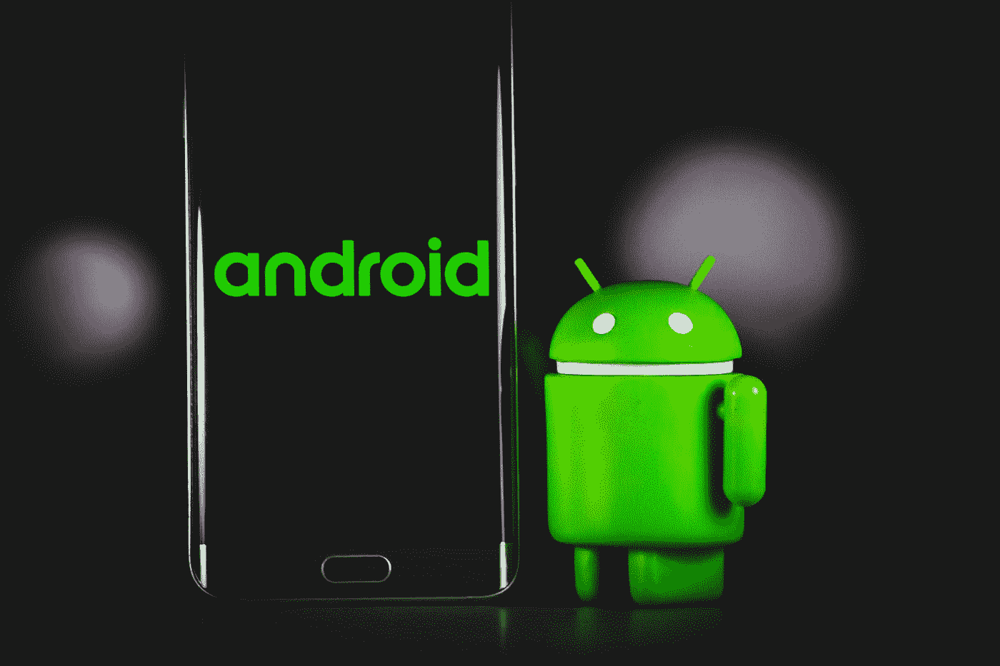

# 哈雷恶意软件:对安卓设备的新攻击

> 原文：<https://infosecwriteups.com/harley-malware-new-attack-on-android-devices-ae2c599c2217?source=collection_archive---------3----------------------->

作者:[安舒尔·维亚斯](https://www.instagram.com/_ansh_vyas/)

[丹尼·米勒](https://unsplash.com/@redaquamedia?utm_source=medium&utm_medium=referral)在 [Unsplash](https://unsplash.com?utm_source=medium&utm_medium=referral) 上的照片

# **简介**

事实上，2020 年的一项研究发现，甚至谷歌 Play 商店上一些最良性的安卓应用程序也感染了恶意软件。在 DC 漫画宇宙中，哈利·奎因是一个角色，他的女朋友名叫哈利·奎因，这使她容易受到恶意软件的攻击和病毒的感染。小丑恶意软件是众所周知的。针对安卓用户的哈雷恶意软件最近激增，最初是在三星、华为和谷歌手机上发现的，在用户不知情的情况下，它被发现清空了银行账户。

# 作案手法

黑客使用特洛伊木马攻击潜在目标。谷歌 Play 商店的应用程序感染发生在黑客下载随机的应用程序，然后在重新下载原始程序的替代版本之前用恶意代码感染它们。用户不知不觉地下载这些应用程序，以为他们得到的是原始版本。由于被改变的应用程序继续正常运行，用户不会意识到他们已经将有害代码下载到了他们的设备上。当改变后的应用程序安装在智能手机上时，它会在整个设备中传播，并获得对重要组件的控制。

自 2020 年以来，谷歌 Play 商店上已发现超过 190 个感染哈雷恶意软件的恶意应用程序。这些应用程序已经被下载了 480 万次，但可能还会有更多。

# 通过订阅窃取

一旦安装了 Harley，它就会收集有关用户设备的数据和他们正在使用的移动网络的信息。一旦手机从 Wi-Fi 切换到手机，C&C 服务器就会联系它，这样它就可以收集应该选择加入的订阅列表。哈雷在一个看不见的窗口中打开一个订阅网站，输入受害者的电话号码，按下按钮，甚至通过短信输入确认码。通过在没有意识到的情况下注册订阅服务，受害者最终会付费。哈雷甚至可以拨打特定的电话号码来确认订阅，这令人惊讶。

# 受影响的应用程序

*   小马相机— 500，000 多次下载
*   动态壁纸和主题启动器—超过 100，000 次下载
*   行动启动器和壁纸—超过 100，000 次下载
*   彩色电话— 100，000 多次下载
*   优秀的发布者— 100，000 多次下载
*   周一小部件— 100，000 多次下载
*   funcall-变声器—超过 100，000 次下载
*   Eva Launcher — 100，000 多次下载
*   Newlook Launcher — 100，000 多次下载
*   像素屏幕壁纸—超过 100，000 次下载

# 保护

虽然谷歌试图将恶意应用程序排除在 Play Store 之外，但恶意应用程序经常会出现在那里。为了避免被 Play Store 上的评论所愚弄，在安装任何应用程序之前，请在线检查书面或视频评论。由于 Play Store 上的评论有时可能是伪造的，所以在安装任何应用程序之前，最好在线检查书面或视频评论。您还应该确保您的设备上启用了 Google Play Protect，以便它可以扫描您的所有应用程序和新应用程序中的恶意软件。你也应该考虑安装一个最好的安卓杀毒软件来提供额外的保护。在你的设备上安装应用程序时要小心，就像你在网上下载其他东西一样，这一点很重要。在安装之前，问问自己是否真的需要一个像手电筒、通讯录或翻译这样的应用程序。

## 来自 Infosec 的报道:Infosec 每天都有很多内容，很难跟上。[加入我们的每周简讯](https://weekly.infosecwriteups.com/)以 5 篇文章、4 条线索、3 个视频、2 个 GitHub Repos 和工具以及 1 个工作提醒的形式免费获取所有最新的 Infosec 趋势！