# 哈星扫雷艇

> 原文：<https://infosecwriteups.com/haxing-minesweeper-e79ece9f5d16?source=collection_archive---------0----------------------->

最近，我在推特上发布了一张我凭记忆看着雷区赢得扫雷游戏的截图。我贴这个没有任何原因，只是为了好玩，因为我很高兴我终于赢得了这场比赛。我曾经在 2002 年在 Windows XP 中玩这个游戏，但我从来没有赢过这个游戏，我甚至不知道这个游戏是如何工作的，直到今天我读到它是如何工作的😀

在几分钟内，我的通知被淹没，我没想到会得到这么多喜欢。有人问我这方面的教程。我想就此写一篇简短的博文。如果我错过了什么，请原谅。

在发了那张截图之后，我看到了@DidierStevens 的博客[的帖子](https://blog.didierstevens.com/2017/07/09/video-mimikatz-minesweeper/)，他展示了一个来自@ gentilkiwi 的关于用 Mimikatz 入侵扫雷的视频。在 Mimkatz 中包含这样的功能真是太棒了。让我们试着在 XP 中为扫雷编写一个简单的脏黑客。

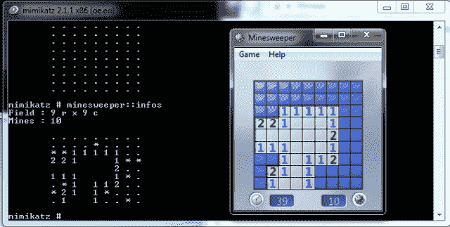

在 Windows XP 中你可以从`%systemroot%\system32\winmine.exe`
找到二进制文件，如果你没有 Windows XP，你仍然可以从[这里](http://www.minesweeper.info/downloads/WinmineXP.html)下载原始的二进制文件。

首先，让我们看看二进制文件是否启用了 ASLR。DLL 特征获得了 0x8000 的值，该值为“*IMAGE _ DLLCHARACTERISTICS _ TERMINAL _ SERVER _ AWARE*”。已经确认这个 PE 编译时没有 ASLR 保护。我们可以很容易地硬编码地址，如果我们正在为此编写一个黑客。

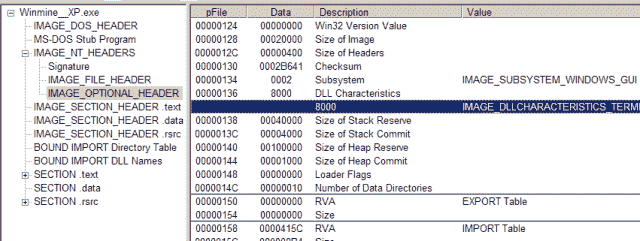

查看从'*gdi32.dll*'导入的函数，我们可以确定该程序使用的是微软视窗图形设备接口(GDI)。这是显而易见的，因为这是一个游戏😊我们还可以看到从'*advapi32.dll*'使用的注册表 API，这意味着我们可以怀疑应用程序访问了注册表。

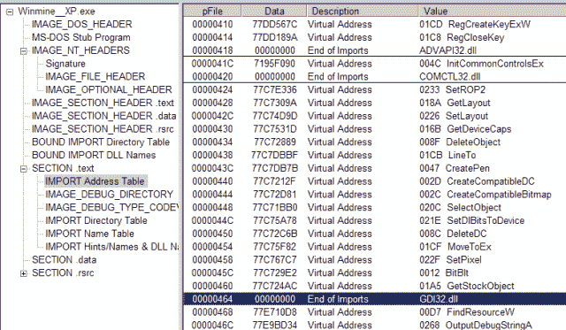

分数存储在注册表中，值从注册表中读取。如果您检查所有导入并找到对' *RegQueryValueExW* ' API 的引用，并找到一个断点，您就可以找到注册表的位置。另一个简单的方法是挂钩 API😊

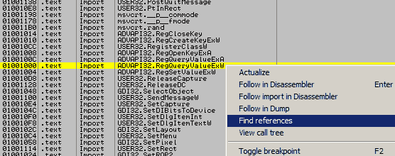

命中断点后，您可以看到堆栈上的参数，并且可以在注册表中打开该位置。

`HKEY_CURRENT_USER\software\Microsoft\winmine`


您可以修改名称、分数和其他选项，如颜色、难度、高度、宽度等。“名称 1”的值对应于十六进制的“时间 1”的分数值。

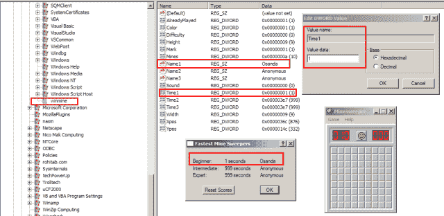

让我们在'[*BeginPaint*](https://msdn.microsoft.com/en-us/library/windows/desktop/dd183362(v=vs.85).aspx)' API 上打一个断点。

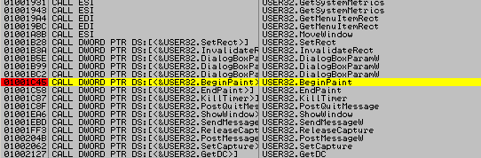

让我们进入函数内部

`01001C4C |. E8 720E0000 CALL Winmine_.01002AC3`

然后再次进入函数内部。

```
01002AE6 |. 56 PUSH ESI ; /Arg1
01002AE7 |. E8 BBFBFFFF CALL Winmine_.010026A7 ; \Winmine_.010026A7
```

你会看到'[*BitBlt*](https://msdn.microsoft.com/en-us/library/windows/desktop/dd183370(v=vs.85).aspx)*API 用来一个一个的绘制方块。*

*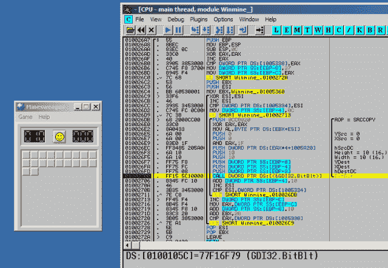*

*如果我们检查寄存器，EBX 包含雷场 0x010056360，ESI 寄存器用于递增每个字节。*

*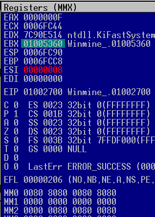*

*如果我们转储 EBX 寄存器，我们可以从 0x01005340 确定起始点。*

*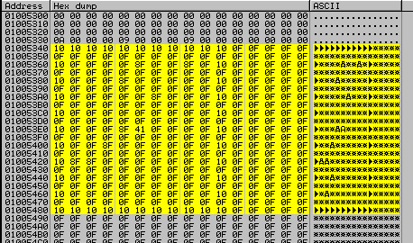*

*它将 0x20 添加到 EBX，我们可以确定每个字段的结尾。*

*`0100271D |. 83C3 20 |ADD EBX,20`*

*首先，我们要打开游戏的流程。为此，我们将使用 FindWindow 并获得窗口的句柄，然后将其传递给' *GetWindowThreadProcessId* '，一旦我们获得' *dwProcessId* '我们就可以将该值传递给' *OpenProcess* ' API。你也可以使用这里讨论的[中的*createtoolhelp 32 snapshot*技术。](https://osandamalith.com/2016/05/28/parent-process-detection/)*

```
*HWND window = FindWindow(NULL, L"Minesweeper");
if (window == NULL)
    return wprintf(L"[-] Failed to find Minesweeper process");

GetWindowThreadProcessId(window, &dwProcessId);
HANDLE process = OpenProcess(PROCESS_VM_READ, FALSE, dwProcessId);*
```

*接下来，我们将分配缓冲区来存储雷区数据。*

```
*LPBYTE buffer = (LPBYTE)malloc(size);
if (buffer == NULL)
    return wprintf(L"[-] Failed to allocated memory");*
```

*最后，我们将编写一个无限循环，使用“ReadProcessMemory”API 从内存的起始地址读取内存，这样每当我们单击一个字段时，这些字段都会得到更新。我们可以在字段中每行的末尾使用 0x20。*

```
*while (true) {
        BOOL ret = ReadProcessMemory(process, (LPVOID)start, buffer, size,
            &dwRead);

        if (ret == NULL) return wprintf(L"[-] Failed to read memory");

        for (size_t i = 0, j = 0; i < size; i++, j++) {
            if (j == 0x20) {
                puts("");
                j = 0;
            }
            printf("%c", buffer[i]);
        }
        Sleep(1500);

        system("cls");
    }*
```

*我们只是使用' *ReadProcessMemory* ' API 从内存中转储了思维场😊*

*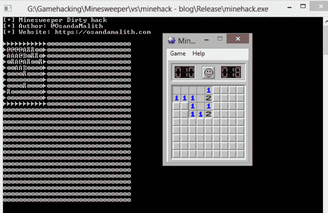*

*这是完整的源代码。
[https://github . com/OsandaMalith/game hacking/blob/master/mineesweeper/hack . c](https://github.com/OsandaMalith/GameHacking/blob/master/Minesweeper/Hack.c)*

```
*#include "stdafx.h"

#include <stdio.h>
#include <tchar.h>
#include <windows.h>

#define start 0x1005340
#define end 0x10056A0

int _tmain(int argc, _TCHAR* argv[]) {
    DWORD dwProcessId = 0;
    DWORD dwRead = 0;
    HWND window = FindWindow(NULL, L"Minesweeper");
    if (window == NULL)
        return wprintf(L"[-] Failed to find Minesweeper process");

    GetWindowThreadProcessId(window, &dwProcessId);
    HANDLE process =  OpenProcess(PROCESS_VM_READ, FALSE, dwProcessId);

    DWORD size = end - start;

    LPBYTE buffer = (LPBYTE)malloc(size);
    if (buffer == NULL)
        return wprintf(L"[-] Failed to allocated memory");

    while (true) {
        wprintf(L"[+] Minesweeper Dirty hack\n");
        wprintf(L"[+] Author: [@OsandaMalith](http://twitter.com/OsandaMalith)\n");
        wprintf(L"[+] Website: [https://osandamalith.com\n\n](https://osandamalith.com\n\n)");

        BOOL ret = ReadProcessMemory(process, (LPVOID)start, buffer, size,
            &dwRead);
        if (ret == NULL) return wprintf(L"[-] Failed to read memory");

        BYTE field = NULL;

        for (size_t i = 0, j = 0; i < size; i++, j++) {
            if (j == 0x20) {
                puts("");
                j = 0;
            }
            printf("%c", buffer[i]);
        }
        Sleep(1500);

        system("cls");
    }
    return 0;
}*
```

*您可以修改字节值并打印出类似这样的内容，我将把这留给您😊*

*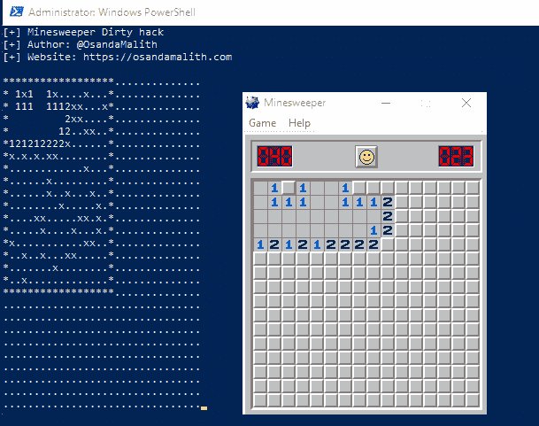*

*你可以检查我的朋友 Ophir Harpaz 已经很好地修补了她制作的程序，如果 al == 0x8f 是一个地雷，请将其更改为代码洞内的 0x0E 标志。
[https://github.com/ophirharpaz/Patched-Minesweeper](https://github.com/ophirharpaz/Patched-Minesweeper)*

*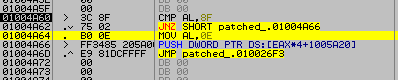**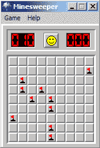*

*我希望这篇文章对你开始破解简单游戏有用😉*

# *翻译*

*хакинг扫雷舰—[https://howtorecover.me/khaking-minesweeper](https://howtorecover.me/khaking-minesweeper)*

**原载于 2018 年 4 月 7 日*[*http://osandamalith.com*](https://osandamalith.com/2018/04/07/haxing-minesweeper/)*。**