# 对智人的堆积剥削

> 原文：<https://infosecwriteups.com/heap-exploitation-for-homo-sapiens-f166cd6a59fe?source=collection_archive---------0----------------------->

你好黑客们，

今天，我们将开始一个关于 ARM 上堆利用的新系列。与堆栈利用相比，堆利用相当复杂且难以理解。资源不多，尤其是堆利用本身。大多数教程对我们这些**人类**生物来说是非常痛苦和难以理解的。我也是堆利用方面的新手，所以我认为写这些文章将有助于像我这样的人轻松理解这一点，而无需太多努力。

我想让这件事尽可能简单。我不会过多地深入堆内部。我只会触及表面。即使这些教程基于 ARM，也可以在 x86 等其他平台上完成。

我将介绍一些常见的堆错误，如堆溢出、免费后使用、双免费、风水等。所以先说一下学习这个的前提条件。

*   ARM x32 指令的基础知识
*   应该对堆栈溢出有所了解
*   c 编程基础
*   耐心
*   应熟悉广发银行和全球环境基金

说得够多了，让我们开始吧。

# 堆简介

注意，我们将重点关注在 Linux 上实现的 **glibc 堆分配器**。这和 windows 不一样。

那堆是什么？

简单地说，堆是一个动态分配的树状结构，可用于存储数据(变量、指针等)。在堆上分配的变量在运行时分配内存。我们可以在任何时候分配一个特定的块，也可以在任何时候释放它。这使得在任何给定时间跟踪堆的哪些部分被分配或空闲变得更加复杂。与操作系统管理的堆栈不同，堆应该由用户自己管理，因为它是动态的。使用完堆内存后，应该由用户自己删除(释放)。

在 C 语言中，我们将使用 malloc()从堆中分配内存。它返回一个指向已分配内存的空指针，该内存应该根据需要存储的数据类型进行类型转换。让我们看一个例子。

```
pt = (cast-type*) malloc(byte-size)
```

> **pt =(int *)malloc(5 * sizeof(int))；**

当 malloc 返回一个地址时，它应该存储在一个指针中，对吗？

*   pt:存储地址的指针
*   (int *):类型转换为整数
*   sizeof(int):返回整数的大小(4 字节)

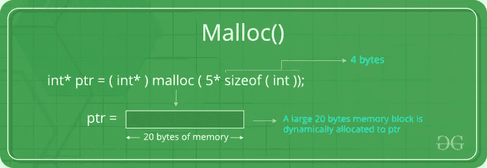

[https://www . geeks forgeeks . org/dynamic-memory-allocation-in-c-using-malloc-calloc-free-and-realloc/](https://www.geeksforgeeks.org/dynamic-memory-allocation-in-c-using-malloc-calloc-free-and-realloc/)

这将返回大约 5×4 字节= 20 字节，并且 pt 将指向该存储块的开始。

我说大约，对吗？你知道为什么吗？

你可能会想，这怎么可能，因为整数的大小是 4 字节，所以 5 * 4 = 20 字节。

但是这将分配超过 20 个字节。这就是堆内部机制发挥作用的地方。我不会深究，因为我想保持简单，但让我解释一下为什么有超过 20 个字节。

长话短说，堆管理器确保分配在 32 位系统上是 8 字节对齐，在 64 位系统上是 16 字节对齐。

实际上，内存分配的对齐并不重要，但是应该正确地进行对齐，因为堆管理器不知道用户/程序员将在分配的空间中存储什么，这也是为了提高**性能**而实现的。

还要注意，malloc()返回的最小内存块在 32 位系统中是 **16 字节**，在 64 位系统中是 **32 字节**。

因为我们使用的是 32 位系统，所以返回的内存块的最小大小是 16 字节。这意味着如果我们试图通过 malloc 从堆中分配小于或等于 16 字节大小的内存，它将总是返回 16 字节。如果你尝试分配超过 16 字节的内存，它将返回 16+8 字节，也就是 24 字节。在最小大小的内存块之后，它将增加 8 个字节，因为在 32 位系统中，内存块是按 8 个字节对齐的

为了更好地理解这一点，让我们在调试器中看看。我将用这个程序来说明 malloc 的行为。

> # include<stdlib.h># include<stdio . h>void main(){</stdlib.h>
> 
> char * m1 =(char *)malloc(2)；
> char * m2 =(char *)malloc(4)；
> char * m3 =(char *)malloc(10)；
> char * M4 =(char *)malloc(20)；
> 
> }

使用 gcc 编译它

> 海合会马洛克

我们把这个加载到 gdb 里面，对主函数进行反汇编。

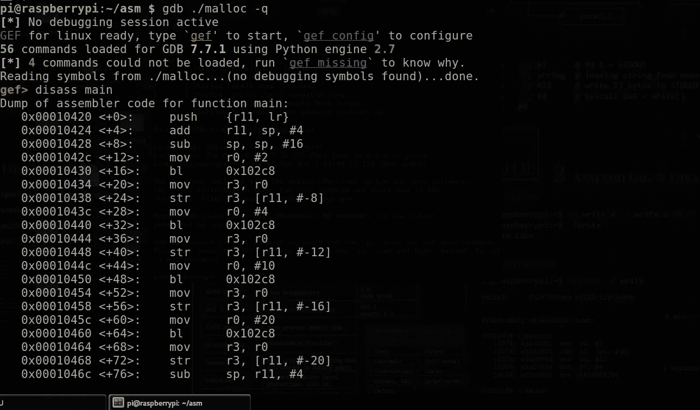

现在来看一下拆解。

有四个打给 malloc 的电话。因此，我们可以假设“bl 0x102c8”是 malloc 的分支，类似地，看看这个分支上面的 mov 指令，它每次都向 r0 移动一些值。你能猜出这个值是什么吗？

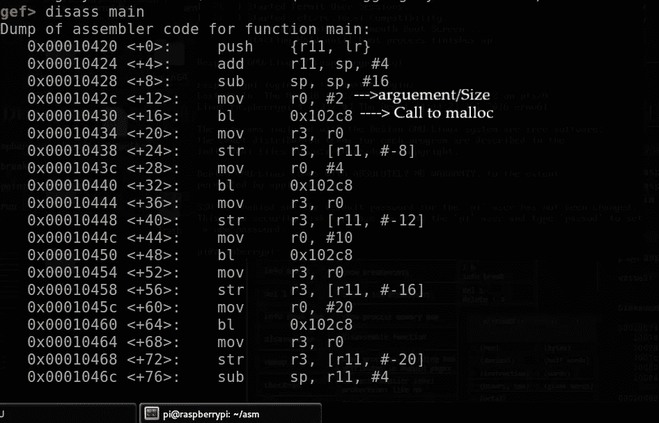

根据 ARM 调用约定，第一个参数应该在 r0 寄存器中传递。malloc()中唯一的参数是用户/程序员给定的要分配的大小。所以它将用户/程序员提供的大小复制到 r0，作为 malloc()的参数。

简单来说，

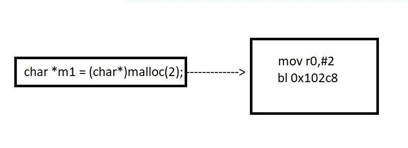

让我们在地址为 0x00010430 的第一个 malloc 处设置一个断点，然后运行程序。

> bp *0x00010430

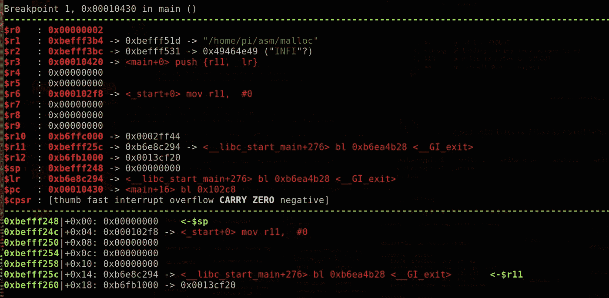

我们的断点已被命中。如果你现在看 r0，它包含 2(malloc(size)的参数)。现在让我们跳过 ni

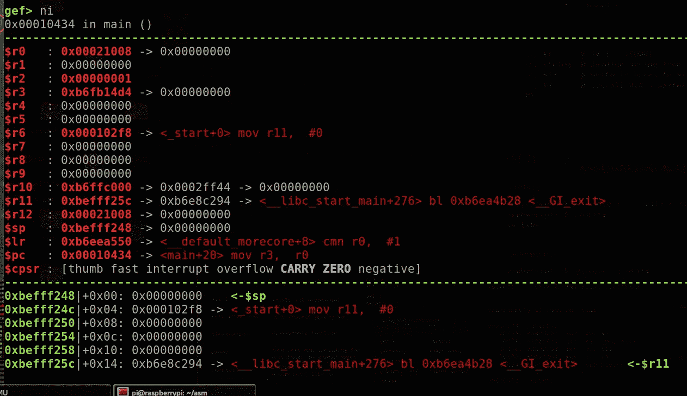

现在调试器执行了 malloc()调用，并返回到下一条指令。如你所知，r0 包含了一个函数的返回值，所以在调用 malloc()之后，它将返回一个指向零的地址。它是指向由 malloc()返回的已分配内存的第一个字节的地址。

所以地址“0x00021008”指向分配内存的开始，是这样吗？让我们使用 examine 命令对此进行检查。

> 全球环境基金> x/6x 0x 00021008–8

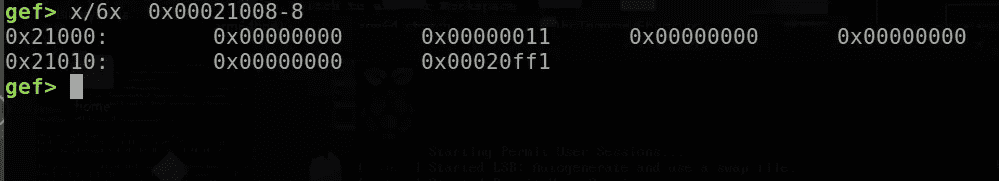

这个输出可能看起来有点混乱，但是让我解释一下。我们分配的空间从“0x 00021008”(r0 中的返回地址)开始。所以空间从下图的阴影空间开始

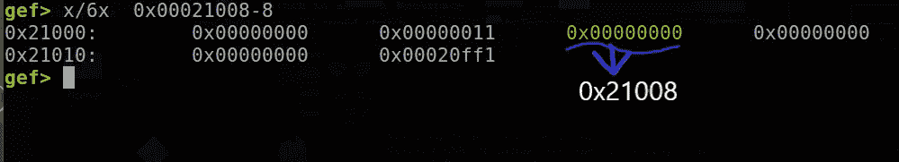

你可能会奇怪，我们只要求 2 个字节，但其他空间有零。啊，是的，记得我说过在 32 位系统中，最小分配内存块是 16 字节。所以这些零也被我们的第一个 malloc(2)分配了空间。

但是这个怎么加起来是 16 个字节，我们的 0x021008 之前这个诡异的 0x11 是什么？

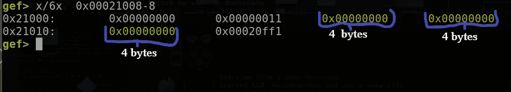

因此，将这 4 个字节相加将得到 3 * 4 = 12 个字节。但是我们的最小 16 字节对齐在哪里呢？

所以事实是奇怪的 0x11 也是我们分配的块的一部分。现在如果你计算 4 * 4 = 16 字节。一切都会解决的，对吧？

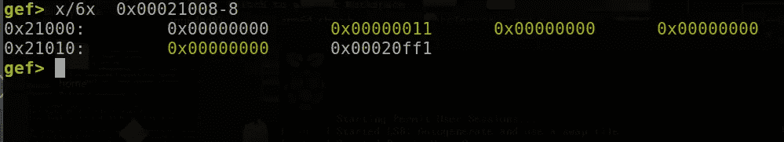

这是我们从 malloc(2)中分配的内存块。即使我们请求 2 个字节，它也返回一个 16 字节的对齐块。

现在，下一个问题是，如果包含“0x00000011”的前四个字节是我们分配的块的一部分，那么为什么 r0 不指向那个内存地址(0x21004)以及包含值 0x11 的是什么？

为了回答这个问题，让我们来看看分配内存的结构。

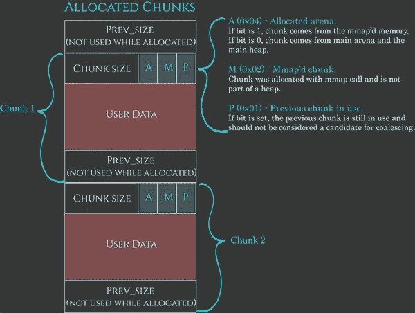

SOS:Azerialabs.com

Chunk 只是 malloc()为我们分配的内存块调用的另一个词。(上面的整个黄色阴影块)。从现在开始，我将使用这个词，而不是每次都键入分配的内存块。

分配的块有一个称为“块大小”的字段。这包含我们分配的块的总大小，也包括这个字段本身。正如我们在上面看到的，字段(上面的黄色阴影图片)是 4 字节长，所以 4 * 4 = 16。

在这里，我们分配的块是 16 字节(包括大小字段)长。因此大小字段将包含值 16。我们可以忽略“ **PREV SIZE** ”字段，因为当一个块被*分配*时它不被使用。

十六进制的 16 是 0x10，但是我们的字段包含 0x11。额外的一位来自标志“ **PREV: IN USE** ”(看上面的图片)，这意味着从堆中分配的块正在使用中。这将在我们使用当前块时进行设置。大小就是这样变成 0x11 的。

malloc 总是将地址返回到块的“用户数据”部分，这就是为什么 r0 没有指向“元数据”(大小字段)的地址，该地址位于 0x21004。“用户数据”从 0x21008 开始，这就是 r0 包含该地址的原因。

我想现在一切都清楚了。让我们继续我们的节目到下一个 malloc(4)。它也将分配相同的 16 个字节。下面是我们的前两个 malloc()

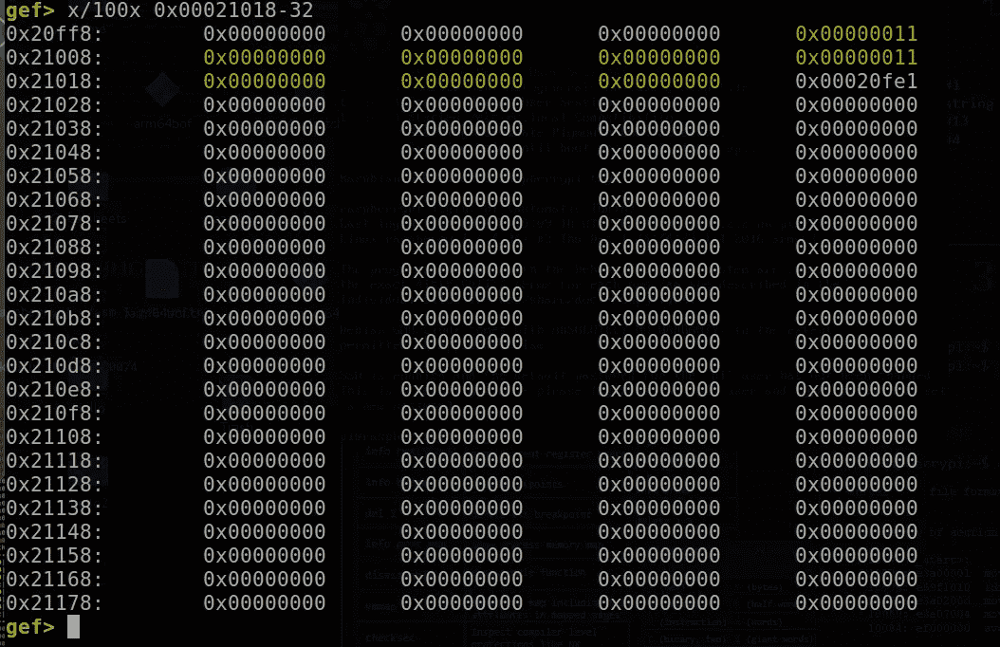

这对于所有请求的 16 字节或更小的块都是一样的。让我们看看当我们分配超过 16 个字节时会发生什么。让我们继续我们的程序，直到最后一个 malloc(20)超过 16 个字节。因此，让我们在那里设置一个断点并进行检查。

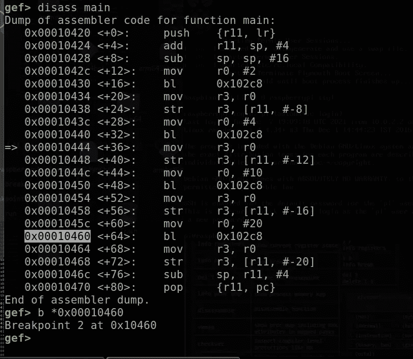

让我们使用 inspect 命令检查 r0 处的地址

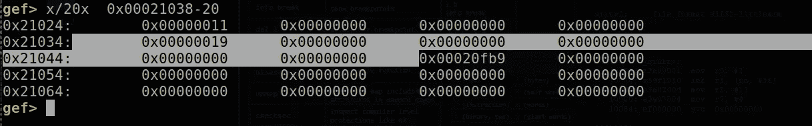

正如我们所看到的，它返回了一个 24 字节大小的块。十进制的 0x19(十六进制)是 24。

这种分配在 24 字节以内是相同的。但是如果你尝试内存分配超过 24 字节，它将返回一个 24+8 = 32 字节的块。这就是 8 字节对齐理论的由来。所以接下来的块将是 8 的倍数。所以大概是 16，24，32 等等。我希望你明白我的意思。

让我们退出调试器，继续前进。

因此，让我们在使用后释放块。要释放这个块，我们可以使用 c 中的 free 函数。(我不会展示这个例子)

自由(指针)

> 免费(pt)；

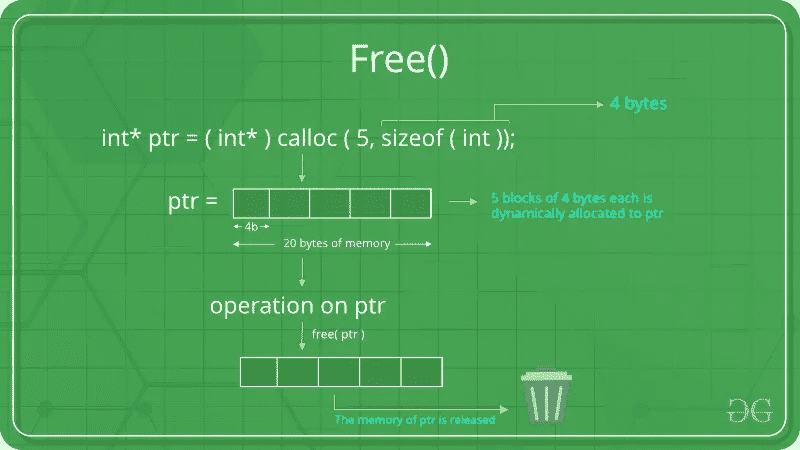

即使在释放它之后，它也会指向同一个内存位置，所以我们应该让指针(pt)指向空值。这样它就不会指向任何内存位置。如果处理不当，可能会导致其他安全隐患，比如在 free()之后使用。我们稍后会谈到这一点。让我们开始吧

> pt = NULL

所以我想这是足够的理论。这里不需要的东西，我不想过度解释和添加不必要的东西。我们可以在需要的时候通过其他东西，就像我们通过其他开发技术一样。如果你还想阅读更多，请浏览这个

[](https://www.geeksforgeeks.org/dynamic-memory-allocation-in-c-using-malloc-calloc-free-and-realloc/) [## 使用 malloc()、calloc()、free()和 realloc() - GeeksforGeeks 在 C 中动态分配内存

### 由于 C 是一种结构化语言，它有一些固定的编程规则。其中一个包括改变一个…

www.geeksforgeeks.org](https://www.geeksforgeeks.org/dynamic-memory-allocation-in-c-using-malloc-calloc-free-and-realloc/) 

# 溢出堆

与堆栈不同，我们不能直接控制 PC(程序计数器)。堆不像堆栈那样包含任何返回地址。所以覆盖并不是一直都有帮助。但是，如果有任何这样的指针，那么你是幸运的。您可以覆盖指针并控制程序流程

为了理解这一点，我们将开发一个非常简单的程序。所以让我们来看看这个程序。

> # include <stdio.h># include<string . h>
> # include<stdlib . h></stdio.h>
> 
> void main(int argc，char *argv[]){
> 
> if(argc<= 1){
> 
> printf(“Provide an argument as the username :)\n”);
> 
> exit(0);
> 
> }
> 
> printf(“Basic ARM Heap overflow challenge \n”);
> 
> char *name = malloc(64);
> char * cmd = malloc(64)；
> 
> strcpy(cmd，“whoami”)；
> 
> strcpy(name，argv[1])；
> 
> printf("%s 正在执行命令%s "，name，cmd)；
> printf(" \ n \ n ")；
> 
> 系统(cmd)；
> 
> }

所以这是一个简单的程序。它从命令行接受一个参数，并沿着输入的参数打印命令“whoami”的输出。

> char * name = malloc(64)；
> char * cmd = malloc(64)；

类型为**字符**的指针变量 name 和 cmd 将指向所分配内存的起点。

这里，第一个 **malloc** 将从堆中分配大约 60 个字节，并返回指向该内存的第一个字节的地址。它存储在变量名中。这个*名*变量用于存储使用 strcpy()的命令行输入。请注意，这是我们可以控制程序输入的唯一地方。

第二个 malloc 的大小与第一个 malloc 相同，它也这样做，并将地址存储在“cmd”变量中。它用于在分配的内存中复制命令“whoami”。

“whoami”命令在调用时显示当前用户的用户名。这里的用户是“pi”。

让我们看一个演示。

首先使用 GCC 编译它。

> gcc 堆挑战. c -o 堆挑战

现在让我们运行这个。

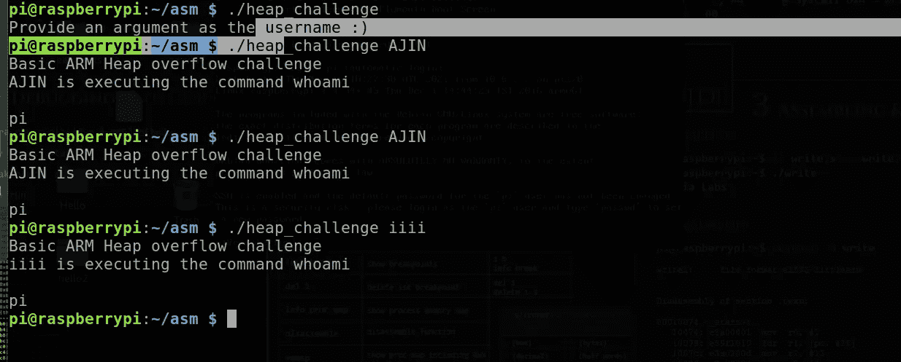

正如你在这里看到的，它需要一个参数。它通过使用系统函数来执行命令。

我希望你明白这个程序是如何工作的。

现在让我问你。你发现这里的漏洞了吗？

如果你有，恭喜你。如果没有，请再次查看代码并检查代码中使用的函数。

想起什么了吗？

我想你现在明白了，对吧？

该漏洞存在于 ***strcpy*** 函数中。众所周知***strcpy****是一个没有绑定检查的易受攻击的函数。就像在堆栈中一样，我们可以利用这个函数来溢出我们的堆。*

> *strcpy(cmd，“whoami”)；*
> 
> *strcpy(name，argv[1])；//漏洞*

*第一个 malloc()用于为 username 分配空间，第二个用于复制命令。因为它们的大小相同，所以返回的块将彼此相邻。*

*让我们使用调试器来确认这个论点。*

*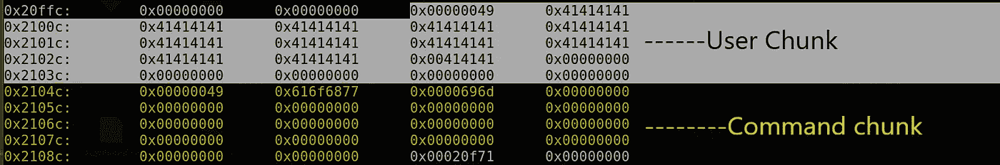*

*黄色阴影部分表示用于复制命令的块。命令“whoami”已经被复制到其中。如果查看第二个块的大小字段，DWORD 的值为“0x616f6877 ”,其后的下一个 DWORD 包含“0x0000696d ”,表示“whoami”命令。第一个块中的 41 表示发送到命令行输入的“A”。*

*说得够多了……现在让我们直奔主题吧。如何利用这一点？*

*如果你看看这个程序，主要的缺陷不是使用 strcpy()，而是使用程序块的顺序。命令块在用户名块之后，并且用户的输入也仅在第二次复制命令之后才被复制。因此，这给了我们一个溢出用户块并覆盖命令块的机会，因为如果我们溢出用户块，溢出的数据将转到相邻的命令块。因此，我们可以用自己的任意命令覆盖“whoami”命令，并执行它。*

*让我们运行程序，提供一个大的“A”输入，并尝试溢出我们的第一个块。*

*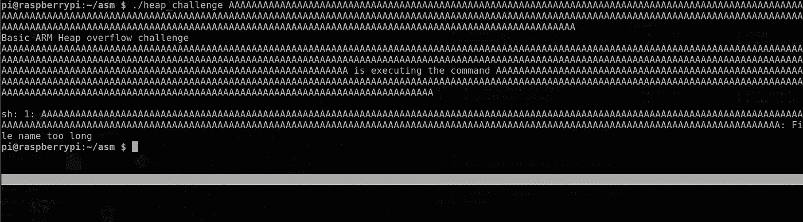*

*不出所料，程序块溢出了，结果，我们的“whoami”命令没有执行。“whoami”命令被“A”覆盖。*

*那现在怎么办？*

*让我们尝试执行任意命令。为此，我们可以通过调整“A”的数量并猜测在第二个块中覆盖“whoami”命令所需的“A”的数量，或者您可以使用与我们在基本堆栈溢出中使用的模式类似的模式。*

*我将只使用第一个命令，并尝试执行“ls”命令*

*ls 命令:列出目录中的所有文件。*

*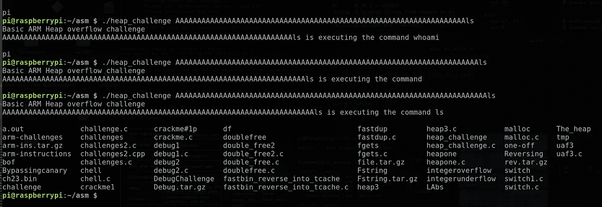*

*试了几次后，我做对了。:)*

*让我们试着用这个得到一个壳。这很简单，我们只需要传递“/bin/sh”而不是“ls ”,因为它使用 system()函数，它将生成一个 shell。*

*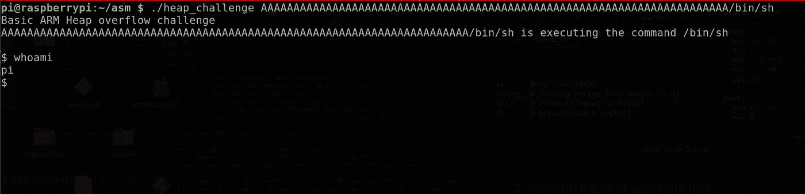*

*最后，我们得到了贝壳。*

*我想今天就这些了，我们把这个包起来吧。*

*尽管我想让这变得简单，但同时我也想让你明白这些事情是如何运作的。这里我跳过了很多东西。但是一旦我们转移到其他话题，我会把它说出来。我希望你喜欢这个，有一个美好的一天:)*

## *参考*

*[](https://www.geeksforgeeks.org/dynamic-memory-allocation-in-c-using-malloc-calloc-free-and-realloc/) [## 使用 malloc()、calloc()、free()和 realloc() - GeeksforGeeks 在 C 中动态分配内存

### 由于 C 是一种结构化语言，它有一些固定的编程规则。其中一个包括改变一个…

www.geeksforgeeks.org](https://www.geeksforgeeks.org/dynamic-memory-allocation-in-c-using-malloc-calloc-free-and-realloc/) [](https://azeria-labs.com/heap-exploitation-part-1-understanding-the-glibc-heap-implementation/) [## 堆利用第 1 部分:理解 Glibc 堆实现

### C 和 C++程序员使用在程序执行期间手动分配新的进程内存区域…

azeria-labs.com](https://azeria-labs.com/heap-exploitation-part-1-understanding-the-glibc-heap-implementation/) 

如有任何疑问，您可以联系我

https://www.facebook.com/i.am.ultralegend[脸书](https://www.facebook.com/i.am.ultralegend)

insta gram:【https://www.instagram.com/hagane_no_rekinjutsushi/ 

如果你想支持我或者学习 **ARM 开发**请查看我的课程:[https://www . udemy . com/course/reverse-engineering-and-binary-exploitation-in-ARM/？referral code = 8c 725d 513 e 77420 a0cb](https://www.udemy.com/course/reverse-engineering-and-binary-exploitation-in-arm/?referralCode=8C725D513E77420A0CBF)*