# 堆利用#1 — Tcache 攻击

> 原文：<https://infosecwriteups.com/heap-exploitation-journey-1-tcache-attack-5b38fb0c19b0?source=collection_archive---------0----------------------->

嗨伙计们。距离我上次玩 CTFs 已经半年了。现在我回来学习堆利用。我会写这样的博客，介绍这些技术和展示它们的挑战。

在这第一集中，我们将探索 tcache 链表中指针的中毒，以分配一个任意的块(从我们想要的任何地址开始的块)。

为了说明这个概念，我将带你经历在 **DEFCON19 资格赛回合**中的挑战 **babyheap** 。挑战链接可以在 [**这里找到**](https://github.com/guyinatuxedo/nightmare/tree/master/modules/29-tcache/dcquals19_babyheap) 。

> [https://github . com/guyinatuxedo/nightmare/tree/master/modules/29-tcache/DC quals 19 _ baby heap](https://github.com/guyinatuxedo/nightmare/tree/master/modules/29-tcache/dcquals19_babyheap)

# 侦察

像往常一样，我总是做的第一步是*检查 sec* 并在 *ghidra* 中反编译二进制文件。

我们可以看到所有保护都已启用:

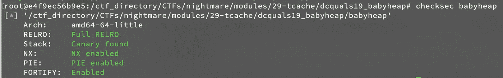

我们也来了解一下 libc 的版本:

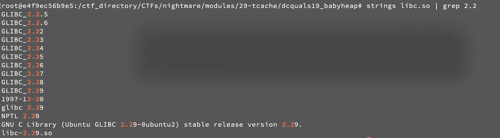

启动 ghidra，我们可以看到处理主菜单的功能:

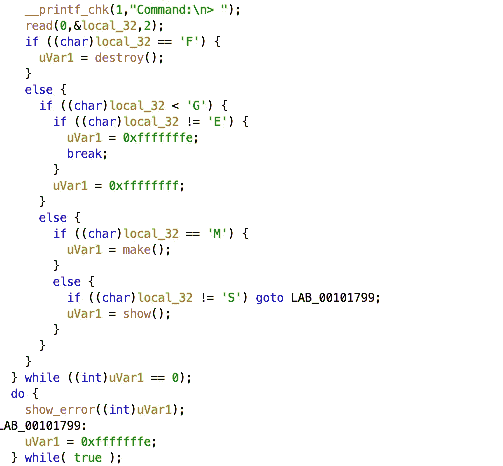

没什么有趣的。让我们来看看**使**功能:

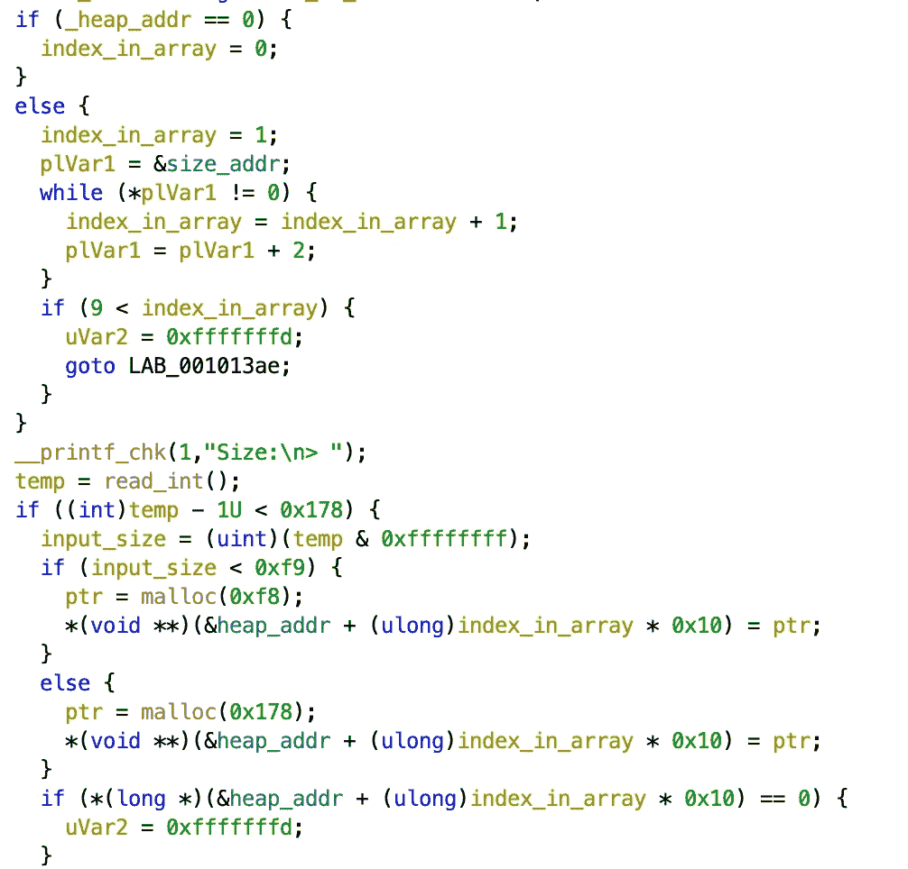

从“index_in_array”变量可以看出，我们最多只允许分配 10 个块。此外，这个变量表示给当前块的索引。

我们只能分配 0xf8 区块和 0x178 区块。然后，使用全局变量，分配的块指针和它们相应的*输入大小(不是分配的块的大小，如果检查块头的话是 0x 100)*被存储在内存中:

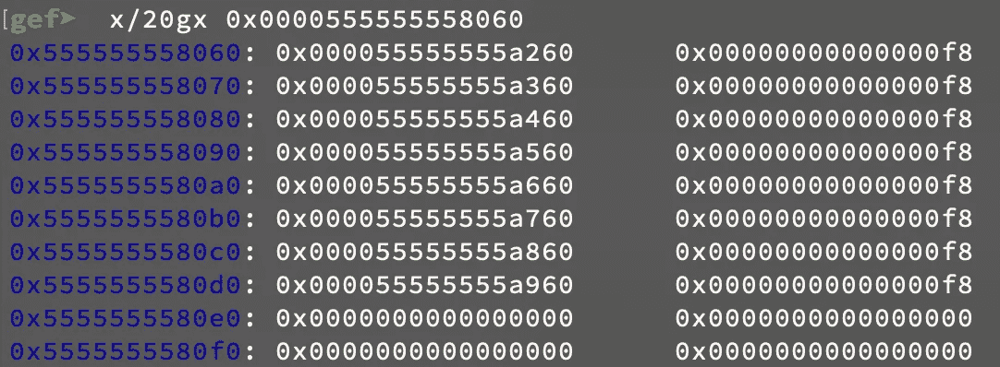

注意，在上面的*第一个 while 循环*中，它是:

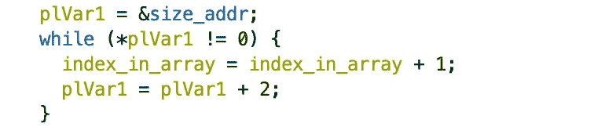

因为 plVar1 是指针，+2 作为指针数学执行，这意味着它将 plVar1 保存的地址增加 16(由于是 64 位二进制，所以 1 地址是 8 字节)。

这段代码还表明，给当前块的*索引依赖于“size_addr”中的第一个非空大小。*

接下来:

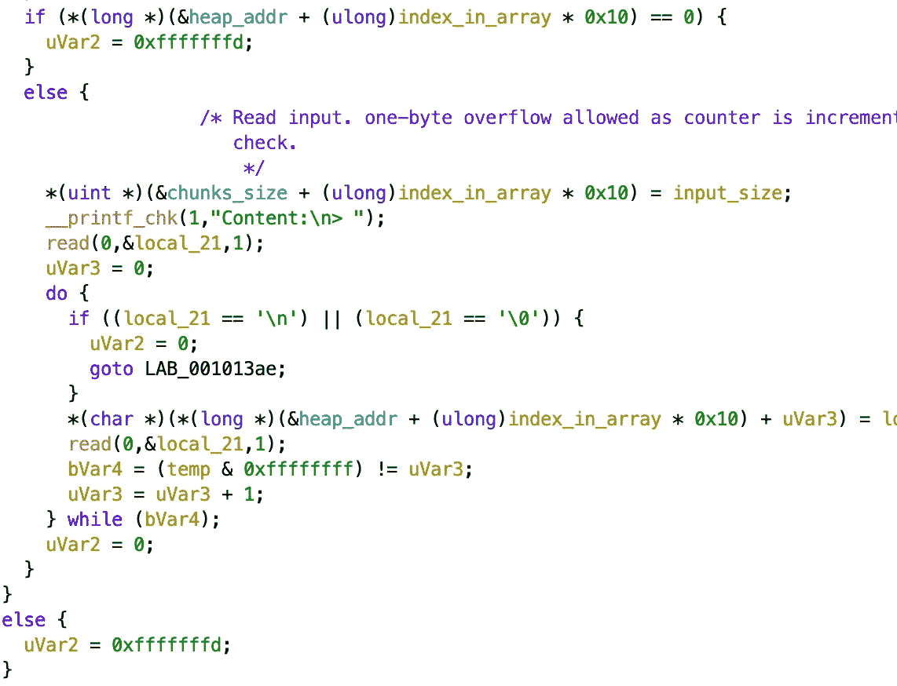

然后，它将用户数据读入分配的块，直到遇到空字节或换行符。因为计数器变量“uVar3”在读取后递增，这允许我们以“输入大小+ 1”字节进行扫描。于是我们这里就有了 ***单字节溢出*** 。

接下来，我们来看看**销毁**功能:

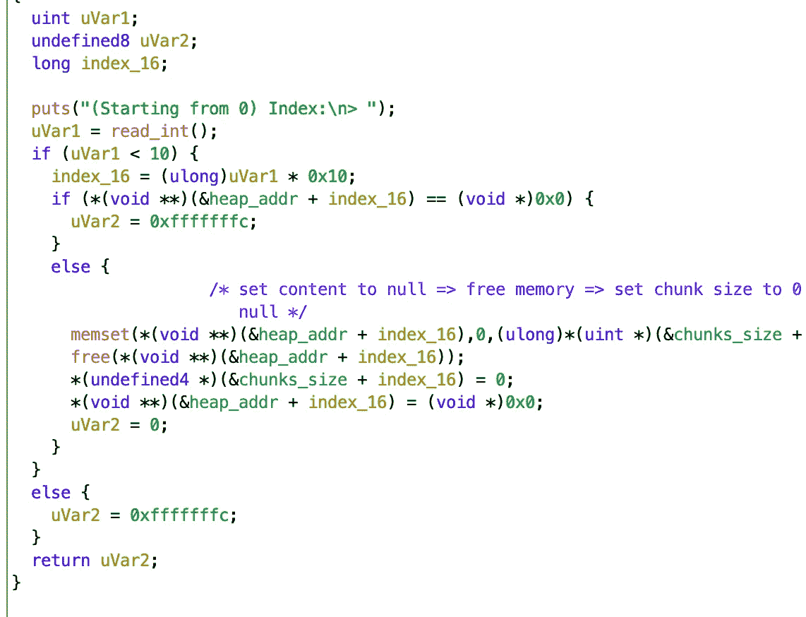

它首先检查指向已分配块的指针是否已经为空，以避免双重释放。然后，它将指针、大小和内容设置为空并释放内存。所以我们没什么可以利用的。

最后，**显示**功能:

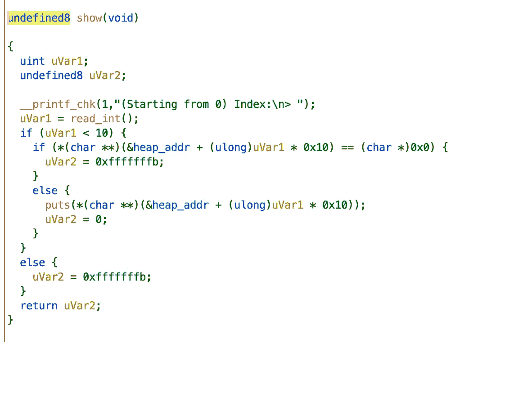

嗯，*或许可以让我们打印出用户以外的数据？除此之外，这里没什么特别的。*

*现在既然 libc 版本≥ 2.26(见上)，就有了 ***tcache*** ，分别是:*

> *每个线程都有一个每线程缓存(称为 tcache ),其中包含一个小的块集合，可以在不锁定 arena 的情况下访问这些块。这些块被存储为**一个单链表**的数组，类似于 fastbins，但是链接指向有效负载(用户区域)而不是块头。**每个 bin 包含一个大小的块**，所以数组由块大小索引(间接)。与 fastbins 不同，tcache 在每个 bin (tcache_count)中被限制允许多少块。如果对于给定的请求大小，tcache bin 为空，则不使用下一个更大的块(可能会导致内部碎片)，而是使用正常的 malloc 例程，即锁定线程的 arena 并从那里开始工作。
> [https://sourceware . org/glibc/wiki/malloc internals # Thread _ Local _ Cache _ . 28 tcache . 29](https://sourceware.org/glibc/wiki/MallocInternals#Thread_Local_Cache_.28tcache.29)*

*当分配块时，堆管理器执行以下策略**，按顺序**:*

> ***试试 *fastbin/smallbin* 回收策略***
> 
> *-如果对应的*快速库*存在，尝试从那里找到一个块(并且也有机会用来自快速库的条目预填充 *tcache* )。*
> 
> *-否则，如果相应的*小容器*存在，从那里分配(随着我们的进行，机会主义地预填充 *tcache* )。*
> 
> ***解决所有延期释放***
> 
> *-否则“真正释放”快速箱中的条目，并将它们的合并块移动到*未排序的*箱。*
> 
> *-检查*未分类*箱中的每个条目。如果合适，就停。否则，将未排序的条目放到相应的小/大 bin 中(可能会将小条目提升到 *tcache* 中)
> [https://azeria-labs . com/heap-exploitation-part-2-glibc-heap-free-bins/](https://azeria-labs.com/heap-exploitation-part-2-glibc-heap-free-bins/)*

*当我们释放数据块时，它执行以下策略**，按顺序**:*

> *4.如果大块可以放进一个*t 缓存*箱，把它存放在那里。*
> 
> *5.如果块设置了 *M* 位，通过 *munmap* 将其返回给操作系统。*
> 
> *6.否则，我们获得竞技场堆锁，然后:*
> 
> *-如果大块适合一个 fastbin，就把它放在相应的 fastbin 上，我们就完成了。*
> 
> *-如果块大于 64KB，立即合并 fastbins，并将合并后的块放在未排序的 bin 上。*
> 
> *-将该块与小、大和未排序的容器中的相邻自由块前后合并。*
> 
> *-如果产生的块位于堆的顶部，则将其合并到堆的顶部，而不是将其存储在 bin 中。*
> 
> *-否则将其存放在*未分类的箱子*中。( *Malloc* 稍后会将条目从未排序的箱子中放入小箱子或大箱子中)。*

*所以我们的块将会在 tcache 中结束。现在每个 tcache bin 最多可以容纳 7 个相同大小的块**。我们最多可以释放/分配 10 个块，那么最后 3 个空闲块去哪了？***

**如最后一点所述，它进入未分拣的箱子。有趣的是，如果一个被释放的块是 unsorted_bin* *中唯一的块，那么它将* ***保存一个指向 arena*** *的指针。但是在我们的简单程序中，只有一个竞技场——主竞技场。所以我们得到一个* ***指针指向 libc 中的某个固定偏移量。****(*[*https://drive . Google . com/file/d/1 ejskblbngmom-lkydkcqvfh 8 eqg1 GB 48/view*](https://drive.google.com/file/d/1eJskblBnGMOM-lKyDKcqVFh8EQG1GB48/view)*)**

*要查看这在 gdb 中是什么样子，分配 8 个≤ 0xf8 字节的块，释放它们，再次分配 8 个≤ 0xf8 字节的块，内容为“AAAAAAAA ”,然后显示第 8 个块的内容。然后，我们只需获取输出的最后 8 个字节:*

*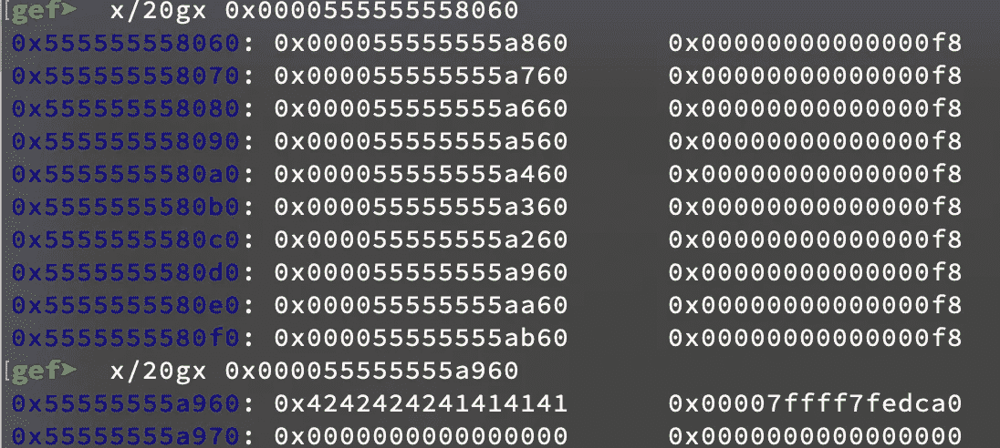*

*然后用 vmmap 找到 libc 基址，从中减去“0x00007ffff7fedca0”得到偏移量:*

*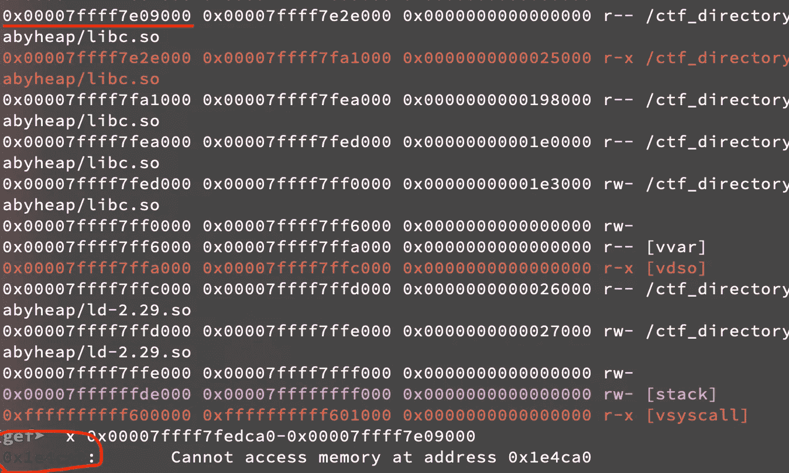*

*既然我们能够泄漏 libc，这给了我们一个提示，也许我们应该尝试调用一个 execve 小工具？*

# *剥削*

*到目前为止，我们已经:*

*   *一个字节溢出到下一个块的大小。*
*   *libc 泄密。*

*如上所述，tcache bins 是链表，所以如果我们可以修改指向下一个空闲块的指针(tcache 中的一个空闲块),那么我们应该能够分配一个任意的块？*

*但是我们把它修改到哪里呢？在二进制文件中，我们没有任何有用的函数可以重定向。但是，我们可以修改它，在“ **__malloc_hook** ”处分配一个块，这是一个自定义函数，在调用“malloc”时会自动调用。然后我们用 one_gadget 填充“_malloc_hook”，这样当我们分配一个新的块时，我们将弹出一个 shell！！！*

*嘣！！！我觉得这是个好计划。现在我们只需要找出一种方法来修改 tcache 中空闲块的指针。*

*回想一下在前面的侦察部分，我们有一个一字节溢出到下一个块的大小。让我们假设**下一个块被分配**。因此，如果我们*将其大小* e 修改为 0x181，然后*释放*它，它将*在 0x180 字节的 tcache bin* 中结束，而不是在 0xf8 字节的 tcache bin 中结束。然后，如果我们分配另一个> 0xf8 字节的块，由于程序的算法，我们将尝试分配一个 0x178 的块。所以我们得到了相同的块，但这次我们被允许将≥ 0xf9 字节填充到它的 0xf8 字节存储区中！！*

*嘣！！！我们在修改后的块中进行任意写入。如果那个块被释放，并且在 tcache bin 中，那么我们可以重写它的指针，指向“ **__malloc_hook** ”。之后，我们继续在 tcache bin 中分配块，直到我们到达“__malloc_hook”，然后我们将我们的地址填入 one_gadget。最后我们再分配一个 chunk 来触发“__malloc_hook”，弹出一个 shell！！！！！！！*

*需要记住的一件重要事情是，我们必须小心表示块的输入索引:在 **make** 函数中，算法遍历全局变量(包含指向块的指针),直到遇到空指针，然后将该索引分配给当前块。此外，因为 ***tcache 是 LIFO，我们以与释放它们的顺序相反的顺序取回数据块*** 。*

*另一件需要记住的重要事情是，我们不能在输入中提供空字节，因为 make 函数只能读取到遇到' \0 '或' \n '为止。*

# *总结我们的攻击计划*

1.  *分配 10 块 0xf8 字节。释放前 8 个。用内容“A”* 8 重新分配 8 个块。*
2.  *显示第 8 块的内容。解压缩最后 8 个字节，从偏移量中减去，并设置 libc 基址。*
3.  *以这样的方式释放 0xf8 块，当我们 ***重新分配它们时，我们按此顺序得到块*** :前面的块防止向后合并，其大小将被覆盖的块，将执行大小覆盖的块，其指针将被覆盖到“__malloc_hook”的块，最后的块防止向前合并。*
4.  *按照上面的顺序重新分配块，第三个块应该有内容“A”* 0x F8+chr(0x 81)。*
5.  *释放第二个块，它将在 0x180 字节的 bin 中结束，因为它的大小被第三个块的内容覆盖。*
6.  *释放第 4 个块，它将在 0xf8 字节的 bin 中结束。*
7.  *分配一个 0x178 字节的块，我们将得到旧的第二个块。用“__malloc_hook”的“A”* 0x F8+“B”* 8+地址填充。现在，第四个块的指针被设置为“__malloc_hook”。*
8.  *分配一个 0xf8 字节的块，我们将得到第 4 个块。*
9.  *分配另一个 0xf8 字节的块，我们将得到“__malloc_hook”。填入 one_gadget 的地址。*
10.  *分配另一个块来触发“__malloc_hook”，从而触发 one_gadget。*
11.  *享受你的贝壳吧！！:)*

*下面是我的漏洞利用 python 代码的链接:[https://github . com/we chicken 456/nightman _ solutions/blob/main/dcquals 19 _ baby heap/my _ exploit . py](https://github.com/wechicken456/nightmare_solutions/blob/main/dcquals19_babyheap/my_exploit.py)*

*哇哦，那很有趣。像一个字节溢出这样的小错误会造成如此灾难性的后果。*

*如果您有任何问题，请随时评论或 dm 我的不和谐！*

*不和谐:tuz#9881*

*github:【https://github.com/wechicken456 *

*祝你生日快乐！直到下一次..*