# 帮助——黑盒子报道

> 原文：<https://infosecwriteups.com/help-hackthebox-writeup-20ef0acb6d82?source=collection_archive---------0----------------------->

## Help 本周退役，它是比较容易的机器之一，有点令人沮丧，但我非常喜欢它，因为它迫使我阅读源代码。这个盒子包括通过提交票证选项从 web 服务器获得一个反向外壳，然后利用内核来找到它。

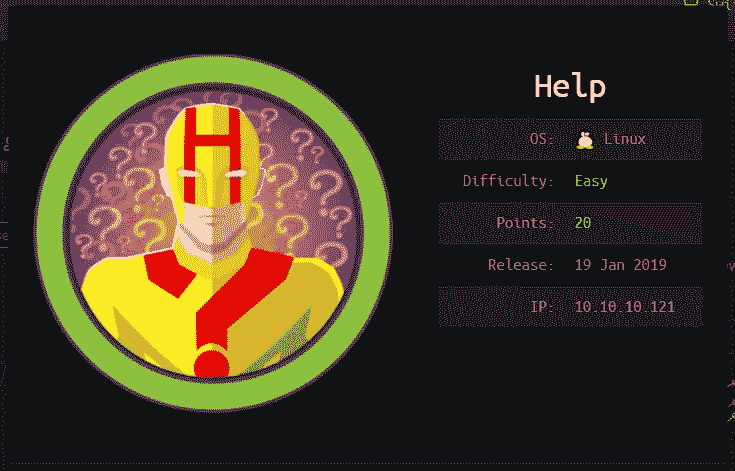

## 让我们跳进来。

# **计数和侦察**

和往常一样，让我们从一次 **Nmap** 扫描开始

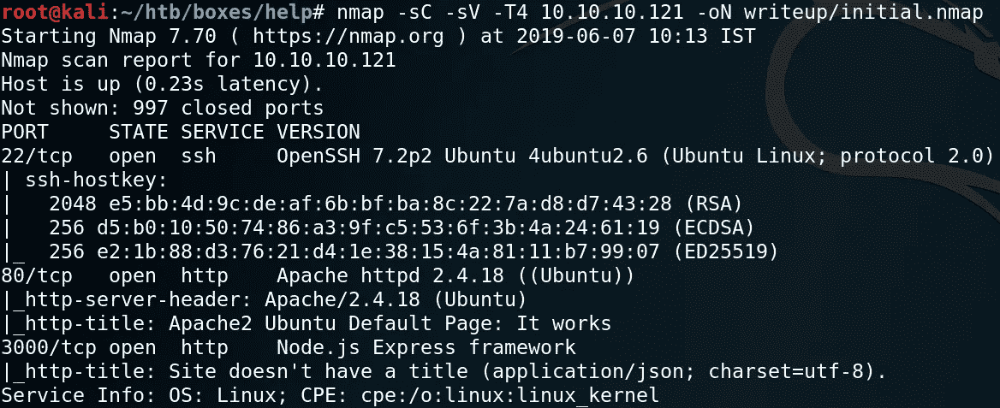

**NMAP 扫描**

看看结果，

> ***我们看到端口 22、80 和 3000 都是打开的***
> 
> ***端口 22—******OpenSSH***
> 
> ***80 —阿帕奇服务器***
> 
> ***3000 — Node.js Express 框架(看起来很有趣* )**

查看 80 端口，我们看到这是 Apache2 服务器的默认页面。

在端口 80 上运行 gobuster，会出现一个有趣的目录

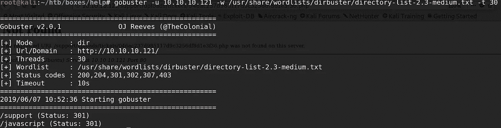

让我们检查一下我们在***http://10 . 10 . 10 . 121/support***得到了什么。

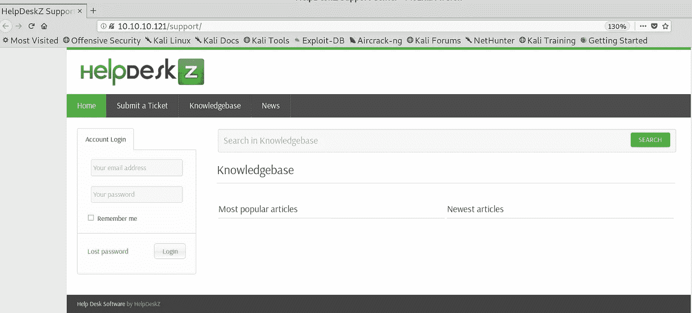

> *这是一个 helpdesz 应用程序，快速的谷歌搜索显示* **helpdesz 是一个基于 PHP 的免费软件，它允许你用一个基于网络的支持票系统来管理你的站点的支持。**

我们有一个登录选项和一个提交票证的选项。让我们试着提交一张票。

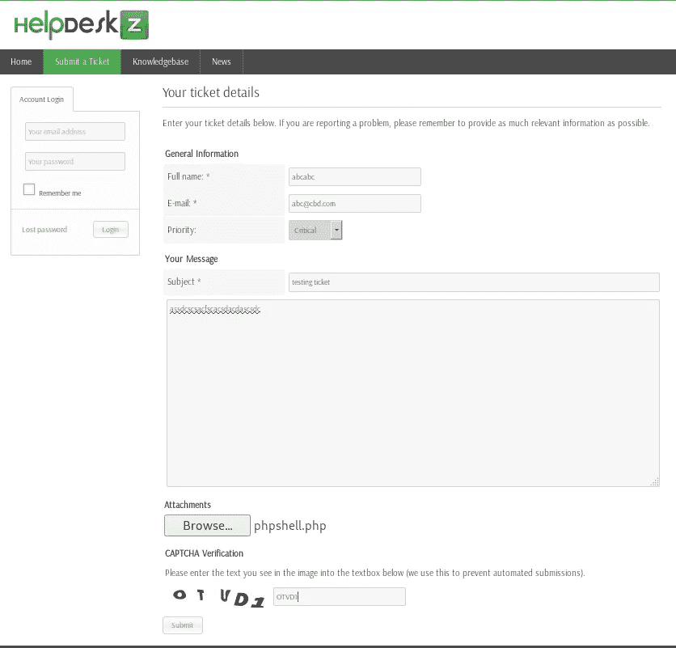

页面说 ***php*** 文件不允许(过滤旁路可能)。

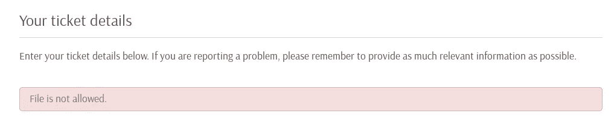

这里更重要的一点是找到文件上传的位置。让我们看一下代码，因为它是一个开源应用程序。

[https://github . com/evolution script/HelpDeskZ-1.0/blob/master/controllers/submit _ ticket _ controller . PHP](https://github.com/evolutionscript/HelpDeskZ-1.0/blob/master/controllers/submit_ticket_controller.php)

 [## evolutionscript/HelpDeskZ-1.0

### 通过在 GitHub 上创建一个帐户，为 evolutionscript/HelpDeskZ-1.0 的开发做出贡献。

github.com](https://github.com/evolutionscript/HelpDeskZ-1.0/blob/master/controllers/submit_ticket_controller.php) 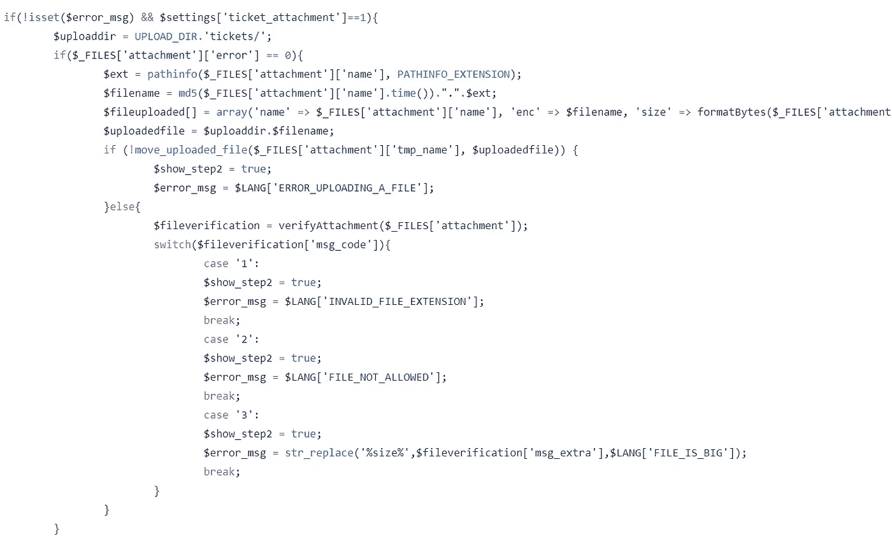

> 查看代码，我们看到一个 md5 在上传的文件名上运行，文件名后面附加了 **time()** 函数。尽管如此，我们还是看到一条错误消息，指出不允许使用文件类型。但是它实际上被上传了，我们看到的只是上传后的错误信息。(好看！！！)

但是服务器在另一个时区 **(GMT)。**所以我不得不将服务器响应时间转换为 epoch as，PHP time() ***函数返回当前时间，以 Unix Epoch 以来的秒数表示。***

我在这里所做的只是在浏览器中点击提交按钮后从网络选项卡检查响应头(懒得在 Burp 中拦截请求)。

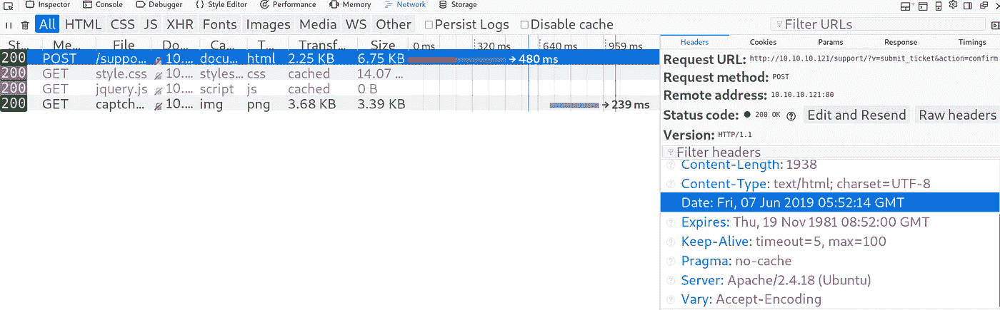

在那里。【2019 年 6 月 07 日 05:52:14 GMT 为服务器响应时间。它对应的纪元是 **1559886734。**

我使用【https://www.epochconverter.com/】做了转换

太棒了。我们拿到了时间戳和上传目录。忘了说，我已经上传了一个 phpshell，是的，让我们得到我们的外壳。

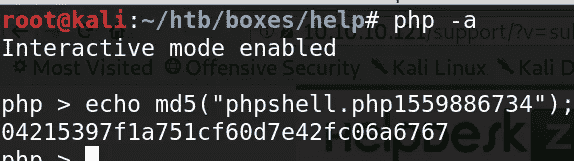

这里“**phpshell.php**”是我们的文件名，附加在它后面的是 Epoch 中的服务器响应时间。

我们的文件上传到**http://<HelpDeskBaseUrl>/uploads/tickets/<MD5>。<文件扩展名>**

为了抓住你的壳，不要忘记启动你的监听器。浏览至网址
**http://10 . 10 . 10 . 121/support/uploads/tickets/04215397 f1 a 751 cf 60 d7e 42 fc 06 a 6767 . PHP**

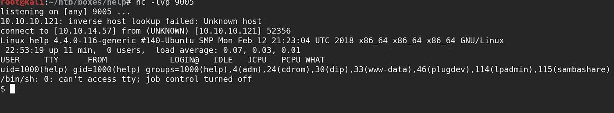

Banggg！！有壳。

# **权限提升**

手动查看目录，我找不到任何有趣的东西。还运行 [**procmon.sh ( Ippsec 进程监控脚本)**](https://gist.github.com/jsvazic/8fe9dde369f6396f65a1aa795dd77744) 就白费了。

像往常一样，我跑了 [**LinEnum**](https://github.com/rebootuser/LinEnum) 也没看出有什么猫腻。但是，内核是旧的。我没有考虑使用内核漏洞的选项，因为这不是我们想要的方式。但是在这里内核漏洞是有意的方式。我继续开发内核。看看下面的内核版本。

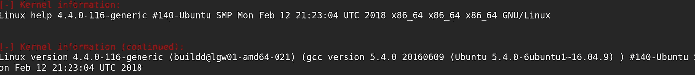

快速的谷歌搜索显示了一个权限提升漏洞。让我们在那里运行漏洞并获得 root shell。

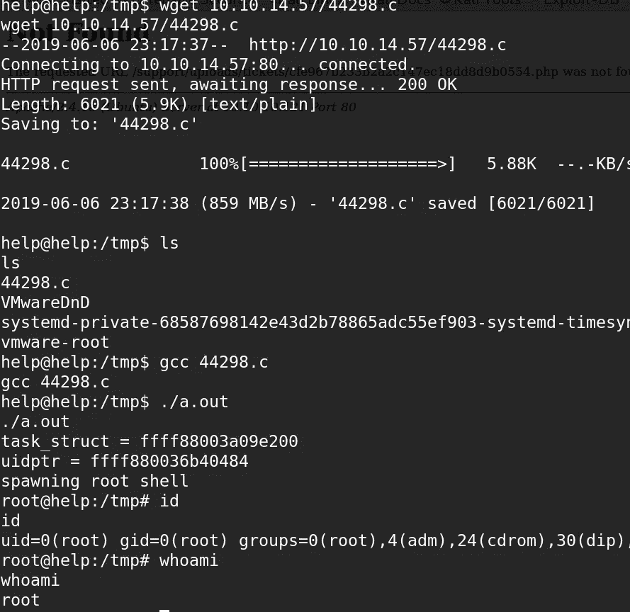

扎根并完成。如果你还没有，去拿你的旗子。

# **附加**

## 端口 3000 — Node.js Express 框架

检查 3000 端口时，我们收到了一个 JSON 响应。

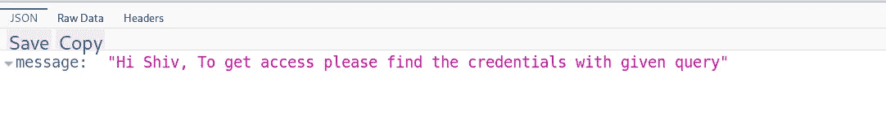

嗯，也许我们得到了一个潜在的用户名 **( Shiv )** 。让我们把它放在后面的口袋里，并列举更多。

Page 说，我们必须用一个给定的查询来获得可信度。我的一个朋友告诉我，它使用的是 **GRAPHQL** ，是 [**REST**](https://en.wikipedia.org/wiki/Representational_state_transfer) 的替代品。而 GraphQL 中的端点是 **/graphql**

## 而且网址是 http:// <site>/graphql？query={query}</site>

经过大量的试验和错误。我设法得到了正确的查询。

[http://10 . 10 . 10 . 121:3000/graph QL？查询= {用户名，密码](http://10.10.10.121:3000/graphql?query={user{username,password) **}}**

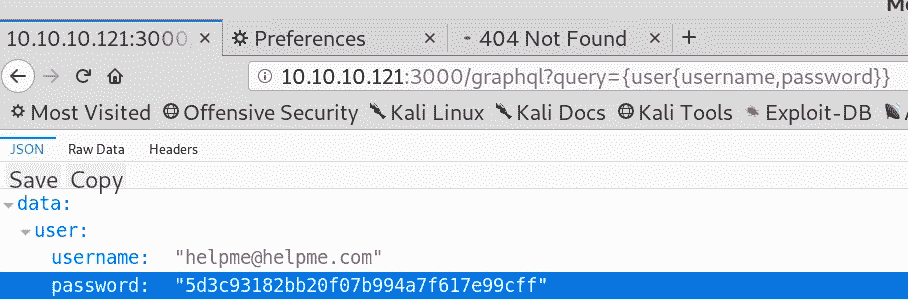

使用这些凭证(当然是在破解散列之后)登录到 HelpDeskz 应用程序，其余一切都是一样的。在野外也有同样的开发，虽然他们需要一些编辑，但我会把它们留给你去尝试。

请随时提交任何反馈。

**感谢并快乐黑客，
Preetham(**[***@ cyber 01***](https://www.hackthebox.eu/profile/9160)***)***