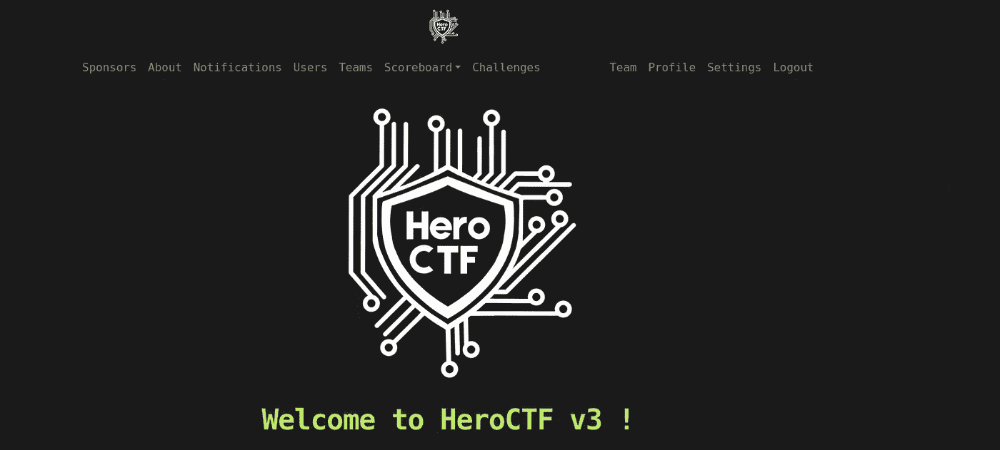
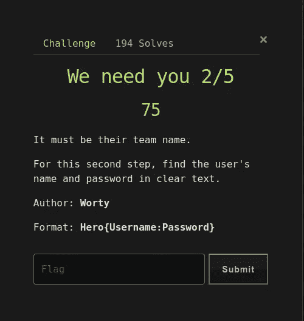
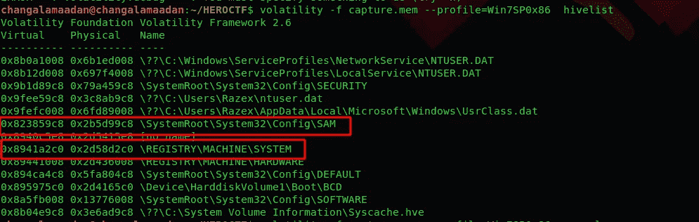
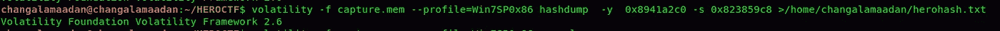
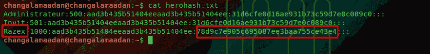
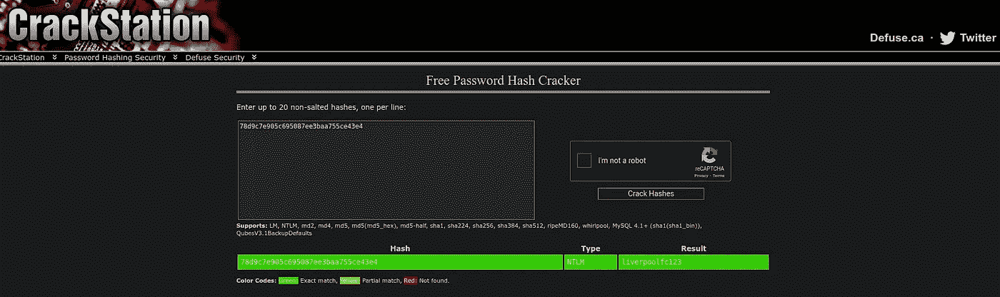

# HEROCTF 演练第 2 部分

> 原文：<https://infosecwriteups.com/heroctf-walkthrough-part-2-49756e9846a1?source=collection_archive---------0----------------------->

完成第一轮法医挑战后，我们进入第二部分。在第二部分中，我们的挑战是找到用户名和密码的明文格式。

首先，我们需要列出所有的配置单元地址。

为了找到用户名和密码，我们需要 hivelist 中的另一个 hive 地址。这里我们使用这个\ SystemRoot \ System32 \ Config \ SAM 配置单元地址来查找用户名和密码。SAM(安全帐户管理器)是 windows XP、Windows Vista、Windows 7、8.1 和 10 中使用的数据库，用于存储用户的密码

所以我们知道所有的散列都存储在 SAM 中，所以我们将所有的散列转储到一个 txt 文件中

是的，我们已经完成了，我们的散列存储在 herohash.txt 中。然后下一步是破解散列。我们知道 Windows 系统是用 LM 和 NTLM 算法来加密用户密码的

在这里，我用 https://crackstation.net/来破解密码。破解站是一个强大的哈希破解在线工具。

是的，我们破解了它。最后一面旗帜是

英雄{Razex:liverpoolfc123}

谢谢大家；