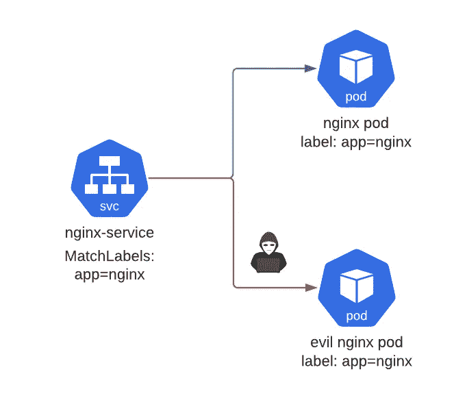

# 用标签劫持 Kubernetes 资源

> 原文：<https://infosecwriteups.com/hijacking-kubernetes-services-with-labels-ea6b863b5a8e?source=collection_archive---------0----------------------->



它所需要的只是一个匹配标签选择器。

> 标签旨在用于指定对用户有意义且相关的对象的标识属性，但并不直接暗示核心系统的语义。—[https://kubernetes . io/docs/concepts/overview/working-with-objects/labels/](https://kubernetes.io/docs/concepts/overview/working-with-objects/labels/)

根据 kubernetes 文档，标签只是用来识别用户的属性。但是如果它们被用来授权其他资源如何与它们交互呢？令人震惊的是，向下滚动标签文档页面，我们看到`service`目标是由一个选择器标签定义的。深入挖掘，您甚至会发现其他资源，如用匹配标签选择器定义的网络策略。所以像所有 kubernetes 的东西一样，我质疑这是如何被利用的。

例如，让我们创建一个部署和服务:

```
**apiVersion**: apps/v1
**kind**: Deployment
**metadata**:
  **name**: nginx-deployment
  **labels**:
    **app**: nginx
**spec**:
  **selector**:
    **matchLabels**:
      **app**: nginx
  **template**:
    **metadata**:
      **labels**:
        **app**: nginx
    **spec**:
      **containers**:
      - **name**: nginx
        **image**: nginx
        **ports**:
        - **containerPort**: 80**---
apiVersion**: v1
**kind**: Service
**metadata**:
  **name**: nginx-service
**spec**:
  **selector**:
    **app**: nginx-service
  **selector**:
    **matchLabels**:
      **app**: nginx
  **ports**:
    - **protocol**: TCP
      **port**: 80
```

这将创建一个在端口 80 上运行 nginx 的部署。该服务将把任何带有标签`app=nginx`的 pod 作为目标，并暴露容器的端口 80。从功能角度来看这很好，但是安全性呢？

默认情况下，对于谁可以创建特定标签没有访问控制。

一个流氓部署可以通过创建一个同样标有`app=nginx`的新部署来轻松劫持这个服务，但实际上运行它想要的任何容器。例如:

```
**apiVersion**: apps/v1
**kind**: Deployment
**metadata**:
  **name**: evil-nginx-deployment
  **labels**:
    **app**: evil-nginx
**spec**:
  **selector**:
    **matchLabels**:
      **app**: nginx
  **template**:
    **metadata**:
      **labels**:
        **app**: nginx
    **spec**:
      **containers**:
      - **name**: evil-nginx
        **image**: evil-nginx
        **ports**:
        - **containerPort**: 80
```

因为部署的 selector.matchLabels 容器`app=nginx`将被 nginx-service 作为目标。此时，nginx-service 的流量将分布在 nginx 和 evil-nginx 部署中。

这很有趣，因为创建流氓部署的用户或服务帐户只需要访问创建新部署的权限。它不需要创建或修改服务的权限，也不需要修改现有部署的权限。

同样的概念也适用于网络策略。对您的生产服务和部署的网络访问可能只是一个远离灾难的流氓标签。

乐趣并不仅限于 kubernetes 的本地资源，如服务和网络策略。许多自定义资源定义(CRD)也包括选择器匹配标签的使用。

## 结论

永远不要相信 kubernetes 的标签是权威的来源。在任何可能的情况下，坚持使用标签作为用户识别属性的唯一来源，而不是授权资源连接的一种方式。