# horizontal:HackTheBox 演练

> 原文：<https://infosecwriteups.com/horizontall-hackthebox-walkthrough-13090d7d59a2?source=collection_archive---------0----------------------->

## 描述

Horizontall 是 HackTheBox 上另一个不错的盒子。只需在/etc/hosts 文件中添加 horizontall.htb，就可以开始了。

> 端口扫描

在我的端口扫描过程中，我首先使用 [**rustscan**](https://tryhackme.com/room/rustscan) 快速找出开放端口的数量…

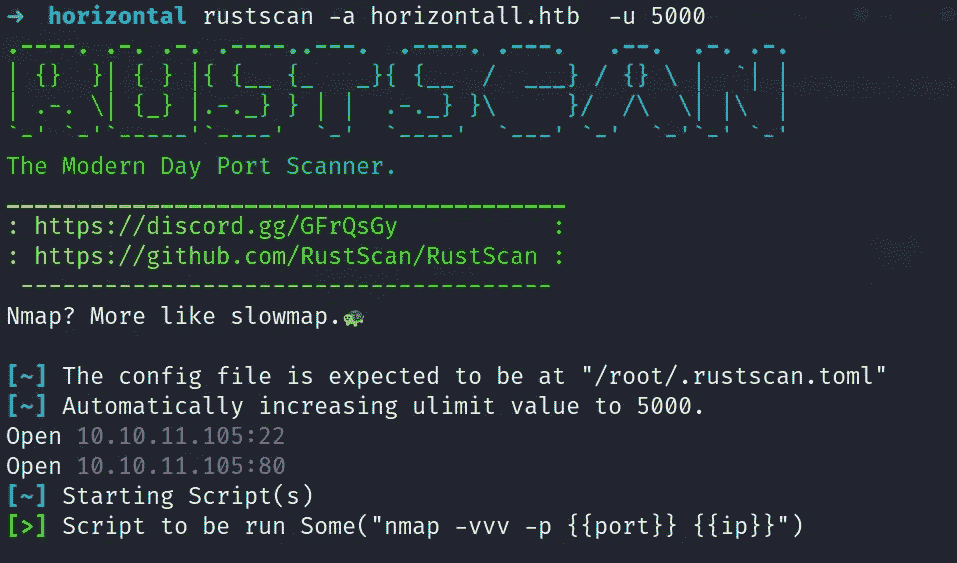

…然后在那些开放的端口上开始详细的 **Nmap** 扫描。

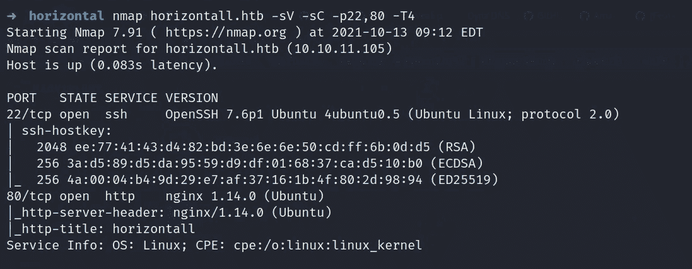

> 网络侦察

所以我们先列举一下 80 端口。索引页如下所示。页面源代码不包含任何有用的内容。

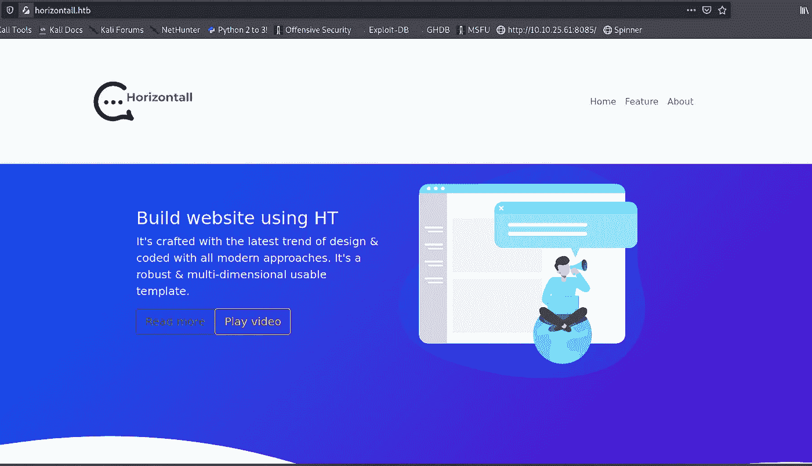

让我们开始对 URL→[http://horizontall.htb/](http://writer.htb/)进行 **ffuf** 扫描

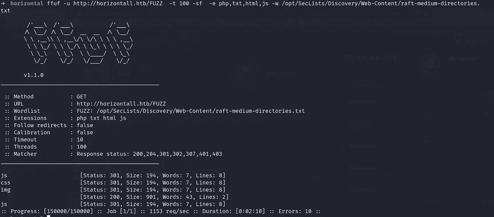

以上都没有用。我尝试的下一件事是使用 wfuzz 工具枚举子域。

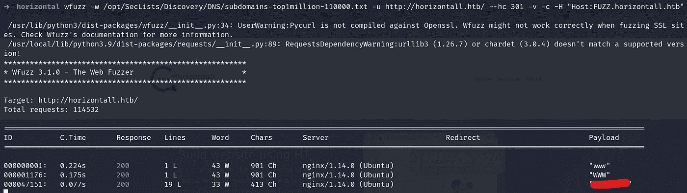

所以我们得到了一个子域，让我们访问它，看看我们能得到什么有用的东西。

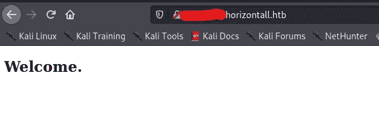

所以这里也没有什么有用的，但我再次试图列举任何隐藏目录的 FQDN。

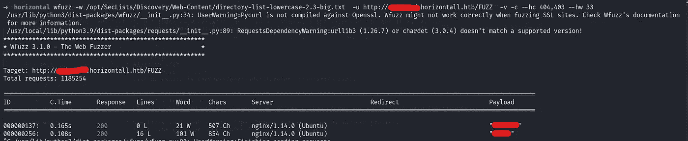

现在我们到了目录，其中有一个 strapi CMS 的登录页面。

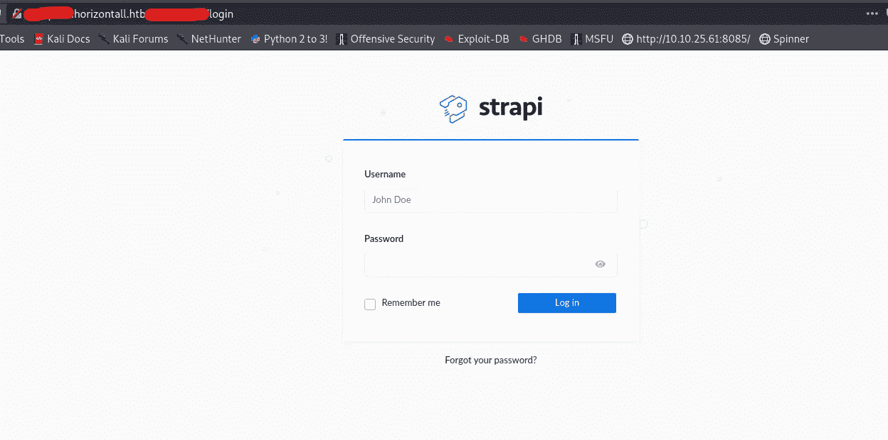

谷歌搜索 strapi 登录的默认凭证显示 admin: admin，但在这里没有用。接下来，我试图搜索该 CMS 可用的任何公开漏洞，我得到了这个远程代码执行 [**漏洞**](https://www.exploit-db.com/exploits/50239) 但不确定，因为我还不知道版本。

该漏洞很简单，我们必须提供网址(子域一)，脚本会告诉使用 CMS 版本第一，如果该版本是等同于“3 . 0 . 0-测试版 17.4”，然后利用将工作。在下一个 password_reset()函数中，漏洞试图重置用户“admin”的密码，并为我们提供带有新凭证的 JSON Web 令牌。

因此，基本上我们有一个 JSON web 令牌，用于在双方之间共享安全信息，并在保护 API 方面变得越来越流行。 [**JWT**](https://www.akana.com/blog/what-is-jwt) 有类似 x.y.z 的格式，回来利用我们可以通过访问这个 URL→[http://[子域]. horizontal . htb/[发现路径]/auth/reset-password](http://api-prod.horizontall.htb/admin/auth/reset-password) 来确认这个密码剩余路径

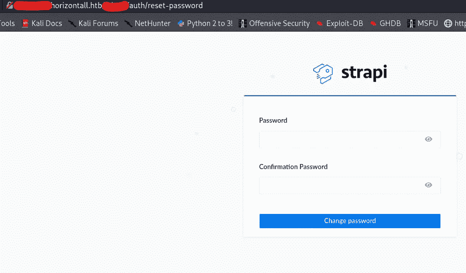

最后一个函数 code_exec(cmd)用于触发 RCE，但是我们没有得到已经提到的交互式 shell。样本输出。

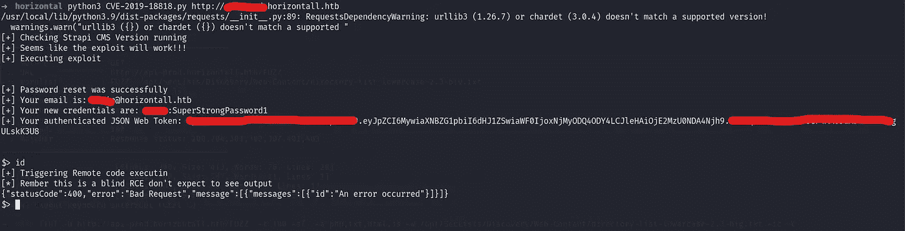

在当前的漏洞利用中，提到了两个 CVE，因此第一个 [CVE-2019-18818](https://www.cybersecurity-help.cz/vulnerabilities/22788/) 基于我们已经做过的弱密码恢复，对于下一个[CVE-2019–1609](https://www.cybersecurity-help.cz/vdb/SB2019120606)RCE，我们必须找到漏洞利用代码。再次谷歌我能够找到 [**漏洞**](https://github.com/dasithsv/CVE-2019-19609/blob/main/exploit.py) 。

> 获得初始访问权限

现在，对于这个漏洞，我们必须按照<subdomain.horizontall.htb>、<kali_ip>、<jwt earlier="">、<[http://subdomain.horizontall.htb/](http://api-prod.horizontall.htb/)>的顺序传递输入，漏洞设置一个“数据”变量，在端口“9001”上附加反向外壳，并在头部分发布带有 jwt 令牌的数据。</jwt></kali_ip></subdomain.horizontall.htb>

现在，在运行漏洞之前，只需在新终端的端口 9001 上启动一个 nc 监听器。

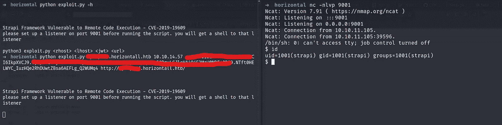

因此，我们以用户 strapi 身份进行远程访问，并使用这个"**python 3-c ' import pty；pty.spawn("/bin/bash")'** "。

使用这个"**find/-type f-user strapi-perm 600 2>/dev/null**命令来查找任何具有读写权限的文件，我得到了路径" **/opt/strapi/。ssh/authorized_keys** ”。因为我们有写访问权，所以我们可以通过 SSH 附加我们自己的 id_rsa 密钥来获得访问权。

使用 ssh-keygen 创建 id_rsa 密钥，并将 id_rsa.pub 密钥复制到文件 **/opt/strapi/。ssh/authorized _ key。**将文件 id_rsa 的权限授予 chmod 600 id_rsa。现在通过 SSH 登录得到一个好看的 shell。

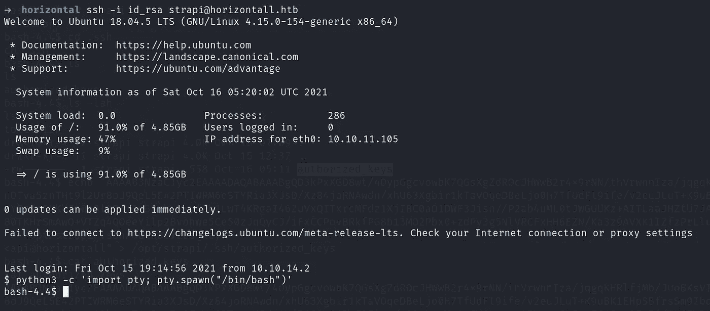

此时，我们可以使用[**linPEAS**](https://github.com/carlospolop/PEASS-ng/tree/master/linPEAS)**脚本，但是使用诸如‘netstat’，‘PS’，‘tcpdump’之类的命令进行检查总是有用的。所以使用 netstat 给了我**

**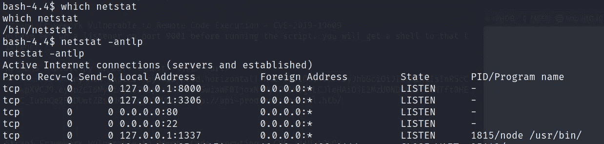**

**我试图找到 MySQL 的凭证，但没有得到任何凭证。其次，我使用 [**凿子**](https://github.com/andrew-d/static-binaries) 工具转发端口 8000。为了让凿子进入远程机器，我使用了 [**更新**](https://github.com/sc0tfree/updog) 工具。**

**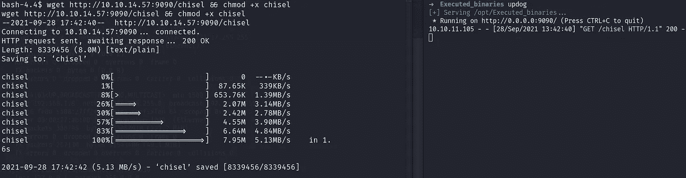**

**现在，要转发所需的端口，首先必须运行"**。/chisel server-p[端口号] —在 kali 机器上反转&** ”**

**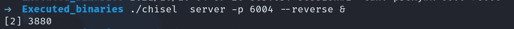**

**…然后运行"**。/chisel client[kali _ IP]:[kali _ port]R:[port _ to _ listen _ connection]:127 . 0 . 0 . 1:[port _ to _ forward]**"在攻击者框上。**

**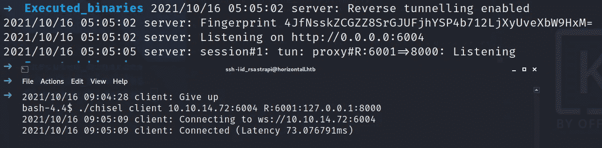**

**访问网址→ [http://127.0.0.1:6001](http://127.0.0.1:6001) 在浏览器上访问转发端口 8000。**

**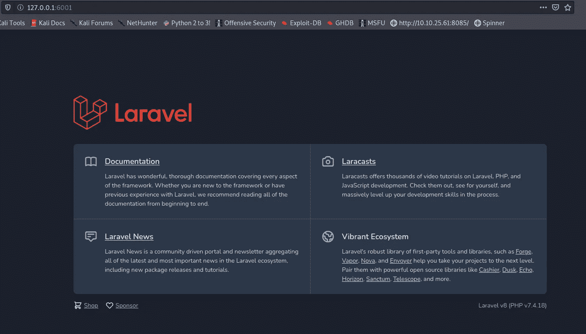**

**我在这里没什么可做的，所以我只是谷歌“如何在端口转发后利用 Laravel ”,得到了这个[页面](https://book.hacktricks.xyz/pentesting/pentesting-web/laravel)说[CVE-2021–3129。](https://github.com/hungnt199/CVE-2021-3129_exploit)因此，Laravel 容易受到不正确输入验证的攻击，远程攻击者可以通过发送特制的请求来读取和写入系统上的任意文件。复制漏洞代码，并使用它来检查您是否可以执行任何命令。**注意:-** 使用 URL 中转发端口 8000 的端口。**

**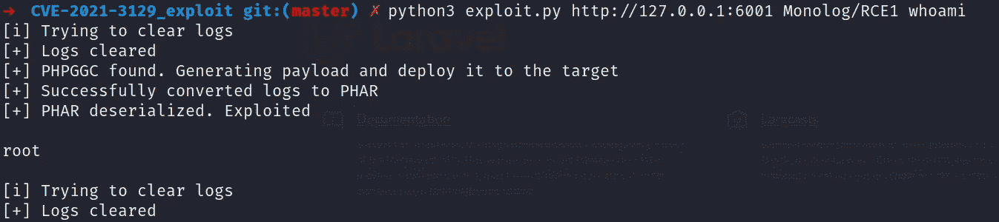**

**获取根标志很容易，因为您必须使用 cat 命令代替 whoami 来读取标志。**

# **在你走之前**

**这是我的另一个黑客机器演练:-**

** [## 编剧:黑客盒子演练

### 描述

shubham-singh.medium.com](https://shubham-singh.medium.com/writer-hackthebox-walkthrough-1ff86b33799a)  [## 世界末日:黑客盒子演练

### 描述

shubham-singh.medium.com](https://shubham-singh.medium.com/armageddon-hackthebox-walkthrough-6d8e2261a676)  [## 懒人先生-概述

### 网络安全爱好者🐱‍💻。拉兹先生有 7 个存储库可用。在 GitHub 上关注他们的代码。

github.com](https://github.com/Mr-Lazzy) 

鼓掌👏如果你喜欢的话。**