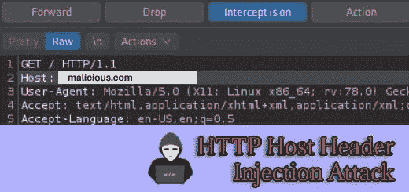
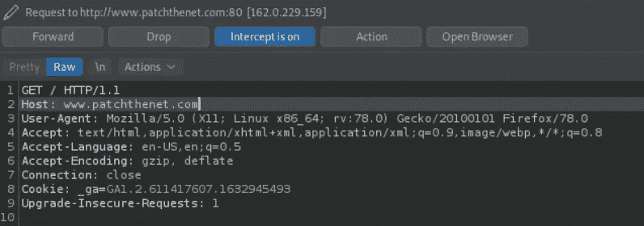

# 主机标头注入攻击

> 原文：<https://infosecwriteups.com/host-header-injection-attacks-7160f9fcf63e?source=collection_archive---------2----------------------->

主机标头注入不是您通常在 CTFs 或安全挑战中发现的攻击类型。然而，它在野生网络中广泛存在。一旦您遇到一个易受攻击的 web 服务器，利用它也不是非常困难，本文稍后将展示这一点。

在我们进入攻击部分之前，让我们首先了解什么是主机报头，以及它的作用。



# HTTP 主机标头

主机头是 web 客户端应该包含在其 HTTP 请求中的必填字段。它向 web 服务器指示客户端正在尝试连接到哪个域。这在多个网站托管在同一个 web 服务器上的情况下非常有用。它们可以共享相同的 IP 地址，但域名不同。

带有主机头的 HTTP 请求应该是这样的:

```
GET /index.html HTTP/1.1
Host : patchthenet.com
```

Web 应用程序通常不托管在独立的服务器上。相反，你会经常发现它们运行在共享服务器上。因此，这些应用程序将共享相同的 IP 地址。因此，为了区分传入请求的目的地，web 服务器将依赖 HTTP 主机头。

另一方面，一些网站可能只能通过处理来自客户端的流量的中间系统来访问。这些系统可能是负载平衡器、反向代理或 WAFs。在这种情况下，所有这些网站将共享一个 IP 地址。再一次，HTTP 主机头将帮助将请求路由到它们预期的目的地。

好了，现在我们已经看到了这个头文件的效用，让我们继续下去，看看它如何给 web 应用程序的安全性带来风险。

# HTTP 主机报头注入攻击

有时，web 应用程序需要知道它们所在的域。当他们需要通过绝对路径引用资源时尤其如此。

在这种情况下，web 应用程序通常会从 HTTP 主机头值中获取这个域名。

下面是一个 web 应用程序如何实现这一点的示例:

```
<a href="http://<?php echo $_SERVER['Host']; ?>/absolute/path/to/a/resource">Link</a>
```

在这条看似无害的线背后，隐藏着一个可能一开始并不明显的重大漏洞。

web 应用程序将检索主机头值:`$_SERVER['Host']`，并将其插入代码中。

然而，正如我们之前看到的，这个值是用户可以控制的。这意味着用户可以在发送请求之前修改它。

攻击者可以简单地注入一个恶意的有效负载作为主机头值，web 应用程序会无意中处理并执行它。

## x 转发主机

另一种改变主机头值的方法是使用`X-Forwarded-Host`。代理使用这个头将 HTTP 请求转发到 web 服务器，同时保留 web 浏览器提供的原始主机值。

攻击者可以使用此报头和恶意负载来覆盖主机报头。

```
GET /index.html HTTP/1.1
Host : patchthenet.com
X-Forwarded-Host : malicious.com
```

以前面的例子为例，用上面的值更改主机变量，我们将得到以下结果:

```
<a href=”http://malicious.com/absolute/path/to/a/resource">Link</a>
```

攻击者可以使用主机标头作为引发各种攻击的方式。最常见的情况是，攻击者会注入主机标头，以实现 web 缓存中毒、SSRF 或密码重置中毒。

## 剥削

一旦发现有漏洞的网站，利用它其实很简单。使用本地代理，您可以在网站离开您的机器之前拦截您对网站的请求。

例如，下图显示了使用 Burp 拦截的对我的网站的请求:



现在，攻击者可以简单地用他们控制的域名改变主机头的值，这里写着:`www.patchthenet.com`。然后，他们可以转发请求。

当然，这在这里是行不通的，而且对大多数网站也是无效的，因为网站管理员实施了许多安全控制措施来保护他们的网站免受这些攻击。

这就是我们接下来要讨论的内容。

# 防止主机标头注入攻击

幸运的是，主机标头注入攻击并非不可避免。通过遵循某些安全措施，您可以保护您的 web 应用程序，并降低发生 HTTP 主机头攻击的风险。

您可以设置的最安全的措施是首先避免使用 HTTP 主机头。在调用资源时，您应该经常问自己是否真的需要包含绝对路径。

当您真的需要依赖主机头时，那么您应该确保验证主机头，就像您验证任何其他用户提供的输入一样。

您还应该考虑对照已知域的白名单检查 HTTP 主机头。web 应用程序将只处理白名单中的域名。

*原载于 2022 年 2 月 5 日【https://patchthenet.com】[](https://patchthenet.com/articles/host-header-injection-attacks/)**。***

# *🔈 🔈Infosec Writeups 正在组织其首次虚拟会议和网络活动。如果你对信息安全感兴趣，这是最酷的地方，有 16 个令人难以置信的演讲者和 10 多个小时充满力量的讨论会议。[查看更多详情并在此注册。](https://iwcon.live/)*

*[](https://iwcon.live/) [## IWCon2022 - Infosec 书面报告虚拟会议

### 与世界上最优秀的信息安全专家建立联系。了解网络安全专家如何取得成功。将新技能添加到您的…

iwcon.live](https://iwcon.live/)*