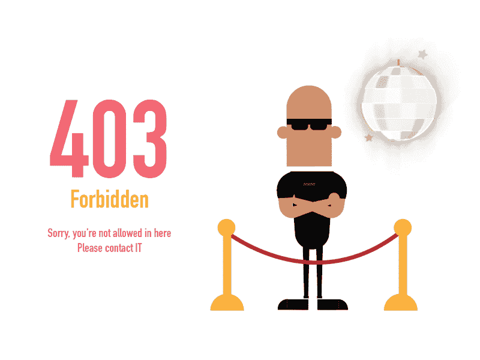
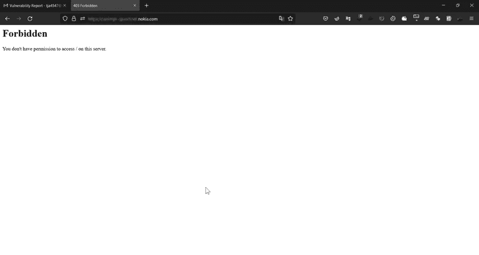
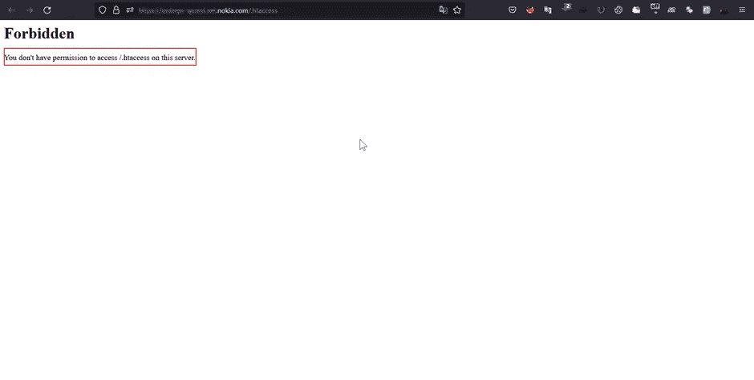
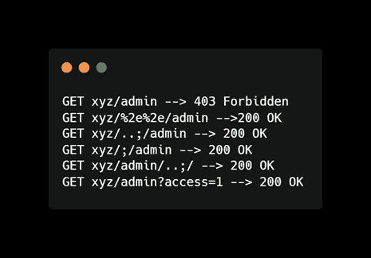
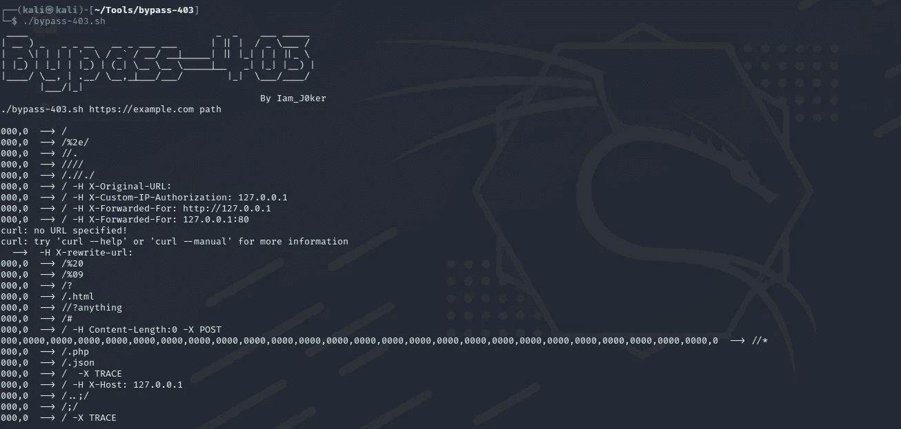
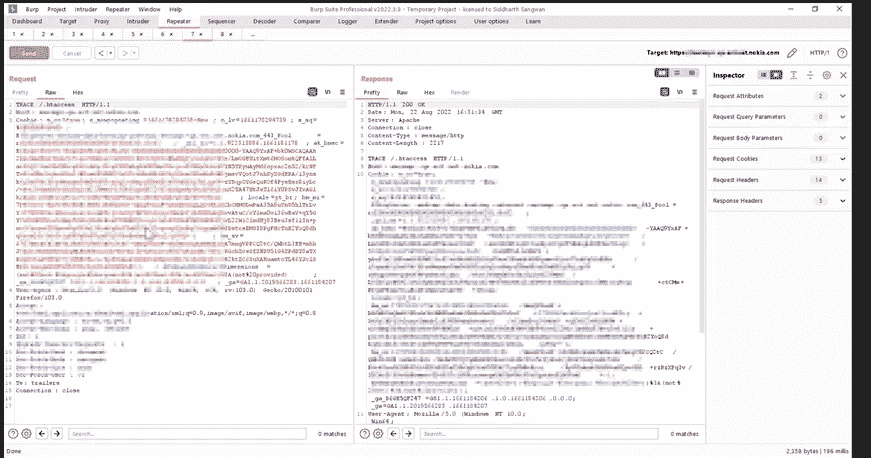
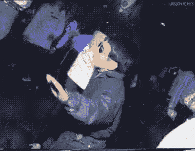
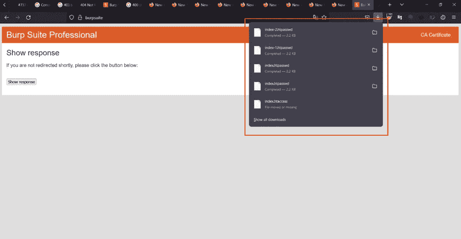
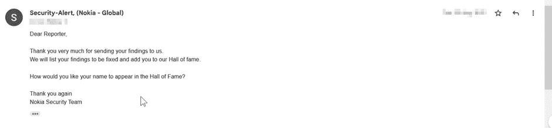
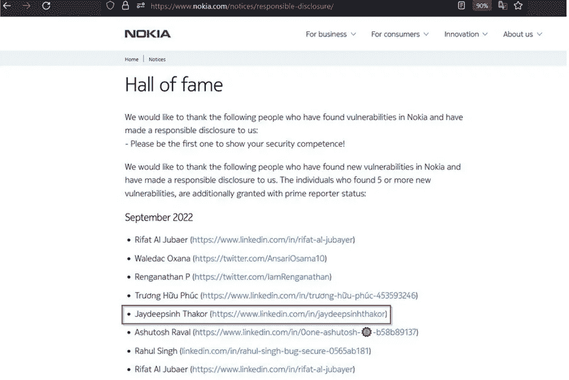

# 403 禁止旁路如何让我进入诺基亚名人堂(HOF)

> 原文：<https://infosecwriteups.com/how-403-forbidden-bypass-got-me-nokia-hall-of-fame-hof-8acbd2c1c2c8?source=collection_archive---------0----------------------->

你好，神奇的人和臭虫赏金猎人，我是 JD ( Jaydeepsinh Thakor)我希望你们都很好❤，在这篇文章中，我想分享我是如何得到我的第一个 HOF &我是如何能够在诺基亚子域上使用简单的方法技术绕过 403 的，所以让我们开始，

首先，明白什么是 403。基本上，403 是一个状态代码，当一个未经授权的用户试图访问一些受限制的页面，服务器响应给出一个错误，403 状态代码为禁止。我们来详细了解一下。

## **什么是 403 禁？**

作为普通用户，我们没有权限访问特定的网页/网站/域(只能访问像管理员等授权用户)，所以当我们试图访问这种类型的网站时，它会给我们一个错误 403 禁止。

## **什么是 403 禁止绕道？**

绕过 403 禁止错误表示客户端能够与服务器通信，但是服务器不允许客户端访问所请求的内容。

在选择了我的目标(Nokia.com)之后，我开始了我的侦察过程:

> T **这是我遵循的简单方法:**
> 1:使用不同的工具(如 amass、sub-finder、asset finder 等)枚举子域
> 2:开始手动评估这些网站&拦截请求并了解网站如何工作
> 3:检查不同的功能。

经过分析，我得到了一些领域，给我一个 403 禁止错误，所以我的心炸了，我决定让我们尝试绕过它:)

所以我来到了一个类似[**https://subs.nokia.com 的子域。**](https://subs.nokia.com.)

403 禁止页面

此外，我尝试了简单的内容欺骗，如 iFrame 注入/文本注入，如这些**【或 **"/ > < p >注入< /p >** 】，但遗憾的是，这并没有奏效，为了不浪费我的时间，我采用了 403 旁路方法。**

**首先，我检查了网站是否包含隐藏目录，所以我写了 https://subdomain.nokia.com/.htaccess****，它给出了一个 403 错误，而不是 404“没有找到”，这意味着。此子域中存在 htaccess 文件。******

> ******https://subs.nokia.com。htaccess******

************

******错误:您没有权限访问/。此服务器上的 htaccess。******

## ******是时候绕过这个了。******

******对于 bypass 403 有许多不同的方法，但是首先我使用了一些基本的和常见的方法，比如使用/(斜杠)，/；等等…但是没有运气:(******

************

******此外，你可以自动完成这个过程，GitHub 上有很多 automation 403 bypass 工具******

************

******403 旁路工具******

****** [## GitHub - iamj0ker/bypass-403:一个简单的脚本，仅供自己使用，用于绕过 403

### 一个简单的脚本，只是为了绕过 403 - GitHub - iamj0ker/bypass-403 而做的。

github.com](https://github.com/iamj0ker/bypass-403)  [## GitHub - yunemse48/403bypasser

### 403 hedef sayfalardaki eriim kontrolükst lamaraln mak I in kullanlan teknikleri otomatikle stirir。但是…

github.com](https://github.com/yunemse48/403bypasser) 

> 然后我移动到下一个方法，即**变更请求方法:**
> 
> 更改请求的方法，如 **GET → POST，GET → TRACE** 等。

所以我启动了我们的专业工具**打嗝套件**，截取了请求并发送给中继器【我们也可以使用 curl 做同样的事情，但是我对打嗝套件很着迷，所以..]

我开始玩中继器，改变请求方法 **GET → POST** ，但没有成功，仍然显示 403。然后，我再次将其更改为 **GET → TRACE** 并

神奇的事情发生了，**嘣**我得到了 200 个 OK 回复

喔哦

然后我点击**“在浏览器中显示响应”**并粘贴到浏览器上，你猜怎么着！的。htaccess /。htpasswd 文件弹出，给我下载权限。

但是……当我打开并看到那些文件时，并没有包含任何重要的信息，所以我有点难过

然后我想我什么也没发现，但我绕过了他们的 403 机制，所以为什么不应该报告！！

**因为让我们尝试一个翻转场景:**

然而，我没有发现任何重要的信息或密码，好吧，但如果重要的东西在网站内使用，并以同样的方式维护，它可能会绕过攻击者，看到/转储/访问/任何敏感文件。

因此，在这一切之后，我已经就此问题向 security-alert@nokia.com 发送了一份写得很好的详细解释报告和包含 POC 的邮件。

然后他们从他们那边验证了同样的结果，并通知我这是一个有效的发现

几天后，他们将我添加到他们的名人堂页面，如下所示

是的，今天就到这里，谢谢！！我希望你喜欢读它。

## 来自 Infosec 的报道:Infosec 每天都有很多内容，很难跟上。[加入我们的每周简讯](https://weekly.infosecwriteups.com/)以 5 篇文章、4 个线程、3 个视频、2 个 GitHub Repos 和工具以及 1 个工作提醒的形式免费获取所有最新的 Infosec 趋势！******