# 一个配置糟糕的数据库是如何让我们拥有超过 25，000 台主机的整个云的(1/2)

> 原文：<https://infosecwriteups.com/how-a-badly-configured-db-allowed-us-to-own-an-entire-cloud-of-over-25k-hosts-part-1-2-8846beab691e?source=collection_archive---------1----------------------->

[链接到第 2 部分](https://medium.com/bugbountywriteup/how-a-badly-configured-db-allowed-us-to-own-an-entire-cloud-of-over-25k-hosts-part-2-2-5a63da194bc1)

# 介绍

在这篇文章中，我们将了解如何将数据库的直接 sqlmap 连接与 BMC/IPMI 利用相结合，从而危及大型云托管客户端的安全。

# 获得立足点

几年前，我们的团队负责在 Openstack 网络中执行基础设施 pentest。它由大约 2000 台物理服务器组成，托管超过 25000 个虚拟实例。我们在一个不允许大量出站流量的小子网中开始了 pentest。在快速的 Nmap 扫描后，我们无法找到任何简单的漏洞来利用，所以我们开始研究我们可用的服务。其中，我们发现了一个公开的 PostgreSQL 服务器，托管在一个开发服务器中。在用公司名称的多个派生创建了一个自定义单词列表后，我们能够用相对简单的凭证登录。用户名是 Postgres，为了保护这家公司的匿名性，我们假设密码是“admin”。

我们继续使用 sqlmap(【https://github.com/sqlmapproject/sqlmap】T2)。创建这个工具是为了利用 SQL 注入，但是在建立到数据库的直接连接时(如果您有凭证)，它也可以为您提供几个选项。其中一个选项是在被利用的数据库上启动命令外壳。

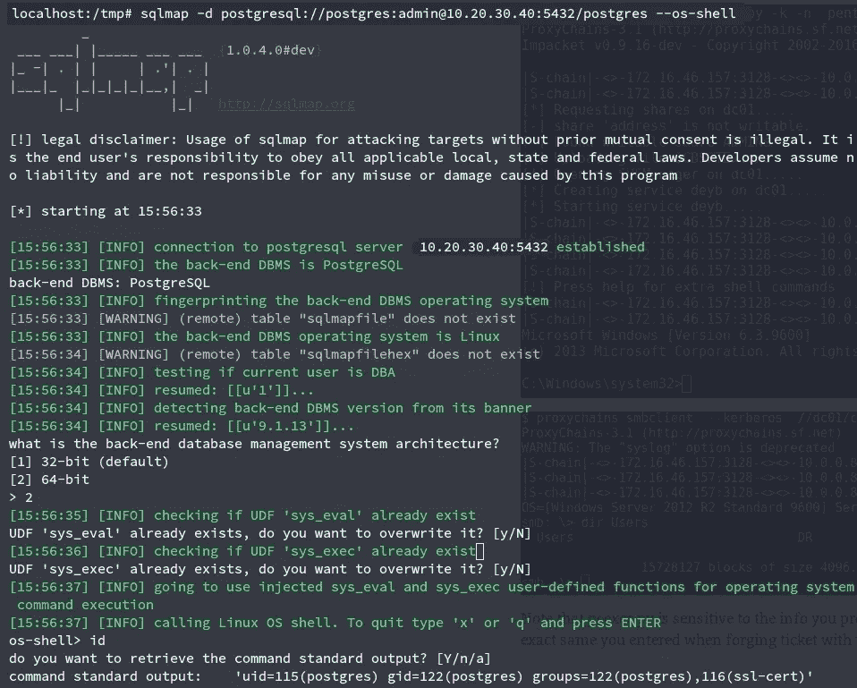

在测试外壳后，我们决定组装一个定制的有效载荷，以便接收一个反向的外壳，让玩具工作起来更舒服。

为此，我们开始用 msfvenom 组装有效载荷。在本例中，有效负载是一个反向 TCP shell，用于 x64 Linux 机器(您可以看到我们必须在前面的映像中选择 DB 架构)。

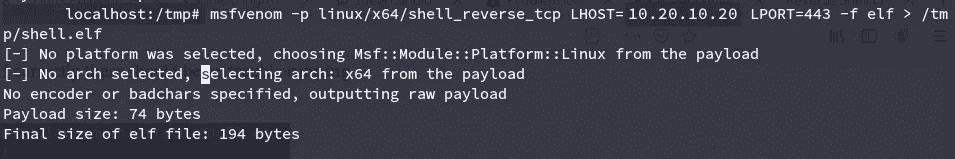

把有效载荷和 msfvenom 放在一起

使用这个有效负载的一个优点是，您可以用一个简单的 Netcat 接收连接。大多数其他有效负载需要类似 Metasploit 的 exploit/multi/handler 模块来接收反向连接。

在使用 sqlmap shell 运行有效负载之后，我们从服务器获得了连接。

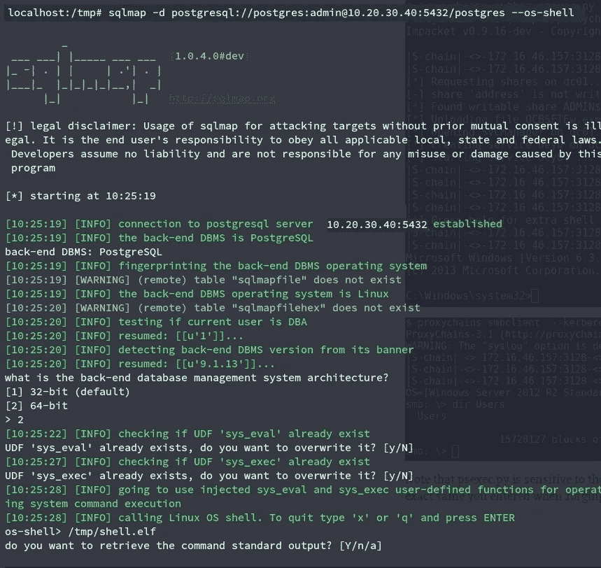

运行有效负载

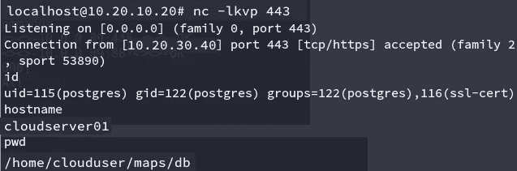

接收连接返回，并测试访问。

# 利用 BMC 设备

每当您在进行基础设施测试时，如果您在网络的新网段中危及了一台机器，您应该重新进行扫描，以检查是否有新的可见性。这个数据库允许我们访问公司的云网络，包括大多数虚拟化实例以及主机。我们真的很兴奋得到新的扫描结果，并看到其中的多个 BMC 设备。

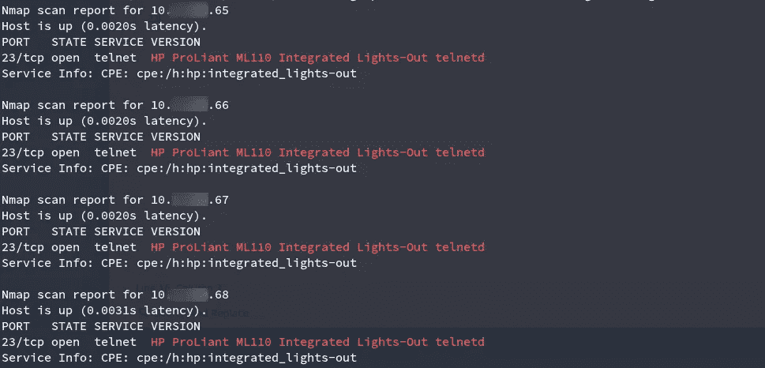

这是我们可以买到的三种不同品牌的 BMC 设备之一

BMC(基板管理控制器)基本上是一种嵌入式设备，连接到主服务器，为您提供带外监控。所有大型硬件提供商都为其产品定制了 BMC，您可以列出

*   戴尔 DRAC 公司
*   IBM IMM 公司
*   惠普劳工组织
*   超微 IPMI

另一个你需要熟悉的术语，IPMI(智能平台管理接口)，基本上是你用来和这些设备通信的协议([https://en . Wikipedia . org/wiki/Intelligent _ Platform _ Management _ Interface](https://en.wikipedia.org/wiki/Intelligent_Platform_Management_Interface))。

这么说吧，IPMI 是迄今为止你能找到的最不安全的协议之一。给你一个想法，IPMI 2.0 的设计方式是，你可以在认证阶段直接从服务器请求用户的散列(真的，查一下)。不仅如此，还有一个认证缺陷，你需要用“密码 0”模式登录，这将允许你使用任何密码登录。你可以在这篇 Rapid7 帖子中找到许多更深入解释/利用的缺陷:[https://blog . rapid 7 . com/2013/07/02/a-penetration-testers-guide-to-IPMI/](https://blog.rapid7.com/2013/07/02/a-penetration-testers-guide-to-ipmi/)

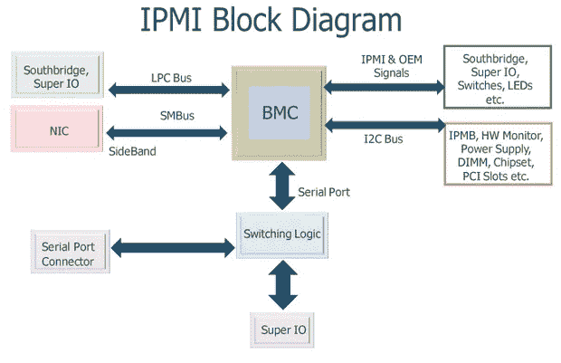

IPMI·布洛克的建筑

您可能会发现 BMC 设备通常没有得到适当的保护，因为它们是那种您在构建数据中心时只设置一次的设备，然后在通过通常方式无法访问服务器时偶尔使用。

我们能够轻松地对一些启用了密码 0 的设备进行身份验证:

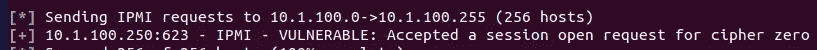

丹·法默是 BMC/IPMI 相关漏洞研究的先驱。你可以在他的网站:【http://fish2.com/ipmi/cipherzero.html上阅读更多关于如何利用 ipmitool 工具开发 cipher 0 的信息。现在它似乎关闭了，但你可以随时阅读谷歌的缓存版本。不管怎样，这里你可以看到我们是如何用随机密码登录的。注意“-C 0”部分。

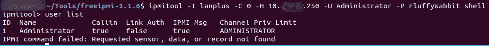

使用随机密码成功登录设备

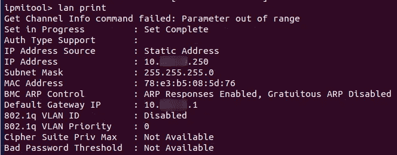

设备的网络信息

即使某些设备没有启用 cipher 0，您仍然可以通过其他方式登录。最常见的两种方法是使用默认凭证(系统管理员通常不会费心去更改)，或者利用散列泄露漏洞(然后破解散列)。对于大多数设备，我们不得不采用后者。

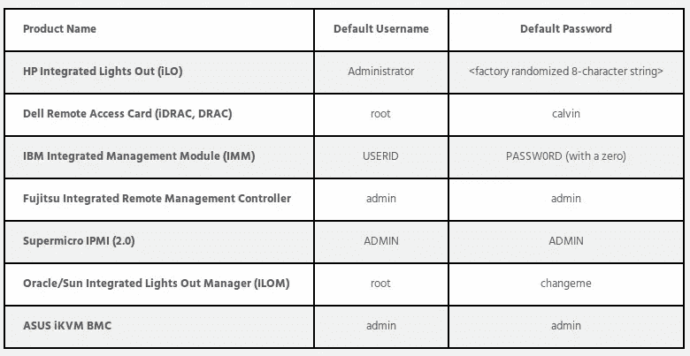

大多数制造商微不足道的违约信用

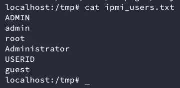

包含我们将从服务器请求的用户散列的单词列表

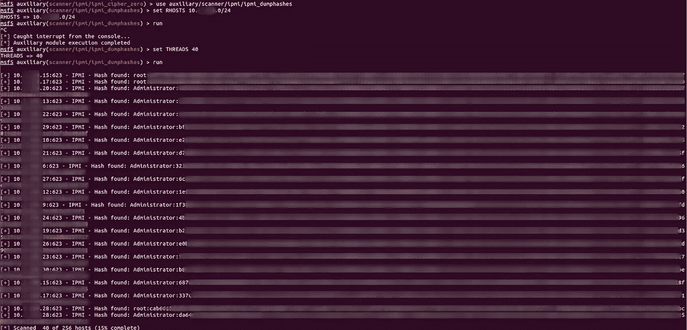

使用 metasploit 公开用户散列

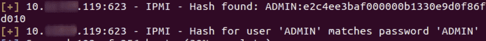

琐碎的散列被立即报告

在列举了所有的散列之后，我们开始破解它们

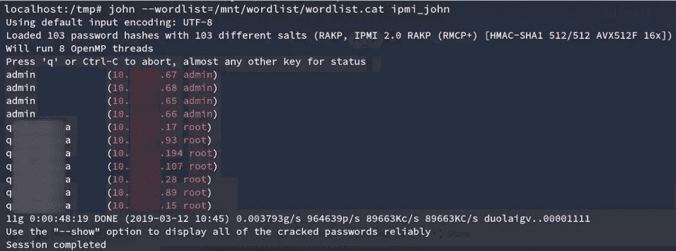

破解第一个哈希

几分钟后，我们访问了大约 600 个 BMC。

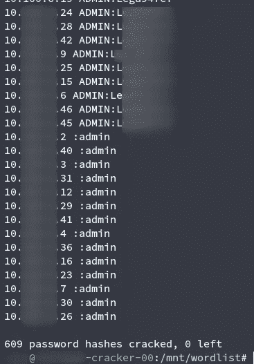

609 个哈希成功破解

有几个我们无法破解的惠普 ILO 设备。幸运的是，从版本 1.00 到 2.50，HP iLO 4 中还有一个认证旁路。这允许您通过连接 HTTP 头中的缓冲区溢出创建一个管理员帐户，由 web 服务器([https://cvedetails.com/cve/CVE-2017-12542/](https://cvedetails.com/cve/CVE-2017-12542/))处理。该漏洞利用这个 BO 来获得对 rest API 的特权访问，这反过来又给予您帐户创建权限。

剥削 CVE-2017–12542

经过这些步骤，我们完全控制了公司 90%的 BMC 设备。我将在这里结束第 1 部分。在第 2 部分中，我们将解释我们如何使用该设备来控制整个基础设施，以及该公司最终如何解决这些问题。