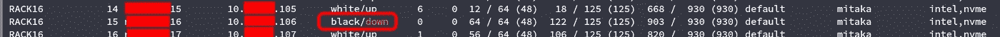
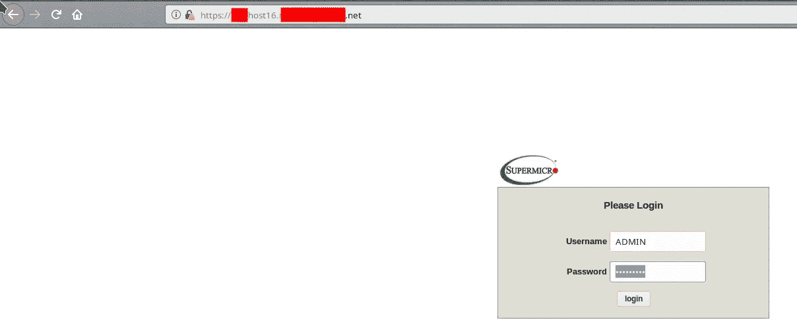
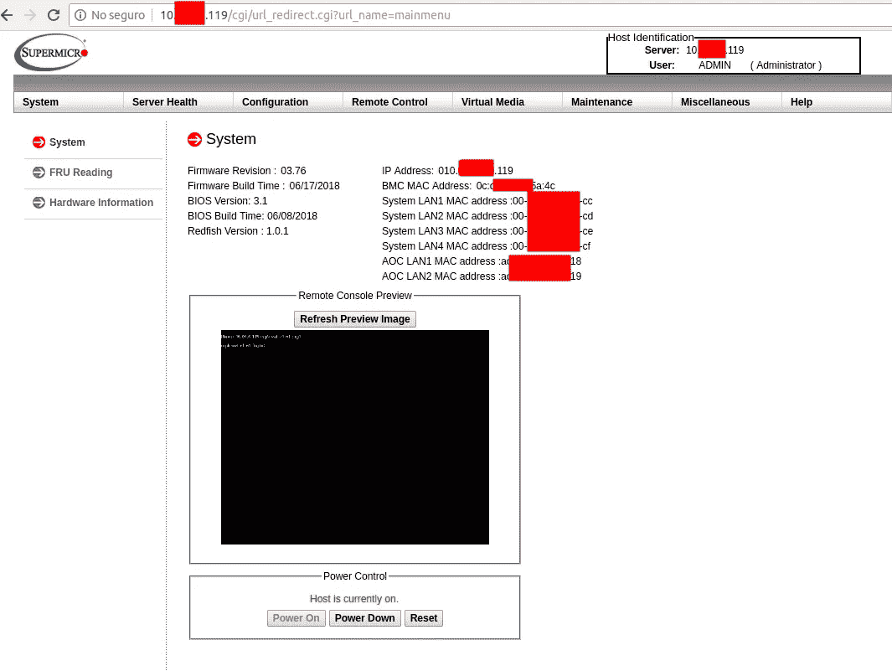
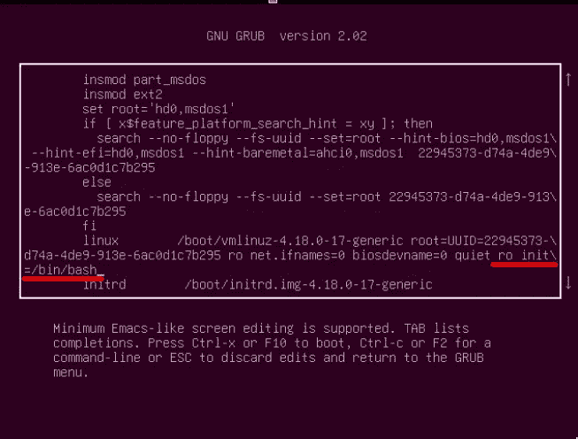
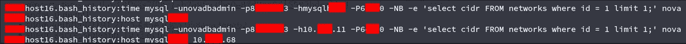
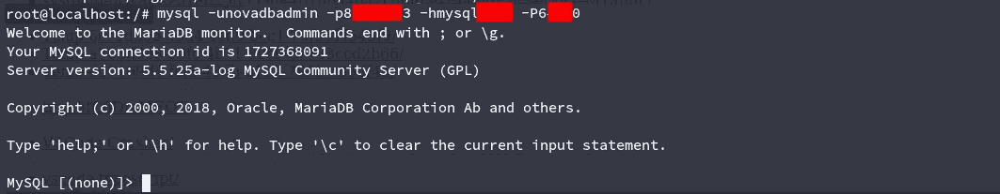
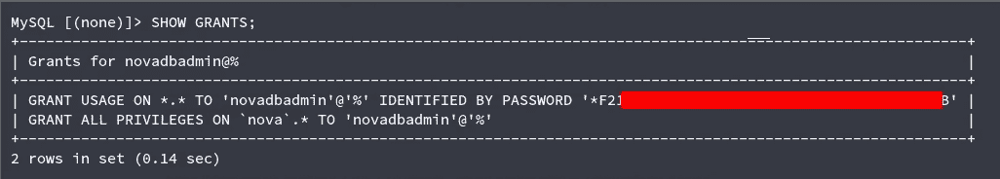
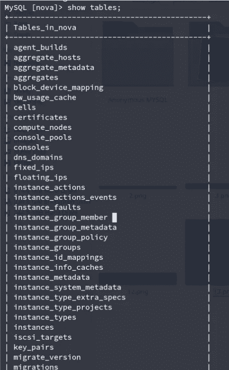
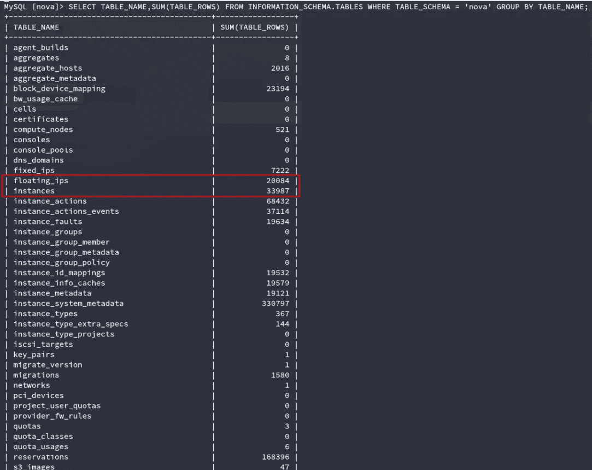
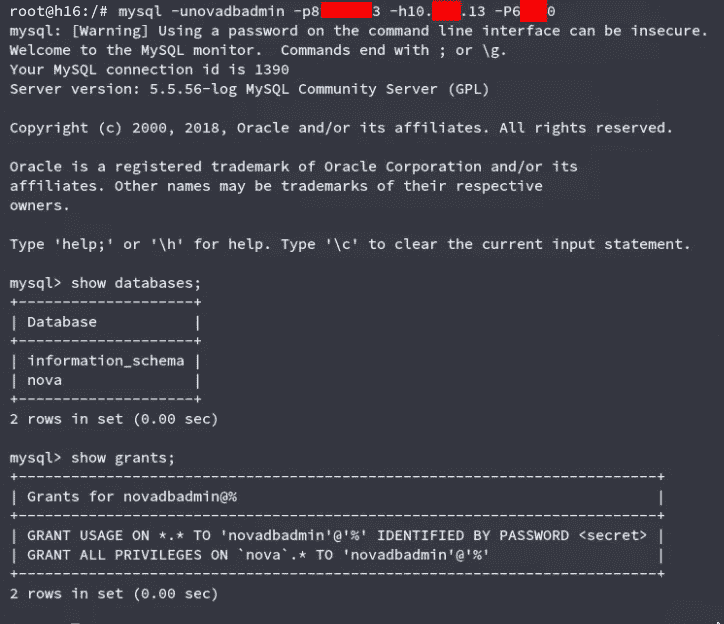

# 一个配置糟糕的数据库如何让我们拥有超过 25000 台主机的整个云(2/2)

> 原文：<https://infosecwriteups.com/how-a-badly-configured-db-allowed-us-to-own-an-entire-cloud-of-over-25k-hosts-part-2-2-5a63da194bc1?source=collection_archive---------2----------------------->

在[第 1 部分](https://medium.com/bugbountywriteup/how-a-badly-configured-db-allowed-us-to-own-an-entire-cloud-of-over-25k-hosts-part-1-2-8846beab691e)中，我们简要解释了我们如何获得几乎所有托管原生 Openstack 云的 BMC 设备的管理员权限。在这一部分，我们将展示我们如何使用这些来实现完全的妥协。

如果你对 BMC 设备有所了解，现在你会知道它们允许你

*   班长
*   重新启动
*   重新设置
*   千伏计（kilovoltmeter 的缩写）

连接的设备。这很好，但它们只是模拟了对服务器的物理访问，您仍然需要进入服务器。是的，你可以通过关闭它们来做，但是我们认为这还不够，所以我们继续挖掘。

损害具有物理地址的设备的最常见方式之一是重新启动该设备并操纵启动，以便获得根外壳。您也可以在 Unix、Mac 和 Windows 中这样做。

这种方法的注意事项是，每台服务器通常托管大约 2000 台虚拟主机。所以我们需要找到一台没有被使用的服务器。计划是关闭它(或者只启动它，如果它已经关闭的话)并编辑启动，给我们 root 访问权限。之后，我们想看一下配置，以找到任何错误/有用的数据，这些错误/有用的数据会让我们危及其他服务器的安全。

Openstack 允许您查询本地基础设施并请求某些参数。其中之一是实例的状态，在这个本地公司的例子中，定义为实例的可用性(接收流量的白名单/黑名单)+运行状态(启动/关闭)。
我们需要找到一个黑名单服务器(运行状态并不重要)。我们设法找到了一个磁盘问题，这是关闭的。幸运的是，我们能够引导，困难在于文件系统的某些部分处于只读模式。



查询 openstack 以寻找合适的服务器进行攻击

一旦我们找到它，我们就用之前破解的凭证登录。



使用在第 1 部分获得的凭证



访问 KVM 界面

KVM 界面模拟通过 BMC 直接连接到服务器。当它启动时，你需要编辑 grub 的启动和附加

```
ro init=/bin/bash
```

到适当的行，才能引导进入根 shell([https://wiki . arch Linux . org/index . PHP/Reset _ lost _ root _ password](https://wiki.archlinux.org/index.php/Reset_lost_root_password))。通常您会使用读写标志(rw)，但我们必须使用只读标志(ro)来防止故障磁盘出现任何问题。



编辑 grub 的菜单

登录后，我们列出了网络接口来验证服务器的连接性。如您所见，ifconfig 显示了超过 10 个活动接口。


在花了相当多的时间分析了网络布局并了解了我们所处的位置之后，我们开始分析服务器。

几分钟后，我们用 bash_history(您可以在 Linux 机器上找到的最好的法庭信息来源之一)挖到了金子



服务器历史记录中 novadb 的凭证。

对于那些不熟悉 Openstack 架构的人来说，Nova 是管理数据库的名称，它保存了整个云的管理信息，如证书、配额、实例名称、元数据和许多其他关键信息([https://docs.openstack.org/nova/rocky/cli/nova-manage.html)](https://docs.openstack.org/nova/rocky/cli/nova-manage.html)。



测试连接凭据

登录后，我们验证了我们的管理员访问查询 MySQL 的授权。



检查完之后，现在我们可以列出 NovaDB 的内部结构。



Novadb 数据库中的表

当列出实例信息时，我们可以看到大约 34K 个已定义的实例。然而，其中约有三分之一在任何特定时间都无法访问/未启动。查看 floating_ips 记录，可以获得更可靠的实例数量。



让我解释一下为什么这个数据库发现如此重要。

如果您想关闭整个公司，您可以通过 BMC 界面关闭每一台虚拟化服务器，但这只会在系统管理员重新启动所有设备之前关闭它。

您可以编写自定义恶意软件来感染所有服务器，但通过 BMC 渠道进行大规模部署并不容易(记住，我们需要启动一个未使用的服务器来编辑 grubs 启动，然后才能访问它)。

不过，使用 NovaDB access，您可以简单地破坏数据库，整个云环境将停止工作。不仅如此，假设系统管理员足够精明，能够立即查看数据库，那么对损坏的数据库进行故障诊断要比对不存在的数据库进行故障诊断困难得多。

当然，系统管理员可能会意识到某些地方出了问题，并简单地用最新的备份覆盖所有内容，对吗？我们，我们也想到了。这就是我们破坏备份的原因。

首先，我们尝试用类似下面的语句查询主数据库

```
SELECT * FROM information_schema.PROCESSLIST AS p WHERE p.COMMAND = 'Binlog Dump';
```

([https://server fault . com/questions/207640/how-to-find-slaves-IP-address-and-user-name-from-master-server](https://serverfault.com/questions/207640/how-to-find-slaves-ip-address-and-user-name-from-master-server))，但他们使用的是一种定制的备份解决方案，这种备份是偶尔进行的，而不是采用主从复制模式。所以我们继续扫描相邻子网，只是为了找到与主数据库运行在同一个端口的备份数据库。


我们是如何找到备份的

我们检查了凭证重用，果然，凭证与主凭证相同。



验证备份访问

由于拥有备份，我们能够证明虚拟化基础架构的整体危害，以及在几分钟内永久停止运营的方法。

我总是喜欢在总结/报告的结尾写下对发现的问题可能的解决方法。这种情况有很多，比如:

*   凭据重复使用
*   缺失网络分段
*   琐碎的密码
*   不安全的备份结构
*   过时的固件

不容易解决的一个关键点是《IPMI 议定书》的弱点。引用丹·法默的网站:

> 注释 4。脸书已经发布了 OpenBMC，这是一个看起来很有趣的实现，理论上，可以放在 BMC 上。大多数供应商都有问题(惠普、戴尔、IBM 等。)不会让你安装没有他们签名的固件…所以你就倒霉了。再加上低级别的司机之类的……谁知道呢。我自己无法建造它，但让我们保持希望。如果任何人知道(公开可用的)硬件，这将实际上运行，给我写信。

因此，最全面的补救措施是将支持 BMC 的服务器放在不同的网段上，使用受限和受监控的访问 IP 白名单。这就是这家公司最终做的事情。

我希望这是有教育意义的，我们确实在研究这些主题和做这个评估中得到了很多乐趣！