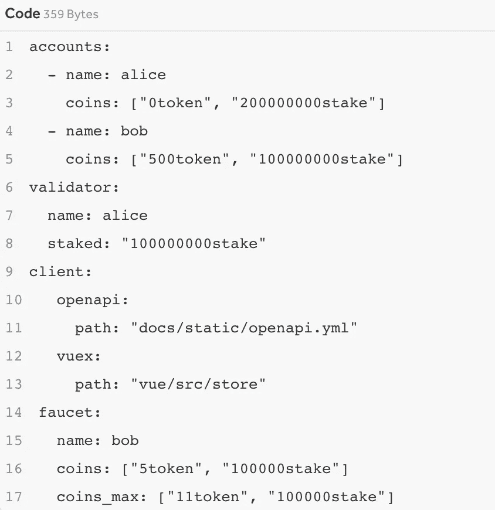
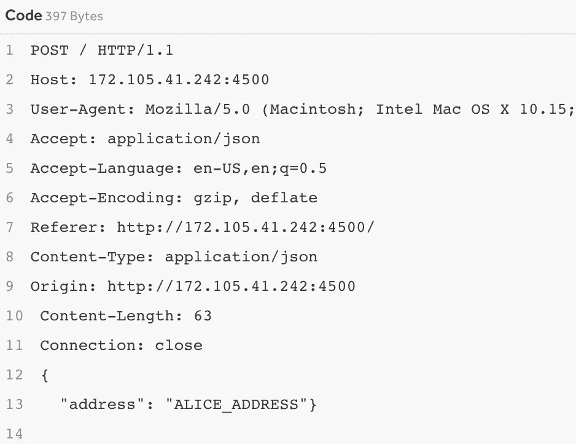

# 这些加密黑客如何获得 5000 美元的 Bug 奖金

> 原文：<https://infosecwriteups.com/how-a-race-condition-made-these-crypto-hackers-5000-bug-bounty-a72158a472a8?source=collection_archive---------1----------------------->

## 故事的寓意——测试并发请求

# 什么是竞争条件？

当两个线程或进程试图同时访问同一个资源时，就会出现[竞争情况](https://en.wikipedia.org/wiki/Race_condition)。具体会发生什么取决于机器、CPU、编译器等等。，并且行为并不总是确定的。本质上，这完全取决于操作顺序改变时[上下文切换](https://en.wikipedia.org/wiki/Context_switch)的时机。例如，如果一个用户从 500 美元的余额开始，然后线程`A`处理 1000 美元的存款，线程`B`处理 500 美元的取款，我们应该期望总共 1000 美元。然而，如果操作顺序是这样的，即`A`和`B`都读取到有$500，`A`更新`500 + 1000`，然后 B 更新`500 — 500`，则用户剩下$0！相反，如果`A`第二名，你可以期望用户得到 1500 美元！

现在，这里有一个现实生活中的例子，两个黑客， [HackerOne](https://medium.com/u/6f816e37be2c?source=post_page-----a72158a472a8--------------------------------) 用户@cyberboy 和@z0mb13，发现了一个竞赛条件，使他们获得了**5000 美元的奖金**。

人工智能生成的图像“比特币窃贼插图”，作者 craiyon.com

# 利用

完整披露的原始报告可以在 HackerOne 找到[。这个 bug 是在一个叫](https://hackerone.com/reports/1438052) [Starpor](https://blog.cosmos.network/learn-to-build-your-own-blockchain-with-the-starport-community-call-50fc32df92e7) t. *的平台上发现的:这里可以找到* [*Github 回购*](https://github.com/ignite/cli/tree/7812125a7e96f4b0cb1da62766c6e96e56fc4f5b) 。Starport 是“构建区块链*、*最简单的方法，是基于 [Cosmos SDK](https://cosmos.network/) 构建的(引用来源:[*Github repo*](https://github.com/ignite/cli/tree/7812125a7e96f4b0cb1da62766c6e96e56fc4f5b)*)。*根据 Cosmos 网站，截至 2022 年 7 月 26 日，基于 Cosmos 构建的代币市值超过**530 亿美元**，其中最引人注目的是币安币。那是一大笔钱。

用户@cyberboy 和@z0mb13 在[加密龙头](https://coinmarketcap.com/alexandria/article/what-is-a-crypto-faucet)的 Starport 实现中发现了竞态条件。我不是加密方面的专家，但我的理解是，加密龙头是一个应用程序，奖励用户一定数量的令牌，以换取完成任务。本质上，代币是免费发放的。下面是[好链接](https://coinmarketcap.com/alexandria/article/what-is-a-crypto-faucet)进一步了解。

在 Starport 实现中，构建者可以设置水龙头奖励的最大令牌数。这样做的目的是为了让用户在每个任务中只能获得一定数量的最大令牌。在 PoC 中，我们的黑客将 max 设置为 11，每个 POST 请求发送 5 个令牌。

最大令牌数设置为 11(来源:[黑客龙](https://hackerone.com/reports/1438052))

两人发送了两个 POST 请求，向 Alice 的账户进行两次转账。现在，爱丽丝的账户上有了 10 个代币，这两个人应该不能再向爱丽丝的账户发送更多的请求了。*注:这和我们在*[*HTB·提奥奇尼斯之怒*](/this-is-why-you-should-always-check-for-race-conditions-even-in-javascript-410b6021ad1a) *上的利用一模一样。*然而，两人同时发送了 50 个请求…

张贴 5 个令牌的请求(来源: [HackerOne](https://hackerone.com/reports/1438052)

答对了。团队发现爱丽丝的账户有 30 个代币，而不是 10 个。这个 bug 的含义是，用户可以在任何基于 Starport 服务的水龙头应用程序上提取更多的“免费”令牌，这意味着理论上许多加密令牌开发者可以使用令牌。这被证明是一个巨大而危险的比赛条件，其**严重等级为 9.3** ！！！同样，请在这里阅读 [H1 的原始报告，在这里](https://hackerone.com/reports/1438052)阅读[最初的 Github 问题以查看源代码。](https://github.com/ignite/cli/issues/1965)

@cyberboy 和@z0mb13 再次完成了令人难以置信的工作，祝贺你获得 5000 美元奖金。感谢您通读，请在下面留下任何建设性的反馈、建议或问题！如果你喜欢，请考虑跟随我。在 roberto.cyberkid@gmail.com 联系我，在 twitter 上关注我，在 LinkedIn 上联系我！

*来自 Infosec 的报道:Infosec 上每天都会出现很多难以跟上的内容。加入我们的每周简讯，以 5 篇文章、4 个线程、3 个视频、2 个 Github Repos 和工具以及 1 个工作提醒的形式免费获取所有最新的 Infosec 趋势！*[*https://weekly.infosecwriteups.com/*](https://weekly.infosecwriteups.com/)