# 一个 Instagram 的故事如何驱使我去远程执行代码。

> 原文：<https://infosecwriteups.com/how-an-instagrams-story-drives-me-to-a-remote-code-execution-9ff96458ec89?source=collection_archive---------0----------------------->


# 放弃

> 所有分享的信息仅用于教育目的。请自行使用这些工具，并记住:**您对造成的任何损坏负责**。实际上，想想这种攻击是如何可能的，它是如何发生的，如果你是一名开发人员，请确保构建比这更安全的系统。
> 
> **本文仅代表我个人观点，不代表其他人的观点**。

# 介绍

最近，信息安全社区非常热门，尤其是在意大利。距离下一次政治选举只有几天了，两个最大的政党已经在不同的层面上以不同的方式遭到黑客攻击[[1](https://www.agi.it/politica/hacker_movimento_5_stelle-3461812/news/2018-02-08/)][[2](http://formiche.net/2018/02/hacker-rousseau-polizia-postale/)][[3](https://www.ilfattoquotidiano.it/2018/02/06/hackerato-il-sito-del-pd-di-firenze-anonplus-ci-sono-dati-di-matteo-renzi-dem-roba-vecchia/4140764/)]。当一名学生被报道揭露 Rousseau 的一个巨大漏洞时，关于***道德黑客*** 的讨论达到了高潮，Rousseau 是目前意大利最大的政党“5 月运动”的一个主要网络平台。

我不想在这个讨论中引入更多的内容，因为[已经说得够多了](https://twitter.com/_odisseus/status/963014626077282304)，所以我认为把我对***道德黑客*** 的看法与一个关键漏洞结合起来是很酷的，这是我由于一个有趣的 Instagram 故事而偶然发现的。

# Instagram Stories:简介


描述 Instagram 故事背后的想法的一个简单而有效的方法是我在一个营销网站[4]上找到的以下陈述，并为读者翻译成英语:

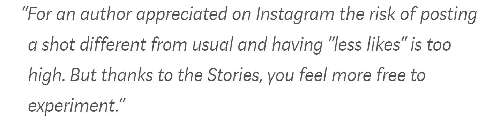

经过适当的修正后，这句话看起来非常适合我要和你分享的故事:

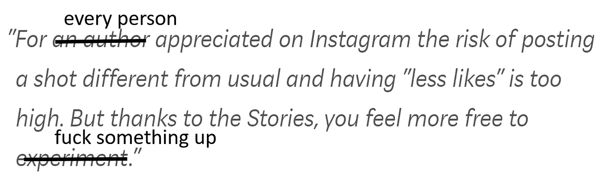

# 第一章:“没意思。”<swipe>“还是没意思..”<swipe>“又没兴趣了……哦 sh*t！”</swipe></swipe>

正如导言中已经说过的，在一个不眠之夜，Instagram 上的一个故事引起了我的注意:


乍一看，它似乎是无辜的:这个人只是贴了一张他/她即将到来的学校旅行的照片。没什么新鲜的，我猜几乎每个人每天都会在 Instagram 上看到这些照片。

但是如果你靠近点看，可能会看到更有趣的东西:

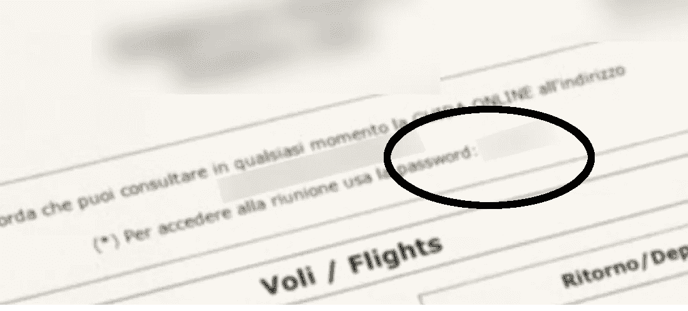

是的，那是一个**密码**(出于显而易见的原因被编辑)和一个**登录门户**的网址(也出于同样的原因被编辑)。当时，我不知道它是否值得，但我试图到达该地址，出现了以下页面:

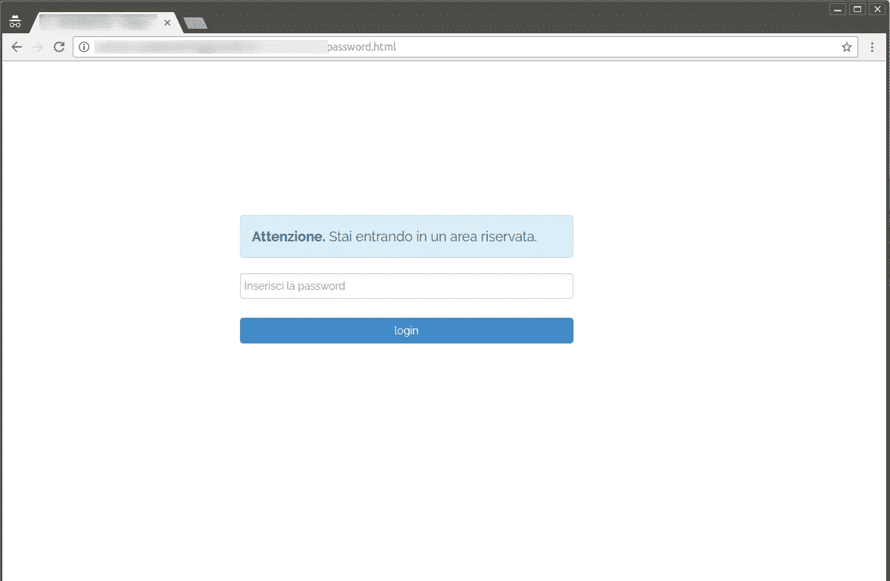

登录页面。(英格:“注意。你正在进入禁区)

我想我已经得到了所有需要的信息，所以我输入了找到的密码，并且成功了。

下图显示了成功登录:

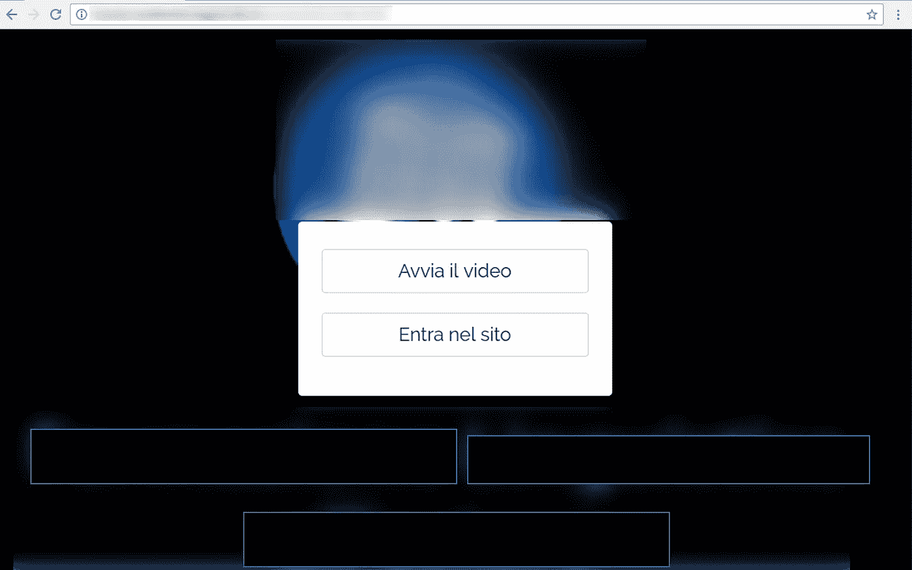

成功登录。(英语:“播放视频”和“进入网站”)

> “好吧，酷，但我不认为我在这里能做太多。我不想开始在网络应用程序中寻找漏洞等……”

# 第 2 章:防范利用漏洞的企图

我开始环顾四周**，没有强迫任何事情**，但是表现得像一个普通用户。这个门户网站提供了在 Instagram 上发布照片的人即将到来的旅行的摘要。

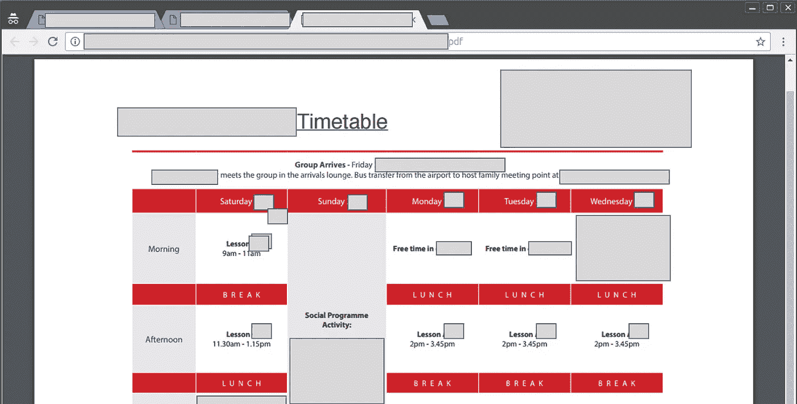

学校课程时间表。

有可能检索到有用的信息，如课程表、学校和酒店的地址、相关教师的姓名和手机号码。我的意思是，这里有一些敏感的信息，但没有什么非常有趣的，因为学生只能访问他的学校旅行的信息，他不能看到其他学校旅行的信息。嗯，不完全是。

当我浏览网站时，我开始在浏览器中查看 URL，我注意到我可以浏览的所有页面都在同一个子域中。几个例子(*原文件夹的名称已更改*):

*   **subdomain . domain . it**/site/21443/docs/12231/time table . pdf
*   **subdomain . domain . it**/presentation/31223/index . html
*   等等..

于是我浏览到了 **subdomain.domain.it** 的根目录，这个页面出现在我面前:

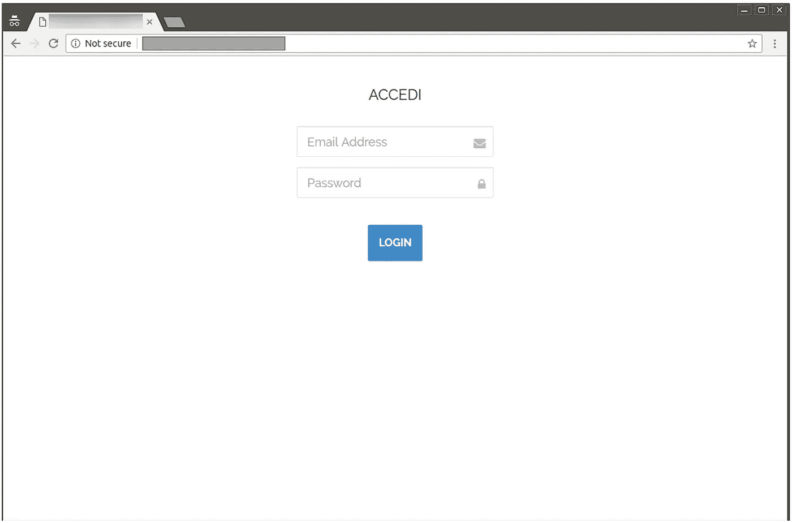

找到第二个登录页面

好吧，这里的诱惑非常强烈，但我已经决定不尝试利用任何东西。**抱歉，这里没有注射尝试。**

我所做的是一个“**手动敲门方法**”:只是几个常见的认证组合，也与以前的密码发现，但没有任何工作，这是可悲的。抱歉，这里没有暴力。

敲了几下门后，我决定不使用任何钥匙打开门，令人惊讶的是它成功了。


> 没有用户名和密码实际上是使用的凭证。欢迎来到 2018 伙计们。

# 第三章:欢迎回来管理员！

成功登录后，web 应用程序显示以下仪表板:

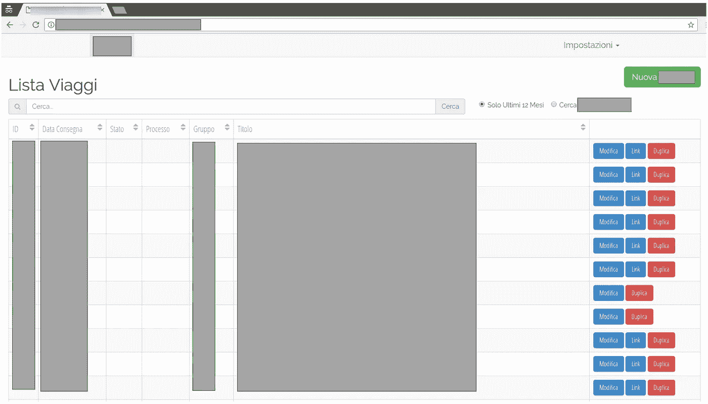

找到管理员仪表板

现在，我可以访问所有已安排的行程(即将到来的和已经结束的)。\_(ツ)_/

从现在开始，我可以任意不加选择地修改每一条行程信息，如下图所示:

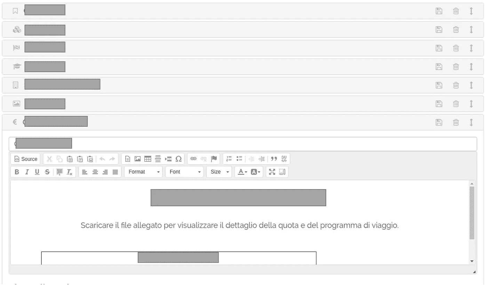

但是我发现的最好的特性是下面这个:

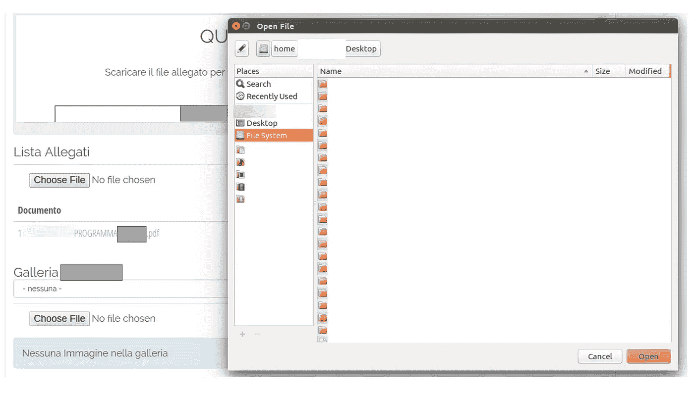

**是的，任意文件上传**。该功能用于连接。为学生提供包含旅行信息的 pdf 文件。

但是，如果我尝试上传一个“非 pdf”文件呢？**让我们从一个文本文件**开始:

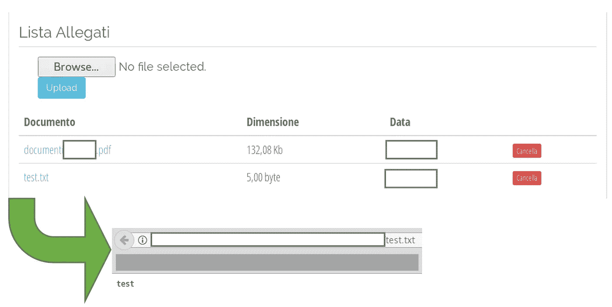

任意文件上传:txt 文件

成功了，所以看起来好像没有**检查文件的扩展名**。让我们试试一个小的。php 文件如下:

```
<? php echo "test"; ?>
```

作为一名渗透测试人员，发现在 web 服务器上运行任意 php 代码的能力显然被认为是非常糟糕的:

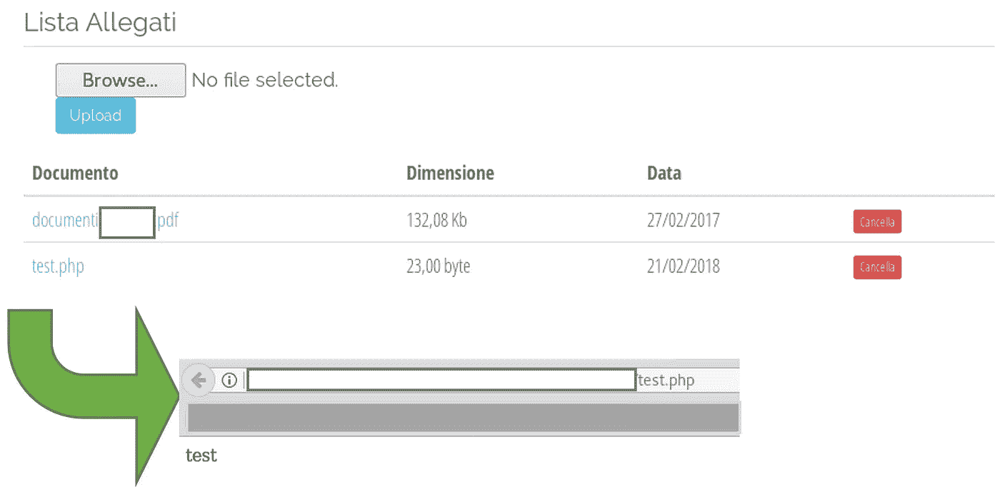

任意文件上传:php 文件

但是你去那里..宾果！网络服务器成功地解释了我的小 php 文件，我已经得到了在这台机器上尝试执行任意代码所需的一切。


RCE 舞

# 第四章:RCE！

为了演示一个 RCE，我上传了一个带有 [weevely3](https://github.com/epinna/weevely3) 的 php 代理:这个代理很小，很难被反病毒软件检测到，客户端和代理之间的通信在 HTTP 请求中是模糊的。

这是上传的模糊 PHP 代理:

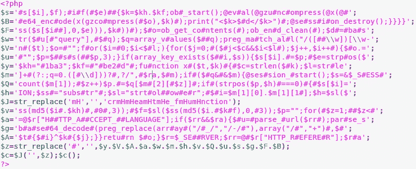

用 weevely3 创建 PHP 代理

我将其重命名为“ **new_settings.php** ”，并成功上传到服务器:

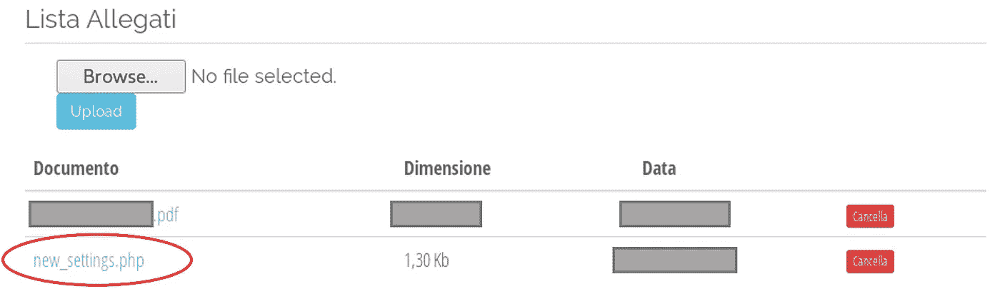

之后，我连接到代理，如下所示，瞧:

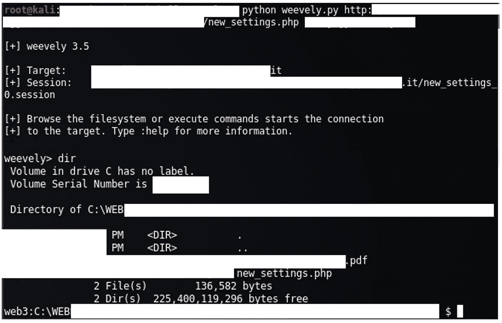

成功连接到 weevely php 代理

**成功获得远程代码执行！**

我想我已经用完了，是时候把我的发现告诉供应商了。他们对此会有什么反应？

# 第 5 章:负责任的披露


*   *2018 年 2 月 26 日*:第一封邮件已发送给供应商。还在网站上写上他们的“支持实时聊天”。没有立即收到答复。
*   *2018 年 2 月 27 日*:第二封邮件已发送给供应商。此外，第一封电子邮件已经发送到开发这个网站的机构。
*   *2018 年 2 月 27 日*:代理商第一次回答:他们正在与客户联系，以解决问题。
*   2018 年 2 月 28 日 : **他们修复了登录页面**。但是仍然没有他们的回答。

参考资料:

[1][https://www . agi . it/politica/hacker _ movi mento _ 5 _ stelle-3461812/news/2018-02-08/](https://www.agi.it/politica/hacker_movimento_5_stelle-3461812/news/2018-02-08/)

[2][http://formiche . net/2018/02/hacker-Rousseau-polizia-postale/](http://formiche.net/2018/02/hacker-rousseau-polizia-postale/)

[3] [https://www.ilfattoquotidiano.it/2018/02/06/hackerato-il-site-del-pd-di-firenze-anonplus-ci-sono-data-di-matteo-renzi-dem-roba-vecchio/4140764/](https://www.ilfattoquotidiano.it/2018/02/06/hackerato-il-sito-del-pd-di-firenze-anonplus-ci-sono-dati-di-matteo-renzi-dem-roba-vecchia/4140764/)

[4] [http://www.ninjamarketing.it/2018/02/19/le-instagram-stories-stange-改变-什么-应该-持有-思想-所有品牌/](http://www.ninjamarketing.it/2018/02/19/le-instagram-stories-stanno-cambiando-cosa-dovrebbe-tenere-a-mente-ogni-brand/)