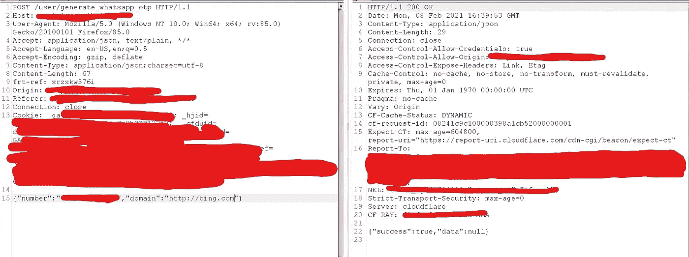
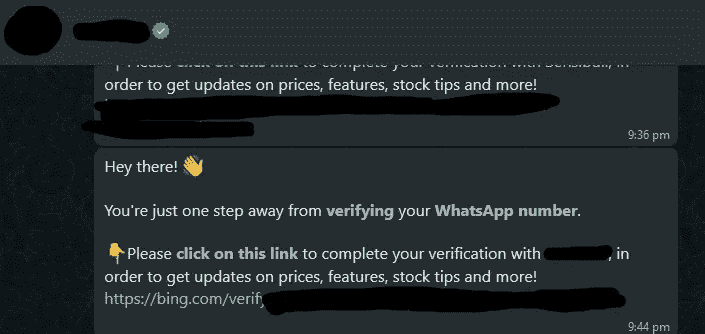
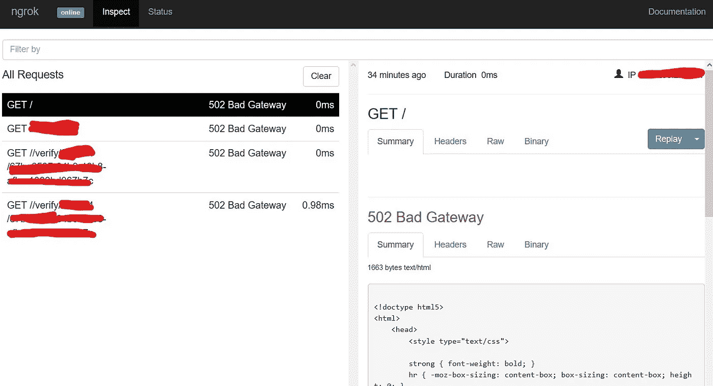

# 开放重定向如何导致帐户被接管？

> 原文：<https://infosecwriteups.com/how-an-open-redirection-leads-to-an-account-takeover-73ea883055d1?source=collection_archive---------0----------------------->

> 嘿，伙计们，我在这里分享我的一个老发现。我发现了一种独特的打开重定向的方法，这种方法会导致帐户被接管。

所以我测试的 Web 应用是一个交易平台。出于演示目的，我们称它为 target.com。

所以有一个用于登录平台的子域。让我们称之为 web.target.com，并创建了一个测试帐户。登录后，我注意到一个“验证 whats-app 号码”的功能，这样用户可以验证帐户，重置密码(通过电子邮件和直接通过 whats-app)，直接通过 whats-app 获得交易更新。所以我继续测试这个功能。在测试时，我注意到 post 请求中有两件有趣的事情“数字”和“域”。这是不是意味着我也可以改变域名？

永远相信你的蜘蛛感觉

**让我们看看我是否能够执行开放重定向**

**步骤:**

1.  转到 https://web.target.com 并登录。
    2。现在转到个人资料并添加 whats-app 编号。提交受害者编号/测试编号。
    3。在 Burp Suite 中截取请求，并将其发送到中继器。
    4。现在我把请求中的“域”改为“域”:[https://bing.com](http://bing.com)对请求&的响应看起来像:

检查请求和响应

5.现在受害者收到了一条来自 Target.com 官方 whatsapp 账户的信息。受害者点击链接并重定向到攻击者的域。

但这是一个低严重性的问题，似乎不是一个安全问题。所以我只做了一件事，并试图利用它来应对一些严重的漏洞。

6.在验证了我请求的密码重置令牌的应用程序编号之后。并在 burpsuite 中捕捉到了这个请求。

7.已将“域”更改为 Ngrok URL，并收到带有重置链接的消息。

8.同时在 Ngrok 仪表板中收到一个请求，该请求带有密码重置令牌。

9.我用那个令牌重置了受害者账户的密码。

**影响:此漏洞可导致账户被接管。**

**公司修复了漏洞，奖励了我**💲💲💲**。**

## ***推特:***[【https://twitter.com/Mah3Sec】T21](https://twitter.com/Mah3Sec_)

感谢阅读我的文章，祝你狩猎愉快！