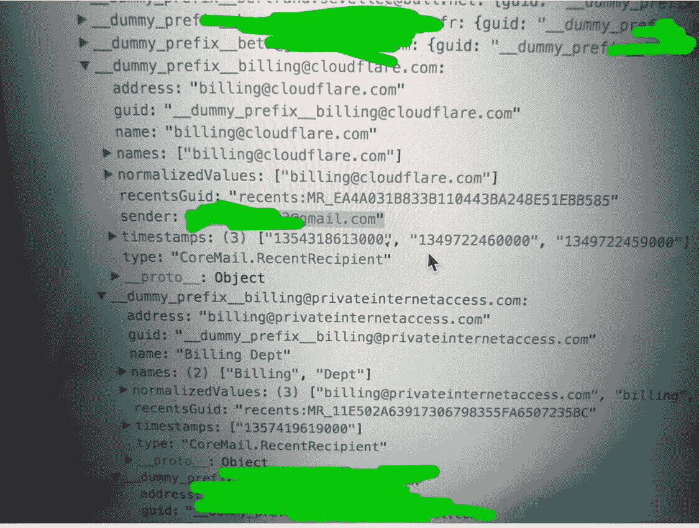
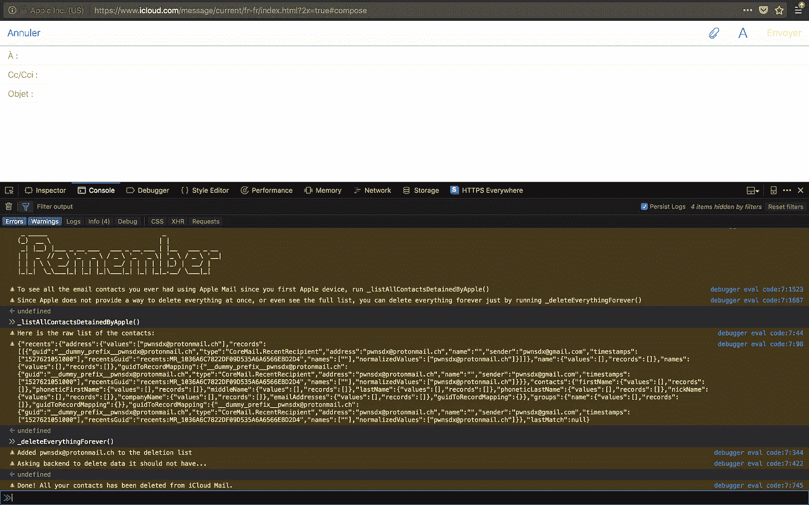

# 苹果公司是如何将你所有的电子邮件元数据在他们的服务器上储存多年的

> 原文：<https://infosecwriteups.com/how-apple-stored-all-your-email-metadata-for-years-on-their-servers-2a61b1a3232d?source=collection_archive---------0----------------------->

今天我要揭示的是，自从 iCloud 推出以来，苹果是如何获得你使用官方邮件应用发送(甚至在某些情况下收到)的所有电子邮件的元数据的。

很多年前，我停止使用 Gmail，但我保留了这个账户。我没有删除它，而是删除了里面的所有内容，包括电子邮件和联系人，并使用官方邮件应用程序将它连接到我的手机上。两年前，我注意到当我写电子邮件并开始输入收件人时，我可以看到我删除的联系人出现了。我又查了谷歌，甚至是 iCloud 通讯录，但一无所获。

自从我没有时间去好好调查到底发生了什么，但在这个 GDPR 日，我想起了这件事，我非常愿意仔细看看。

## 调查

我最初认为它来自谷歌服务器，但在调查后我得出结论，iCloud Mail 似乎在苹果服务器上的 clear 中谨慎地收集你在官方应用程序中发送的电子邮件的元数据，而不管使用的邮箱是什么(谷歌、Outlook、Riseup、fast Mail……)。

显然是用于自动完成电子邮件的“最近”功能，这里我有 1.2 MB 的元数据，大约有 700 多个联系人，这大约是自 2017 年 iCloud 推出以来我可以从任何邮箱联系的每封电子邮件，这与我迁移到使用外部应用程序的 ProtonMail 相冲突。

Apple 服务器上的数据样本，包含发件人、收件人、收件人姓名和时间戳。

在我的个人转储中，我能够找到 2012 年初的电子邮件地址。我还能找到没有回复的电子邮件，所以目前还不清楚苹果是否也在收集你收到的电子邮件的元数据。我可以假设他们在过去这样做过，但是因为我不能繁殖而停止了。

## (大)问题

问题是，即使在几年后，数据仍然存在(然而我们在这里谈论的是“最近的人”)，用户没有办法知道列表(不打开 web 开发人员控制台)，对于他能找到的一点点，他必须一个接一个地删除它们。

我和一个朋友确认了一下，似乎尽管他没有实际的 iCloud 电子邮件地址，也没有切换过 iCloud 的“邮件”选项，但这些数据仍然会保存下来，因为他后来发现是通过创建它保存的。

## 使用 iRemember 转储和删除所有内容

如果您使用启用了 iCloud 的 iPhone 或 Mac，您可能会受到影响。你可以登陆 iCloud Web，在 Web 开发者控制台执行我调用的 iRemember 来查看苹果为你保存了多少数据:[https://gist . github . com/pwn sdx/9a 8092604363 bbaf 5560 f1 d 68171 CCD 9](https://gist.github.com/pwnsdx/9a8092604363bbaf5560f1d68171ccd9)

iRemember 正在运行

## 现在发生了什么？

苹果在 2 个月前添加了一篇描述该功能的知识库文章(没有任何技术细节):[https://support.apple.com/kb/ph20541?locale=en_GB](https://support.apple.com/kb/ph20541?locale=en_GB)(**是的，2 个月前一个 5 岁的功能**)。

这个数据可能会出现在即将发布的 **GDPR** 报告中，这可能是为什么现在这个数据被修正了，但是很多人肯定会问自己这个数据怎么会出现在他们的苹果账户中。

**5 月 31 日更新**:提出要求的人开始收到他们的 GDPR 报告，电子邮件元数据似乎出现在报告的“其他数据”部分。该文件为 XML 格式，位于*其他数据>苹果功能使用 iCloud >邮件> Recents.xml* 下

**5 月 31 日更新**:重要更正:iOS 11.4 并未修复该问题。因此，更新并不能解决问题。如果您想要避免这种数据收集，建议注销 iCloud 或停止使用官方邮件应用程序。

## 我是谁？

我的名字是塞布莉·哈德杜。我是一名开发人员、pentester、bug 猎人和隐私倡导者。白天，我作为安全团队的一员在 [Wire](https://wire.com) 工作，在空闲时间，我涉足一些项目，比如 [Mailsploit](https://www.mailsploit.com/index) 和 [Unsecure](https://github.com/pwnsdx/Unsecure) 。