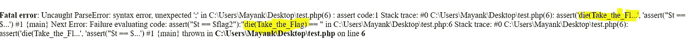

# “断言”是如何让你被黑的！！

> 原文：<https://infosecwriteups.com/how-assertions-can-get-you-hacked-da22c84fb8f6?source=collection_archive---------0----------------------->

## 深入探究 assert()函数以及利用它的方法！

各位黑客和开发者，我已经有一段时间没有在这里发表博客了。今天我将讨论**编码+黑客**，特别是关于几乎每一种高级语言中都存在的一个特性，称为“**断言**”。您将了解什么是 assert()函数以及在野外利用它们的不同方法。所以抓紧时间，让我们开始吧。

照片由[马体·米罗什尼琴科](https://www.pexels.com/@tima-miroshnichenko?utm_content=attributionCopyText&utm_medium=referral&utm_source=pexels)从[派克斯](https://www.pexels.com/photo/close-up-view-of-system-hacking-in-a-monitor-5380664/?utm_content=attributionCopyText&utm_medium=referral&utm_source=pexels)拍摄

# 什么是断言？

Assertion 的字面意思是***“表示你坚信某事为真的陈述”，*** 类似地，有时在编程中，我们假设某些值为真，然后继续执行其余的代码。

例如，我们可以断言**任何到达本地 SQL 服务器的请求都必须来自本地主机，因此不需要身份验证就可以继续进行，**这整个陈述已经开始刺激您的黑客感官，您可以想到该断言可能出错的许多方式。

在许多不同的场景中，可以使用 assert()来捕捉代码中的假设。

assert()检查一个条件是否为真，如果不为真，则引发一个错误并关闭程序。

# assert()与 if-else 块有什么不同？

您可能会问，所有这些 assert()函数都是在做检查，然后相应地采取行动，那么为什么不用 if-else 来代替它呢

断言就是在代码中记录你的假设。if-else 语句是为了处理不同的逻辑场景。让我们从一个简单的例子来理解

例如当你写作的时候

你的意思是说，在我的 **print_number** 函数中，我假设指针总是不为空。如果这是空的，我会非常非常惊讶。我根本不在乎在我的代码中处理这种情况。

但是，如果你写

你似乎在说，在我的 **print_number** 函数中，我希望人们传递一个空指针。我知道如何处理这种情况，我也处理过这种情况。

所以，有时你会知道如何处理某些情况，你想这样做。然后，使用 if-else。有时候，你认为一些事情不会发生，你不在乎去处理它。你只需表达你的惊讶，然后用 assert 停止程序执行。

# 与 assert()相关的安全隐患！

assert()在不同的编程语言中有不同的工作方式，但是它仍然是一个安全相关的问题。

## 1:访问控制错误

这主要是由于在优化模式下运行代码而在 python 中发现的。

现在，默认情况下 Python 以`__debug__`为真执行，但是在生产环境中，以优化运行是很常见的。这将**跳过断言**语句，直接进入安全代码

如果这段代码像`python3 assert.py`一样执行，那么它就像预期的那样完美地工作。但是，如果它与开关`-O`一起使用进行优化，那么就会出现严重的问题。根据官方网站:`-O` *删除 assert 语句和任何以* `[*__debug__*](https://docs.python.org/3/library/constants.html#debug__)`的值为条件的代码

当您在[优化模式](https://docs.python.org/3/using/cmdline.html#envvar-PYTHONOPTIMIZE)下运行这个 Python 程序时，*断言语句*被忽略，任何普通用户都可以成为**超级用户。**

## 2:拒绝服务(DOS)攻击

由于负载分配和更好的系统设计，DoS 攻击在过去几年中已经有所下降，但应用程序级 DoS 仍然是 bug-Bounty 领域中一个令人兴奋的 Bug。由于糟糕的代码编写或开发人员犯的小错误，如错误处理不当，应用程序级 DoS 仍然可以实现。

在这个小例子中，你可以看到一个简单的 C++程序，以`Year of Birth`为输入，检查它是否是 **> 18** 。乍一看，这一切似乎都很好，但在这段代码中，没有执行任何错误处理，这将直接导致程序在 assert 检查失败后崩溃。

在这里使用错误处理可以很容易地防止这种情况，但是令人惊讶的是，在 C 和 C++这样的语言中，许多开发人员对此并不重视。

## 3:扭曲的拒绝服务

有时不是你的代码导致这些 DoS 发生，而是某个库依赖另一个库导致程序意外崩溃。你可以把它想象成一个多米诺骨牌，如果一个 assert()为 false，它将使代码中的所有函数退出，从而使整个应用程序崩溃。

类似的场景发生在 **NodeJS，**它被标记为**CVE-2019–15604**在这个漏洞中，**攻击者可以使用格式错误的证书字符串远程触发 TLS 服务器上的断言，导致服务器崩溃**

最初， [**罗杰·斯豪滕**](https://www.linkedin.com/in/rogierschouten) 于 [**黑客**](https://hackerone.com/reports/746733)**向 NodeJS 团队提交了一份报告，团队将此视为一个**关键漏洞**，几天后发布了修复程序。**

*   **CVE-2019–15604 的起因是什么？？**

**该漏洞利用了 NodeJS 的`socket`库中的`getPeerCertificate()`函数。任何人都可以远程连接到 TLS 服务器并提供特制的 x509 证书，这将导致断言和进程中止。**

**当精心制作的证书被发送到 TLS 服务器时，抛出了以下错误，它清楚地显示了一个断言被触发，导致整个服务器崩溃。**

**该修复程序更详细地解释了该问题。**

**格式错误的证书的关键属性是[**subject altname**](https://nodejs.org/api/tls.html#tlssocketgetpeercertificatedetailed)包含一个类型为`23`的字符串，它不能被`X509V3_EXT_print`编码成一个字符串**

**如果 **X509** 扩展不支持打印到缓冲区，则 **X509V3_EXT_print** 会返回不同于`1`的值。代码没有因为不可恢复的断言而失败，而是被替换为 hashmap 中带有 JS null 值的相关值。**

**这个漏洞显示了在一个小的库中，错误处理中的小疏忽是如何变成一个失败的临界点的。**

## ****3:远程代码执行****

**PHP 一直是一个疯狂利用的矿井，其中之一是使用 assert()函数远程执行代码。简而言之 **assert()+PHP===Server Pwned。****

**与其他编程语言不同的是，PHP 赋予 assert()一种特殊的能力，**如果将** `**assertion**` **作为字符串给出，它将被 assert()** 视为 PHP 代码**

**这意味着如果你传递一个`string`给 assert()，它将作为一个`eval()`函数运行系统命令。**

*   ****运行时变量泄漏****

**如果一个运行时变量被用来执行断言检查，那么这个变量有时可能会从内存中泄漏。**

**这里我做了一个简单的程序，使用断言检查将输入与`NULL`进行比较。现在，如果我们传递一个格式错误的输入，我们可以在错误中看到`flag`变量的值**

****

**这是因为 PHP 中的`**die**`函数可以在退出程序流之前运行任何系统命令。我们滥用了这个特性，在 assert 函数中传递了一个字符串。结合这两个问题，我们可以从运行时访问任何随机变量，或者执行系统命令。**

**我们可以利用任何可能直接接受用户输入而不进行净化的应用程序。为此，我们可以发送像`"die(system(ls));//"`这样的有效载荷，它将在系统上运行`ls`，而`system()`之后的其余代码将被视为注释，因为有效载荷中存在`;//`。**

**这里需要关注的最重要的事情是，我们想要发送一个字符串，然后使用`die()`函数运行 or 命令，然后注释掉剩余的代码。这可以帮助我们利用 PHP 中 assert()函数的大多数用例。我们可以把它看作是 SQL 注入，在这里我们运行我们的查询，然后注释掉查询的其余部分。**

*   ****绕过 LFI 检查和 strpos()检查****

**许多应用程序使用 strpos()来检查文件参数中的恶意输入。 **strpos()** 查找子字符串在字符串中第一次出现的位置，如果在给定的字符串中找不到给定的子字符串，则返回 False。**

> **assert("strpos('$file '，'..')=== false”)或 die(“侦测到 LFI 企图！");**

**这种过滤器可以在许多 CTF 甚至在现实生活中找到，以保护应用程序免受 LFI 攻击。该过滤器检查任何`..`模式的`file`变量，如果找到，程序终止。**

**我们可以使用上面使用的相同技术，但是这里我们有一个额外的函数(strpos ),我们需要绕过它，以便直接运行我们的命令到 assert 函数。**

**`' and die(system(ls))or '`，这个有效负载可以用来脱离 strpos()并直接与 assert()函数交互，同样我们可以在服务器上运行任意命令。**

# **缓解措施💡**

*   **避免在生产中使用 assert()函数**
*   **在代码中使用 assert 之前，要特别注意您是否在 python 中运行优化的代码。**
*   **断言应该只用作调试功能。**
*   **您可以使用它们进行健全性检查，测试应该始终为`**true**`的条件**
*   **断言不应该用于正常的运行时操作，如输入参数检查。**
*   **根据经验，如果没有激活断言检查，您的代码应该总是能够正确工作。**
*   **如果在 assert 函数中直接使用用户输入，那么尝试净化它。**

**这将是这一次，如果你想让我在这里补充的话，请分享你的观点。**

**非常感谢你的阅读。喜欢就分享😇😇**

**在**媒体**和**上跟随我订阅邮件列表💌如果你想在我发表文章时得到它们。✨✨****

**可以在推特上找我:[**mayank _ pandey 01**](https://twitter.com/mayank_pandey01)**👻****