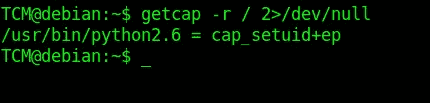
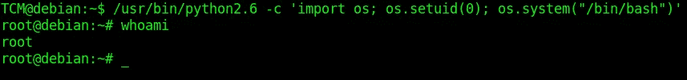

# 能力实际上是如何工作的？|利用|权限提升

> 原文：<https://infosecwriteups.com/how-capabilities-actually-work-exploitation-privilege-escalation-536afee917ad?source=collection_archive---------7----------------------->


# SUID:传统的 Linux 方式

有时，低权限用户需要使用较高权限执行特定任务，为此，Linux 提供了在特定二进制文件上设置 SUID 位的功能。

SUID(设置用户 ID)位是一种特殊的权限，可以在 Linux 操作系统中的可执行文件上设置。这允许非特权用户以文件所有者的权限运行程序。

例如，如果一个非根用户想要执行一个设置了根用户的**的 SUID 位的程序，他/她将在整个程序执行过程中被给予根权限。**

# 为什么是能力？

SUID 运行良好，但是它有很高的安全风险，因为它将完全权限授予非 root 用户，即使只要求使用 root 权限执行某些操作。

> 攻击者利用 SUID 位在系统上执行权限提升。

这就是**功能**的用武之地，功能还允许用户以根用户的权限运行某些可执行文件。但它更安全，**如何？**功能并不提供全部权限，而是将特权和权限划分为更小、更具体的单元或线程，可以有选择地启用或禁用。

> **注意:**权能授予进程而不是用户特权。

每种功能都对应于特定的权限或特权，例如绑定到网络端口的功能、更改系统时间的功能或向其他进程发送信号的功能。

```
**Some Linux Capabilities and their functions are:-**

CAP_DAC_OVERRIDE: The ability to override file permissions.

CAP_DAC_READ_SEARCH: The ability to read and search directories and files that
the process does not have permission to access.

CAP_KILL: The ability to send signals to other processes.

CAP_NET_BIND_SERVICE: The ability to bind to a network port below 1024.

CAP_SYS_BOOT: The ability to reboot the system.

CAP_CHOWN: The ability to change the owner and group of a file.
```

点击此处阅读更多内容..

[](https://man7.org/linux/man-pages/man7/capabilities.7.html) [## 功能(7) - Linux 手册页

### 功能(7) Linux 程序员手册功能(7)功能-概述 Linux 的功能…

man7.org](https://man7.org/linux/man-pages/man7/capabilities.7.html) 

# 在 Linux 内核内部

功能作为**位掩码**存储在 **/proc** 文件系统中的一个单独文件中。对于每个进程，位掩码是一个数据结构，它将一组标志或选项表示为单个值中的单个位。位掩码中的每个位对应一个特定的功能，位的值(0 或 1)表示该功能是启用还是禁用。

可以使用 setcap 命令和 capsh 命令对它们进行操作。当一个进程发出一个需要特定能力的系统调用时，内核会检查该进程的能力，看是否授予了必要的权限。如果权限未被授予，系统调用将被拒绝，并且进程会得到一个错误代码。

1.  **允许的能力**:这些是一个进程被允许拥有的特权，不管它当前是否正在使用这些特权执行。
2.  **有效功能:**这些功能由 Linux 内核检查，看它是否有效。这些是进程当前正在执行的特权。一个进程只有在被允许并且有效的情况下才能行使特权。

## 示例:

这两者就像编程中的函数，首先编译器检查一个函数是否存在，如果存在，那么它将执行那个函数。这里的编译器是 Linux 内核，允许的能力是被声明的函数，有效的能力是被执行的函数。希望这能让你对它的工作原理有所了解。

`setcap`命令将功能名称和值作为参数，并相应地更新进程位掩码中的相应位。

```
setcap cap_chown=+ep myprogram
```

上述命令将`myprogram`进程的位掩码中的`CAP_CHOWN`位设置为 1，表示该功能已启用。请注意文件名前的+号，如果是负(-)号，则表示该功能被禁用。

[](https://tryhackme.com/room/linprivesc) [## TryHackMe | Linux 权限提升

### 了解 Linux 权限提升的基础知识。从列举到利用，获得超过 8…

tryhackme.com](https://tryhackme.com/room/linprivesc) 

# **黑客思维:如何被利用？**

在目标机器中，我们可以看到使用 **getcap** 命令启用的功能。当以非特权用户的身份运行时，`getcap -r /`将生成大量的错误，因此将错误消息重定向到/dev/null 是一个很好的做法。

> **cap_setuid** 如果不小心使用，功能可能会很危险，因为它允许进程更改进程的有效用户 id 和组 ID，这可能会导致权限提升。



命令: `getcap -r / 2>/dev/null`

有一个启用了 **cap_setuid+ep** 的 python 二进制文件，这个允许一个程序获得 setuid(执行时设置用户 id)和有效(ep)权限，这些权限需要以文件所有者的权限来执行，而不是执行它的用户的权限。



旁路:`/usr/bin/python2.6 -c ‘import os; os.setuid(0); os.system(“/bin/bash”)’`

这可以通过添加一段代码并告诉 python 导入 OS 并生成一个 **/bin/bash** shell 来轻松利用。因为它是以根用户的权限执行的，所以它将生成一个具有根用户权限的 shell。

查看更多设置了该功能的二进制文件。

[](https://gtfobins.github.io/#+capabilities) [## GTFOBins

### GTFOBins 是 Unix 二进制文件的精选列表，可用于在错误配置的环境中绕过本地安全限制…

gtfobins.github.io](https://gtfobins.github.io/#+capabilities) 

感谢您的阅读。

## 来自 Infosec 的报道:Infosec 每天都有很多内容，很难跟上。[加入我们的每周简讯](https://weekly.infosecwriteups.com/)以 5 篇文章、4 条线索、3 个视频、2 个 GitHub Repos 和工具以及 1 个工作提醒的形式免费获取所有最新的 Infosec 趋势！