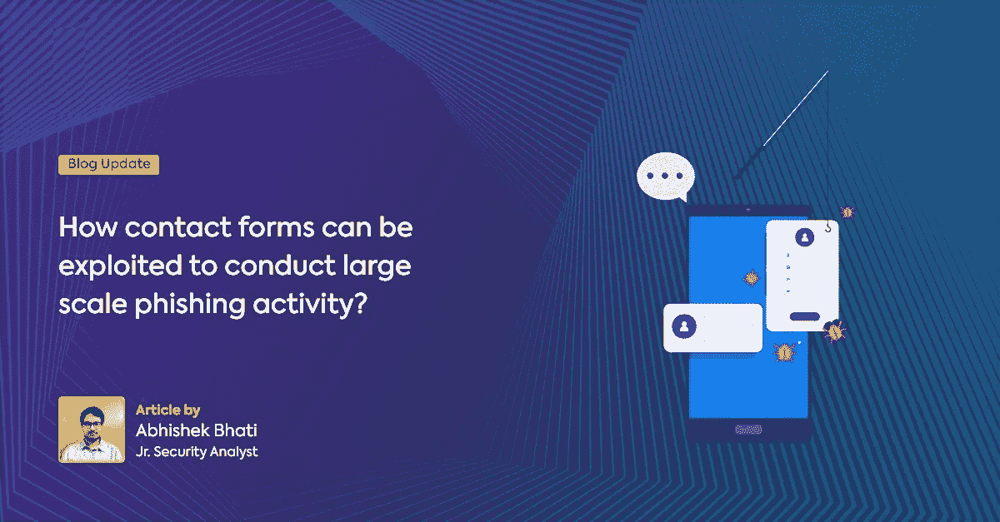
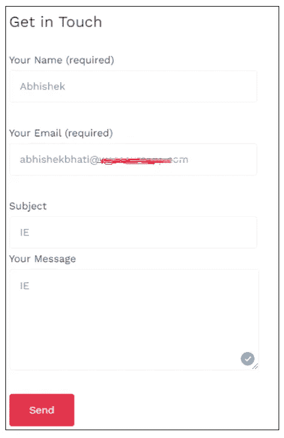
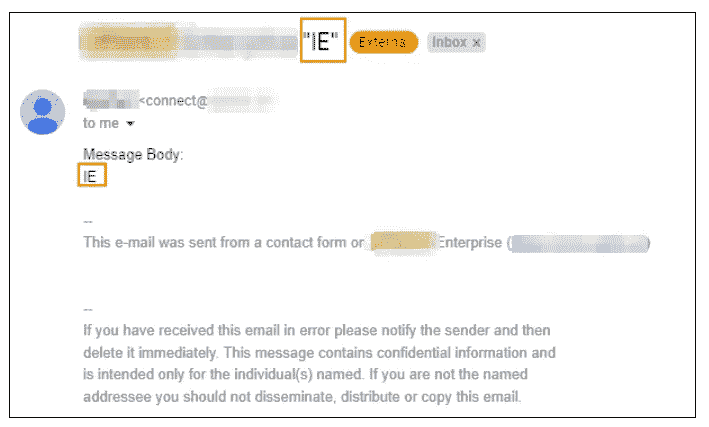
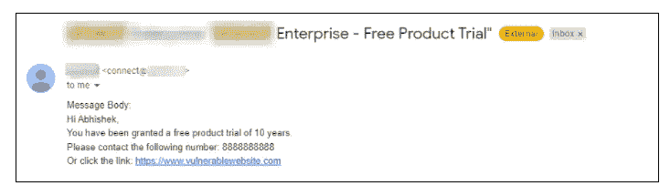
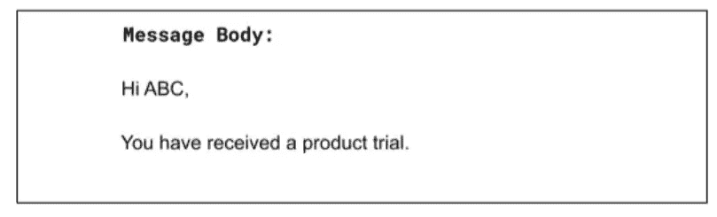
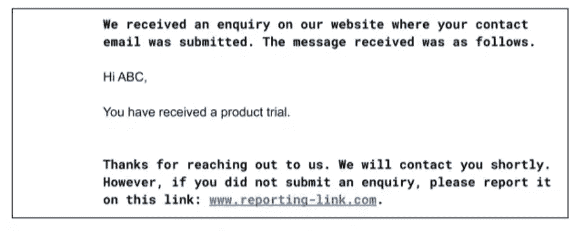
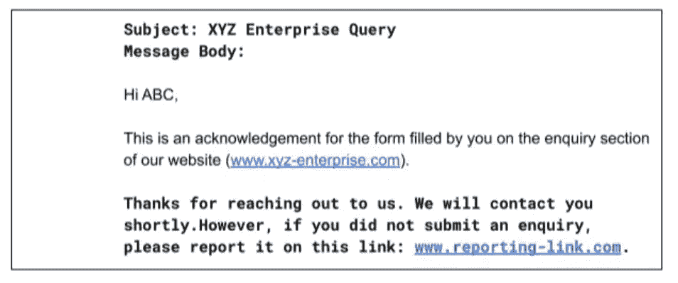

# 如何利用联系方式进行大规模网络钓鱼活动？

> 原文：<https://infosecwriteups.com/how-contact-forms-can-be-exploited-to-conduct-large-scale-phishing-activity-1333bcbaaba4?source=collection_archive---------4----------------------->

用于客户咨询的联系方式是大多数公司网站上最常见的功能之一。它为潜在客户提供了一个与公司联系的简单途径。

WordPress 插件可以帮助你以简单的方式创建这样的功能。一些公司超越并承认从顾客那里收到的信息。

# 但是如何利用这一点来进行网络钓鱼活动呢？

在为我们的一个客户进行应用安全评估的过程中，我们遇到了一个类似下图的“联系我们”表单:

乍一看，这个表单似乎非常标准且无害，但是出于好奇，我们输入了数据并发送了查询。我们在如下所示的字段中输入数据:

几乎就在这之后，我们收到了该公司的回复，如下图所示:

然后，我们检查是否有任何系统来验证输入详细信息的用户是否实际拥有输入的电子邮件 ID。结果，没有。

经过进一步调查，发现可以发送的电子邮件数量不限于。下图显示了攻击者如何利用这一点的概念验证:

从上面的邮件可以看出，在没有任何限制的情况下，攻击者可以将用户重定向到任何易受攻击的链接。

此外，攻击者也不必建立自己的网络钓鱼基础设施。他们也不必花费精力接管合法电子邮件的账户，这通常是在电子邮件回复链中完成的。由于该电子邮件来自一个已经有声誉和适当记录的公司的域名，该电子邮件落入垃圾邮件的机会也变得非常低。通过仔细规划时机和精心制作极具诱惑力的内容，借助这种具有高度决定性的形式，可以开展大规模的网络钓鱼活动。

即使在 Red Teaming 活动中，这些从安全角度来看通常被公司忽略的形式也被用来进行大规模的网络钓鱼攻击。凭证也可以通过这种易受攻击的形式以非常精确的方式提供给公司的员工和其他相关人员。此外，这些通常可以提供目标组织的客户帐户的入口点。

## 这可能会对组织产生多种影响:

*   耗尽域的电子邮件供应。
*   通过向多人发送虚假广告来诋毁公司。
*   发送多封电子邮件来降低域名的声誉，这样即使是合法的电子邮件也会被垃圾邮件拦截。
*   通过这封电子邮件分享误导性信息，攻击和扰乱公司现有客户的业务。

## 现在，如何减少网络钓鱼活动？

有几种可能的方法:

例如，代替

回复邮件可以包含更加清晰的信息:

可以发送如下简单消息进行确认:

*   为了防止有人发送过多的电子邮件而滥用表单，可以使用验证码。
*   除此之外，应该实现速率限制机制来限制请求的数量。
*   除此之外，还应该有适当的监控系统来检查有多少电子邮件是从您组织的帐户发出的。如果存在不同于正常发送速率的高强度活动，则应建立警报系统，以便采取适当的纠正措施。

# 关于作者

阿布舍克·巴蒂

小安全分析师