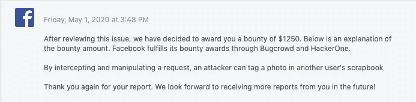

# 我如何在脸书上给任何用户的剪贴簿贴上照片

> 原文：<https://infosecwriteups.com/how-could-i-tag-photo-to-any-users-scrapbook-on-facebook-23ab15e6e4b4?source=collection_archive---------4----------------------->


**概要:**

这篇博文是关于脸书剪贴簿中一个不安全的直接对象引用漏洞。在脸书剪贴簿，只有业主和他们的合作伙伴将能够标签剪贴簿照片。漏洞是任何用户都可以在照片中标记其他用户的剪贴簿。

**漏洞类型:**

**IDOR** (不安全的直接对象引用)

参考:[https://www . owasp . org/index . PHP/Top _ 10 _ 2010-A4-unsecured _ Direct _ Object _ References](https://www.owasp.org/index.php/Top_10_2010-A4-Insecure_Direct_Object_References)

**复制步骤:**

1.  打开脸书个人资料并创建任何带照片的帖子。
2.  现在访问任何用户的剪贴簿相册。
3.  右击用户的剪贴簿相册，复制剪贴簿 ID。
4.  现在访问您创建的帖子并打开照片。
5.  现在，单击照片，然后单击标记照片选项，选择要标记的任何用户。
6.  现在，在标记之前，确保打开 Burp Suite 的拦截器来捕获请求。
7.  现在单击“选择用户”，您将在 Burp suite 中看到以下类型的请求:

```
POST /ajax/photo_tagging_ajax.php?av=100022637353520HTTP/1.1
Host: [www.facebook.com](http://www.facebook.com/)Connection: closeContent-Length: 668Origin: [https://www.facebook.com](https://www.facebook.com/)User-Agent: Mozilla/5.0 (Macintosh; Intel Mac OS X 10_14_0)fbid=XXX&id=USERID&subject=XXXX&name=XXXX&action=add&etc
```

8.现在将**主题**参数值更改为受害者的**剪贴簿 ID** 并转发请求。

9 .成交。



**时间线:**

2020 年 2 月 25 日—初始报告

2020 年 3 月 3 日—报告已分类

2020 年 5 月 1 日—脸书修复了漏洞

2020 年 5 月 1 日—已确认修复

2020 年 5 月 1 日——脸书颁发的奖金